<h1 align="center">Informe del Trabajo Final</h1>

<h3 align="center">Universidad Peruana de Ciencias Aplicadas</h3>

 

  

 

<h5 align="center">Ingeniería de Software</h5>

<h5 align="center">Desarrollo de Aplicaciones Open Source - 1ASI0729 – 2610</h5>

<h5 align="center">Docente: Juan Antonio Flores Moroco</h5>

<h5 align="center">Startup: IntegraVida</h5>

<h5 align="center">Producto: GlucoSmart</h5>

## Team members:

| Nombre | Código |
| :--- | :---: |
| Arias Tasayco, Jean Pool Alexander | U202414054 |
| Raymundo Villarroel, Abigail Nadhim | U202318001 |
| Estupiñan Olortegui, Juan Sebastian | U202223405 |
| Tello Murga, Javier Oswaldo | U202218387 |
| Muñoz Amasifuen, Jose Antonio | U20231D385 |

<h5 align="center">Ciclo 2026-10</h5>

---

# Registro de Versiones del Informe

| Versión | Fecha | Autor | Descripción de Modificación |
| :---: | :---: | :--- | :--- |
| 0.1 | 10/04 | Jean Arias | Definición del Startup Profile y Lean UX Assumption y Hypotesis Statement (Capítulo I). |
| 0.2 | 13/04 | Jean Arias | Desarrollo de Artefactos de Negocio: Empathy Map, Persona y Journey Map (Capítulo II). |
| 0.3 | 16/04 | Jean Arias | Especificación de requerimientos: Impact Mapping (Capítulo III). |
| 0.4 | 19/04 | Jean Arias | Desarrollo e integración de la interfaz de usuario (UI) para la Landing Page de GlucoSmart (Capítulo IV). |
| 0.5 | 19/04 | Abigail Raymundo | Creación de wireframes para definir la estructura de contenidos y elaboración de mockups de alta fidelidad en Figma. |
| 0.6 | 21/04 | Jean Arias | Implementación del Sprint 1, configuración de software y despliegue (Capítulo V). |
| 0.7 | 21/04 | Abigail Raymundo | Desarrollo e integración de la interfaz de usuario (UI) para la Landing Page de GlucoSmart. |
| 0.8 | 21/04 | Javier Tello | Desarrollo del lenguaje ubicuo del dominio, estimación y priorización del Product Backlog, diagramas de clases y diagrama entidad-relación del sistema GlucoSmart. |
| 0.9 | 23/04 | Jose Muñoz | Desarrollo de User Stories, diseño UX/UI de la Web Application (wireframes, mockups, wireflows y user flows), prototipo interactivo en Figma y definición de arquitectura mediante Event Storming y diagramas C4. |
| 1.0 | 10/05 | Jean Arias | Implementación de servicios frontend, integración de API REST, configuración de json-server y despliegue inicial del entorno frontend en Firebase Hosting y Render.com. |
| 1.1 | 12/05 | Abigail Raymundo | Desarrollo del bounded context Patient Profile Management incluyendo PatientProfileComponent, edición de perfil, mejoras visuales del frontend y experiencia responsive de usuario. |
| 1.2 | 13/05 | Juan Sebastian Estupiñan | Implementación del bounded context Glucose Monitoring incluyendo registro de glucosa, historial clínico, filtros y gráficos médicos. |
| 1.3 | 14/05 | Javier Tello | Desarrollo e integración del bounded context Appointment Management y mejoras de navegación dentro de la Web Application. |
| 1.4 | 14/05 | Jose Muñoz | Implementación de servicios REST, validaciones y lógica de integración para módulos clínicos y alertas médicas. |

# Project Report Collaboration Insights

- Enlace del Repositorio:
	- [ <https://github.com/MTS-OpenSource/IntegraVida.git>](https://github.com/MTS-OpenSource/IntegraVida)
	- [ <https://github.com/MTS-OpenSource/InformeProyecto.git>](https://github.com/MTS-OpenSource/InformeProyecto)
	- https://github.com/MTS-OpenSource/Integravida-FrontendServices.git

- AV1:
  - ¿Qué Problema se encontró?
	  Se identificó una alta fragmentación y deficiencia en la gestión de la información clínica de pacientes diagnosticados con Diabetes Mellitus. Actualmente, el registro de métricas vitales (como los niveles de glucosa y hemoglobina glicosilada - HbA1c) y el control de la medicación se realizan, en su mayoría, de forma manual, aislada o dependiente de la memoria del paciente. Esta situación genera dos problemas críticos:
		1. **En el paciente:** Una baja adherencia al tratamiento debido a olvidos frecuentes de las dosis, sumado a la incertidumbre y falta de un canal directo para reportar efectos secundarios de los fármacos.
		2. **En el personal médico:** Pérdida de tiempo valioso durante las consultas al tener que unificar e interpretar historiales desordenados (en papel o Excel). Además, existe una nula capacidad de **farmacovigilancia activa**, lo que impide a los doctores intervenir preventivamente antes de que un paciente sufra una crisis de hipoglucemia severa o daño orgánico.
	
- ¿Cómo se resolverá?
	El problema se resolverá mediante el desarrollo y despliegue de IntegraVida una plataforma web B2B2C respaldada por una arquitectura de base de datos relacional robusta. Esta solución centralizará la información y conectará en tiempo real a los pacientes con sus médicos tratantes, resolviendo la problemática a través de tres pilares tecnológicos:
	
	1. **Sistema de Adherencia Automatizado:** Notificaciones y confirmaciones de toma de medicación que reducen drásticamente los olvidos en los pacientes.
	2. **Módulo de Farmacovigilancia y Alertas Críticas:** Un canal de registro rápido donde los pacientes reportan reacciones adversas, el cual dispara alertas inmediatas al médico si los parámetros indican un riesgo vital.
	3. **Ecosistema de Decisiones Clínicas:** Un panel de control (_Dashboard_) interactivo para el médico que procesa los datos registrados y los visualiza en gráficos de tendencias, permitiendo optimizar el tiempo de consulta y ajustar los tratamientos de forma rápida y segura basándose en evidencia real.

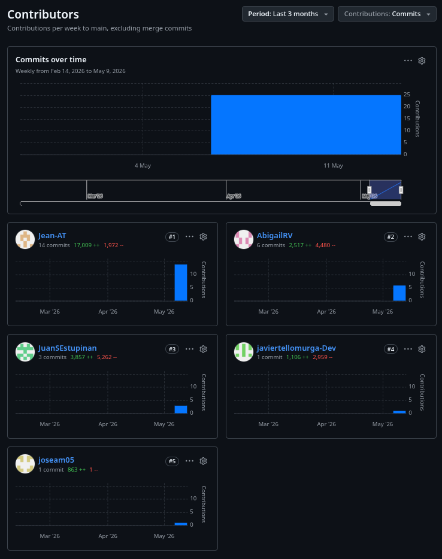

# Contenido

- [Registro de versiones del informe](#_toc226040379)
- [Project Report Collaboration Insights](#_toc226040380)
- [Student Outcome](#_toc226040381)

# Capítulo I: Introduction

- [1.1 Startup Profile](#_toc226040383)
  - [1.1.1 Descripción de la Startup](#_toc226040384)
  - [1.1.2 Perfiles de integrantes del equipo](#_toc226040385)

- [1.2 Solution Profile](#_toc226040386)
  - [1.2.1 Antecedentes y problemática](#_toc226040387)
  - [1.2.2 Lean UX Process](#_toc226040388)
    - [1.2.2.1 Lean UX Problem Statements](#_toc226040389)
    - [1.2.2.2 Lean UX Assumption](#_toc226040390)
    - [1.2.2.3 Lean UX Hypothesis Statements](#_toc226040391)
    - [1.2.2.4 Lean UX Canvas](#_toc226040392)

- [1.3 Segmento Objetivo](#_toc226040393)

# Capítulo II: Requirements Elicitation & Analysis

- [2.1 Competidores](#_toc226040395)
  - [2.1.1 Analisis Competitivo](#_toc226040396)
  - [2.1.2 Estrategia y tácticas frente a competidores](#_toc226040397)

- [2.2 Entrevistas](#_toc226040398)
  - [2.2.1 Diseño de entrevistas](#_toc226040399)
  - [2.2.2 Registro de entrevista](#_toc226040400)
  - [2.2.3 Analisis de entrevista](#_toc226040401)

- [2.3 Needfinding](#_toc226040402)
  - [2.3.1 User Personas](#_toc226040403)
  - [2.3.2 User Task Matrix](#_toc226040404)
  - [2.3.3 User Journey Mapping](#_toc226040405)
  - [2.3.4 Empathy Mapping](#_toc226040406)

- [2.4 Big Picture Event Storming](#_toc226040407)
- [2.5 Ubiquitous Language](#_toc226040408)

# Capítulo III: Requirements Specification

- [3.1 User Stories](#_toc226040410)
- [3.2 Impact Mapping](#_toc226040411)
- [3.3 Product Backlog](#_toc226040412)

# Capítulo IV: Product Design

- [4.1 Style Guidelines](#_toc226040414)
  - [4.1.1 General Style Guidelines](#_toc226040415)
  - [4.1.2 Web Style Guidelines](#_toc226040416)

- [4.2 Information Architecture](#_toc226040417)
  - [4.2.1 Organization Systems](#_toc226040418)
  - [4.2.2 Labeling Systems](#_toc226040419)
  - [4.2.3 SEO Tags and Meta Tags](#_toc226040420)
  - [4.2.4 Searching Systems](#_toc226040421)
  - [4.2.5 Navigation Systems](#_toc226040422)

- [4.3 Landing Page UI Design](#_toc226040423)
  - [4.3.1 Landing Page Wireframe](#_toc226040424)
  - [4.3.2 Landing Page Mock-up](#_toc226040425)

- [4.4 Web Applications UX/UI Design](#_toc226040426)
  - [4.4.1 Web Applications Wireframes](#_toc226040427)
  - [4.4.2 Web Applications Wireflow Diagrams](#_toc226040428)
  - [4.4.3 Web Applications Mock-ups](#_toc226040429)
  - [4.4.4 Web Applications User Flow Diagrams](#_toc226040430)

- [4.5 Web Applications Prototyping](#_toc226040431)

- [4.6 Domain-Driven Software Architecture](#_toc226040432)
  - [4.6.1 Design-Level Event Storming](#_toc226040433)
  - [4.6.2 Software Architecture Context Diagram](#_toc226040434)
  - [4.6.3 Software Architecture Container Diagrams](#_toc226040435)
  - [4.6.4 Software Architecture Components Diagrams](#_toc226040436)

- [4.7 Software Object-Oriented Design](#_toc226040437)
  - [4.7.1 Class Diagrams](#_toc226040438)

- [4.8 Database Design](#_toc226040439)
  - [4.8.1 Database Diagrams](#_toc226040440)

# Capítulo V: Product Implementation, Validation & Deployment

- [5.1 Software Configuration Management](#_toc226040442)
  - [5.1.1 Software Development Environment Configuration](#_toc226040443)
  - [5.1.2 Source Code Management](#_toc226040444)
  - [5.1.3 Source Code Style Guide & Conventions](#_toc226040445)
  - [5.1.4 Software Deployment Configuration](#_toc226040446)

- [5.2 Landing Page, Services & Applications Implementation](#_toc226040447)

## Sprint 1

- [5.2.1 Sprint 1](#_toc226040448)
  - [5.2.1.1 Sprint Planning 1](#_toc226040449)
  - [5.2.1.2 Aspect Leaders and Collaborators](#_toc226040450)
  - [5.2.1.3 Sprint Backlog 1](#_toc226040451)
  - [5.2.1.4 Development Evidence for Sprint Review](#_toc226040452)
  - [5.2.1.5 Execution Evidence for Sprint Review](#_toc226040453)
  - [5.2.1.6 Services Documentation Evidence for Sprint Review](#_toc226040454)
  - [5.2.1.7 Software Deployment Evidence for Sprint Review](#_toc226040455)
  - [5.2.1.8 Team Collaboration Insights during Sprint](#_toc226040456)

## Sprint 2

- [5.3.1 Sprint 2](#_toc226040448)
  - [5.3.1.1 Sprint Planning 2](#_toc226040449)
  - [5.3.1.2 Aspect Leaders and Collaborators](#_toc226040450)
  - [5.3.1.3 Sprint Backlog 2](#_toc226040451)
  - [5.3.1.4 Development Evidence for Sprint Review](#_toc226040452)
  - [5.3.1.5 Execution Evidence for Sprint Review](#_toc226040453)
  - [5.3.1.6 Services Documentation Evidence for Sprint Review](#_toc226040454)
  - [5.3.1.7 Software Deployment Evidence for Sprint Review](#_toc226040455)
  - [5.3.1.8 Team Collaboration Insights during Sprint](#_toc226040456)

# Conclusiones

- [Conclusiones y recomendaciones](#_toc226040463)

# Bibliografía

- [Bibliografía](#_toc226040465)

# Anexos

- [Anexos](#_toc226040466)

# Student Outcome

El curso contribuye al cumplimiento del Student Outcome ABET:  
**ABET – EAC - Student Outcome 3**

**Criterio:** Capacidad de comunicarse efectivamente con un rango de audiencias.

En el siguiente cuadro se describen las acciones realizadas y conclusiones por parte del grupo, que permiten sustentar el logro del ABET – EAC - Student Outcome 3.

| Criterio específico | Acciones realizadas | Conclusiones |
| :--- | :--- | :--- |
| **Comunica oralmente con efectividad a diferentes rangos de audiencia.** | **Jean Pool Alexander Arias Tasayco** **AV1:** Participó activamente en reuniones de validación con usuarios entrevistados para presentar la propuesta de valor de GlucoSmart y recopilar retroalimentación relacionada con funcionalidades médicas y experiencia de usuario.  **TB1:** Lideró las reuniones de coordinación técnica del Sprint 2 explicando la arquitectura frontend, bounded contexts y despliegue de servicios a los integrantes del equipo y usuarios entrevistados.  **Abigail Nadhim Raymundo Villarroel** **AV1:** Presentó propuestas visuales mediante wireframes y mockups de alta fidelidad para comunicar la estructura visual de la Landing Page y validar la experiencia de usuario.  **TB1:** Explicó el funcionamiento del módulo Patient Profile Management mostrando la interacción entre interfaces, formularios y servicios REST durante las revisiones funcionales del Sprint 2.  **Javier Oswaldo Tello Murga** **AV1:** Expuso los artefactos de análisis como lenguaje ubicuo, historias de usuario y diagramas técnicos para comunicar la estructura funcional del sistema GlucoSmart.  **TB1:** Participó en reuniones técnicas explicando la lógica del bounded context Appointment Management y su integración con el frontend general.  **Jose Antonio Muñoz Amasifuen** **AV1:** Presentó el prototipo interactivo desarrollado en Figma y explicó el flujo de navegación de la Web Application orientada a pacientes y médicos.  **TB1:** Explicó la integración de servicios REST y la validación de endpoints utilizados por los módulos clínicos del sistema.  **Juan Sebastian Estupiñan** **TB1:** Participó en las revisiones funcionales del Sprint 2 explicando el funcionamiento del módulo Glucose Monitoring, historial clínico y gráficos médicos integrados al sistema. | El trabajo colaborativo realizado durante los Sprints permitió fortalecer las capacidades de comunicación oral del equipo al presentar propuestas visuales, avances funcionales, arquitectura técnica y validaciones del sistema frente a distintos tipos de audiencia. Asimismo, las reuniones de coordinación, revisiones funcionales y demostraciones del producto permitieron comunicar efectivamente ideas técnicas y funcionales relacionadas con el proyecto GlucoSmart. |
| **Comunica por escrito con efectividad a diferentes rangos de audiencia.** | **Jean Pool Alexander Arias Tasayco** **AV1:** Elaboró secciones del informe relacionadas con Startup Profile, Lean UX, Sprint Planning y despliegue del proyecto.  **TB1:** Documentó la arquitectura frontend, servicios REST, configuración de despliegue y evidencias técnicas del Sprint 2.  **Abigail Nadhim Raymundo Villarroel** **AV1:** Elaboró documentación visual mediante wireframes y mockups para representar la estructura de la Landing Page y la experiencia de usuario.  **TB1:** Documentó el bounded context Patient Profile Management, evidencias de frontend, integración de componentes y mejoras visuales implementadas en la Web Application.  **Javier Oswaldo Tello Murga** **AV1:** Desarrolló documentación relacionada con historias de usuario, criterios de aceptación y diagramas técnicos del sistema.  **TB1:** Documentó funcionalidades relacionadas con Appointment Management y su integración dentro de la arquitectura modular del frontend.  **Jose Antonio Muñoz Amasifuen** **AV1:** Elaboró documentación UX/UI, Event Storming y diagramas C4 utilizados para representar la arquitectura del sistema.  **TB1:** Participó en la documentación técnica relacionada con endpoints REST, validaciones y arquitectura basada en bounded contexts.  **Juan Sebastian Estupiñan** **TB1:** Documentó funcionalidades relacionadas con el módulo Glucose Monitoring y evidencias funcionales del historial clínico y gráficos médicos implementados durante el Sprint 2. | La elaboración continua de documentación técnica, reportes de Sprint, diagramas, evidencias funcionales y artefactos de análisis permitió fortalecer la capacidad del equipo para comunicar información técnica y funcional de manera clara y organizada. Asimismo, la documentación desarrollada facilitó la comprensión del sistema tanto para usuarios como para integrantes técnicos del proyecto. |

# Capitulo I: Introduction

## 1.1 Startup Profile

IntegraVida es una startup tecnológica del sector HealthTech nacida con la ambición de transformar radicalmente el paradigma del manejo de enfermedades crónicas, con un enfoque inicial en la diabetes. Nos definimos como una organización orientada a la innovación que desarrolla ecosistemas de software abiertos, rompiendo con las limitaciones de las soluciones propietarias y cerradas que fragmentan la información médica. 

Nuestra propuesta de valor reside en la interoperabilidad y la democratización de los datos de salud. A través del uso de arquitecturas distribuidas y modernas, IntegraVida conecta a pacientes, especialistas y sistemas de farmacovigilancia en una red de colaboración en tiempo real. No solo buscamos registrar datos, sino transformarlos en activos clínicos accionables que permitan cerrar la brecha de tratamiento y mejorar la calidad de vida de las poblaciones vulnerables a nivel global. 

Misión 

Empoderar a pacientes que conviven con enfermedades crónicas a través de soluciones de software de código abierto de alto rendimiento, diseñadas para facilitar una gestión integral, autónoma y segura de su salud. Nos comprometemos a proporcionar una infraestructura digital robusta que garantice la trazabilidad terapéutica y la precisión clínica, permitiendo que las decisiones médicas se basen en la analítica de datos en tiempo real y en una comunicación bidireccional efectiva entre el paciente y el equipo multidisciplinario de salud. 

Visión 

Consolidarnos para el año 2030 como la plataforma referente a nivel mundial en el ecosistema de salud abierta, convirtiéndonos en el núcleo digital estándar para la atención médica personalizada. Aspiramos a liderar la integración tecnológica en el sector salud, donde nuestras arquitecturas de software sirvan de base para millones de usuarios, transformando los sistemas de salud tradicionales en modelos predictivos, inclusivos y altamente eficientes, escalando desde nuestra base operativa en Perú hacia mercados internacionales.

### 1.1.1 Descripción de la Startup

**IntegraVida** es una startup peruana del sector **HealthTech** orientada al desarrollo de soluciones digitales para el seguimiento y control de enfermedades crónicas, con un enfoque inicial en la diabetes. La empresa surge como respuesta a la fragmentación de información clínica, la baja interoperabilidad entre actores del sistema de salud y la falta de herramientas que acompañen de forma continua tanto al paciente como al profesional médico en la toma de decisiones.

La startup propone una visión centrada en la integración de datos y en la construcción de un ecosistema digital accesible, seguro y escalable. En lugar de limitarse al registro aislado de indicadores de salud, **IntegraVida** busca consolidar información clínica relevante, hábitos del paciente, adherencia al tratamiento, alertas preventivas y comunicación médico-paciente dentro de una misma plataforma. De esta manera, se promueve una atención más precisa, preventiva y conectada con el contexto real del usuario.

Como primer producto, desarrolla **GlucoSmart**, una plataforma web que permite monitorear niveles de glucosa, registrar medicamentos, generar recordatorios, visualizar reportes y fortalecer la trazabilidad terapéutica. Esta solución está pensada para atender las necesidades de pacientes con diabetes y de profesionales de salud que requieren información confiable y oportuna para mejorar el seguimiento clínico.

El valor diferencial de la startup radica en combinar tecnología, enfoque centrado en el usuario y principios de software abierto para construir una solución con impacto social. Con ello, **IntegraVida** aspira a contribuir a la modernización del cuidado de la salud, reducir la brecha de tratamiento y mejorar la calidad de vida de las personas que conviven con enfermedades crónicas.

### 1.1.2. Perfiles de integrantes del equipo

Estudiante: **Arias Tasayco, Jean Pool Alexander** Carrera:**Ingeniería de Software** Soy un estudiante de la carrera de Ingeniería de Software. Me considero un apasionado por la tecnología y me dedico a transformar ideas en soluciones digitales eficientes y escalables.  Durante mi formación, he adquirido habilidades en el desarrollo de software y en la creación de soluciones que no solo cumplen con su propósito, sino que buscan innovar. Mi objetivo es utilizar mis conocimientos para resolver problemas reales y generar un impacto positivo a través de la tecnología.   

Estudiante: **Raymundo Villarroel, Abigail Nadhimr** Carrera:**Ingeniería de Software** Soy un estudiante de la carrera de Ingeniería de Software.Actualmente estoy cursando el 5° ciclo de Ingeniería de Software, avanzando algunos cursos del ciclo superior. Desde siempre me ha apasionado crear, diseñar y programar para ofrecer soluciones, me gusta aprender constantemente para ampliar mis conocimientos y perfil profesional. Me comprometo a aportar con responsabilidad al equipo, trabajar de manera colaborativa y contribuir a que juntos podamos desarrollar un proyecto sobresaliente. Mis principales habilidades incluyen creatividad, disciplina y trabajo en equipo, cualidades que aplico para lograr resultados efectivos y de calidad.   

Estudiante: **Tello Murga, Javier Oswaldo** Carrera: **Ingeniería de Software** Soy un estudiante de la carrera de Ingeniería de Software, actualmente cursando el 6.º ciclo. Me considero una persona responsable, perseverante y comprometida con mi aprendizaje. Me interesa el desarrollo de software y la creación de soluciones digitales que puedan resolver problemas reales. A través del trabajo en equipo, busco aportar con organización, análisis y compromiso para contribuir al desarrollo de un proyecto sólido y de calidad.                                                                                                                                                                                                                                                                                           

## 1.2. Solution Profile

### 1.2.1 Antecedentes y problemática

Who (¿A quiénes les afecta?) 

El impacto de esta problemática es sistémico y se distribuye en tres niveles críticos: 

- Pacientes con diabetes: Se ven obligados a gestionar su condición con herramientas que ofrecen datos fragmentados (silos de información), careciendo de una visión holística de su salud. Esto genera "fatiga de datos" y una alarmante ausencia de alertas preventivas que les permitan actuar antes de una crisis. 
- Personal Médico y Clínicas: Los especialistas reciben datos recolectados de forma asíncrona y sin contexto. Al no contar con trazabilidad real sobre la adherencia farmacológica o los efectos adversos, se ven limitados para realizar ajustes terapéuticos precisos, trabajando bajo un modelo de "ensayo y error" reactivo. 
- Sistemas de Salud Públicos y Privados: Estos organismos asumen el impacto financiero de las complicaciones crónicas (nefropatías, neuropatías, etc.) que podrían evitarse con un seguimiento preventivo. La ineficiencia en el manejo ambulatorio dispara los costos operativos y satura los servicios de emergencia. 

What (¿Cuál es el problema?) 

El problema central es la ineficiencia funcional y la desarticulación de datos en el ecosistema mHealth actual. Las aplicaciones convencionales se han limitado al registro cuantitativo de la glucosa, ignorando la integración de pilares fundamentales como la farmacovigilancia y la trazabilidad terapéutica. Existe una brecha crítica entre lo que el médico prescribe (indicación) y lo que el paciente realmente ejecuta (consumo real), lo que convierte a los datos recolectados en información estéril para el análisis clínico profesional. 

Where (¿Dónde surge el problema?) 

La problemática se localiza en la convergencia crítica entre el sector salud y la ingeniería de software (mHealth). No es solo un problema de software, sino de diseño arquitectónico: las interfaces y los flujos de datos no están anclados a los protocolos clínicos del mundo real. Esta desconexión impide que las intervenciones digitales logren su objetivo principal: la reducción sostenida de los niveles de hemoglobina glicosilada (HbA1c) en el paciente. 

When (¿Cu.ándo sucede el problema?) 

El problema persiste de manera ininterrumpida durante todo el ciclo de vida del tratamiento, pero se agudiza drásticamente en el periodo ambulatorio. Es precisamente cuando el paciente sale del entorno controlado del consultorio cuando se pierde el control sobre la adherencia a la medicación y se omiten las señales tempranas de reacciones adversas, rompiendo la continuidad del cuidado médico. 

Why (¿Por qué sucede el problema?) 

Esta situación es consecuencia de una visión técnica limitada que prioriza el registro de números sobre la gestión de la salud. Las herramientas actuales carecen de módulos de retroalimentación profesional y sistemas de apoyo a la decisión clínica. Al no existir una infraestructura integral que conecte la ingesta de fármacos con las variaciones glicémicas, el ciclo terapéutico permanece abierto, impidiendo la identificación de riesgos antes de que se conviertan en complicaciones severas. 

How (¿Cómo sucede el problema?) 

El problema se manifiesta a través de un ecosistema de aplicaciones reactivas e interacciones aisladas. Las apps generan alertas genéricas e irrelevantes que el paciente termina ignorando. Según investigaciones recientes (Tang, 2024), la falta de un diseño interactivo que incluya recordatorios personalizados, soporte profesional y una experiencia de usuario (UX) consistente, degrada la retención del paciente y, por ende, la sostenibilidad de cualquier beneficio clínico inicial. 

How Much (¿Qué impacto tiene?) 

A escala global, la diabetes afecta a 830 millones de personas, con la cifra alarmante de que más del 50% no recibe una terapia adecuada. En el contexto local, IntegraVida identifica en Lima Metropolitana un mercado de alta densidad que requiere soluciones urgentes. Proyectamos que la implementación de GlucoSmart permitirá no solo reducir costos por complicaciones en un porcentaje significativo, sino también escalar la solución a nivel nacional, transformando la brecha de tratamiento en el Perú en un caso de éxito de salud digital distribuida.

### 1.2.2 Lean UX Process
#### *1.2.2.1 Lean UX Problem Statements*

Actualmente, el manejo de enfermedades crónicas como la diabetes se caracteriza por la fragmentación de datos y el uso de silos de información. Las aplicaciones existentes (mHealth) se limitan al registro cuantitativo de glucosa, pero carecen de una conexión real con los protocolos clínicos y la trazabilidad terapéutica. 

Descripcion del Problema: 

- Problema: La desarticulación de datos y la falta de alertas preventivas en el monitoreo ambulatorio de pacientes diabéticos. 
- Afectados: Pacientes que sufren "fatiga de datos", médicos que trabajan bajo ensayo y error reactivo, y sistemas de salud que asumen altos costos por complicaciones evitables. 
- Impacto: Los pacientes pierden el control sobre su adherencia farmacológica al salir del consultorio, lo que impide la reducción sostenida de niveles de hemoglobina glicosilada. 
- Solución: Una infraestructura de software de código abierto que garantice la interoperabilidad y transforme los datos en activos clínicos accionables en tiempo real.

#### *1.2.2.2 Lean UX Assumption*

Para el desarrollo de la plataforma **GlucoSmart** bajo la startup IntegraVida, hemos formulado los siguientes supuestos (Assumptions) divididos en supuestos de negocio, del usuario y de las características del producto. Estos nos permitirán validar nuestro modelo y entender el contexto de uso de la aplicación web.

**Supuestos de Negocio (Business Assumptions):**

1. Creemos que nuestros clientes principales (hospitales, clínicas y consultorios privados) necesitan una plataforma unificada para el monitoreo integral de la diabetes.
2. Creemos que estas instituciones están dispuestas a adoptar un nuevo software si este demuestra optimizar el tiempo de consulta y reducir las complicaciones derivadas de una mala adherencia al tratamiento.
3. Creemos que el valor principal que ofrecemos a los centros de salud es la centralización de datos clínicos (glucosa, historial de medicación, farmacovigilancia), lo que permite una toma de decisiones médicas más certera y rápida.

**Supuestos del Usuario (User Assumptions):**

1. **¿Quién es el usuario?** Nuestros usuarios principales son, por un lado, pacientes con diabetes (tipo 1 y 2) que requieren un seguimiento constante; y por otro, doctores (endocrinólogos y médicos generales) encargados de su tratamiento.
2. **¿Dónde encaja el producto en su trabajo o vida?** Para los pacientes, encaja en su rutina diaria como una herramienta móvil/web para registrar sus niveles y recibir alertas; para los médicos, encaja en su flujo de trabajo clínico durante y entre las consultas para revisar la evolución del paciente.
3. **¿Qué problemas tiene nuestro producto y cómo los resuelve?** El problema actual es la fragmentación de la información y la falta de seguimiento de la adherencia y reacciones adversas. Nuestro producto resuelve esto al proporcionar un historial clínico consolidado e interactivo.
4. **¿Cuándo y cómo es usado nuestro producto?** El paciente lo usará diariamente para registrar la ingesta de medicamentos (adherencia) y los niveles de glucosa. El médico lo usará durante las consultas para revisar los reportes y tendencias, y recibirá alertas inmediatas en caso de riesgo de hipoglucemia severa o reacciones adversas.

**Supuestos de Características (Feature Assumptions):**

1. Creemos que la funcionalidad de **registro de farmacovigilancia y reacciones adversas** será una de las más valoradas por los doctores, ya que mejora la seguridad del paciente.
2. Creemos que el **módulo de recordatorios y control de adherencia** incrementará drásticamente la fidelidad de los pacientes a su tratamiento prescrito.
3. Creemos que la **generación de gráficos de tendencias automáticos** permitirá a los médicos optimizar el tiempo de diagnóstico y ajuste de dosis.

#### *12.2.3 Lean UX Hypothesis Statements*

A partir de nuestros supuestos, hemos formulado las siguientes declaraciones de hipótesis (Hypothesis Statements) que validaremos a lo largo del ciclo de desarrollo de **GlucoSmart**:

- **Hipótesis 1 (Focalizada en la Adherencia del Paciente):** Creemos que lograremos un _incremento en la adherencia a la medicación_ en un 30% dentro de los primeros 3 meses, si los _pacientes con diabetes_ logran _reducir sus episodios de olvido de medicación_ a través de la característica de _un sistema automatizado de alarmas y confirmación de consumo de medicamentos_.
- **Hipótesis 2 (Focalizada en la Eficiencia Médica):** Creemos que lograremos _reducir el tiempo de revisión de historial clínico en las consultas médicas_ en un 20%, si los _endocrinólogos y médicos generales_ logran _interpretar el estado del paciente en menos de 2 minutos_ mediante la característica de _un dashboard interactivo con gráficas de evolución de glucosa (HbA1c) y reportes de adherencia_.
- **Hipótesis 3 (Focalizada en la Farmacovigilancia):** Creemos que _reduciremos las complicaciones de salud evitables por cambios de tratamiento inadecuados_, si los _médicos tratantes_ logran _identificar rápidamente las reacciones adversas a la medicación_ mediante la característica de _un módulo de alertas inmediatas y registros de efectos adversos directamente vinculados a la historia clínica del paciente_.
- **Hipótesis 4 (Focalizada en la Comunicación):** Creemos que _aumentaremos la retención de pacientes en el uso de la plataforma_, si los _pacientes con diabetes_ logran _sentir un mayor acompañamiento médico_ a través de la característica de _compartir reportes en tiempo real con sus médicos y recibir sugerencias personalizadas.
#### *1.2.2.4 Lean UX Canvas*

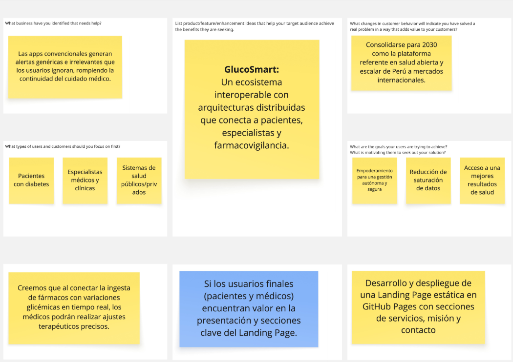

## 1.3 Segmento Objetivo

El éxito de GlucoSmart radica en su capacidad para interconectar a los actores principales del ecosistema de salud. Por ello, se han identificado dos segmentos objetivos primarios y uno secundario, definidos a partir de los hallazgos en las entrevistas y el análisis del dominio del problema.

#### 1.3.1 Segmento Primario 1: Pacientes con Diabetes Mellitus (Tipo 1 y 2)

Este segmento comprende a personas que requieren un control constante de sus niveles de glucosa y una gestión rigurosa de su medicación.

- **Perfil Demográfico:** Hombres y mujeres de 18 a 65 años, residentes en zonas urbanas con acceso a dispositivos móviles y conexión a internet.
- **Perfil Psicográfico:** Personas que buscan mayor autonomía en el manejo de su enfermedad, pero que experimentan frustración por el olvido de dosis o la falta de interpretación de sus datos clínicos.
- **Necesidades Críticas:** * Automatización de recordatorios de medicación para mejorar la adherencia.
    
    - Visualización clara (gráficos) de sus niveles de glucosa y hemoglobina glicosilada (HbA1c).
    - Un canal para reportar efectos adversos (farmacovigilancia) y recibir retroalimentación médica.
    - Consejos personalizados sobre nutrición y manejo del estrés.

#### 1.3.2 Segmento Primario 2: Médicos Especialistas y Personal de Salud

Este segmento incluye a endocrinólogos, médicos generales y personal de enfermería encargados del seguimiento de pacientes crónicos.

- **Perfil Profesional:** Médicos de clínicas privadas y hospitales que atienden una alta carga de pacientes con diabetes mensualmente (como el caso del Dr. Walter Gómez, con 40 años de experiencia).
- **Necesidades Críticas:**
    
    - Acceso a una historia clínica centralizada y actualizada en tiempo real.
    - Herramientas de análisis de tendencias para optimizar el tiempo de consulta.
    - Sistemas de alertas tempranas ante crisis de hipoglucemia o hiperglucemia para prevenir daños orgánicos.
    - Registro estructurado de reacciones adversas a medicamentos para ajustar tratamientos de forma segura

# Capitulo II: Requirements Elicitation & Analysis
## 2.1 Competidores

Para comprender el posicionamiento de **GlucoSmart** en el mercado de la salud digital, se ha realizado un análisis competitivo identificando a los principales actores actuales que ofrecen soluciones para el manejo de la diabetes y la integración de datos de salud. A continuación, se detallan los principales competidores directos e indirectos:

#### 1. mySugr

- **Descripción:** Es una de las aplicaciones líderes a nivel mundial para el control de la diabetes. Permite a los pacientes registrar sus niveles de glucosa en sangre, comidas, medicación y actividad física.
- **Fortalezas:** Cuenta con un alto nivel de usabilidad, gamificación para motivar al paciente, y una calculadora de bolos de insulina muy precisa. Además, permite generar informes en PDF o Excel para ser compartidos con los médicos.
- **Debilidades (Oportunidad para GlucoSmart):** mySugr está orientada principalmente al paciente de forma individual. Carece de un entorno o _dashboard_ integral a nivel hospitalario que consolide historiales médicos masivos, y no cuenta con un módulo de farmacovigilancia automatizado para alertar a los médicos sobre reacciones adversas a medicamentos específicos.

#### 2. SocialDiabetes

- **Descripción:** Es una plataforma de origen español orientada al control de la diabetes tipo 1 y 2. Destaca por tener la certificación de dispositivo médico (CE) y busca conectar la información del paciente con el personal sanitario.
- **Fortalezas:** Permite sincronizar datos directamente con múltiples glucómetros y monitores continuos de glucosa (MCG). Ofrece una interfaz tanto para el paciente como para el profesional de la salud, permitiendo ajustes en el tratamiento de manera remota.
- **Debilidades (Oportunidad para GlucoSmart):** Su enfoque es predominantemente insulinodependiente. Además, algunas de las funcionalidades más importantes para las clínicas y la conexión en tiempo real están reservadas para planes corporativos de muy alto costo, lo que dificulta su adopción en clínicas emergentes o de presupuesto moderado.

#### 3. Glucose Buddy

- **Descripción:** Aplicación de registro de salud centrada en el paciente que permite el seguimiento del azúcar en la sangre, los medicamentos administrados, los resultados del laboratorio (como la HbA1c) y la presión arterial.
- **Fortalezas:** Posee una curva de aprendizaje corta y un sistema de recordatorios muy eficiente para que los usuarios no olviden registrar sus datos diarios ni tomar su medicación.
- **Debilidades (Oportunidad para GlucoSmart):** Funciona como un diario electrónico personal y no como una base de datos relacional médica. No facilita una comunicación bidireccional ágil con el médico tratante, y la gestión de dietas o el reporte de efectos adversos está muy limitado, dejando de lado el seguimiento clínico integral.

#### Ventaja Competitiva de GlucoSmart (IntegraVida)

A diferencia de los competidores mencionados, que actúan principalmente como diarios digitales o herramientas aisladas para el usuario final, **GlucoSmart** se posiciona como una solución integral _B2B2C_. Nuestra plataforma destaca por su robusta arquitectura de base de datos relacional orientada no solo al registro, sino al **control de la adherencia** y a la **farmacovigilancia**. Al proporcionar a los hospitales y consultorios un historial clínico centralizado y alertas inmediatas ante reacciones adversas, GlucoSmart empodera la toma de decisiones clínicas y garantiza la seguridad del paciente de manera más efectiva que las aplicaciones convencionales.
### 2.1.1 Analisis Competitivo

| **Perfil**                   | **Su Startup: IntegraVida (GlucoSmart)**                                                  | **Competidor 1: mySugr**                                                       | **Competidor 2: SocialDiabetes**                                                | **Competidor 3: Glucose Buddy**                                    |
| ---------------------------- | ----------------------------------------------------------------------------------------- | ------------------------------------------------------------------------------ | ------------------------------------------------------------------------------- | ------------------------------------------------------------------ |
| **Logo / Nombre**            | **IntegraVida**                                                                           | **mySugr**                                                                     | **SocialDiabetes**                                                              | **Glucose Buddy**                                                  |
| **Overview**                 | Plataforma integral B2B2C para el monitoreo de diabetes con enfoque en farmacovigilancia. | Aplicación móvil enfocada en el registro diario y gamificación para pacientes. | Plataforma certificada para la interconexión de dispositivos y ajuste de dosis. | Diario digital para el seguimiento de métricas de glucosa y dieta. |
| **Ventaja Competitiva**      | Centralización de historial clínico para médicos y alertas de reacciones adversas.        | Interfaz altamente intuitiva y "monstruo" de diabetes para gamificación.       | Alta compatibilidad con hardware (glucómetros y bombas) y certificación CE.     | Simplicidad de uso y amplia base de datos de alimentos.            |
| **Mercado Objetivo**         | Clínicas, hospitales, endocrinólogos y pacientes crónicos.                                | Pacientes con diabetes tipo 1 y 2 que buscan autogestión.                      | Usuarios avanzados que requieren sincronización con dispositivos médicos.       | Usuarios que buscan un registro manual sencillo y gratuito.        |
| **Estrategias de Marketing** | Venta directa a instituciones de salud y marketing de contenidos médicos.                 | Alianzas con farmacéuticas (Roche) y posicionamiento en App Stores.            | Enfoque en certificaciones médicas y prescripción por profesionales.            | Modelo Freemium con publicidad y presencia orgánica en móviles.    |
| **Productos & Servicios**    | Dashboard médico, App para pacientes, Módulo de Farmacovigilancia.                        | Diario de azúcar, Calculadora de bolos, Reportes médicos.                      | Registro de carbohidratos, Conector en la nube, Telemedicina.                   | Diario de glucosa, seguimiento de presión arterial y peso.         |
| **Precios & Costos**         | Modelo SaaS por suscripción institucional o premium para pacientes.                       | Gratis (Básico) / Suscripción Pro (SaaS).                                      | Suscripción mensual/anual para funciones premium.                               | Gratuito con anuncios / Versión Premium sin anuncios.              |
| **Canales de Distribución**  | Web (Panel Médico) y Móvil (Paciente).                                                    | Principalmente Móvil (iOS/Android).                                            | Web y Móvil.                                                                    | Móvil (iOS/Android).                                               |
#### Análisis SWOT (FODA)

**1. IntegraVida (Su Startup)**

- **Fortalezas:** Base de datos relacional robusta, enfoque único en farmacovigilancia, interoperabilidad médico-paciente.
- **Debilidades:** Marca nueva en el mercado, dependencia de la adopción por parte de instituciones médicas.
- **Oportunidades:** Creciente digitalización del sector salud en la región, falta de herramientas que consoliden reacciones adversas.
- **Amenazas:** Regulaciones gubernamentales estrictas sobre datos de salud (Ley de Protección de Datos Personales).

**2. mySugr**

- **Fortalezas:** Gran base de usuarios, respaldo de Roche, excelente experiencia de usuario (UX).
- **Debilidades:** Poca profundidad en el análisis de farmacovigilancia para el médico.
- **Oportunidades:** Expansión a mercados emergentes.
- **Amenazas:** Nuevas aplicaciones con IA que automaticen el registro sin intervención del usuario.

**3. SocialDiabetes**

- **Fortalezas:** Certificaciones sanitarias europeas, conectividad con hardware médico.
- **Debilidades:** Costo elevado para integración en clínicas pequeñas.
- **Oportunidades:** Alianzas con sistemas de salud pública.
- **Amenazas:** Competencia directa de fabricantes de glucómetros que lanzan sus propias apps.

**4. Glucose Buddy**

- **Fortalezas:** Facilidad de uso, marca establecida desde los inicios de las App Stores.
- **Debilidades:** Funcionalidades limitadas para el seguimiento médico profesional.
- **Oportunidades:** Mejora de su plataforma web para telemedicina.
- **Amenazas:** Pérdida de usuarios que migran a apps más especializadas o gamificadas.
### 2.1.2 Estrategia y tácticas frente a competidores

Para asegurar la penetración en el mercado de **IntegraVida** frente a los competidores analizados, se plantean las siguientes estrategias:

1. **Diferenciación Técnica (Frente a mySugr y Glucose Buddy):**
    
    - Mientras los competidores se centran en el "diario del paciente", nuestra táctica será el **"Ecosistema de Decisiones Clínicas"**. Implementaremos reportes automáticos de farmacovigilancia que los competidores no poseen, permitiendo que el médico identifique si un síntoma es una reacción adversa al medicamento, algo que las apps de registro manual ignoran.
    
2. **Estrategia de Alianzas Institucionales (Frente a SocialDiabetes):**
    
    - En lugar de competir solo por el usuario final, IntegraVida buscará convenios con clínicas locales para que el uso de **GlucoSmart** sea el estándar de seguimiento en sus consultas. La táctica incluye ofrecer un "Dashboard de Gestión" gratuito para el médico por cada _N_ pacientes referidos, facilitando la adopción tecnológica en centros de salud.
    
3. **Táctica de Contenido y Confianza:**
    
    - Publicaremos casos de estudio sobre cómo la centralización de datos en una base de datos relacional (nuestra arquitectura) reduce errores en la prescripción, atacando la debilidad de las aplicaciones "diario" que mantienen la información aislada del flujo de trabajo del doctor.
    
4. **Optimización de Canales:**
    
    - A diferencia de mySugr, que es casi 100% móvil, fortaleceremos nuestra **plataforma Web** con visualizaciones de datos complejas (gráficos de tendencia de HbA1c), orientadas específicamente a la pantalla del consultorio médico, mejorando la experiencia de revisión en la cita presencial o virtual.

## 2.2 Entrevistas

### 2.2.1 Diseño de entrevistas

Segmento 1: Pacientes con Diabetes 

1. ¿Cómo describes tu experiencia diaria gestionando su diabetes con las herramientas o apps que usa actualmente?.
2. ¿Ha sentido alguna vez "fatiga de datos" o agotamiento por tener que registrar manualmente sus niveles de glucosa constantemente?  
3. ¿Qué tan difícil le resulta mantener el control y la adherencia a sus medicamentos cuando se encuentra fuera del consultorio o centro médico?  
4. ¿Siente que las apps actuales le brindan alertas preventivas realmente útiles antes de sufrir una crisis o descompensación?  
5. ¿Alguna vez ha ignorado notificaciones de salud por considerarlas poco relevantes para su situación específica?  
6. ¿Le resultaría valioso que sus registros de glucosa se cruzaran automáticamente con los horarios en que toma sus medicamentos?  
7. ¿Qué opina de la posibilidad de que su médico pueda visualizar sus datos en tiempo real sin esperar a su próxima cita presencial? 
8. ¿Estaría dispuesto a usar nuestra nueva app que garantice la transparencia y la seguridad de su información médica?  
9. ¿Cómo cree que mejoraría su calidad de vida si tuviera una visión completa de su tratamiento (dieta, medicamentos, glucosa) en una sola aplicación?  
10. Al conocer la propuesta de GlucoSmart, ¿qué función le parece que resolvería mejor sus problemas diarios?  
11. ¿Qué otras funciones no anunciadas en la propuesta de la app le gustaría agregar y cómo le resultaría de uso importante?  
12. ¿Estaría dispuesto a usar GlucoSmart como su herramienta principal de gestión de glucosa si estuviera disponible hoy mismo? 

Segmento 2: Doctores 

1. ¿Qué tan complicado le resulta a usted realizar ajustes terapéuticos precisos utilizando solo los datos manuales que el paciente trae a consulta? 
2. ¿Considera que los actuales silos de información en salud dificultan obtener una visión más precisa de la condición de sus pacientes? 
3. ¿Cómo afecta a su diagnóstico el hecho de recibir datos recolectados de forma asíncrona y sin un contexto clínico real? 
4. ¿Ha sentido que su tratamiento a veces se basa en realizar ensayo y error debido a la falta de trazabilidad del paciente? 
5. ¿Qué importancia le asigna a la brecha existente entre lo que usted recomienda a sus pacientes y lo que el paciente realmente consume en su periodo ambulatorio? 
6. ¿Cree que una app o plataforma facilitaría la integración de datos entre diferentes instituciones de salud? 
7. ¿Qué valor le daría a contar con herramientas de analítica de datos en tiempo real para apoyar su toma de decisiones clínicas? 
8. ¿De qué manera una app podría mejorar la precisión en el seguimiento de enfermedades crónicas que suelen considerarse complejas? 
9. ¿Le interesaría una plataforma que conecte directamente el sistema de farmacovigilancia con las variaciones glicémicas del paciente? 
10. ¿Cómo evaluaría una solución digital cuyo diseño esté estrictamente anclado a los protocolos clínicos del mundo real? 
11. ¿Considera que acceder a datos accionables en tiempo real ayudaría a reducir las complicaciones severas y los costos operativos en salud? 
12. ¿Integraría GlucoSmart en su flujo de trabajo clínico si esto le permitiera cerrar el ciclo terapéutico de manera proactiva?
### 2.2.2 Registro de entrevista

- Entrevista a Pacientes con Diabetes (Segmento 1)
	
	Nombre: Jorge
	Apellidos: Quispe 
	Edad: 19 años
	Distrito: San Miguel
	
	
	
	[Entrevista_a_Paciente01.mp4](https://youtu.be/siAso9B_aSc)
	
	- Resumen de la entrevista a Paciente
	
	La entrevista fue realizada a Jorge Quispe, de 19 años y residente de San Miguel, quien fue diagnosticado con diabetes tipo 2 hace aproximadamente 7 u 8 años.
	
	Control de Glucosa y Medicación:
	
	- Medición: Mide sus niveles de glucosa diariamente, por las mañanas, utilizando un glucómetro.
	- Episodios: En el último mes, experimentó dos episodios de hiperglucemia.
	- Medicamentos: Actualmente utiliza metformina y glibenclamida.
	- Adherencia: Ocasionalmente olvida o retrasa una dosis, lo que ocurre aproximadamente una o dos veces al mes.
	- Efectos Secundarios: Ha experimentado efectos secundarios leves, como mareos.
	
	Hábitos y Estilo de Vida:
	
	- Actividad Física: Realiza actividad física tres veces por semana, saliendo a caminar y a andar en bicicleta.
	- Alimentación: Sigue una dieta con restricción de azúcares y frituras.
	- Factores Adicionales: El estrés afecta sus niveles de glucosa, causando un aumento.
	
	Uso de Tecnología y Apoyo Digital:
	
	- Recordatorios: Le gustaría recibir recordatorios para la toma de medicamentos.
	- Visualización de Datos: Le parece útil ver gráficos de la evolución de su glucosa para monitorear su salud.
	- Recomendaciones: Le gustaría que una aplicación le sugiera recetas y recomendaciones personalizadas.
	- Compartir Datos: Estaría dispuesto a compartir sus datos de salud con su médico a través de una aplicación para facilitar las consultas.
	
	Sugerencia de Valor Añadido: Propone la adición de un chat en la aplicación con profesionales (nutricionistas o doctores) para resolver dudas rápidas, lo que le brindaría mayor confianza.

- Entrevista a Pacientes con Diabetes (Segmento 1)
    
    Nombre: Virgilia
    Apellidos: Velasque Huarcalla
	Edad: 49 años
	
	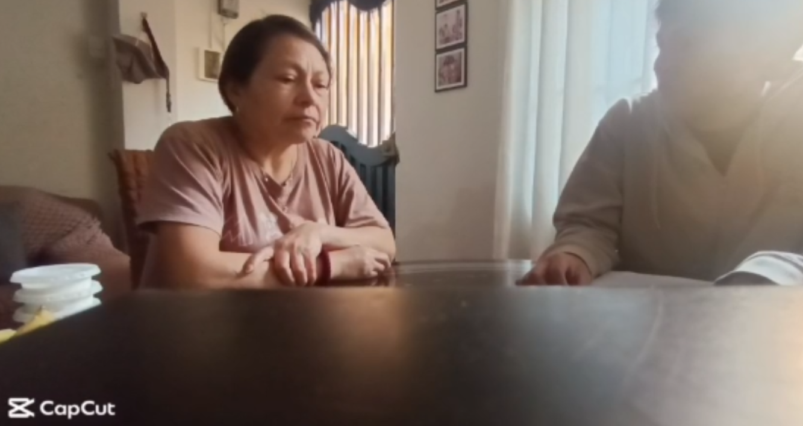
	
	Distrito: callao
	[Entrevista a paciente 02.mp4](https://youtu.be/RhP6C_cGmqs)
	
	- Resumen de la entrevista a Paciente
    
	La entrevista fue realizada a Virgilia Velasque, de 49 años y residente del Callao, quien fue diagnosticada con diabetes tipo 2 hace aproximadamente 15 años.
	
	Control de Glucosa y Medicación:
	
	- Medición: Mide sus niveles de glucosa cada 2-3 meses, dependiendo de cómo se siente, utilizando un glucómetro en postas o farmacias.
	- Episodios: A lo largo de 15 años ha tenido dos episodios de hipoglucemia.
	- Medicamentos: Uso metformina durante 10 años; desde hace 6 meses cambio a otra medicación.
	- Adherencia: En los primeros años tomaba tratamiento de forma desordenada, pero desde hace 6 años cumple al pie de la letra las indicaciones de su médico.
	- Efectos Secundarios: Con la metformina tuvo ardor gástrico; con la nueva medicación presentó maremotos leves, que con el tiempo disminuyeron por la adaptación de su propio cuerpo.
	
	Hábitos y Estilo de Vida:
	
	- Actividad Física: Hace 6 años realizaba ejercicio con el peso corporal y desde hace 1 año y medio entrena con pesas, principalmente para controlar sus niveles de estrés.
	- Alimentación: Su dieta se basa en un mayor consumo de proteínas y verduras, con baja ingesta de carbohidratos; solo en raras ocasiones consume grandes cantidades de estos
	- Factores Adicionales: El estrés afecta directamente sus niveles de glucosa, generando descompensaciones y falta de sueño.
	
	Uso de Tecnología y Apoyo Digital:
	
	- Recordatorios: Considera muy útil recibir alarmas o recordatorios que le ayuden a no olvidar la toma de sus medicamentos.
	- Visualización de Datos: Le interesa contar con gráficos que muestran cómo evoluciona o se dispara su glucosa a lo largo del tiempo.
	- Recomendaciones:Le gustaría recibir sugerencias personalizadas relacionadas con su tratamiento, principalmente enfocadas en alarmas para recordar la medicación.
	- Compartir Datos: Vería beneficioso poder compartir sus registros directamente con el médico a través de la aplicación, especialmente en citas virtuales personalizadas.
	- Sugerencia de Valor Añadido: Destaca la importancia de contar con citas virtuales enfocadas en el paciente, pues le dan mayor confianza y apoyo en su control.

- Entrevista a Pacientes con Diabetes (Segmento 1)
	
	Nombre: Andy Jermy Ascalla Venancio
	Edad: 18
	Distrito: San Martin de Porres
	
	
	
	[Entrevista a paciente 03.mp4](https://youtu.be/rn8sOZuT5MM)
	
	Resumen de la entrevista a Paciente
	
	La entrevista fue realizada a Andy Jermy Ascalla Venancio, de 18 años y residente de San Miguel, quien fue diagnosticado con diabetes tipo 1 hace aproximadamente 5  años.
	
	Control de Glucosa y Medicación:
	
	- Medición: Mide sus niveles de glucosa diariamente, por las mañanas, utilizando un glucómetro.
	- Episodios: En el último mes, experimentó dos episodios de hiperglucemia.
	- Medicamentos: Actualmente utiliza metformina y glibenclamida.
	- Adherencia: Ocasionalmente olvida o retrasa una dosis, lo que ocurre aproximadamente una o dos veces al mes.
	- Efectos Secundarios: Ha experimentado efectos secundarios leves, como mareos.
	
	Hábitos y Estilo de Vida:
	
	- Actividad Física: Realiza actividad física tres veces por semana, saliendo a caminar y a andar en bicicleta.
	- Alimentación: Sigue una dieta con restricción de azúcares y frituras.
	- Factores Adicionales: El estrés afecta sus niveles de glucosa, causando un aumento.
	
	Uso de Tecnología y Apoyo Digital:
	
	- Recordatorios: Le gustaría recibir recordatorios para la toma de medicamentos.
	- Visualización de Datos: Le parece útil ver gráficos de la evolución de su glucosa para monitorear su salud.
	- Recomendaciones: Le gustaría que una aplicación le sugiera recetas y recomendaciones personalizadas.
	- Compartir Datos: Estaría dispuesto a compartir sus datos de salud con su médico a través de una aplicación para facilitar las consultas.

- Entrevista a medicos (Segmento 2
	
	Nombre: Walter
	Apellidos: Gomez Navarro
	Edad: 70 años
	Distrito: La Molina
	
	
	
	[Entrevista a medico 01.mp4](https://youtu.be/O9gIC_WXCfg)
	
	- Resumen de la entrevista a Paciente
	
	La entrevista se realizó con Walter Gómez Navarro (70), médico con 40 años de experiencia. Destaca la hemoglobina glicosilada como clave en el control de la diabetes, señala problemas de adherencia al tratamiento y considera muy útiles los gráficos y alertas en tiempo real para prevenir riesgos.
	
	Manejo de la diabetes: 
	
	- Pacientes atendidos: 5 pacientes diabéticos mensuales
	- Monitoreo de glucosa: Revisión cada 3 meses.
	- Métodos: Benedict (menos preciso) y hemoglobina glicosilada (HbA1c), considerado el estándar internacional, porque refleja el promedio de glucosa de los últimos 3 meses.
	- Indicadores clave: HbA1c por debajo de 7 indica buen control; por encima, diabetes mal controlada.
	- Registro: Historia clínica como unidad central, complementada con bases de datos personales y hojas Excel.
	
	Tratamiento y adherencia:
	
	- Adherencia: Problema frecuente, muchos pacientes olvidan la medicación.. Un olvido aislado no es grave, pero múltiples omisiones desencadenan riesgo de hiperglucemia, coma diabético y estado premortem.
	- Ajustes de tratamiento: Según evolución del paciente. Dificultad: los pacientes no cumplen dietas y fallan los hipoglucemiantes orales.
	- Efectos adversos: Considera muy importante registrarlos. 
	
	Uso de Tecnología y Apoyo Digital:
	
	- Dispositivos: Recomienda glucómetros de punción digital.
	- Datos en gráficos: Considera que ver tendencias gráficas de glucosa es muy útil para entender la evolución del paciente rápidamente. Incluso lo ve como indicador de calidad en la práctica médica.
	- Alertas inmediatas: Considera esencial recibir avisos de hipoglucemia para la prevención de daños cerebrales, cardíacos, hepáticos y renales, además de riesgo de muerte.

### 2.2.3 Analisis de entrevista

Tras el procesamiento de las entrevistas realizadas a los segmentos de pacientes y al médico especialista (Dr. Walter Gómez), se han identificado patrones críticos que justifican la arquitectura y funcionalidades de **GlucoSmart**. El análisis se divide en los siguientes hallazgos clave, los cuales son la base directa para las Historias de Usuario de nuestro Product Backlog:

1. **Deficiencia en la Adherencia y Necesidad de Automatización:** Los pacientes jóvenes (Jorge y Andy, 18-19 años) reportan olvidos mensuales de medicación, mientras que Virgilia (49 años) destaca la importancia de las alarmas. El Dr. Gómez advierte que estos olvidos "aislados" incrementan el riesgo de coma diabético. Esto valida la prioridad alta de un **sistema automatizado de recordatorios**.
2. **Monitoreo Basado en Evidencia y Tendencias:** El Dr. Gómez señala que la revisión cada 3 meses debe basarse en la hemoglobina glicosilada (HbA1c) y tendencias gráficas, ya que son indicadores de calidad. Los tres pacientes entrevistados solicitaron ver su evolución visualmente en lugar de datos aislados. Esto justifica la creación de un **Dashboard de Tendencias** interactivo.
3. **Gestión de Seguridad del Paciente: Farmacovigilancia:** Se identificaron efectos secundarios reales: ardor gástrico en Virgilia y mareos en Jorge. El Dr. Gómez califica como "esencial" recibir alertas inmediatas de hipoglucemia para prevenir daños cerebrales o muerte. Estos hallazgos fundamentan el **Registro de Efectos Adversos** y el **Sistema de Alertas Críticas** en tiempo real.
4. **Colaboración y Telemedicina:** Los pacientes expresaron su total disposición a compartir datos para facilitar consultas virtuales (especialmente Virgilia y Jorge). Jorge propuso un chat directo con profesionales para resolver dudas rápidas, lo que incrementaría su confianza. Esto da soporte al **Módulo de Compartición de Datos** y al **Chat de Consultas**.
5. **Educación y Factores Externos:** El análisis reveló que el estrés afecta directamente los niveles de glucosa de todos los pacientes. Jorge y Andy solicitaron recetas y recomendaciones personalizadas. Esto justifica la inclusión de **Sugerencias de Estilo de Vida** para un manejo integral de la enfermedad.
## 2.3 Needfinding

### 2.3.1 User Personas

User Persona Segmento 2:
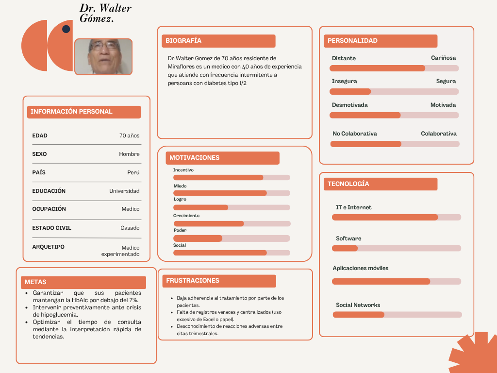

User Persona Segmento 1:
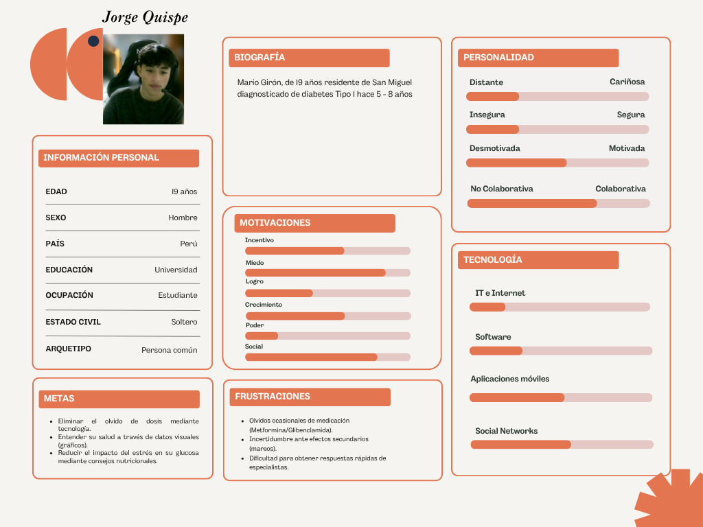

### 2.3.2 User Task Matrix

| **Segmento** | **Tarea Principal**   | **Descripción**                                                  | **Frecuencia**         |
| ------------ | --------------------- | ---------------------------------------------------------------- | ---------------------- |
| **Paciente** | Registro de Glucosa   | Ingreso manual o sincronizado de niveles medidos con glucómetro. | Diaria (Mañanas)       |
| **Paciente** | Confirmación de Dosis | Notificar al sistema la ingesta de la medicación prescrita.      | Diaria (Según receta)  |
| **Paciente** | Reporte de Síntomas   | Registrar mareos, ardor u otros efectos secundarios.             | Ocasional (Evento)     |
| **Médico**   | Revisión de Dashboard | Analizar gráficos de tendencias y HbA1c del paciente.            | Trimestral (Consulta)  |
| **Médico**   | Atención de Alertas   | Evaluar notificaciones críticas de hipoglucemia severa.          | Inmediata (Emergencia) |
| **Médico**   | Ajuste de Tratamiento | Modificar medicación basándose en el historial de adherencia.    | Trimestral / Remoto    |
### 2.3.3 User Journey Mapping

| **Etapa**      | **Acciones**                                                  | **Pensamientos**                                       | **Emociones**         | **Oportunidades**                                     |
| -------------- | ------------------------------------------------------------- | ------------------------------------------------------ | --------------------- | ----------------------------------------------------- |
| **Registro**   | Crea cuenta y configura su medicación y metas de glucosa.     | "¿Será difícil configurar todas mis pastillas?"        | Ansiedad / Esperanza  | Tutorial guiado y carga masiva de medicamentos.       |
| **Uso Diario** | Recibe alertas, confirma toma de medicina y registra glucosa. | "Es bueno que la app me recuerde, a veces se me pasa." | Alivio / Control      | Gamificación por días de adherencia perfecta.         |
| **Crisis**     | Siente mareo y registra el síntoma y un nivel bajo en la app. | "Me siento mal, ¿qué debo hacer ahora?"                | Preocupación / Miedo  | Botón de pánico o guía rápida de primeros auxilios.   |
| **Consulta**   | Comparte el acceso de sus datos con el Dr. Walter.            | "Ahora mi doctor verá exactamente qué pasó este mes."  | Confianza / Seguridad | Generación de reporte PDF profesional para el médico. |

### 2.3.4 Empathy Mapping

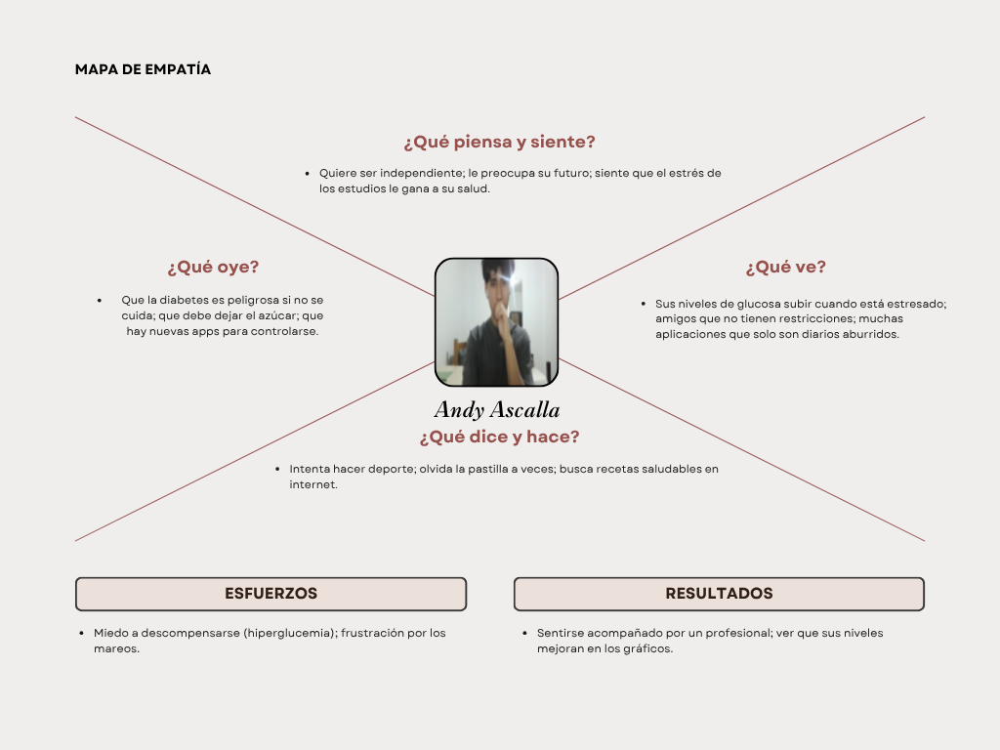

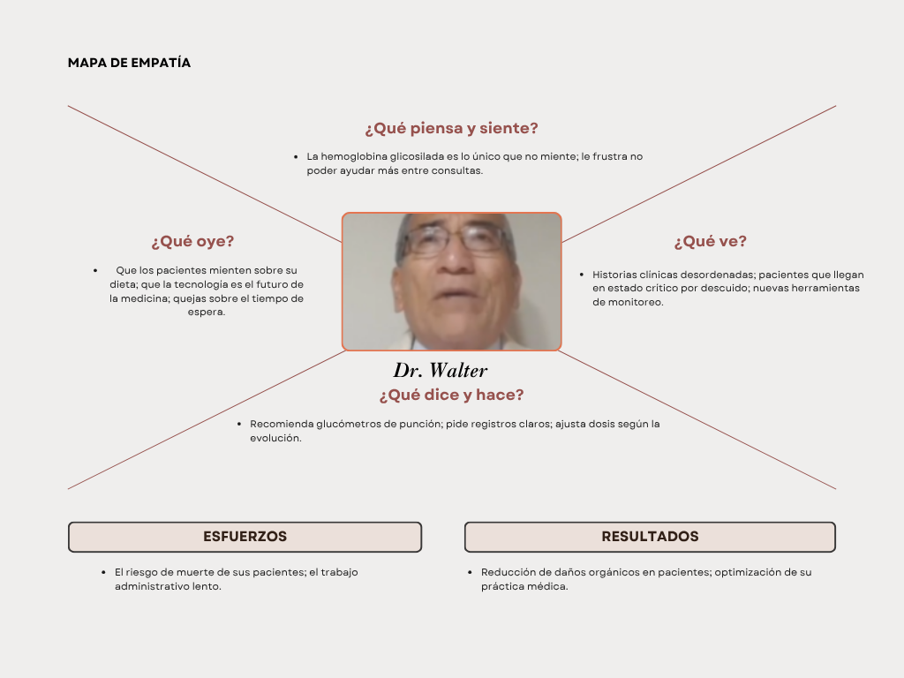
## 2.4 Big Picture Event Storming

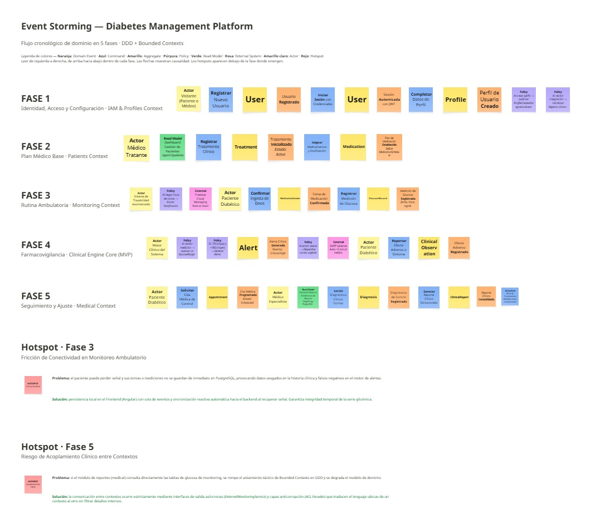

El análisis de _Big Picture Event Storming_ se ha realizado con el objetivo de comprender la complejidad del dominio de la gestión de la diabetes y la farmacovigilancia. Esta dinámica nos permitió visualizar cronológicamente cómo interactúan los pacientes, los médicos y el sistema a lo largo del proceso de tratamiento.

Para este análisis se ha definido la siguiente leyenda estándar:

- **Actores (Amarillo):** Quién ejecuta la acción (Paciente, Médico, Sistema Automatizado).
- **Comandos (Azul):** La intención o acción ejecutada (Ej. "Registrar Glucosa")
- **Eventos de Dominio (Naranja):** El resultado inmutable en tiempo pasado (Ej. "Glucosa Registrada").
- **Sistemas Externos (Rosado):** Servicios de terceros (Ej. "Servicio de Notificaciones Push").
- **Modelos de Lectura (Verde):** La información que el actor visualiza para tomar decisiones (Ej. "Dashboard de Tendencias").

#### Flujo Cronológico del Dominio (GlucoSmart)

El flujo del negocio se ha dividido en cuatro fases principales, basadas en las necesidades identificadas en las entrevistas de validación:

**Fase 1: Configuración Inicial y Vinculación**

- **Actor:** Paciente / Médico.
    
- **Comando:** Crear cuenta de usuario $\rightarrow$ **Evento:** Cuenta Creada.
    
- **Comando:** Configurar plan de medicación $\rightarrow$ **Evento:** Plan de Medicación Establecido.
    
- **Comando:** Generar código de acceso clínico $\rightarrow$ **Evento:** Código de Acceso Generado.
    
- **Comando:** Ingresar código de paciente $\rightarrow$ **Evento:** Paciente Vinculado al Médico.
    

**Fase 2: Monitoreo Diario y Adherencia (Prevención de Olvidos)**

- **Actor:** Sistema Automatizado.
- **Comando:** Evaluar horario de medicación $\rightarrow$ **Evento:** Recordatorio Disparado.
- **Sistema Externo:** Servicio de Notificaciones Push notifica al usuario.
- **Actor:** Paciente.
- **Comando:** Confirmar ingesta de medicamento $\rightarrow$ **Evento:** Medicación Confirmada.
- **Comando:** Ingresar nivel de glucosa matutino $\rightarrow$ **Evento:** Medición de Glucosa Registrada.

**Fase 3: Farmacovigilancia y Gestión de Crisis**

- **Actor:** Paciente.
- **Modelo de Lectura:** Formulario de síntomas.
- **Comando:** Registrar reacción adversa (Ej. mareos/ardor) $\rightarrow$ **Evento:** Efecto Adverso Registrado.
- **Actor:** Sistema Automatizado.
- **Comando:** Evaluar umbral de riesgo clínico $\rightarrow$ **Evento:** Límite de Hipoglucemia Excedido.
- **Comando:** Generar alerta de riesgo $\rightarrow$ **Evento:** Alerta Crítica Generada.
- **Sistema Externo:** Servicio de Mensajería (Email/SMS) envía aviso al médico tratante.

**Fase 4: Consulta y Ajuste de Tratamiento**

- **Actor:** Médico (Ej. Dr. Gómez).
- **Modelo de Lectura:** Dashboard de Tendencias de HbA1c y Registro de Farmacovigilancia.
- **Comando:** Visualizar evolución trimestral $\rightarrow$ **Evento:** Historial Clínico Consultado.
- **Comando:** Modificar dosis o tipo de medicamento $\rightarrow$ **Evento:** Tratamiento Ajustado.
- **Actor:** Sistema Automatizado.
- **Comando:** Actualizar plan del paciente $\rightarrow$ **Evento:** Plan de Medicación Actualizado (Cierra el ciclo volviendo a la Fase 2).

#### Análisis de Puntos Críticos (Cuellos de Botella)

Durante el Event Storming, se identificaron dos áreas de fricción (representadas con notas adhesivas rojas en el diseño visual) que el software debe mitigar de forma prioritaria:

1. **Fricción en el Registro Manual:** La dependencia de que el paciente ingrese manualmente sus niveles de glucosa puede generar vacíos en la base de datos.
2. **Tiempo de Reacción ante Alertas:** La alerta crítica de hipoglucemia debe ser bidireccional; si el médico no está disponible de inmediato, el sistema debe proporcionar instrucciones de primeros auxilios básicas al paciente para mitigar el daño orgánico inmediato.
## 2.5 Ubiquitous Language

El lenguaje ubicuo del proyecto **GlucoSmart** define los términos clave que serán utilizados de manera consistente a lo largo del análisis, diseño e implementación del sistema. Este glosario permite que todos los integrantes del equipo compartan una misma comprensión del dominio de negocio relacionado con el monitoreo y control de la diabetes.

### Términos generales

**1. Platform (Plataforma):**  
Sistema digital de GlucoSmart que permite centralizar la información clínica del paciente y facilitar la interacción con el doctor.

**2. Patient (Paciente):**  
Persona con diabetes que utiliza la plataforma para registrar su información de salud, recibir seguimiento y controlar su tratamiento.

**3. Doctor (Doctor):**  
Profesional de salud encargado de revisar la información del paciente, brindar seguimiento médico y tomar decisiones clínicas.

**4. Diabetes Management (Gestión de la diabetes):**  
Proceso de control, seguimiento y tratamiento continuo de la diabetes mediante registros clínicos, monitoreo y atención médica.

**5. Clinical Information (Información clínica):**  
Conjunto de datos relacionados con el estado de salud del paciente, tales como niveles de glucosa, síntomas, medicamentos y observaciones médicas.

**6. Treatment (Tratamiento):**  
Plan médico definido para el paciente, que incluye medicamentos, indicaciones y controles necesarios para el manejo de la diabetes.

**7. Monitoring (Monitoreo):**  
Seguimiento continuo de los datos de salud del paciente registrados dentro de la plataforma.

**8. Clinical Record (Registro clínico):**  
Historial digital donde se almacena la información médica relevante del paciente para su consulta y seguimiento.

---

### Perfil de usuario – Paciente

**1. Glucose Level (Nivel de glucosa):**  
Valor registrado en la plataforma para representar la concentración de glucosa del paciente en sangre.

**2. Glucose Log (Registro de glucosa):**  
Historial de mediciones de glucosa ingresadas por el paciente para el control de su estado de salud.

**3. Medication (Medicamento):**  
Fármaco indicado al paciente para controlar la diabetes o tratar condiciones relacionadas.

**4. Medication Intake (Toma de medicación):**  
Acción de registrar el consumo de un medicamento en la plataforma.

**5. Symptom (Síntoma):**  
Malestar o señal física reportada por el paciente durante su tratamiento o seguimiento.

**6. Treatment Adherence (Adherencia al tratamiento):**  
Nivel de cumplimiento del paciente respecto a las indicaciones médicas, medicamentos y controles establecidos.

**7. Reminder (Recordatorio):**  
Notificación generada por el sistema para avisar al paciente sobre la toma de medicamentos, controles o citas médicas.

**8. Alert (Alerta):**  
Aviso emitido por la plataforma cuando se detecta una situación que requiere atención, como una medición fuera del rango esperado.

**9. Appointment (Cita médica):**  
Encuentro programado entre el paciente y el doctor para revisión, seguimiento o evaluación del tratamiento.

**10. Health History (Historial de salud):**  
Conjunto de registros del paciente relacionados con su evolución, controles, síntomas y tratamiento.

---

### Perfil de usuario – Doctor

**1. Clinical Review (Revisión clínica):**  
Proceso mediante el cual el doctor analiza la información registrada por el paciente en la plataforma.

**2. Diagnosis (Diagnóstico):**  
Determinación médica sobre la condición de salud del paciente a partir de su evaluación clínica.

**3. Prescription (Prescripción):**  
Indicación médica que define qué medicamentos debe tomar el paciente, en qué dosis y con qué frecuencia.

**4. Clinical Follow-up (Seguimiento clínico):**  
Supervisión periódica realizada por el doctor sobre el estado de salud y evolución del paciente.

**5. Therapeutic Adjustment (Ajuste terapéutico):**  
Modificación del tratamiento en función de la evolución clínica y los datos registrados en la plataforma.

**6. Medical Observation (Observación médica):**  
Comentario o anotación realizada por el doctor sobre el estado, avance o respuesta del paciente al tratamiento.

**7. Medical Decision (Decisión médica):**  
Acción clínica tomada por el doctor a partir de la información analizada en el sistema.

**8. Appointment Schedule (Agenda de citas):**  
Listado de citas médicas programadas que permite al doctor organizar su seguimiento con los pacientes.

---

### Gestión del tratamiento y seguimiento

**1. Dose (Dosis):**  
Cantidad específica de medicamento que el paciente debe consumir según la prescripción médica.

**2. Frequency (Frecuencia):**  
Número de veces o intervalo en el que el paciente debe tomar su medicación.

**3. Schedule (Horario):**  
Momento definido para la toma de medicamentos, controles o citas médicas.

**4. Medical Report (Reporte médico):**  
Resumen organizado de la información clínica del paciente en un periodo determinado.

**5. Traceability (Trazabilidad):**  
Capacidad del sistema para registrar y seguir la evolución del paciente y el cumplimiento de su tratamiento a lo largo del tiempo.

**6. Follow-up History (Historial de seguimiento):**  
Registro cronológico de revisiones, observaciones y cambios realizados durante el control médico del paciente.

---

### Alertas y control de riesgos

**1. Risk Alert (Alerta de riesgo):**  
Notificación emitida cuando el sistema detecta una posible situación peligrosa para la salud del paciente.

**2. Adverse Effect (Efecto adverso):**  
Reacción no deseada que puede presentarse en el paciente como consecuencia de un medicamento o tratamiento.

**3. Preventive Notification (Notificación preventiva):**  
Aviso generado para anticipar posibles complicaciones y promover una acción oportuna.

**4. Clinical Event (Evento clínico):**  
Situación relevante registrada en la plataforma, como una variación anormal de glucosa, un síntoma o un cambio en el tratamiento.

---

### Acceso a la plataforma

**1. Sign Up (Registro):**  
Proceso mediante el cual un usuario crea una cuenta en la plataforma GlucoSmart.

**2. Sign In (Inicio de sesión):**  
Acción de ingresar al sistema mediante credenciales para acceder a sus funcionalidades.

**3. User Account (Cuenta de usuario):**  
Perfil digital asociado a un paciente o doctor dentro de la plataforma.

**4. User Profile (Perfil de usuario):**  
Información personal y profesional registrada en el sistema según el tipo de usuario.

# Capitulo III: Requirements Specification

## 3.1 User Stories

En esta sección se presentan las épicas y las historias de usuario del proyecto **GlucoSmart**, alineadas con las necesidades funcionales de los principales actores del sistema: **pacientes** y **doctores**. Estas historias de usuario servirán como base para la priorización del backlog, el diseño del sistema y la planificación del desarrollo.

### Epics

| Epic ID | Título                               | Descripción                                                                                                                       |
| ------- | ------------------------------------ | --------------------------------------------------------------------------------------------------------------------------------- |
| EP-01   | Landing Page y Captación de Usuarios | Como startup, queremos presentar claramente la propuesta de valor de GlucoSmart para informar y captar potenciales usuarios.      |
| EP-02   | Gestión de Cuenta y Acceso           | Como usuario, queremos registrarnos e iniciar sesión de forma segura para acceder a las funcionalidades de la plataforma.         |
| EP-03   | Perfil y Datos Clínicos del Paciente | Como paciente, queremos gestionar nuestro perfil y antecedentes clínicos para mantener información médica actualizada.            |
| EP-04   | Monitoreo y Registro de Salud        | Como paciente, queremos registrar y consultar nuestros datos de salud para llevar control continuo de la diabetes.                |
| EP-05   | Tratamiento, Medicación y Alertas    | Como paciente y doctor, queremos gestionar tratamientos, medicación y alertas para mejorar la adherencia y prevención de riesgos. |
| EP-06   | Seguimiento Clínico del Doctor       | Como doctor, queremos revisar y registrar información clínica del paciente para realizar un seguimiento médico adecuado.          |
| EP-07   | Gestión de Citas Médicas             | Como usuario, queremos gestionar citas médicas para organizar el seguimiento y la atención de salud.                              |

### User Stories

| Story ID | Título                                       | Descripción                                                                                                                                         | Criterios de Aceptación                                                                                                                                                                                                            | Epic ID |
| -------- | -------------------------------------------- | --------------------------------------------------------------------------------------------------------------------------------------------------- | ---------------------------------------------------------------------------------------------------------------------------------------------------------------------------------------------------------------------------------- | ------- |
| US-01    | Hero section del Landing Page                | Como visitante, quiero visualizar la propuesta de valor principal de GlucoSmart para comprender rápidamente el propósito de la plataforma.          | **Scenario 1:** **Given** the visitor accesses the landing page, **When** the main section is displayed, **Then** the visitor can clearly identify the purpose of GlucoSmart and its focus on diabetes management.        | EP-01   |
| US-02    | Registro de paciente                         | Como paciente, quiero registrarme en la plataforma para acceder a las funcionalidades de monitoreo y seguimiento de mi salud.                       | **Scenario 1:** **Given** the patient completes the registration form with valid data, **When** the patient selects the “Sign Up” option, **Then** the system creates the account successfully.                           | EP-02   |
| US-03    | Registro de doctor                           | Como doctor, quiero registrarme en la plataforma para acceder a la información clínica de mis pacientes y realizar seguimiento médico.              | **Scenario 1:** **Given** the doctor completes the registration form with valid data, **When** the doctor selects the “Sign Up” option, **Then** the system creates the account successfully.                             | EP-02   |
| US-04    | Log in                                       | Como usuario, quiero iniciar sesión con mis credenciales para acceder de forma segura a mi cuenta.                                                  | **Scenario 1:** **Given** the user already has a registered account, **When** the user enters valid credentials, **Then** the system grants access to the account.                                                        | EP-02   |
| US-05    | Recuperación de contraseña                   | Como usuario, quiero recuperar mi contraseña para volver a acceder a mi cuenta si la he olvidado.                                                   | **Scenario 1:** **Given** the user selects the password recovery option, **When** the user enters a valid email address, **Then** the system sends instructions to restore access.                                        | EP-02   |
| US-06    | Cerrar sesión                                | Como usuario, quiero cerrar sesión de manera segura para proteger la privacidad de mi información.                                                  | **Scenario 1:** **Given** the user is authenticated in the platform, **When** the user selects the “Log Out” option, **Then** the system ends the session and redirects the user out of the private area.                 | EP-02   |
| US-07    | Crear perfil de paciente                     | Como paciente, quiero completar mi perfil personal y clínico para contar con un registro base dentro de la plataforma.                              | **Scenario 1:** **Given** the patient accesses the profile section, **When** the patient completes the required personal and clinical information, **Then** the system stores the information successfully.               | EP-03   |
| US-08    | Editar perfil de paciente                    | Como paciente, quiero actualizar mis datos personales y clínicos para mantener mi información correcta y vigente.                                   | **Scenario 1:** **Given** the patient already has a registered profile, **When** the patient edits the data and saves the changes, **Then** the system updates the information successfully.                              | EP-03   |
| US-09    | Registrar antecedentes médicos               | Como paciente, quiero registrar mis antecedentes médicos relevantes para que el doctor disponga de mayor contexto clínico.                          | **Scenario 1:** **Given** the patient accesses the medical history section, **When** the patient enters valid background information, **Then** the system stores it correctly in the clinical record.                     | EP-03   |
| US-10    | Visualizar historial de salud                | Como paciente, quiero consultar mi historial de salud para revisar la evolución de mi condición a lo largo del tiempo.                              | **Scenario 1:** **Given** the patient has previous health records in the platform, **When** the patient accesses the health history section, **Then** the system displays the stored information in an organized way.     | EP-03   |
| US-11    | Consultar perfil y datos clínicos personales | Como paciente, quiero visualizar mi información personal y clínica consolidada para tener una visión general de mi estado de salud.                 | **Scenario 1:** **Given** the patient accesses the profile section, **When** the patient requests to view the registered information, **Then** the system displays the personal and clinical data in a consolidated view. | EP-03   |
| US-12    | Registrar nivel de glucosa                   | Como paciente, quiero registrar mis niveles de glucosa para llevar control sobre mi estado diario de salud.                                         | **Scenario 1:** **Given** the patient accesses the monitoring module, **When** the patient enters a valid glucose measurement, **Then** the system stores the entered value successfully.                                 | EP-04   |
| US-13    | Visualizar historial de glucosa              | Como paciente, quiero consultar el historial de mis mediciones de glucosa para identificar cambios y patrones en el tiempo.                         | **Scenario 1:** **Given** the patient has previous glucose records, **When** the patient accesses the glucose history section, **Then** the system displays the list of records in chronological order.                   | EP-04   |
| US-14    | Registrar síntomas                           | Como paciente, quiero registrar los síntomas que presento para complementar la información clínica de mi seguimiento.                               | **Scenario 1:** **Given** the patient accesses the symptoms section, **When** the patient enters valid symptom information, **Then** the system stores the symptom in the clinical history.                               | EP-04   |
| US-15    | Visualizar evolución de salud                | Como paciente, quiero visualizar el resumen de mi evolución de salud para entender mejor mi progreso y condición actual.                            | **Scenario 1:** **Given** the patient has health information registered in the platform, **When** the patient accesses the health progress panel, **Then** the system displays a summary of the health records.           | EP-04   |
| US-16    | Recibir alerta por glucosa fuera de rango    | Como paciente, quiero recibir alertas cuando mis niveles de glucosa estén fuera de rango para actuar de manera oportuna ante un posible riesgo.     | **Scenario 1:** **Given** the patient registers a glucose measurement outside the expected range, **When** the system validates the entered value, **Then** the system generates an alert for the patient.                | EP-04   |
| US-17    | Visualizar tratamiento actual                | Como paciente, quiero consultar mi tratamiento actual para saber qué indicaciones y medicamentos debo seguir.                                       | **Scenario 1:** **Given** the patient has an active treatment registered, **When** the patient accesses the treatment section, **Then** the system displays the current medical indications.                              | EP-05   |
| US-18    | Registrar tratamiento prescrito              | Como doctor, quiero registrar el tratamiento prescrito del paciente para dejar definidas las indicaciones médicas dentro de la plataforma.          | **Scenario 1:** **Given** the doctor accesses the patient’s clinical profile, **When** the doctor enters a valid treatment plan, **Then** the system stores the treatment successfully.                                   | EP-05   |
| US-19    | Registrar toma de medicación                 | Como paciente, quiero registrar cada toma de mi medicación para llevar control del cumplimiento de mi tratamiento.                                  | **Scenario 1:** **Given** the patient accesses the medication section, **When** the patient records a completed medication intake, **Then** the system stores the information in the corresponding history.               | EP-05   |
| US-20    | Recibir recordatorio de medicación           | Como paciente, quiero recibir recordatorios de medicación para no olvidar mis tomas programadas.                                                    | **Scenario 1:** **Given** the patient has medication schedules configured, **When** the scheduled time is reached, **Then** the system sends a medication reminder.                                                       | EP-05   |
| US-21    | Reportar efectos adversos                    | Como paciente, quiero reportar efectos adversos relacionados con mi medicación para que el doctor pueda evaluarlos oportunamente.                   | **Scenario 1:** **Given** the patient accesses the pharmacovigilance section, **When** the patient records a valid adverse effect report, **Then** the system stores the report successfully.                             | EP-05   |
| US-22    | Consultar adherencia al tratamiento          | Como doctor, quiero consultar el nivel de adherencia del paciente a su tratamiento para evaluar si está cumpliendo correctamente las indicaciones.  | **Scenario 1:** **Given** the doctor accesses the patient’s history, **When** the doctor reviews the recorded medication information, **Then** the system displays the treatment adherence level.                         | EP-05   |
| US-23    | Revisar información clínica del paciente     | Como doctor, quiero revisar la información clínica registrada por el paciente para realizar un seguimiento adecuado de su estado de salud.          | **Scenario 1:** **Given** the doctor accesses the patient record, **When** the doctor reviews the clinical records, **Then** the system displays the patient’s consolidated information.                                  | EP-06   |
| US-24    | Registrar observaciones médicas              | Como doctor, quiero registrar observaciones médicas sobre la evolución del paciente para dejar constancia del seguimiento clínico realizado.        | **Scenario 1:** **Given** the doctor accesses the patient record, **When** the doctor enters a valid medical observation, **Then** the system stores the observation successfully.                                        | EP-06   |
| US-25    | Emitir diagnóstico                           | Como doctor, quiero registrar un diagnóstico dentro de la plataforma para documentar formalmente la evaluación clínica del paciente.                | **Scenario 1:** **Given** the doctor accesses the patient’s clinical history, **When** the doctor enters a valid diagnosis, **Then** the system stores the diagnosis in the clinical record.                              | EP-06   |
| US-26    | Generar reporte clínico del paciente         | Como doctor, quiero generar un reporte clínico del paciente para contar con un resumen organizado de su información médica.                         | **Scenario 1:** **Given** the doctor accesses the patient record, **When** the doctor requests a clinical report, **Then** the system displays a structured clinical summary.                                             | EP-06   |
| US-27    | Solicitar cita médica                        | Como paciente, quiero solicitar una cita médica para recibir atención y seguimiento por parte del doctor.                                           | **Scenario 1:** **Given** the patient accesses the appointment module, **When** the patient submits a request with valid data, **Then** the system schedules the appointment successfully.                                | EP-07   |
| US-28    | Visualizar agenda de citas                   | Como usuario, quiero visualizar mis citas programadas para organizar mejor mi seguimiento médico.                                                   | **Scenario 1:** **Given** the user has registered appointments, **When** the user accesses the agenda section, **Then** the system displays the scheduled appointments in chronological order.                            | EP-07   |
| US-29    | Navegación por el Landing Page               | Como visitante, quiero navegar fácilmente entre las secciones del landing page para encontrar información del producto de manera rápida y ordenada. | **Scenario 1:** **Given** the visitor is on the landing page, **When** the visitor selects a navigation menu option, **Then** the system scrolls to the corresponding section.                                            | EP-01   |
| US-30    | Ver información de la Startup                | Como visitante, quiero visualizar información sobre IntegraVida y GlucoSmart para conocer el contexto y objetivo de la solución.                    | **Scenario 1:** **Given** the visitor accesses the “About Us” section, **When** the visitor reviews its content, **Then** the system displays relevant information about the startup and the product.                     | EP-01   |
| US-31    | Conocer la misión y visión de la Startup     | Como visitante, quiero leer la misión y visión de la startup para entender su enfoque y compromiso con el manejo de la diabetes.                    | **Scenario 1:** **Given** the visitor accesses the “About Us” section, **When** the visitor reviews the information cards, **Then** the system displays the startup’s mission and vision.                                 | EP-01   |
| US-32    | Cambiar idioma del Landing Page              | Como visitante, quiero cambiar el idioma del landing page para visualizar la información en el idioma de mi preferencia.                            | **Scenario 1:** **Given** the visitor is on the landing page, **When** the visitor selects one of the available languages, **Then** the interface content is updated to the selected language.                            | EP-01   |
| US-33    | Contactar al equipo de soporte               | Como visitante, quiero enviar un mensaje al equipo de soporte para resolver dudas o solicitar información sobre la plataforma.                      | **Scenario 1:** **Given** the visitor completes the contact form with valid data, **When** the visitor selects the “Send” option, **Then** the system registers or sends the message successfully.                        | EP-01   |
| US-34    | Reprogramar cita médica                      | Como usuario, quiero reprogramar una cita médica para adaptar el seguimiento a mi disponibilidad.                                                   | **Scenario 1:** **Given** the user has a previously scheduled appointment, **When** the user selects a new valid date and time, **Then** the system updates the appointment successfully.                                 | EP-07   |
| US-35    | Cancelar cita médica                         | Como usuario, quiero cancelar una cita médica para liberar el espacio cuando no pueda asistir.                                                      | **Scenario 1:** **Given** the user has a scheduled appointment, **When** the user selects the “Cancel” option, **Then** the system cancels the registered appointment successfully.                                       | EP-07   |
| US-36    | Recibir recordatorio de cita                 | Como usuario, quiero recibir recordatorios de mis citas médicas para no olvidar mis atenciones programadas.                                         | **Scenario 1:** **Given** the user has an upcoming appointment registered, **When** the appointment date is approaching, **Then** the system sends the corresponding reminder.                                            | EP-07   |
| US-37    | Visualizar gráficos de glucosa               | Como paciente, quiero visualizar gráficos de mis niveles de glucosa para identificar patrones en mi evolución de salud. | **Scenario 1:** **Given** the patient has registered glucose data, **When** the patient accesses the analytics section, **Then** the system displays graphical representations of the glucose levels over time. | EP-04 |
| US-38    | Filtrar historial de glucosa                 | Como paciente, quiero filtrar mi historial de glucosa por fechas para analizar periodos específicos de mi evolución. | **Scenario 1:** **Given** the patient accesses the glucose history, **When** the patient applies a valid date filter, **Then** the system displays the filtered results accordingly. | EP-04 |
| US-39    | Editar registro de glucosa                   | Como paciente, quiero editar un registro de glucosa para corregir errores en la información ingresada. | **Scenario 1:** **Given** the patient has an existing glucose record, **When** the patient edits and saves the data, **Then** the system updates the record successfully. | EP-04 |
| US-40    | Eliminar registro de glucosa                 | Como paciente, quiero eliminar un registro de glucosa para mantener mi historial limpio y preciso. | **Scenario 1:** **Given** the patient has an existing glucose record, **When** the patient selects the delete option, **Then** the system removes the record successfully. | EP-04 |
| US-41    | Visualizar alertas generadas                 | Como paciente, quiero ver el historial de alertas generadas para comprender eventos críticos anteriores. | **Scenario 1:** **Given** the patient has received alerts, **When** the patient accesses the alerts section, **Then** the system displays the list of alerts. | EP-05 |
| US-42    | Configurar rango de glucosa                  | Como paciente, quiero configurar mis rangos de glucosa personalizados para recibir alertas más precisas. | **Scenario 1:** **Given** the patient accesses settings, **When** the patient defines valid glucose ranges, **Then** the system stores the configuration successfully. | EP-05 |
| US-43    | Confirmar lectura de alerta                  | Como paciente, quiero marcar una alerta como leída para llevar control de las notificaciones atendidas. | **Scenario 1:** **Given** the patient has unread alerts, **When** the patient marks an alert as read, **Then** the system updates its status. | EP-05 |
| US-44    | Visualizar efectos adversos registrados      | Como paciente, quiero consultar los efectos adversos registrados para llevar control de mis reacciones. | **Scenario 1:** **Given** the patient has recorded adverse effects, **When** the patient accesses the pharmacovigilance section, **Then** the system displays the recorded information. | EP-05 |
| US-45    | Evaluar efectos adversos                     | Como doctor, quiero analizar los efectos adversos reportados para ajustar el tratamiento del paciente. | **Scenario 1:** **Given** the doctor accesses patient data, **When** the doctor reviews adverse effect records, **Then** the system displays the corresponding details. | EP-05 |
| US-46    | Visualizar dashboard de pacientes            | Como doctor, quiero visualizar un listado de mis pacientes para acceder rápidamente a su información clínica. | **Scenario 1:** **Given** the doctor has registered patients, **When** the doctor accesses the dashboard, **Then** the system displays the patient list. | EP-06 |
| US-47    | Buscar paciente                              | Como doctor, quiero buscar pacientes por nombre o identificación para acceder rápidamente a su información. | **Scenario 1:** **Given** the doctor accesses the patient module, **When** the doctor enters a valid search parameter, **Then** the system displays matching results. | EP-06 |
| US-48    | Visualizar evolución gráfica del paciente    | Como doctor, quiero visualizar gráficos de evolución del paciente para analizar su progreso clínico. | **Scenario 1:** **Given** the patient has health records, **When** the doctor accesses the analytics section, **Then** the system displays graphical data. | EP-06 |
| US-49    | Actualizar tratamiento                       | Como doctor, quiero modificar el tratamiento del paciente para adaptarlo a su evolución clínica. | **Scenario 1:** **Given** the doctor accesses the treatment module, **When** the doctor updates the information, **Then** the system saves the changes successfully. | EP-05 |
| US-50    | Compartir información clínica                | Como paciente, quiero compartir mi información con mi doctor para facilitar el seguimiento médico. | **Scenario 1:** **Given** the patient authorizes access, **When** the doctor requests information, **Then** the system grants access securely. | EP-06 |
| US-51    | Recibir recomendaciones médicas              | Como paciente, quiero recibir recomendaciones del doctor para mejorar el control de mi salud. | **Scenario 1:** **Given** the doctor provides recommendations, **When** the patient accesses the notifications section, **Then** the system displays the message. | EP-06 |
| US-52    | Notificar cancelación de cita                | Como usuario, quiero recibir una notificación cuando una cita sea cancelada para reorganizar mi agenda. | **Scenario 1:** **Given** an appointment is canceled, **When** the system processes the update, **Then** the user receives a notification. | EP-07 |
| US-53    | Validar disponibilidad de citas              | Como paciente, quiero ver horarios disponibles para agendar citas correctamente. | **Scenario 1:** **Given** the patient accesses scheduling, **When** the system retrieves availability, **Then** the system displays available time slots. | EP-07 |
| US-54    | Confirmar cita médica                        | Como usuario, quiero confirmar una cita programada para asegurar mi atención médica. | **Scenario 1:** **Given** the appointment is scheduled, **When** the user confirms it, **Then** the system updates the status. | EP-07 |
| US-55    | Visualizar resumen general del sistema       | Como usuario, quiero ver un resumen general de mi información para tener una visión rápida de mi estado de salud. | **Scenario 1:** **Given** the user accesses the dashboard, **When** the system loads the data, **Then** the system displays a summarized view of health data. | EP-04 |

## 3.2 Impact Mapping

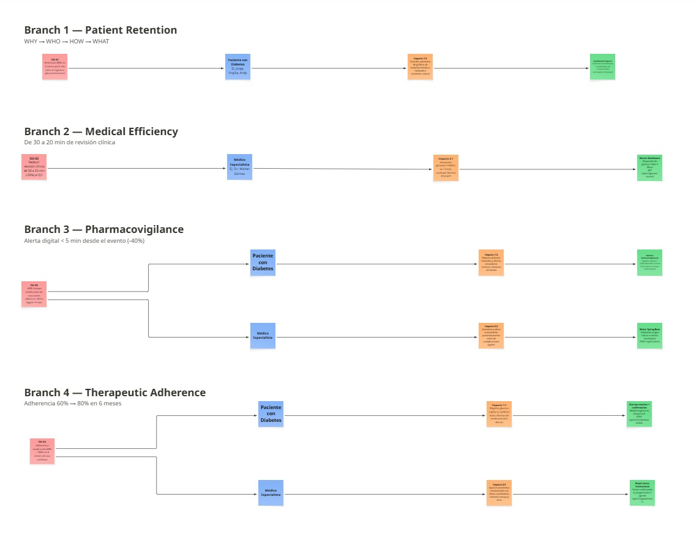

Para asegurar que las funcionalidades de **GlucoSmart** estén alineadas con los objetivos estratégicos de **IntegraVida**, se ha desarrollado un Impact Mapping. Esta técnica nos permite visualizar cómo los entregables de software generarán un cambio de comportamiento en nuestros usuarios, logrando así el impacto de negocio deseado.

A continuación, se detalla la estructura del mapa de impacto:

#### 1. Objetivo del Negocio (WHY / ¿Por qué?)

- **Meta Principal:** Lograr una retención de uso continuo del 80% en pacientes durante los primeros 3 meses y reducir el tiempo de revisión de historial clínico en las consultas médicas en un 20%
#### 2. Actores (WHO / ¿Quién?)

Para alcanzar esta meta, dependemos de los dos segmentos principales identificados en nuestras entrevistas:

- **Actor 1:** Paciente con Diabetes (Ej. Jorge).
- **Actor 2:** Médico Especialista (Ej. Dr. Walter).
#### 3. Impactos (HOW / ¿Cómo?)

¿Cómo necesitamos que cambie el comportamiento de estos actores para lograr nuestra meta?

- **Para el Paciente:**
    
    - _Impacto 1.1:_ Que registre su glucosa y confirme la ingesta de su medicación diariamente sin olvidos.
    - _Impacto 1.2:_ Que reporte los efectos adversos o síntomas inusuales en el momento en que ocurren.
    
- **Para el Médico:**
    
    - _Impacto 2.1:_ Que interprete la evolución de la hemoglobina glicosilada (HbA1c) en segundos, en lugar de revisar apuntes desordenados.
    - _Impacto 2.2:_ Que intervenga de forma preventiva antes de que un paciente sufra daño orgánico por hipoglucemia.

#### 4. Entregables / Funcionalidades (WHAT / ¿Qué?)

¿Qué vamos a construir (desarrollar) en la plataforma para facilitar esos impactos?

- **Para lograr el Impacto 1.1 (Registro diario):**
    
    - _Entregable:_ Sistema automatizado de recordatorios y confirmación de dosis.
	
- **Para lograr el Impacto 1.2 (Reporte de síntomas):**
    
    - _Entregable:_ Módulo de registro rápido de farmacovigilancia y reacciones adversas.
    
- **Para lograr el Impacto 2.1 (Interpretación rápida):**
    
    - _Entregable:_ Dashboard interactivo con gráficos de tendencias de glucosa y filtros históricos.
    
- **Para lograr el Impacto 2.2 (Intervención preventiva):**
    
    - _Entregable:_ Sistema de alertas críticas enviadas en tiempo real ante niveles fuera del rango seguro.

## 3.3 Product Backlog

El Product Backlog de **GlucoSmart** ha sido priorizado en función del valor de negocio que cada historia aporta al producto. El orden sigue la secuencia recomendada: primero las historias relacionadas con la **Landing Page** (visibilidad y propuesta de valor), luego los **CRUDs fundamentales** (autenticación y perfiles), después el **core de negocio** (monitoreo de glucosa, alertas y adherencia), seguido de las **Technical Stories** para el RESTful API y el despliegue, y finalmente las historias secundarias de gestión médica.

**URL pública del Product Backlog:** `[Pendiente: pegar aquí el enlace público del tablero Trello/Jira/Pivotal]`

La estimación técnica de cada historia se expresa mediante **Story Points**.

| # Orden | User Story ID | Título | Descripción | Story Points | Prioridad |
| :---: | :---: | :--- | :--- | :---: | :---: |
| 1 | US-01 | Hero section del Landing Page | Como visitante, quiero visualizar la propuesta de valor principal de GlucoSmart para comprender rápidamente el propósito de la plataforma. | 2 | Alta |
| 2 | US-29 | Navegación por el Landing Page | Como visitante, quiero navegar fácilmente entre las secciones del landing page para encontrar información del producto de manera rápida y ordenada. | 3 | Alta |
| 3 | US-30 | Ver información de la Startup | Como visitante, quiero visualizar información sobre IntegraVida y GlucoSmart para conocer el contexto y objetivo de la solución. | 2 | Alta |
| 4 | US-31 | Conocer la misión y visión de la Startup | Como visitante, quiero leer la misión y visión de la startup para entender su enfoque y compromiso con el manejo de la diabetes. | 2 | Alta |
| 5 | US-32 | Cambiar idioma del Landing Page | Como visitante, quiero cambiar el idioma del landing page para visualizar la información en el idioma de mi preferencia. | 3 | Media |
| 6 | US-33 | Contactar al equipo de soporte | Como visitante, quiero enviar un mensaje al equipo de soporte para resolver dudas o solicitar información sobre la plataforma. | 3 | Media |
| 7 | US-02 | Registro de paciente | Como paciente, quiero registrarme en la plataforma para acceder a las funcionalidades de monitoreo y seguimiento de mi salud. | 5 | Alta |
| 8 | US-03 | Registro de doctor | Como doctor, quiero registrarme en la plataforma para acceder a la información clínica de mis pacientes y realizar seguimiento médico. | 5 | Alta |
| 9 | US-04 | Log in | Como usuario, quiero iniciar sesión con mis credenciales para acceder de forma segura a mi cuenta. | 3 | Alta |
| 10 | US-06 | Cerrar sesión | Como usuario, quiero cerrar sesión de manera segura para proteger la privacidad de mi información. | 1 | Alta |
| 11 | US-07 | Crear perfil de paciente | Como paciente, quiero completar mi perfil personal y clínico para contar con un registro base dentro de la plataforma. | 5 | Alta |
| 12 | US-08 | Editar perfil de paciente | Como paciente, quiero actualizar mis datos personales y clínicos para mantener mi información correcta y vigente. | 3 | Alta |
| 13 | US-11 | Consultar perfil y datos clínicos personales | Como paciente, quiero visualizar mi información personal y clínica consolidada para tener una visión general de mi estado de salud. | 2 | Alta |
| 14 | US-12 | Registrar nivel de glucosa | Como paciente, quiero registrar mis niveles de glucosa para llevar control sobre mi estado diario de salud. | 5 | Alta |
| 15 | US-13 | Visualizar historial de glucosa | Como paciente, quiero consultar el historial de mis mediciones de glucosa para identificar cambios y patrones en el tiempo. | 3 | Alta |
| 16 | US-37 | Visualizar gráficos de glucosa | Como paciente, quiero visualizar gráficos de mis niveles de glucosa para identificar patrones en mi evolución de salud. | 5 | Alta |
| 17 | US-38 | Filtrar historial de glucosa | Como paciente, quiero filtrar mi historial de glucosa por fechas para analizar periodos específicos de mi evolución. | 3 | Alta |
| 18 | US-39 | Editar registro de glucosa | Como paciente, quiero editar un registro de glucosa para corregir errores en la información ingresada. | 3 | Media |
| 19 | US-40 | Eliminar registro de glucosa | Como paciente, quiero eliminar un registro de glucosa para mantener mi historial limpio y preciso. | 2 | Media |
| 20 | US-16 | Recibir alerta por glucosa fuera de rango | Como paciente, quiero recibir alertas cuando mis niveles de glucosa estén fuera de rango para actuar de manera oportuna ante un posible riesgo. | 5 | Alta |
| 21 | US-41 | Visualizar alertas generadas | Como paciente, quiero ver el historial de alertas generadas para comprender eventos críticos anteriores. | 3 | Alta |
| 22 | US-42 | Configurar rango de glucosa | Como paciente, quiero configurar mis rangos de glucosa personalizados para recibir alertas más precisas. | 5 | Alta |
| 23 | US-43 | Confirmar lectura de alerta | Como paciente, quiero marcar una alerta como leída para llevar control de las notificaciones atendidas. | 2 | Media |
| 24 | US-17 | Visualizar tratamiento actual | Como paciente, quiero consultar mi tratamiento actual para saber qué indicaciones y medicamentos debo seguir. | 3 | Alta |
| 25 | US-19 | Registrar toma de medicación | Como paciente, quiero registrar cada toma de mi medicación para llevar control del cumplimiento de mi tratamiento. | 3 | Alta |
| 26 | US-55 | Visualizar resumen general del sistema | Como usuario, quiero ver un resumen general de mi información para tener una visión rápida de mi estado de salud. | 5 | Alta |
| 27 | TS-01 | Configurar json-server como Fake RESTful API | Como equipo de desarrollo necesitamos configurar un servidor fake con json-server que exponga los endpoints necesarios para el frontend. | 3 | Alta |
| 28 | TS-02 | Implementar endpoints CRUD /users | Como equipo técnico necesitamos endpoints de autenticación GET y POST /users para implementar login y registro en el frontend. | 2 | Alta |
| 29 | TS-03 | Implementar endpoints CRUD /patients | Como equipo técnico necesitamos endpoints de gestión de perfil de paciente para conectar el frontend con la capa de datos. | 3 | Alta |
| 30 | TS-04 | Implementar endpoints CRUD /glucose_records | Como equipo técnico necesitamos endpoints de gestión de registros de glucosa para conectar el módulo de monitoreo. | 3 | Alta |
| 31 | TS-05 | Implementar endpoints CRUD /alerts | Como equipo técnico necesitamos endpoints de gestión de alertas para conectar el módulo de notificaciones. | 2 | Alta |
| 32 | TS-06 | Implementar endpoints GET/PUT /glucose_ranges | Como equipo técnico necesitamos endpoints de configuración de rangos para personalizar los umbrales de alerta por paciente. | 2 | Media |
| 33 | TS-07 | Implementar endpoints CRUD /medications | Como equipo técnico necesitamos endpoints de gestión de medicamentos para el módulo de tratamiento. | 3 | Media |
| 34 | TS-08 | Implementar endpoint POST /medication_intakes | Como equipo técnico necesitamos un endpoint de confirmación de tomas para el módulo de adherencia a la medicación. | 2 | Media |
| 35 | TS-09 | Configurar despliegue en Firebase Hosting | Como equipo técnico necesitamos desplegar el frontend en Firebase Hosting para que esté disponible públicamente. | 3 | Alta |
| 36 | TS-10 | Configurar despliegue de json-server en Render | Como equipo técnico necesitamos desplegar el servidor fake en Render para que el frontend pueda consumirlo en producción. | 3 | Alta |
| 37 | US-05 | Recuperación de contraseña | Como usuario, quiero recuperar mi contraseña para volver a acceder a mi cuenta si la he olvidado. | 3 | Media |
| 38 | US-09 | Registrar antecedentes médicos | Como paciente, quiero registrar mis antecedentes médicos relevantes para que el doctor disponga de mayor contexto clínico. | 3 | Media |
| 39 | US-14 | Registrar síntomas | Como paciente, quiero registrar los síntomas que presento para complementar la información clínica de mi seguimiento. | 2 | Media |
| 40 | US-15 | Visualizar evolución de salud | Como paciente, quiero visualizar el resumen de mi evolución de salud para entender mejor mi progreso y condición actual. | 5 | Media |
| 41 | US-18 | Registrar tratamiento prescrito | Como doctor, quiero registrar el tratamiento prescrito del paciente para dejar definidas las indicaciones médicas dentro de la plataforma. | 5 | Media |
| 42 | US-20 | Recibir recordatorio de medicación | Como paciente, quiero recibir recordatorios de medicación para no olvidar mis tomas programadas. | 5 | Media |
| 43 | US-21 | Reportar efectos adversos | Como paciente, quiero reportar efectos adversos relacionados con mi medicación para que el doctor pueda evaluarlos oportunamente. | 3 | Media |
| 44 | US-22 | Consultar adherencia al tratamiento | Como doctor, quiero consultar el nivel de adherencia del paciente a su tratamiento para evaluar si está cumpliendo correctamente las indicaciones. | 5 | Media |
| 45 | US-23 | Revisar información clínica del paciente | Como doctor, quiero revisar la información clínica registrada por el paciente para realizar un seguimiento adecuado de su estado de salud. | 5 | Media |
| 46 | US-24 | Registrar observaciones médicas | Como doctor, quiero registrar observaciones médicas sobre la evolución del paciente para dejar constancia del seguimiento clínico realizado. | 3 | Media |
| 47 | US-25 | Emitir diagnóstico | Como doctor, quiero registrar un diagnóstico dentro de la plataforma para documentar formalmente la evaluación clínica del paciente. | 3 | Baja |
| 48 | US-26 | Generar reporte clínico del paciente | Como doctor, quiero generar un reporte clínico del paciente para contar con un resumen organizado de su información médica. | 5 | Baja |
| 49 | US-27 | Solicitar cita médica | Como paciente, quiero solicitar una cita médica para recibir atención y seguimiento por parte del doctor. | 5 | Media |
| 50 | US-28 | Visualizar agenda de citas | Como usuario, quiero visualizar mis citas programadas para organizar mejor mi seguimiento médico. | 3 | Media |
| 51 | US-34 | Reprogramar cita médica | Como usuario, quiero reprogramar una cita médica para adaptar el seguimiento a mi disponibilidad. | 3 | Baja |
| 52 | US-35 | Cancelar cita médica | Como usuario, quiero cancelar una cita médica para liberar el espacio cuando no pueda asistir. | 2 | Baja |
| 53 | US-36 | Recibir recordatorio de cita | Como usuario, quiero recibir recordatorios de mis citas médicas para no olvidar mis atenciones programadas. | 3 | Baja |
| 54 | US-44 | Visualizar efectos adversos registrados | Como paciente, quiero consultar los efectos adversos registrados para llevar control de mis reacciones. | 3 | Baja |
| 55 | US-45 | Evaluar efectos adversos | Como doctor, quiero analizar los efectos adversos reportados para ajustar el tratamiento del paciente. | 5 | Baja |
| 56 | US-46 | Visualizar dashboard de pacientes | Como doctor, quiero visualizar un listado de mis pacientes para acceder rápidamente a su información clínica. | 5 | Baja |
| 57 | US-47 | Buscar paciente | Como doctor, quiero buscar pacientes por nombre o identificación para acceder rápidamente a su información. | 3 | Baja |
| 58 | US-48 | Visualizar evolución gráfica del paciente | Como doctor, quiero visualizar gráficos de evolución del paciente para analizar su progreso clínico. | 5 | Baja |
| 59 | US-49 | Actualizar tratamiento | Como doctor, quiero modificar el tratamiento del paciente para adaptarlo a su evolución clínica. | 5 | Baja |
| 60 | US-50 | Compartir información clínica | Como paciente, quiero compartir mi información con mi doctor para facilitar el seguimiento médico. | 3 | Baja |
| 61 | US-10 | Visualizar historial de salud | Como paciente, quiero consultar mi historial de salud para revisar la evolución de mi condición a lo largo del tiempo. | 3 | Baja |

# Capitulo IV: Product Design

## 4.1. Style Guidelines.

El propósito de esta sección es establecer los lineamientos visuales y de diseño de interacción para la plataforma GlucoSmart de la startup IntegraVida. Estas directrices aseguran que la interfaz de usuario (UI) sea coherente, profesional y transmita confianza, factores críticos en un sistema de gestión de salud y farmacovigilancia tanto para pacientes como para personal médico.
### 4.1.1. General Style Guidelines.

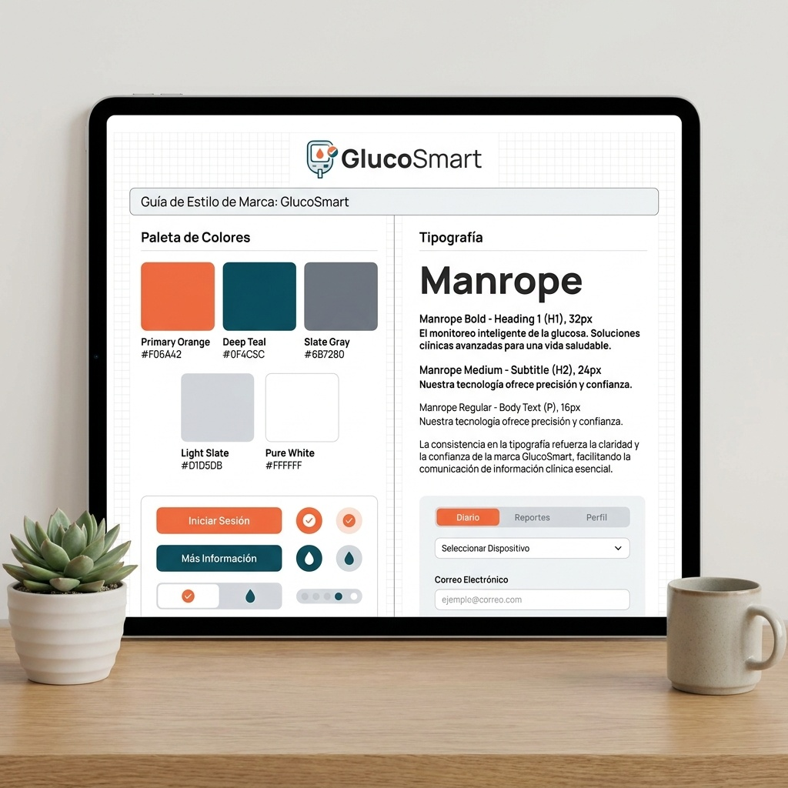

Los lineamientos generales definen la identidad visual de la marca y los elementos base que componen todas las interfaces del sistema, tal como se muestra en la imagen de referencia adjunta.

- Tipografía (Typography):Para garantizar la máxima legibilidad de los datos clínicos (niveles de glucosa, registros de HbA1c), se ha seleccionado la familia tipográfica. Esta fuente _sans-serif_ ofrece claridad en pantallas digitales de cualquier tamaño. Se establece una jerarquía estructurada utilizando distintos pesos: _Bold_ o _SemiBold_ para encabezados y títulos principales, y _Regular_ para el cuerpo de texto y lectura de tablas médicas.
- Paleta de Colores (Color Palette): La selección de colores busca transmitir limpieza, tranquilidad y tecnología médica, evitando la fatiga visual del doctor durante la revisión de historiales.
    
    - Color Primario : Utilizado para resaltar los elementos de mayor importancia y establecer la identidad de la marca.
    - **Color Secundario y Fondos:** Tonos neutros y grises claros que permiten que la información y los gráficos destaquen sin saturar la vista.
    - **Colores Semánticos:** Fundamentales para el entorno de salud. Se emplea el color rojo para alertas críticas (ej. hipoglucemia severa o efectos adversos), amarillo para advertencias preventivas, y verde para confirmaciones de éxito y estados estables.
    
- **Logotipo e Iconografía:** El logotipo de IntegraVida se mantendrá constante en la cabecera (_header_) del sistema. La iconografía empleada debe ser minimalista, de trazos limpios y consistentes, facilitando el reconocimiento rápido de secciones clave como "Farmacovigilancia", "Dashboard Médico" y "Recordatorios".
### 4.1.2. Web Style Guidelines.

Estas directrices especifican cómo los elementos generales se aplican directamente a la experiencia e interacción dentro de la aplicación web de **GlucoSmart**, asegurando que los usuarios completen sus tareas de manera eficiente.

- **Estructura y Disposición (Layout):** La plataforma está diseñada bajo los principios de diseño web adaptable (_Responsive Web Design_). Para la vista del médico, se implementa una estructura de panel de control (_Dashboard_) dividida en una barra lateral (_sidebar_) para la navegación principal, y una sección principal (_main view_) donde se despliegan las tablas de pacientes y los gráficos de tendencias.
- **Componentes de Interacción:**
    
    - **Botones (Buttons):** Los botones de llamada a la acción (CTA), como "Registrar Glucosa" o "Notificar Reacción Adversa", utilizarán el color primario con texto en alto contraste (blanco). Todo botón debe contar con estados visuales definidos (_hover_, _active_, _disabled_) para proporcionar retroalimentación inmediata al interactuar con ellos.
    - **Formularios de Entrada (Forms):** Los campos para ingresar la medicación o actualizar la historia clínica tendrán bordes sutiles y etiquetas descriptivas claras. Los mensajes de validación (errores al ingresar datos anómalos) aprovecharán los colores semánticos para guiar al usuario a corregir la información.
    - **Visualización de Datos:** Las gráficas de evolución y reportes de adherencia deben respetar el contraste establecido por las pautas de accesibilidad (WCAG). Se prioriza el uso de espacios en blanco (_white space_) para separar los bloques de información, evitando el uso excesivo de líneas divisorias, lo que garantiza una lectura ágil del historial clínico.

## 4.2. Information Architecture.

### 4.2.1. Organization Systems.

Para estructurar el contenido de la plataforma, se han implementado los siguientes sistemas:

- **Esquema Jerárquico:** Se utiliza para la navegación principal, permitiendo profundizar desde una visión general (Dashboard) hacia detalles específicos (Historial de dosis o Reporte de Farmacovigilancia).
- **Organización Orientada a Tareas:** Las interfaces están agrupadas según las acciones prioritarias identificadas en el _Task Mapping_: "Registrar Medición", "Consultar Alertas" y "Generar Reporte".
- **Esquema Matricial:** En el panel del médico, la información se organiza permitiendo múltiples puntos de acceso; un médico puede llegar a un reporte de efectos adversos filtrando por el nombre del paciente o por la gravedad de la alerta.

### 4.2.2. Labeling Systems.

El sistema de etiquetado busca un equilibrio entre la precisión clínica y la claridad para el paciente, evitando ambigüedades:

- **Etiquetas para Médicos:** Se emplea terminología técnica estandarizada como _"HbA1c"_ (Hemoglobina Glicosilada), _"Farmacovigilancia"_ y _"Adherencia Terapéutica"_.
- **Etiquetas para Pacientes:** Se utilizan términos familiares y directos como _"Mi Glucosa"_, _"Mis Recordatorios"_ y _"¿Cómo me siento?"_ (para el registro de síntomas).
- **Iconografía Predictiva:** Se acompañan las etiquetas con iconos universales (ej. una campana para alarmas, un gráfico para tendencias) para acelerar el reconocimiento visual.

### 4.2.3. SEO Tags and Meta Tags

Para posicionar a **IntegraVida** como un referente en salud digital y facilitar el acceso a la plataforma, se han definido los siguientes metadatos:

- **Index Title:** `IntegraVida | GlucoSmart - Control Inteligente de Diabetes y Farmacovigilancia`.
    
- **Meta Description:** `Plataforma integral para el monitoreo de diabetes. Conecta a médicos y pacientes en tiempo real para el seguimiento de glucosa, adherencia a medicación y prevención de efectos adversos.`
    
- **Keywords:** `Control de diabetes`, `monitoreo de glucosa`, `farmacovigilancia digital`, `salud digital Perú`, `historial clínico interactivo`.

### 4.2.4. Searching Systems.

Dada la naturaleza crítica de los datos médicos, el sistema de búsqueda está optimizado para la velocidad:

- **Búsqueda Global (Médico):** Permite localizar pacientes por nombre, DNI o nivel de riesgo actual.
- **Filtros Avanzados:** En los reportes, el usuario puede filtrar por "Rango de Fechas", "Tipo de Síntoma" o "Nivel de Glucosa" (Hipoglucemia/Hiperglucemia).
- **Autocompletado:** El sistema sugiere nombres de medicamentos comunes para evitar errores ortográficos en el registro de dosis.

### 4.2.5. Navigation Systems.

Se han implementado tres capas de navegación para garantizar que el usuario nunca se sienta perdido:

- **Navegación Global (Navbar):** Ubicada en la parte superior, permite el acceso a las secciones principales (Inicio, Mi Perfil, Soporte) y el cambio de idioma.
- **Navegación Local (Sidebar):** Una barra lateral persistente en el _Dashboard_ que permite conmutar entre las herramientas de gestión (Gráficos, Alarmas, Farmacovigilancia).
- **Navegación Contextual (Breadcrumbs):** Migas de pan que indican la ruta actual (ej. _Inicio > Pacientes > Jorge Quispe > Historial Mensual_), facilitando el retorno a niveles superiores sin usar el botón de retroceso del navegador.

## 4.3. Landing Page UI Design.

### 4.3.1. Landing Page Wireframe.

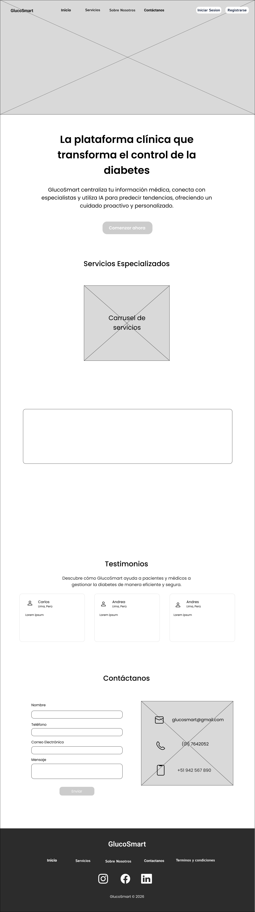

### 4.3.2. Landing Page Mock-up.

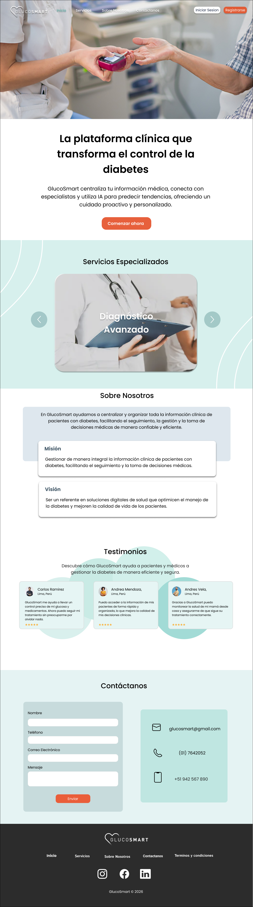

## 4.4. Web Applications UX/UI Design.

### 4.4.1. Web Applications Wireframes.
Se desarrollaron wireframes para representar la estructura base de la aplicación, enfocándose en la distribución de los elementos sin considerar aspectos visuales avanzados.

Los wireframes diseñados incluyen las siguientes pantallas:

- Login / Register
- Dashboard del paciente
- Registro de glucosa
- Historial de salud
- Alertas y notificaciones
- Perfil del paciente

Estos wireframes permiten definir la organización de la información y la navegación del sistema.

#### Wireframes

### 4.4.2. Web Applications Wireflow Diagrams.
El wireflow representa la navegación entre las diferentes pantallas del sistema.

El flujo principal inicia en el login, seguido del dashboard, desde donde el usuario puede acceder a las funcionalidades principales como registro de glucosa, historial de salud, alertas y perfil.

Este flujo permite visualizar cómo el usuario interactúa con la aplicación de manera estructurada.

#### Wireflow Diagram

### 4.4.2. Web Applications Mock-ups.

Los mockups representan la versión visual final de la aplicación, incorporando elementos de diseño como colores, tipografía y estilo visual.

Se mantuvo coherencia con la landing page de IntegraVida, utilizando un diseño limpio, moderno y enfocado en el sector salud.

#### Mockups

### 4.4.3. Web Applications User Flow Diagrams.

El flujo de usuario se diseñó considerando como segmento objetivo principal a pacientes con diabetes, quienes requieren monitorear constantemente su estado de salud.

El flujo principal describe el proceso de uso diario de la aplicación:

1. El paciente inicia sesión en la aplicación
2. Accede al dashboard donde visualiza su estado actual
3. Registra su nivel de glucosa
4. El sistema procesa la información
5. Se actualiza el historial de salud
6. En caso de valores críticos, se generan alertas

Adicionalmente, el usuario puede acceder a:

- Historial de salud para revisar registros anteriores
- Alertas y notificaciones para monitorear riesgos
- Perfil del paciente para gestionar su información

Este flujo permite garantizar una experiencia centrada en el monitoreo continuo y la prevención de complicaciones.

## 4.5. Web Applications Prototyping.

Se desarrolló un prototipo interactivo de la aplicación GlucoSmart utilizando la herramienta Figma, con el objetivo de simular la navegación y la interacción real del usuario dentro del sistema antes de su implementación.

El prototipo considera como segmento objetivo principal a pacientes con diabetes mellitus tipo 1 y tipo 2, quienes representan el usuario con mayor nivel de interacción dentro de la plataforma. Asimismo, se contempla de manera secundaria la participación de profesionales de salud en el proceso de monitoreo y seguimiento clínico.

Las principales interacciones implementadas incluyen:

- Inicio de sesión y acceso al dashboard del paciente
- Navegación desde el dashboard hacia el registro de glucosa
- Registro y almacenamiento de niveles de glucosa
- Visualización del historial de salud y evolución del paciente
- Acceso a alertas y notificaciones generadas por el sistema
- Consulta y edición del perfil del paciente
- Retorno al dashboard desde las distintas funcionalidades

El prototipo fue construido a partir de los diagramas de Wireflow y User Flow, permitiendo mantener coherencia con la arquitectura de navegación definida previamente.

Asimismo, se implementaron enlaces interactivos entre pantallas en Figma, simulando el comportamiento real de la aplicación mediante acciones de usuario, lo que permitió validar la usabilidad, identificar mejoras en la experiencia de usuario y reducir riesgos antes de la fase de desarrollo.

El prototipo representa el flujo completo de uso diario del paciente, asegurando una navegación intuitiva, eficiente y alineada con los objetivos del sistema.

#### Prototipo de la aplicación

## 4.6. Domain-Driven Software Architecture.

### 4.6.1. Design-Level Event Storming.

Se aplicó la técnica de Event Storming a nivel de diseño con el objetivo de identificar y modelar los principales eventos del dominio en la aplicación GlucoSmart, orientada al monitoreo de pacientes con diabetes mellitus tipo 1 y tipo 2, así como al apoyo de profesionales de salud en su seguimiento clínico.

El proceso permitió comprender el comportamiento del sistema desde la perspectiva del negocio, identificando las acciones del usuario (comandos), los resultados generados por el sistema (eventos) y las reglas que gobiernan estos procesos (políticas).

Para facilitar el análisis, el dominio fue dividido en los siguientes módulos o *bounded contexts*:

- Account Management
- Patient Profile Management
- Glucose Monitoring
- Alerts & Pharmacovigilance
- Medical Follow-up
- Appointment Management

Dentro de cada contexto se definieron entidades centrales, como *User*, *Patient*, *Glucose Record*, *Alert*, *Clinical Record* y *Appointment*, alrededor de las cuales se organizaron los comandos y eventos asociados.

Entre los eventos más relevantes identificados se encuentran:

- Glucose recorded
- History updated
- Alert generated
- Adverse effect reported
- Treatment updated
- Appointment scheduled

Asimismo, se identificaron políticas clave del sistema, como la evaluación automática de los niveles de glucosa y la generación de alertas cuando los valores se encuentran fuera de rango, lo que constituye una funcionalidad crítica del sistema.

El Event Storming permitió estructurar la lógica del dominio antes del diseño técnico, sirviendo como base para la definición de la arquitectura del sistema mediante el modelo C4.

### 4.6.2. Software Architecture Context Diagram.

El diagrama de contexto representa la interacción entre el sistema GlucoSmart y los actores externos que forman parte del ecosistema de salud.

En este caso, se identifican dos segmentos principales:

- Pacientes con diabetes mellitus tipo 1 y tipo 2, quienes utilizan la aplicación para registrar sus niveles de glucosa, consultar su historial de salud y recibir alertas preventivas.
- Profesionales de salud (médicos especialistas y personal de salud), quienes acceden al sistema para monitorear la evolución clínica del paciente y apoyar su seguimiento.

Adicionalmente, el sistema se integra con un servicio externo de notificaciones encargado de enviar alertas y recordatorios relevantes.

Este diagrama permite visualizar el alcance del sistema y su relación con los actores principales, proporcionando una visión general de su funcionamiento dentro del ecosistema.

### 4.6.3. Software Architecture Container Diagrams.

El diagrama de contenedores describe la arquitectura interna del sistema GlucoSmart, mostrando los principales componentes tecnológicos y su interacción.

El sistema se compone de los siguientes contenedores:

- Web Application: Interfaz desarrollada en Angular que permite la interacción de pacientes y profesionales de salud con el sistema.
- RESTful API: Backend desarrollado en Spring Boot encargado de procesar la lógica de negocio, gestionar datos clínicos, autenticación y generación de alertas.
- Database: Base de datos relacional donde se almacenan los registros de glucosa, historial clínico, perfiles de usuario y alertas.
- Notification Service: Servicio externo encargado del envío de alertas y recordatorios al usuario.

La comunicación entre estos contenedores se realiza mediante solicitudes HTTP/REST, garantizando una arquitectura desacoplada, escalable y mantenible.

Este nivel permite comprender cómo se estructura técnicamente el sistema y cómo fluye la información entre sus componentes principales.

### 4.6.4. Software Architecture Components Diagrams.

El diagrama de componentes presenta una vista detallada del backend del sistema GlucoSmart, específicamente de la API REST, descomponiéndola en sus principales módulos internos.

La arquitectura sigue un enfoque en capas, organizada de la siguiente manera:

- Controllers: Encargados de gestionar las solicitudes HTTP provenientes del frontend, como autenticación, registro de glucosa, consulta de historial y alertas.
- Services: Contienen la lógica de negocio del sistema, incluyendo la validación de datos, procesamiento de información clínica y generación de alertas preventivas.
- Repositories: Responsables del acceso a la base de datos, permitiendo almacenar y recuperar información de usuarios, pacientes, registros de glucosa e historial clínico.

Adicionalmente, se incluye un componente orientado a profesionales de salud, el cual permite consultar la información clínica del paciente para apoyar la toma de decisiones médicas.

Esta estructura modular permite mantener una separación clara de responsabilidades, facilitando la escalabilidad, mantenibilidad y evolución del sistema.

## 4.7. Software Object-Oriented Design.

### 4.7.1. Class Diagrams.

El siguiente diagrama de clases UML representa la arquitectura orientada a objetos del sistema **GlucoSmart**, organizada por bounded contexts identificados en el Event Storming. Cada bounded context agrupa un conjunto de clases con responsabilidades bien definidas, lo que facilita la separación de la lógica de negocio, el mantenimiento del sistema y su escalabilidad futura.

Se han modelado los siguientes bounded contexts:

**Bounded Context 1: Patient Profile Management**

Este contexto agrupa las clases relacionadas con la identidad y los datos clínicos del paciente. La clase central es `Patient`, que contiene los atributos personales del usuario. Se relaciona con `User` (autenticación y roles) y con `MedicalProfile` (datos clínicos como tipo de diabetes, medicación base y fecha de diagnóstico). Esta separación permite que la autenticación evolucione de forma independiente al perfil clínico.

**Bounded Context 2: Glucose Monitoring**

Este contexto gestiona el ciclo de vida de las mediciones de glucosa. `GlucoseRecord` representa una lectura individual y se relaciona con `GlucoseRange` (umbrales personalizados del paciente) y con `Alert` (notificaciones generadas automáticamente cuando una lectura supera o cae por debajo del rango configurado). La lógica de evaluación de rango está encapsulada en `GlucoseService`, garantizando que el frontend no duplique reglas de negocio.

**Bounded Context 3: Appointment Management**

Este contexto gestiona las citas médicas entre pacientes y doctores. La clase `Appointment` relaciona a un `Patient` con un `Doctor` en un horario determinado. El estado de la cita sigue el ciclo: `SCHEDULED → CONFIRMED → COMPLETED / CANCELLED`. La clase `Doctor` se define en este contexto como referencia externa al bounded context de Patient Profile.

#### Class Diagram 1: User & Clinical Management

> Este diagrama presenta las clases relacionadas con autenticación de usuarios, gestión del perfil del paciente e información clínica base (tipo de diabetes, HbA1c objetivo, medicación prescrita).

#### Class Diagram 2: Treatment & Appointment Management

> Este diagrama presenta las clases relacionadas con el monitoreo de glucosa, generación de alertas, gestión de medicamentos, registro de tomas (adherencia) y gestión de citas médicas. Ambos diagramas se interrelacionan a través de las clases `Patient` y `Doctor`, que actúan como entidades centrales del dominio.

## 4.8. Database Design.

El diseño de base de datos de **GlucoSmart** sigue un modelo relacional organizado por bounded contexts, en coherencia con la arquitectura Domain-Driven Design del sistema. Cada contexto tiene sus propias tablas con claves primarias y foráneas que garantizan la integridad referencial. Las principales decisiones de diseño son: (1) separar la entidad `users` (autenticación) de `patients` (datos clínicos) para soportar múltiples roles; (2) almacenar los rangos de glucosa por paciente en una tabla independiente para facilitar la personalización de alertas; (3) registrar cada toma de medicamento en `medication_intakes` de forma separada para habilitar el módulo de farmacovigilancia y adherencia. El modelo actual se implementa como `db.json` en json-server y está diseñado para migrar a una base de datos relacional real (PostgreSQL o MySQL) en sprints futuros.

### 4.8.1. Database Diagrams

Los siguientes diagramas de base de datos están organizados por bounded context, mostrando las tablas, atributos, tipos de datos y relaciones entre entidades para cada dominio del sistema GlucoSmart.

**Bounded Context 1: Patient Profile Management** — incluye las tablas `users`, `patients` y `medical_profiles`, que gestionan la autenticación, los datos personales y el historial clínico base del paciente.

**Bounded Context 2: Glucose Monitoring** — incluye las tablas `glucose_records`, `glucose_ranges` y `alerts`, que gestionan las lecturas de glucosa, los umbrales personalizados y las notificaciones automáticas generadas por el sistema.

**Bounded Context 3: Medication & Adherence** — incluye las tablas `medications` y `medication_intakes`, que gestionan los medicamentos prescritos y el registro de cada toma para el módulo de adherencia terapéutica.

**Bounded Context 4: Appointment Management** — incluye las tablas `appointments` y `doctors`, que gestionan las citas médicas programadas entre pacientes y especialistas.

# Capitulo V: Product Implementation, Validation & Deployment

## 5.1. Software Configuration Management.

La gestión de configuración del software del proyecto **IntegraVida** se definió con el objetivo de asegurar la organización del código fuente, la consistencia del entorno de desarrollo, la estandarización de convenciones técnicas y la correcta publicación del producto. Debido a que la solución implementada corresponde a una **Landing Page** desarrollada con **Angular**, **HTML**, **CSS** y **TypeScript**, se establecieron lineamientos simples pero formales para mantener la trazabilidad de cambios y facilitar el trabajo colaborativo del equipo.

### 5.1.1. Software Development Environment Configuration.

Esta sección describe todas las herramientas y tecnologías utilizadas por el equipo de IntegraVida para el ciclo de vida completo del proyecto GlucoSmart, organizadas por categoría funcional. Para cada herramienta se indica su nombre, el propósito específico dentro del proyecto y la referencia o ruta de descarga.

**Project Management**

| Herramienta | Propósito en el proyecto | Referencia |
| :--- | :--- | :--- |
| **Trello** | Gestión del Product Backlog y Sprint Backlogs. Se usan tableros con columnas To Do, In Process, To Review y Done para el seguimiento de tareas durante cada Sprint. | https://trello.com |
| **Discord** | Comunicación sincrónica y asincrónica del equipo. Se usan canales separados por bounded context para coordinar decisiones técnicas. | https://discord.com |
| **WhatsApp** | Coordinación rápida e informal entre integrantes para avisos y acuerdos de reuniones. | https://whatsapp.com |

**Requirements Management**

| Herramienta | Propósito en el proyecto | Referencia |
| :--- | :--- | :--- |
| **GitHub (InformeProyecto)** | Repositorio donde se documenta el informe, incluyendo User Stories, Product Backlog, diagramas y evidencias de cada Sprint. | https://github.com/MTS-OpenSource/InformeProyecto |
| **Miro** | Elaboración del Event Storming (Big Picture y Design Level) para identificar bounded contexts y eventos de dominio. | https://miro.com |

**Product UX/UI Design**

| Herramienta | Propósito en el proyecto | Referencia |
| :--- | :--- | :--- |
| **Figma** | Diseño de wireframes, mockups de alta fidelidad y prototipo interactivo de la Web Application (GlucoSmart). Permite colaboración en tiempo real entre los miembros del equipo. | https://figma.com |
| **Lucidchart** | Elaboración de diagramas UML (Class Diagrams), diagramas C4 y diagramas de base de datos. | https://lucidchart.com |

**Software Development**

| Herramienta | Propósito en el proyecto | Referencia / Descarga |
| :--- | :--- | :--- |
| **Visual Studio Code** | Editor de código principal del equipo. Se usa para el desarrollo del frontend en Angular/TypeScript y la edición del informe en Markdown. | https://code.visualstudio.com |
| **Node.js v18 LTS** | Entorno de ejecución de JavaScript necesario para ejecutar Angular CLI, json-server y las dependencias del proyecto frontend. | https://nodejs.org |
| **Angular CLI v17** | Framework principal para el desarrollo del Frontend Web Application. Provee la estructura de componentes, servicios, módulos y routing del proyecto. | `npm install -g @angular/cli` |
| **TypeScript 5.x** | Lenguaje de programación tipado utilizado en el frontend Angular. Aporta seguridad de tipos y mejor mantenibilidad del código. | Incluido con Angular CLI |
| **json-server** | Herramienta que simula un servidor RESTful a partir del archivo `db.json`. Permite desarrollar el frontend con una API funcional sin necesidad de un backend real. | `npm install -g json-server` |
| **Git 2.x** | Sistema de control de versiones distribuido. Permite el trabajo colaborativo mediante ramas, commits y pull requests. | https://git-scm.com |
| **GitHub Desktop** | Cliente gráfico de Git que facilita la gestión de ramas y commits a los integrantes del equipo. | https://desktop.github.com |

**Software Deployment**

| Herramienta | Propósito en el proyecto | Referencia |
| :--- | :--- | :--- |
| **Firebase Hosting** | Plataforma de despliegue del Frontend Web Application (Integravida-FrontendServices). Provee hosting estático con HTTPS y CDN global. | https://firebase.google.com/products/hosting |
| **Render** | Plataforma de despliegue del servidor json-server (Fake RESTful API). Expone el `db.json` como una API pública accesible desde el frontend desplegado. | https://render.com |
| **Firebase CLI** | Herramienta de línea de comandos para desplegar el frontend en Firebase Hosting mediante los comandos `firebase login`, `firebase init` y `firebase deploy`. | `npm install -g firebase-tools` |

**Software Documentation**

| Herramienta | Propósito en el proyecto | Referencia |
| :--- | :--- | :--- |
| **GitHub (InformeProyecto)** | Repositorio central del informe del proyecto. El informe está escrito en Markdown y es editado colaborativamente por todos los integrantes. | https://github.com/MTS-OpenSource/InformeProyecto |
| **Markdown** | Lenguaje de marcado ligero utilizado para redactar el informe del proyecto. Permite incluir tablas, imágenes, listas y código dentro de los archivos del repositorio. | https://www.markdownguide.org |

### 5.1.2. Source Code Management.

La administración del código fuente se realizó mediante **Git** y los repositorios remotos fueron alojados en **GitHub** bajo la organización [MTS-OpenSource](https://github.com/MTS-OpenSource). El equipo adopta **GitFlow** como workflow de gestión de ramas para todos los repositorios del proyecto.

**Repositorios del proyecto:**

| Producto | Repositorio | URL |
| :--- | :--- | :--- |
| Landing Page | IntegraVida | https://github.com/MTS-OpenSource/IntegraVida |
| Frontend Web Application | Integravida-FrontendServices | https://github.com/MTS-OpenSource/Integravida-FrontendServices |
| Fake RESTful API (json-server) | JsondbData | https://github.com/MTS-OpenSource/JsondbData |
| Informe del Proyecto | InformeProyecto | https://github.com/MTS-OpenSource/InformeProyecto |

**Estructura de ramas (GitFlow):**

| Tipo de rama | Nombre | Propósito |
| :--- | :--- | :--- |
| Producción | `main` | Código estable desplegado en producción. Solo recibe merges desde `release` o `hotfix`. |
| Desarrollo | `develop` | Rama de integración principal. Todas las features se fusionan aquí antes de pasar a producción. |
| Funcionalidades | `feature/<nombre-del-feature>` | Desarrollo de una nueva funcionalidad. Se crea desde `develop` y se fusiona de vuelta en `develop`. |
| Lanzamientos | `release/<versión>` | Preparación para un nuevo release. Se crea desde `develop` cuando el Sprint está listo. |
| Correcciones críticas | `hotfix/<descripción>` | Corrección de bugs críticos en producción. Se crea desde `main` y se fusiona en `main` y `develop`. |

**Convenciones de nomenclatura para feature branches:**

El nombre debe ser descriptivo, en minúsculas, con palabras separadas por guiones, siguiendo el patrón: `feature/<bounded-context>-<descripcion-corta>`.

Ejemplos: `feature/glucose-monitoring-history-table`, `feature/patient-profile-edit-form`, `feature/auth-login-component`, `feature/alerts-mark-as-read`.

**Convenciones para release branches:**

Se aplica **Semantic Versioning (SemVer)**: `release/<MAJOR>.<MINOR>.<PATCH>`. Ejemplos: `release/1.0.0` (Sprint 1), `release/1.1.0` (Sprint 2), `release/1.1.1` (corrección menor).

**Convenciones para hotfix branches:**

Patrón: `hotfix/<descripcion-breve-del-bug>`. Ejemplos: `hotfix/glucose-record-null-pointer`, `hotfix/login-redirect-loop`, `hotfix/firebase-cors-config`.

**Convenciones de commits (Conventional Commits):**

Formato: `<tipo>(<alcance>): <descripción en imperativo, minúsculas>`. Tipos usados: `feat` (nueva funcionalidad), `fix` (corrección de bug), `docs` (documentación), `style` (formato), `refactor`, `test`, `chore` (mantenimiento).

Ejemplos: `feat(glucose): add new reading form component`, `fix(auth): correct login redirect after logout`, `docs(sprint2): add development evidence table`.

### 5.1.3. Source Code Style Guide & Conventions.

El equipo adopta las siguientes guías de estilo y convenciones estándar de la industria para garantizar consistencia, legibilidad y mantenibilidad del código en todos los repositorios del proyecto.

**HTML — Google HTML/CSS Style Guide**

Referencia: https://google.github.io/styleguide/htmlcssguide.html

Convenciones aplicadas: usar siempre minúsculas para nombres de elementos y atributos HTML; 2 espacios como indentación (no tabs); definir siempre el atributo `alt` en imágenes; atributos booleanos sin valor (`<input disabled>`); codificación UTF-8 declarada en el `<head>`.

**CSS — Google HTML/CSS Style Guide**

Referencia: https://google.github.io/styleguide/htmlcssguide.html

Convenciones aplicadas: clases con minúsculas y guiones (`.glucose-card`, `.patient-header`); evitar IDs para estilos; propiedades CSS ordenadas alfabéticamente dentro de cada regla; uso de propiedades shorthand; variables CSS para colores y tipografías del sistema de diseño.

**JavaScript — Airbnb JavaScript Style Guide**

Referencia: https://github.com/airbnb/javascript

Convenciones aplicadas: usar `const` por defecto y `let` solo cuando la variable cambia; arrow functions para funciones anónimas; template literals en lugar de concatenación; punto y coma obligatorio; nombres de variables en `camelCase`; nombres de clases en `PascalCase`; constantes globales en `UPPER_SNAKE_CASE`.

**TypeScript — Angular Style Guide (oficial de Google)**

Referencia: https://angular.io/guide/styleguide

Convenciones aplicadas: componentes con sufijo `Component` (`GlucoseLogComponent`); servicios con sufijo `Service` (`GlucoseService`); un componente por archivo; imports ordenados (Angular → terceros → propios); uso explícito de `private` y `public`; inyección de dependencias siempre mediante el constructor. Estructura de carpetas: `core/` (singletons, guards), `shared/` (reutilizables), `features/<bounded-context>/` (módulos por dominio).

**Java — Google Java Style Guide**

Referencia: https://google.github.io/styleguide/javaguide.html

Convenciones aplicadas (para el backend en sprints futuros): indentación de 2 espacios; clases en `UpperCamelCase`; métodos y variables en `lowerCamelCase`; constantes en `UPPER_SNAKE_CASE`; llaves `{}` obligatorias en todos los bloques; longitud máxima de línea de 100 caracteres.

### 5.1.4. Software Deployment Configuration.

La configuración de despliegue del proyecto **IntegraVida** fue definida para publicar la Landing Page en **GitHub Pages**, permitiendo que el sistema sea accesible mediante una URL pública sin requerir infraestructura de servidor adicional.

El proceso de despliegue se encuentra vinculado al repositorio del proyecto y utiliza un archivo de configuración **`static.yaml`** ubicado dentro de la carpeta **`.github`**, el cual define el comportamiento necesario para la publicación del sitio estático. A partir de esta configuración, la versión compilada de la aplicación puede ser generada y publicada automáticamente en el entorno de GitHub Pages.

De manera general, el flujo de despliegue contempla las siguientes actividades:

1. Compilar la aplicación Angular para generar los archivos estáticos de producción.
2. Publicar la versión generada en la rama o entorno configurado para GitHub Pages.
3. Verificar que la URL pública cargue correctamente la Landing Page y sus recursos asociados.

Esta configuración permitió contar con un mecanismo de despliegue simple, reproducible y adecuado para un producto web estático orientado a presentación institucional y validación temprana de la propuesta de valor.

## 5.2. Landing Page, Services & Applications Implementation.

### 5.2.1. Sprint 1

### 5.2.1.1. Sprint Planning 1.

Esta sección documenta la planificación del primer Sprint del proyecto GlucoSmart. El objetivo principal de este Sprint fue diseñar e implementar la **Landing Page** de GlucoSmart, que sirve como punto de entrada público a la plataforma y comunica la propuesta de valor del producto a visitantes y potenciales usuarios. Al finalizar el Sprint, la Landing Page debía estar desplegada en una URL pública y ser completamente responsive.

| Sprint # | Sprint 1 |
| :--- | :--- |
| Sprint Planning Background |  |
| Date | 01/04/2026 |
| Time | 6:00 PM |
| Location | Virtual - Discord |
| Prepared By | Jean Pool Arias |
| Attendees (To planning meeting) | Jean Pool Arias, Abigail Raymundo |
| Sprint N-1 Review Summary | No aplica, debido a que corresponde al primer Sprint del proyecto. |
| Sprint N-1 Retrospective Summary | No aplica, debido a que corresponde al primer Sprint del proyecto. |
| Sprint Goal & User Stories |  |
| Sprint N Goal | El enfoque principal del Sprint 1 fue desarrollar y desplegar la primera versión de la Landing Page de GlucoSmart. Durante este Sprint, únicamente Jean Pool Arias y Abigail Raymundo participaron en el proceso de diseño e implementación, enfocándose en construir la identidad visual de IntegraVida mediante Angular, componentes standalone, diseño responsive y despliegue en Firebase Hosting. El Sprint se considerará exitoso cuando la Landing Page esté desplegada y accesible mediante una URL pública mostrando correctamente las secciones principales como hero, servicios, about us, testimonios y contacto. |
| Sprint N Velocity | 20 |
| Sum of Story Points | 20 |

### 5.2.1.2. Aspect Leaders and Collaborators.

En el Sprint 1, los principales aspectos de trabajo fueron: la estructura base del proyecto Angular, la implementación del Navbar y Footer, el desarrollo del Hero y secciones de contenido (About, Testimonios, Servicios), la sección de Contacto y el despliegue en Firebase. Se indica con **L** al líder responsable de las decisiones técnicas del aspecto y con **C** al colaborador de apoyo.

| Team Member | GitHub Username | Landing Page Structure | Navbar & Footer | Hero & Services | About & Testimonials | Contact Section | Firebase Deployment |
| :--- | :--- | :--- | :--- | :--- | :--- | :--- | :--- |
| Jean Pool Arias | Jean-AT | L | L | C | C | C | L |
| Abigail Raymundo | AbigailRv | C | C | L | L | L | C |

### 5.2.1.3. Sprint Backlog 1.

El objetivo principal del Sprint 1 fue desarrollar y desplegar la primera versión de la Landing Page de GlucoSmart. Esta página estática es el primer punto de contacto con el usuario y comunica claramente la propuesta de valor de la plataforma. Al finalizar el Sprint, la Landing Page debía estar desplegada en una URL pública, ser completamente responsive y mostrar correctamente las secciones de hero, servicios, about us, testimonios y contacto.

**URL del Board del Sprint 1:** `[Pendiente: pegar URL pública del tablero Trello del Sprint 1]`

| Sprint#    |                                   |                |                                                   |                                                                                                 |            |             |        |
| :--------- | :-------------------------------- | :------------- | :------------------------------------------------ | :---------------------------------------------------------------------------------------------- | :--------- | ----------- | ------ |
| User Story |                                   | Work-Item/Task |                                                   |                                                                                                 |            |             |        |
| Id         | Title                             | Id             | Title                                             | Description                                                                                     | Estimation | Assignet To | Status |
| US-29      | Navegacion por el Landing Page    | T01            | Crear estructura base del proyecto Angular        | Inicializar proyecto Angular con la estructura de carpetas definidas (shared,comoponents, core) | 1          | Jean Pool   | Done   |
| US-29      | Navegacion por el LandingPage     | T02            | Implementar Navbar component                      | Crear el componente navbar con logo, link de navegacion y botones de accion                     | 1          | Jean Pool   | Done   |
| US-29      | Navegación por el Landing Page    | T03            | Implementar Footer component                      | Crear el componente footer con logo, links, redes sociales y copyright                          | 1          | Abigail     | To-Do  |
| US-29      | Navegación por el Landing Page    | T04            | Implementar navegación entre secciones            | Configurar scroll suave entre secciones del Landing Page                                        | 0.5        | Jean Pool   | To-Do  |
| US-30      | Ver Información del Startup       | T05            | Implementar sección About                         | Crear el componente about con descripción, misión y visión de IntegraVida                       | 1          | Abigail     | To-Do  |
| US-31      | Conocer la mision de la Startup   | T06            | Agregar cards de Msion y vision                   | Implementar las cards dentro del componente about con su contenido                              | 0.5        | Abigail     | To-Do  |
| US-33      | Contactar al equipo de soporte    | T07            | Implementar seccion contact                       | Crear el componente contact con el formulario e informacion de contacto                         | 2          | Jean Pool   | Done   |
| US-01      | Hero section del Landing Page     | T08            | Implementar la seccion Hero                       | Crear el componente service con imagen y principal call to action                               | 1          | Abigail     | To-Do  |
| US-01      | Hero section del LandingPage      | T09            | Implementar seccion Service                       | Crear el componente con carousel de servicio especializados                                     | 2          | Abigail     | To-Do  |
| US-01      | Hero section del LandingPage      | 10             | Implementar Testimonios                           | Crear el componente testimonial con las cards de usuarios                                       | 1          | Abigai      | To-Do  |
| US-32      | Cambiar el idioma del LandingPage | T11            | Implementar Lenguage Service                      | Crear el servicio de internacionalizacion con traduciones en ES y EN                            | 1.5        | Jean Pool   | Done   |
| U-32       | Cambiar el idioma del LandingPage | T12            | Conectar Language Service a todos los componentes | Inyectar el servicio en cada componente y reemplazar textos estaticos                           | 1.5        | Jean Pool   | Done   |
| US-32      | Cambiar el idioma del LandingPage | T13            | Agregar toggle de idioma en navbar                | Implementar boton EN/ES en el navbar para cambiar idioma                                        | 0.5        | Jean Pool   | To-Do  |

### 5.2.1.4. Development Evidence for Sprint Review.

Durante el Sprint 1 se realizó la implementación completa de la Landing Page de GlucoSmart. Los principales avances incluyeron: la estructuración del repositorio con la aplicación de GitFlow, el desarrollo de todas las secciones de la Landing Page (navbar, hero, servicios, about us, testimonios, contacto y footer) con diseño responsive y soporte de internacionalización ES/EN, y el despliegue exitoso en Firebase Hosting. A continuación se presenta la tabla de commits realizados durante el Sprint.

| Repository  | Branch                 | Commit Id                                | Commit Message                          | Commit Message Body                                                 | Committed on   |
| :---------- | :--------------------- | :--------------------------------------- | :-------------------------------------- | :------------------------------------------------------------------ | :------------- |
| IntegraVida | main                   | 79f9b95c9283ad21816efd8f2f5297a71ec4798d | Initial commit                          | Initial project structure and configuration.                        | Abril 02, 2026 |
| IntegraVida | feature/button         | fad9eebb2bf9f8f036b123f834cff54a39c728e2 | Done the component Button               | Complete the reusable button component, ready for integration.      | Abril 12, 2026 |
| IntegraVida | feature/navbar         | 86686462672580b3e6f3212036c498fb613bfcf2 | Done the component Navbar               | Created the navigation bar component with responsive links.         | Abril 12, 2026 |
| IntegraVida | feature/hero           | dc48b680b66be028595bdef4daf27bb3aca86b50 | Done the component Hero                 | Implementation of the Hero section with main call to action.        | Abril 12, 2026 |
| IntegraVida | feature/contact        | a330beb680a6ebc9e8a27463225811fc3e4af0db | Finish contact component & mail service | Added contact cards and form using FormSubmit for email handling.   | Abril 13, 2026 |
| IntegraVida | feature/toggleLanguage | 9fe7cee533381a7edfbd94216b838ebc7efc68f8 | Feature/toggle language                 | Added ToggleButtonLanguage and reorganized the Page directory.      | Abril 22, 2026 |
| IntegraVida | feature/servicios      | e4faec0224cc0568449160b2ea86379c07fe4c94 | feat: carousel de servicios             | Implementation of the services section using a carousel layout.     | Abril 23, 2026 |
| IntegraVida | feature/about-us       | 028db5cf2348fa06e091a2b2ee51536ebc3bf8ba | feat: sección Sobre Nosotros            | Implemented the About Us section with overlapping card design.      | Abril 23, 2026 |
| IntegraVida | feature/testimonials   | 2bfa2fae2524283bb540924a440c0cf2877a4a14 | feat: sección de testimonios            | Completed testimonials section with wave design and responsiveness. | Abril 23, 2026 |
| IntegraVida | feature/footer         | 8524ebc7508136c9b56f6e82d7a44bc2c0643c11 | feat: footer e identidad visual         | Completed footer with social icons and stylized text logo.          | Abril 23, 2026 |

### 5.2.1.5. Execution Evidence for Sprint Review.

En esta entrega el equipo ha desplegado con exito la primera version del LandingPage de IntegraVida 

Enlace del Landing Page desplegado: 

Las Secciones implementadas son: 

- Navbar con toggle de idioma ES/EN
- Hero section con imagen principal 
- Servicios Especializados con carousel
- Sobre Nosotros con cards de Mision y Vision
- Testimonio de usuarios 
- Formulario de Contacto 
- Footer con redes sociales

### 5.2.1.6. Services Documentation Evidence for Sprint Review.

En este Sprint no se implementaron Web Services. El enfoque fue exclusivamente en desarrollo y despliegue del Landing Page estatico

### 5.2.1.7. Software Deployment Evidence for Sprint Review.

Durante el Sprint 1 se realizó el despliegue de la Landing Page de GlucoSmart, lo que permitió disponer de una URL pública accesible desde cualquier dispositivo. A continuación se detallan los pasos realizados durante el proceso de despliegue:

1. Se subió el código fuente al repositorio `IntegraVida` de la organización MTS-OpenSource en GitHub, asegurando que la rama `main` contuviera la versión final aprobada del proyecto.
2. Se navegó a la sección **Settings** del repositorio en GitHub.
3. Se seleccionó el apartado **Pages** en el menú lateral izquierdo.
4. Se eligió la rama `main` y la carpeta `/root` como fuente de publicación.
5. Se confirmó la configuración y se esperó a que GitHub generara la URL pública del sitio.
6. Se accedió al enlace generado para verificar el correcto funcionamiento de la Landing Page y la carga de todos sus assets (CSS, imágenes, componentes Angular).

**URL de la Landing Page desplegada:** https://mts-opensource.github.io/IntegraVida/

**[Pendiente: agregar screenshot del deployment exitoso en GitHub Pages]**

### 5.2.1.8. Team Collaboration Insights during Sprint.

Durante el Sprint 1, las actividades de implementación fueron distribuidas entre los dos integrantes del equipo activos en este Sprint. Jean Pool Arias lideró la estructura base del proyecto Angular, la implementación del Navbar, la sección de Contacto con FormSubmit y el Language Service para internacionalización ES/EN. Abigail Raymundo lideró la implementación del Hero section, la sección About Us con misión y visión, los Testimonios y la sección de Servicios con carousel.

El trabajo colaborativo se llevó a cabo mediante el uso de ramas feature en GitHub, donde cada integrante desarrolló su módulo de forma independiente y realizó commits descriptivos. La coordinación y toma de decisiones de diseño se realizó vía Discord.

**[Pendiente: agregar screenshot de GitHub → IntegraVida → Insights → Contributors]**

**[Pendiente: agregar screenshot del gráfico de commits del período del Sprint 1]**

| Team Member      | Commits    |
| :--- | :--- |
| Jean Pool Arias  | 14 commits |
| Abigail Raymundo | 11 commits |

### 5.3.1. Sprint 2

### 5.3.1.1. Sprint Planning 2.

| Sprint #                         | Sprint 1                                                                                                                                                                                                                                                                                                                                                                                                                                       |     |
| :------------------------------- | :--------------------------------------------------------------------------------------------------------------------------------------------------------------------------------------------------------------------------------------------------------------------------------------------------------------------------------------------------------------------------------------------------------------------------------------------- | --- |
| **Sprint Planning Background**   |                                                                                                                                                                                                                                                                                                                                                                                                                                                |     |
| Date                             | 04/05/2026                                                                                                                                                                                                                                                                                                                                                                                                                                     |     |
| Time                             | 6:00PM                                                                                                                                                                                                                                                                                                                                                                                                                                         |     |
| Location                         | Virtual - Discord                                                                                                                                                                                                                                                                                                                                                                                                                              |     |
| Prepared By                      | Jean Pool Arias                                                                                                                                                                                                                                                                                                                                                                                                                                |     |
| Attendees (To planning meeting)  | Jean Pool Alexander Arias Tasayco Abigail Nadhim Raymundo Villarroel  Juan Sebastian Estupiñan Olortegui Javier Oswaldo Tello Murga Jose Antonio Muñoz Amasifuen                                                                                                                                                                                                                                                                   |     |
| SprinT N-1 Review Summary        | El objetivo principal de este Sprint es implementar las vistas funcionales de la Web Application de GlucoSmart conectadas a json-server mediante servicios Angular, cubriendo los flujos de autenticación, monitoreo de glucosa, historial de salud, alertas y perfil del paciente.                                                                                                                                                            |     |
| SprinT N-1 Retrospective Summary | El equipo identificó como acierto la distribución clara de componentes entre los integrantes. Como oportunidad de mejora se señaló la necesidad de establecer convenciones de commits desde el inicio y mejorar la sincronización de ramas para evitar conflictos en Git. Para este Sprint se acordó usar prefijos feat/fix/chore en todos los commits.                                                                                        |     |
| **Sprint Goal & User Stories**   |                                                                                                                                                                                                                                                                                                                                                                                                                                                |     |
| Sprint N Goal                    | Our focus is on delivering the core functional views of the GlucoSmart web application connected to a fake REST API. We believe it delivers a navigable and data-driven experience to patients managing their diabetes. This will be confirmed when patients can log in, register glucose readings, view their health history with charts, manage alerts and consult their profile — all consuming data from json-server via Angular services. |     |
| Sprint N Velocity                | 45                                                                                                                                                                                                                                                                                                                                                                                                                                             |     |
| Sum of Story Points              | 43                                                                                                                                                                                                                                                                                                                                                                                                                                             |     |

### 5.3.1.2. Aspect Leaders and Collaborators.
En este Sprint los aspectos principales son: Authentication (login/register), Dashboard, Glucose Management, Health History, Alerts & Notifications y Patient Profile. Cada aspecto agrupa vistas y servicios relacionados.

| Team Member      | GitHub Username | Login service | Glucose Lecture | Dashboard Service | Deploy | Design |
| :--------------- | :-------------- | :------------ | :-------------- | :---------------- | :----- | ------ |
| Jean Arias       | Jean-AT         | L             | L               | L                 | L      | C      |
| Abigail Raymundo | AbigailRv       | C             | C               | C                 | C      | L      |
| Juan Sebastian   | JuanSEstupinan  | C             | C               | C                 | C      | L      |
| Javier Oswaldo   | JavierTello20   | C             | C               | C                 | C      | C      |
| Jose Antonio     | joseam05        | C             | C               | C                 | C      | C      |

### 5.3.1.3. Sprint Backlog 2.
El objetivo principal de este Sprint es implementar las vistas funcionales de la Web Application de GlucoSmart conectadas a json-server mediante servicios Angular, cubriendo los flujos de autenticación, monitoreo de glucosa, historial de salud, alertas y perfil del paciente.

|Sprint#|Sprint 2|||||||
|---|---|---|---|---|---|---|---|
|**User Story**||**Work-Item/Task**||||||
|**Id**|**Title**|**Id**|**Title**|**Description**|**Estimation**|**Assigned To**|**Status**|
|US-04|Log in|T01|Crear LoginComponent|Implementar formulario de login con email/password, toggle show/hide password y botones Google/LinkedIn|3|Abigail|To-Do|
|US-02|Registro de paciente|T02|Crear RegisterComponent|Implementar formulario de registro con tabs Login/Sign Up y validaciones reactivas|3|Abigail|To-Do|
|US-06|Cerrar sesión|T03|Implementar logout en Sidebar|Agregar botón Sign Out en sidebar, limpiar localStorage y redirigir al login|1|Abigail|To-Do|
|US-55|Visualizar resumen general|T04|Crear DashboardComponent|Implementar Health Summary con cards de Current Glucose, Treatment Status, Readings Today y HbA1c|5|Abigail|To-Do|
|US-37|Gráficos de glucosa|T05|Implementar Glucose Trends chart|Integrar librería de gráficos con línea Actual vs Target de los últimos 7 días|5|Abigail|To-Do|
|US-17|Visualizar tratamiento actual|T06|Crear Upcoming Doses widget|Implementar lista de medicamentos del día con estados Done/Next/Later en el dashboard|3|Abigail|To-Do|
|US-41|Alertas en dashboard|T07|Crear Recent Alerts widget|Implementar sección Recent Alerts con badges High/Missed/Info en el dashboard|3|Abigail|To-Do|
|US-11|Consultar perfil del paciente|T08|Crear PatientProfileComponent|Implementar vista de perfil con secciones: info médica, contacto y configuración|3|Abigail|To-Do|
|US-08|Editar perfil de paciente|T09|Implementar edición de perfil|Habilitar botón Editar en secciones de info médica y contacto, con botón Guardar cambios|3|Abigail|To-Do|
|US-12|Registrar nivel de glucosa|T10|Crear GlucoseLogComponent|Implementar formulario Nueva Lectura con valor mg/dL, fecha, hora, estado del paciente y comentarios|3|943775190|To-Do|
|US-16|Alerta por glucosa fuera de rango|T11|Implementar lógica de color por rango|Mostrar badge Normal/Alto/Bajo según valor ingresado con colores semánticos en tiempo real|2|943775190|To-Do|
|US-13|Visualizar historial de glucosa|T12|Crear HealthHistoryComponent|Implementar tabla de registros con columnas Fecha, Hora, Glucosa, Estado y paginación|3|943775190|To-Do|
|US-38|Filtrar historial por fechas|T13|Implementar filtros en historial|Agregar filtros Desde/Hasta con accesos rápidos: Última semana, Último mes, 3 meses, 6 meses|3|943775190|To-Do|
|US-37|Evolución de glucosa en historial|T14|Implementar gráfico en historial|Integrar gráfico de línea con límite superior e inferior, estadísticas TIR, hiper, hipo y CV|3|943775190|To-Do|
|US-39|Editar registro de glucosa|T15|Implementar edición en tabla historial|Agregar botón editar en tabla, abrir modal con datos pre-cargados|2|943775190|To-Do|
|US-40|Eliminar registro de glucosa|T16|Implementar eliminación en tabla|Agregar botón eliminar con confirmación modal en tabla del historial|1|943775190|To-Do|
|US-41|Visualizar alertas y notificaciones|T17|Crear AlertsComponent|Implementar página de alertas con tabs Todas/Activas/Resueltas y lista con severidad|3|943775190|To-Do|
|US-43|Marcar alerta como leída|T18|Implementar "Marcar como visto"|Agregar botón por alerta y botón global "Marcar todas como vistas"|2|943775190|To-Do|
|US-42|Configurar rango de glucosa|T19|Implementar panel Configuración de Alertas|Agregar toggles para alertas de glucosa alta/baja y recordatorios en sidebar de alertas|2|943775190|To-Do|
||Poblar base de datos|T20|~~Crear y poblar db.json~~|~~Estructurar db.json con datos fake para: users, patients, glucose_records, medications, medication_intakes, alerts, glucose_ranges~~|3| Jean Arias |**Done**|
|US-04|Log in|T21|Crear AuthService - login()|GET /users, validar email+password, guardar sesión en localStorage|3|Jean Arias |Done|
|US-06|Cerrar sesión|T22|Implementar logout() + AuthGuard|Limpiar localStorage, redirigir al login e implementar guard en rutas protegidas|1|Jean Arias |Done|
|US-55|Dashboard data|T23|Crear DashboardService|Agregar llamadas a glucose_records, medications y alerts para armar resumen del dashboard|5|Jean Arias |Done|
|US-13|Historial de glucosa|T24|Crear GlucoseService - GET|Método getReadings(patientId) GET /glucose_records?patientId=, ordenar por fecha desc|3|Jean Arias |Done|
|US-16|Generar alerta automática|T25|Lógica de alerta en GlucoseService|Al guardar lectura evaluar vs glucose_ranges y hacer POST /alerts si está fuera de rango|3|Jean Arias |Done|
|US-42|Rangos de glucosa|T26|AlertService - rangos|Métodos GET y PUT /glucose_ranges?patientId= para leer y guardar configuración|2|Jean Arias |Done|
|US-02|Registro de paciente|T27|Implementar register() en AuthService|POST /users, verificar email duplicado antes de registrar|3|Josue|To-Do|
|US-12|Registrar glucosa|T28|GlucoseService - POST|Método saveReading() POST /glucose_records con validación de rango incluida|3|Josue|To-Do|
|US-39|Editar glucosa|T29|GlucoseService - PUT|Método updateReading() PUT /glucose_records/:id con validaciones|2|Josue|To-Do|
|US-40|Eliminar glucosa|T30|GlucoseService - DELETE|Método deleteReading() DELETE /glucose_records/:id|1|Josue|To-Do|
|US-19|Registrar toma de medicación|T31|MedicationService - logIntake()|POST /medication_intakes para confirmar toma de medicamento|2|Josue|To-Do|
|US-38|Filtrar historial|T32|GlucoseService - filtros|Método getReadingsByDateRange(from, to) usando query params en json-server|2|935598887|To-Do|
|US-41|Alertas|T33|Crear AlertService - GET|getAlerts(patientId) GET /alerts?patientId=, filtrar por status activo/resuelto|3|935598887|To-Do|
|US-43|Marcar alerta leída|T34|AlertService - markAsRead()|PATCH /alerts/:id con { read: true, status: 'resolved' }|2|935598887|To-Do|
|US-17|Medicación actual|T35|Crear MedicationService - GET|getMedications(patientId) GET /medications?patientId= filtrando activos|3|935598887|To-Do|
|US-11|Perfil paciente|T36|Crear PatientService - GET|getProfile(patientId) GET /patients/:id con todos los datos clínicos|2|935598887|To-Do|
|US-08|Editar perfil|T37|PatientService - updateProfile()|PUT /patients/:id para actualizar datos personales, médicos y configuración|3|935598887|To-Do|

### 5.2.1.4. Development Evidence for Sprint Review.

| Repository | Branch | Commit Id | Commit Message | Commit Message Body | Committed on |
| :--- | :--- | :--- | :--- | :--- | :--- |
| Integravida-FrontendServices | main | f24b0d08ac2c3ce093814aaf0e2c87fd417e4da6 | Initial commit | Initial Proyect & fake db added | Mayo 14, 2026 |
| Integravida-FrontendServices | feature/loginService-US04 | 24a5e388b70a82b858878f5b274cbfca2d4ddbb7 | feat: Add Log UserApi & signIn() | feat: Add Log UserApi & signIn() | Mayo 14, 2026 |
| Integravida-FrontendServices | feature/logOutService-US06 | e95291ab00b14a624dc027d24d8bda8a1c0408bf | feat: Implement AuthStore & signOut Service | feat: Implement AuthStore & signOut Service | Mayo 14, 2026 |
| Integravida-FrontendServices | feature/logOutService-US06 | d32b6a6882c4b89dd12b369fcc0d234e5a5609fd | feat: Change the ApiURL & delete FakedbData | feat: Change the ApiURL & delete FakedbData | Mayo 14, 2026 |
| Integravida-FrontendServices | feature/dashboardData-US55 | 81b1b2f5894fcfcb3355bd0a7535068ddbe1f8af | feat: Implement dashboardServices & testing to check the load data from a Json-ServerUrl | feat: Implement dashboardServices & testing to check the load data from a Json-ServerUrl | Mayo 14, 2026 |
| Integravida-FrontendServices | feature/GlucoseReadings-US13 | 5204d51062bd47f8cfd1fdf6ea024608261845fa | feat: Implement glucoseReadings and testing in the dashboard test | feat: Implement glucoseReadings and testing in the dashboard test | Mayo 14, 2026 |
| Integravida-FrontendServices | development | 8d1abf1ccf5c433cf046ae26991f139117bdc32b | hotfix: explain needs code to run the fake data | hotfix: explain needs code to run the fake data | Mayo 14, 2026 |
| Integravida-FrontendServices | development | 095b016d4b13ad98d4c2a4736a63b84c8f3c8606 | Merge pull request #1 from MTS-OpenSource/feature/loginService-US04 | feat: Add Log UserApi & signIn() | Mayo 14, 2026 |
| Integravida-FrontendServices | development | ad206c1756829f2e5c79e0435af9056443e821c3 | Merge pull request #2 from MTS-OpenSource/feature/logOutService-US06 | Feature/log out service us06 | Mayo 14, 2026 |
| Integravida-FrontendServices | development | fba16e93fbc4404a00fb00f8d047898f879dd7d1 | Merge pull request #3 from MTS-OpenSource/feature/dashboardData-US55 | feat: Implement dashboardServices & testing to check the load data from a Json-ServerUrl | Mayo 14, 2026 |
| Integravida-FrontendServices | development | 724b4215209f89c4c3864df985ad139a28717404 | Merge pull request #5 from MTS-OpenSource/feature/GlucoseReadings-US13 | feat: Implement glucoseReadings and testing in the dashboard test | Mayo 14, 2026 |
| Integravida-FrontendServices | main | ad206c1756829f2e5c79e0435af90325325f325 | feat: fixed alert bugs | feat: fixed alert bugs | Mayo 14, 2026 |
| Integravida-FrontendServices | feature/patient-profile-management-frontend | f2ea363ea7642b93d5f71fdbe14723928bb3aab3 | feat: add patient profile management flows | Added Patient Profile Management flows following layered frontend architecture using domain, application, infrastructure and presentation folders | Mayo 14, 2026 |
| Integravida-FrontendServices | feature/frontend-ddd-cleanup-glucose | 1687481cf18e789c67bcb259b8cf22e65b8b94ab| Merge pull request #10 from MTS-OpenSource/feature/frontend-ddd-cleanup-glucose | Integrated frontend cleanup and bounded context organization using Domain-Driven Design architecture | Mayo 14, 2026 |
| Integravida-FrontendServices | feature/Medical-Followup-Dashboard | b5bd92b63d18784f5613765dea6c8f05526a89c4 | Merge pull request #13 from MTS-OpenSource/feature/Medical-Followup-Dashboard | Integrated Medical Follow-up Dashboard module into development branch | Mayo 14, 2026 |
| Integravida-FrontendServices | feature/appointment-management-javier | c937102e6aeb3fa2530804ca77ba18e12cb86298 | Merge pull request #12 from MTS-OpenSource/feature/appointment-management-javier | Integrated Appointment Management frontend module into the application | Mayo 14, 2026 |
| Integravida-FrontendServices | feature/patient-profile-management-frontend | 94fd770ff0ff5717fbbc639faf90d323336639e2 | Improve patient profile UI and editing experience | Improved Patient Profile interface, responsive layout and profile editing experience for Patient Profile Management bounded context | Mayo 15, 2026 |
| Integravida-FrontendServices | feature/Medical-Followup-Dashboard | 0a801d4aae1fb232caea198942142ed8fdc836d3 | Added files via upload | Revised TypeScript files for Medical Followup features in Dashboard | Mayo 15, 2026 |
| Integravida-FrontendServices | feature/Medical-Followup-Dashboard | 269291a2c12d7e86ce9ccaa5980c1b095f47b430 | Added files via upload | Added modified components for dashboard and glucose charts | Mayo 15, 2026 |
| Integravida-FrontendServices | feature/Medical-Followup-Dashboard | d55c27aa5d0bafb7b4b633d5e89ac3b69652b464 | Added files via upload from cloned repository | Added HTML changes for show Dashboard with the features of Medical Followup including Charts, Recent Alerts, and Medications List | Mayo 15, 2026 |

### 5.3.1.5. Execution Evidence for Sprint Review.

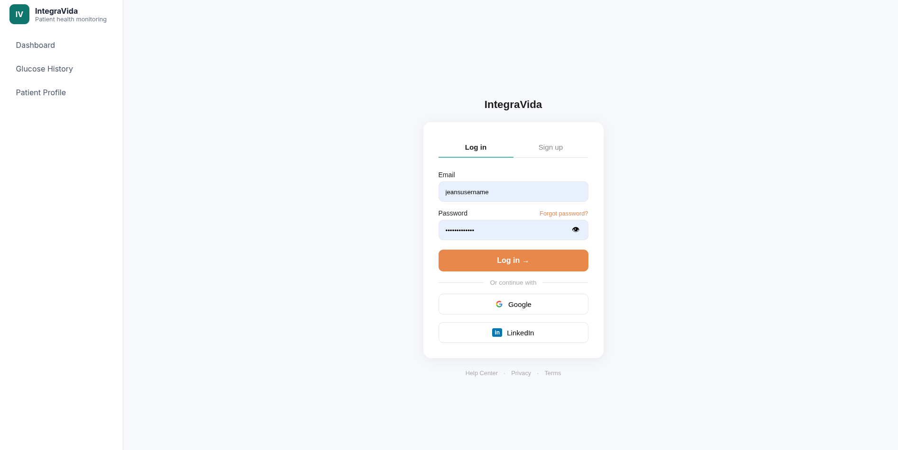
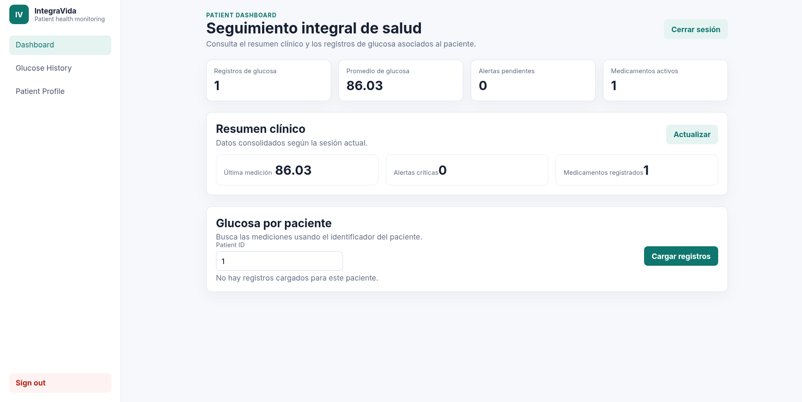
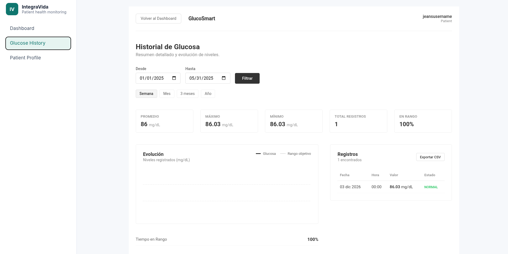
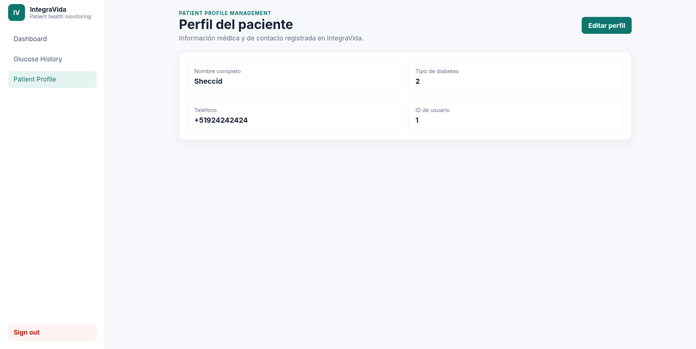
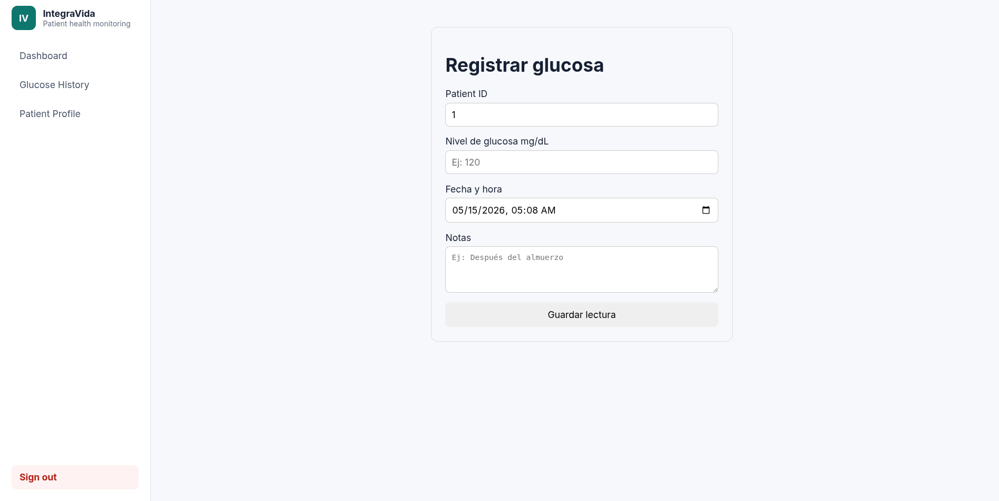

En este Sprint se implementaron las principales vistas funcionales de la Web Application de GlucoSmart. Las secciones desarrolladas incluyen:

- **Login / Register** — autenticación con validaciones y toggle de contraseña
- **Dashboard** — resumen de salud con gráfico de tendencias y medicamentos del día
- **Registro de Glucosa** — formulario con clasificación en tiempo real Normal/Alto/Bajo
- **Historial de Salud** — tabla paginada con filtros de fecha y gráfico de evolución
- **Alertas y Notificaciones** — gestión de alertas activas y resueltas con configuración de rangos
- **Perfil del Paciente** — datos clínicos, contacto y configuración editable

### Video Demonstration

El siguiente video muestra la ejecución funcional de la Frontend Web Application de IntegraVida durante el Sprint 2, incluyendo autenticación, dashboard médico, Patient Profile Management, historial de glucosa y despliegue de la aplicación.

https://youtu.be/_JOh925f1DE

### 5.3.1.6. Services Documentation Evidence for Sprint Review.

### Services Documentation Evidence for Sprint Review

Todos los endpoints se consumen mediante json-server corriendo en `https://integravida-data.onrender.com`.

| Endpoint             | Verbo HTTP | Descripción                    | Parámetros                                    | Assigned Service  |
| -------------------- | ---------- | ------------------------------ | --------------------------------------------- | ----------------- |
| /users               | GET        | Obtener usuarios para login    | email, password (query)                       | AuthService       |
| /users               | POST       | Registrar nuevo usuario        | body: { email, password, role }               | AuthService       |
| /patients/:id        | GET        | Obtener perfil del paciente    | id (path)                                     | PatientService    |
| /patients/:id        | PUT        | Actualizar perfil del paciente | id (path), body completo                      | PatientService    |
| /glucose_records     | GET        | Obtener lecturas de glucosa    | patientId (query)                             | GlucoseService    |
| /glucose_records     | POST       | Guardar nueva lectura          | body: { patientId, value, date, time, state } | GlucoseService    |
| /glucose_records/:id | PUT        | Editar lectura existente       | id (path), body actualizado                   | GlucoseService    |
| /glucose_records/:id | DELETE     | Eliminar lectura               | id (path)                                     | GlucoseService    |
| /alerts              | GET        | Obtener alertas del paciente   | patientId (query)                             | AlertService      |
| /alerts              | POST       | Crear alerta automática        | body: { patientId, type, value }              | AlertService      |
| /alerts/:id          | PATCH      | Marcar alerta como leída       | id (path), body: { read: true }               | AlertService      |
| /glucose_ranges      | GET        | Obtener rangos configurados    | patientId (query)                             | AlertService      |
| /glucose_ranges/:id  | PUT        | Actualizar rangos de glucosa   | id (path), body: { min, max }                 | AlertService      |
| /medications         | GET        | Obtener medicamentos activos   | patientId (query)                             | MedicationService |
| /medication_intakes  | POST       | Registrar toma de medicamento  | body: { medicationId, patientId, takenAt }    | MedicationService |

### 5.3.1.7. Software Deployment Evidence for Sprint Review.

Para este Sprint el despliegue contempla:

1. Entrar a la pagina web https://integravida-appweb.web.app/ y verificar el frontEnd services desplegado
2. Para ver el DB JSON entrar al siguiente link https://integravida-data.onrender.com/ y le saldran todas las tablas que se han desplegado con Render.com

### 5.3.1.8. Team Collaboration Insights during Sprint.

Durante este Sprint, las tareas fueron distribuidas colaborativamente entre todos los integrantes del equipo de desarrollo utilizando GitHub Flow, Pull Requests y ramas independientes para cada funcionalidad. Jean Pool Arias lideró la integración general del frontend, la configuración de servicios y la arquitectura base del proyecto. Abigail Raymundo lideró el desarrollo del módulo Patient Profile Management, incluyendo la interfaz de perfil del paciente, edición de datos y mejoras visuales del frontend. Juan Sebastian Estupiñan participó en los módulos relacionados con el monitoreo y registro de glucosa. Javier Oswaldo Tello desarrolló funcionalidades relacionadas con Appointment Management, mientras que Jose Antonio Muñoz colaboró en la implementación de servicios y lógica de integración REST.

Asimismo, el equipo organizó el frontend utilizando una arquitectura basada en Domain-Driven Design y separación por capas domain, application, infrastructure y presentation, permitiendo una mejor modularidad, escalabilidad e integración entre Bounded Contexts.

| Team Member | GitHub Username | Commits | Insertions | Deletions |
| :--- | :--- | :--- | :--- | :--- |
| Jean Pool Arias | Jean-AT | 14 commits | 17,009 ++ | 1,972 -- |
| Abigail Raymundo | AbigailRV | 7 commits | 3,118 ++ | 4,569 -- |
| Juan Sebastian Estupiñan | JuanSEstupinan | 6 commits | 8,071 ++ | 8,090 -- |
| Javier Oswaldo Tello | javiertellomurga-Dev | 1 commit | 1,106 ++ | 2,959 -- |
| Jose Antonio Muñoz | joseam05 | 1 commit | 863 ++ | 1 -- |

# Conclusiones

## Conclusiones y recomendaciones

#### Conclusiones

- **Validación Temprana mediante Lean UX:** La aplicación del proceso Lean UX, respaldada por entrevistas a pacientes diabéticos y personal médico especialista, permitió validar que la fragmentación de la información clínica y la falta de seguimiento de la adherencia al tratamiento constituyen problemas críticos en el manejo de la diabetes. Esta validación orientada al usuario garantizó que la definición del Product Backlog se centrara en funcionalidades de alto valor real, como el módulo de farmacovigilancia, el registro de glucosa, las alertas médicas y el panel de control clínico, evitando el desarrollo de características de bajo impacto.

- **Arquitectura Frontend Escalable y Modular:** La implementación de la Web Application mediante Angular y TypeScript, siguiendo una arquitectura basada en Domain-Driven Design con separación clara entre capas domain, application, infrastructure y presentation, permitió construir una base técnica sólida, mantenible y extensible. La estandarización de patrones como BaseApi, BaseAssembler y BaseEntity garantiza consistencia en el consumo de servicios y facilita la incorporación de nuevos bounded contexts en futuros sprints.

- **Implementación de Bounded Contexts Funcionales:** La división del sistema en bounded contexts independientes como Authentication, Patient Profile Management, Medical Follow-up, Alerts y Appointment Management permitió distribuir el trabajo de forma colaborativa y reducir dependencias entre módulos. Esto facilitó la integración progresiva de funcionalidades sin afectar la estabilidad general del frontend.

- **Entrega Funcional del Frontend en Sprint 2:** El Sprint 2 culminó con la implementación y despliegue exitoso de las principales vistas funcionales de GlucoSmart — autenticación, dashboard de salud, registro de glucosa, historial con gráficos, alertas y perfil del paciente — conectadas a una API REST desplegada en Render.com y con la Web Application disponible en Firebase Hosting. Esto demuestra la capacidad del equipo para cumplir ciclos de entrega completos, desde el desarrollo hasta el despliegue en producción.

- **Integración Exitosa de Servicios REST:** La conexión entre Angular Services y los endpoints REST desplegados permitió validar correctamente operaciones CRUD para usuarios, pacientes, registros de glucosa, alertas y medicamentos. El uso de json-server como entorno de simulación facilitó las pruebas tempranas y la integración progresiva entre frontend y servicios.

- **Mejora de la Experiencia de Usuario:** La construcción de interfaces responsive, dashboards visuales, formularios interactivos y componentes reutilizables permitió mejorar significativamente la experiencia de navegación del usuario final. Funcionalidades como edición de perfil, visualización de alertas y gráficos médicos contribuyen a una interacción más clara y accesible para pacientes y profesionales de salud.

- **Colaboración Efectiva mediante GitHub Flow:** El uso de ramas feature, Pull Requests y procesos de merge permitió mantener una integración organizada del proyecto durante el Sprint 2. La distribución de tareas por módulos y bounded contexts facilitó el trabajo simultáneo entre integrantes, reduciendo conflictos de integración y fortaleciendo la colaboración técnica del equipo.

- **Despliegue Continuo como Práctica Establecida:** La configuración de despliegue en plataformas cloud como Render.com para servicios y Firebase Hosting para la aplicación web estableció una base sólida de integración y entrega continua. Esto permitió validar funcionalidades en entornos accesibles públicamente y preparar la infraestructura para futuras iteraciones del proyecto.

- **Aplicación de Buenas Prácticas de Ingeniería de Software:** El proyecto permitió aplicar principios reales de ingeniería de software como modularidad, separación de responsabilidades, arquitectura multicapa, control de versiones y metodologías ágiles Scrum, fortaleciendo tanto las capacidades técnicas como organizacionales del equipo de desarrollo.

- **Base Sólida para Futuras Iteraciones:** La estructura técnica alcanzada durante los dos primeros sprints proporciona una base estable para continuar con funcionalidades más avanzadas relacionadas con analítica médica, notificaciones inteligentes, seguimiento automatizado de tratamientos y futuras integraciones con servicios externos de salud digital.

#### Recomendaciones

1. **Implementación de la Capa de Servicios (Backend):** Para los siguientes Sprints, se recomienda priorizar el diseño e implementación de la base de datos relacional y el desarrollo de servicios web (API RESTful). Esto es vital para dar vida a las historias de usuario de mayor impacto, permitiendo la persistencia de los registros de glucosa y la emisión automatizada de alertas de hipoglucemia hacia los médicos.
   
2. **Priorización de la Seguridad de Datos Clínicos:** Dado que **GlucoSmart** procesará información médica altamente sensible, se recomienda integrar requerimientos no funcionales de seguridad desde el inicio del desarrollo del backend. Esto incluye la encriptación de datos en tránsito y en reposo, autenticación robusta (ej. JSON Web Tokens) y el estricto cumplimiento de la Ley de Protección de Datos Personales vigente en el país.

3. **Integración de Pruebas Automatizadas:** Se sugiere incorporar la automatización de pruebas (unitarias y de integración) en el flujo de trabajo del repositorio. Considerando que el sistema maneja alertas de riesgo vital para los pacientes, asegurar la calidad del código mediante la integración continua (CI) minimizará la probabilidad de fallos en el entorno de producción al momento de notificar reacciones adversas o crisis glucémicas.

4. **Mejora Continua de la Experiencia de Usuario:** Se recomienda continuar refinando las interfaces de la Web Application mediante pruebas con usuarios reales, especialmente pacientes con diabetes y profesionales de salud. Esto permitirá detectar dificultades de navegación, mejorar la claridad de los formularios y asegurar que las funcionalidades sean fáciles de usar.

5. **Validación Médica de las Funcionalidades:** Antes de ampliar el sistema, se recomienda validar los módulos de alertas, rangos de glucosa, farmacovigilancia y reportes médicos con especialistas en salud. Esto permitirá asegurar que la información presentada sea clínicamente útil y no genere interpretaciones incorrectas.

6. **Implementación de Roles y Permisos:** Se recomienda fortalecer la gestión de usuarios mediante roles diferenciados para pacientes, médicos y administradores. Esto permitirá controlar el acceso a la información según el tipo de usuario y proteger datos sensibles dentro de la plataforma.

7. **Optimización del Despliegue Continuo:** Se recomienda configurar un flujo CI/CD más automatizado para que cada cambio aprobado mediante Pull Request pueda ser validado, construido y desplegado de forma controlada. Esto reducirá errores manuales durante el proceso de publicación.

8. **Migración desde json-server hacia una API Real:** Aunque json-server fue útil para validar la integración inicial, se recomienda reemplazarlo progresivamente por un backend real con una base de datos persistente, autenticación segura y lógica de negocio centralizada.

9. **Documentación Técnica Más Detallada:** Se recomienda mantener actualizada la documentación de servicios, endpoints, estructura de carpetas, bounded contexts y convenciones de código. Esto facilitará la incorporación de nuevos integrantes y el mantenimiento del proyecto.

10. **Incorporación de Pruebas de Usabilidad:** Se recomienda realizar pruebas de usabilidad con usuarios del segmento objetivo para evaluar si el flujo de registro de glucosa, visualización de alertas y edición del perfil del paciente resulta claro, rápido y comprensible.

11. **Mejora del Manejo de Errores:** Se recomienda implementar mensajes de error más específicos en formularios, servicios y rutas protegidas. Esto permitirá que el usuario comprenda qué ocurrió y cómo solucionarlo sin abandonar la plataforma.

12. **Fortalecimiento del Módulo Patient Profile Management:** Se recomienda ampliar el perfil del paciente incorporando datos médicos adicionales como alergias, contacto de emergencia, historial de diagnósticos, medicamentos activos y preferencias de notificación.

13. **Implementación de Notificaciones Reales:** Se recomienda integrar un sistema real de notificaciones por correo electrónico, SMS o push notifications para alertar al paciente y al médico ante lecturas fuera de rango o eventos críticos.

14. **Mejor Gestión del Product Backlog:** Se recomienda revisar y actualizar constantemente las historias de usuario, criterios de aceptación y estimaciones de story points, asegurando que el backlog refleje las prioridades reales del producto.

15. **Mayor Control de Calidad en Pull Requests:** Se recomienda establecer una checklist de revisión para cada Pull Request, incluyendo compilación exitosa, revisión de código, consistencia visual, cumplimiento de arquitectura y pruebas básicas de funcionamiento.

# Bibliografía

- Carrillo-Larco, R. M., & Bernabé-Ortiz, A. (2019). Diabetes mellitus tipo 2 en Perú: Una revisión sistemática sobre la prevalencia e incidencia en población general. Revista Peruana de Medicina Experimental y Salud Pública. [https://doi.org/10.17843/rpmesp.2019.361.4027](https://doi.org/10.17843/rpmesp.2019.361.4027)

- Lozano Ortiz, M., & Salazar González, B. C. (2007). Estrés percibido y adaptación en pacientes con diabetes mellitus tipo 2.  [http://www.scielo.org.co/scielo.php?script=sci_arttext&pid=S1657-59972007000100007](http://www.scielo.org.co/scielo.php?script=sci_arttext&pid=S1657-59972007000100007)

- Mishra, L. N. (2024, 5 de agosto). Functional Requirements Analysis – Benefits, Steps and Challenges. Adaptive US. Recuperado el 14 de septiembre de 2025. [https://www.adaptiveus-com.translate.goog/blog/functional-requirements-analysis/?_x_tr_sl=en&_x_tr_tl=es&_x_tr_hl=es&_x_tr_pto=tc](https://www.adaptiveus-com.translate.goog/blog/functional-requirements-analysis/?_x_tr_sl=en&_x_tr_tl=es&_x_tr_hl=es&_x_tr_pto=tc)

- Domínguez Reyes, M. Y., & Viamonte Pérez, Y. (2014). Ansiedad, depresión y vulnerabilidad al estrés ante el diagnóstico reciente de diabetes mellitus tipo 2. Gaceta Médica Espirituana. [http://scielo.sld.cu/scielo.php?pid=s1608-89212014000300009&script=sci_arttext&tlng=en](http://scielo.sld.cu/scielo.php?pid=s1608-89212014000300009&script=sci_arttext&tlng=en)

- Organización Mundial de la Salud. (2024, 14 de noviembre). Diabetes. [https://www.who.int/news-room/fact-sheets/detail/diabetes](https://www.who.int/news-room/fact-sheets/detail/diabetes?utm_source=chatgpt.com) [Organización Mundial de la Salud](https://www.who.int/news-room/fact-sheets/detail/diabetes)

- GBD 2021 Diabetes Collaborators. (2023). Global, regional, and national burden of diabetes from 1990 to 2021, with projections of prevalence to 2050: A systematic analysis for the Global Burden of Disease Study 2021. The Lancet, 402(10397), 203–234. [Global, regional, and national burden of diabetes from 1990 to 2021, with projections of prevalence to 2050: a systematic analysis for the Global Burden of Disease Study 2021 - The Lancet](https://www.thelancet.com/journals/lancet/article/PIIS0140-6736\(23\)01301-6/fulltext)

- Yu, X., Wang, Z., Liu, S., & Jung, H. (2025). Technological functionality and system architecture of mobile health interventions for diabetes management: A systematic review and meta-analysis of randomized controlled trials. Frontiers in Public Health, 13, 1549568. [Frontiers | Technological functionality and system architecture of mobile health interventions for diabetes management: a systematic review and meta-analysis of randomized controlled trials  ](https://www.frontiersin.org/journals/public-health/articles/10.3389/fpubh.2025.1549568/full)

- Organización Panamericana de la Salud. (s. f.). Farmacovigilancia. [https://www.paho.org/es/temas/farmacovigilancia](https://www.paho.org/es/temas/farmacovigilancia?utm_source=chatgpt.com)

- Tang, Z., Zhao, L., Li, J., Yang, Y., Liu, F., Li, H., Yang, Z., Qin, S., & Li, X. (2024). Prognostic effectiveness of interactive vs. non-interactive mobile app interventions in type 2 diabetes: A systematic review and meta-analysis. Archives of Public Health, 82, 221. [Prognostic effectiveness of interactive vs. non-interactive mobile app interventions in type 2 diabetes: a systematic review and meta-analysis | Archives of Public Health | Full Text](https://archpublichealth.biomedcentral.com/articles/10.1186/s13690-024-01450-x)

- Oracle. (s. f.). What is MySQL? Oracle. Recuperado el 4 de octubre de 2025, de [https://www.oracle.com/mysql/what-is-mysql/](https://www.oracle.com/mysql/what-is-mysql/)

- Amazon Web Services. (2024). Amazon DynamoDB documentation. [https://docs.aws.amazon.com/dynamodb/](https://docs.aws.amazon.com/dynamodb/)
# Anexos

Anexo 1: [LandignPage Desplegada](https://mts-opensource.github.io/IntegraVida/)
Anexo 2: [Mockups - Wireframe](https://www.figma.com/design/lu1p4NLglhTYnbHWT8lDl4/GlucoSmart-Prototype?node-id=0-1&t=LGg8wMfqWMWoYlOB-1)
Anexo 3: [Impact Mapping](https://miro.com/app/board/uXjVHdifA00=/?share_link_id=602434447345)
Anexo 4:https://integravida-appweb.web.app/
Anexo 5:https://integravida-data.onrender.com/
