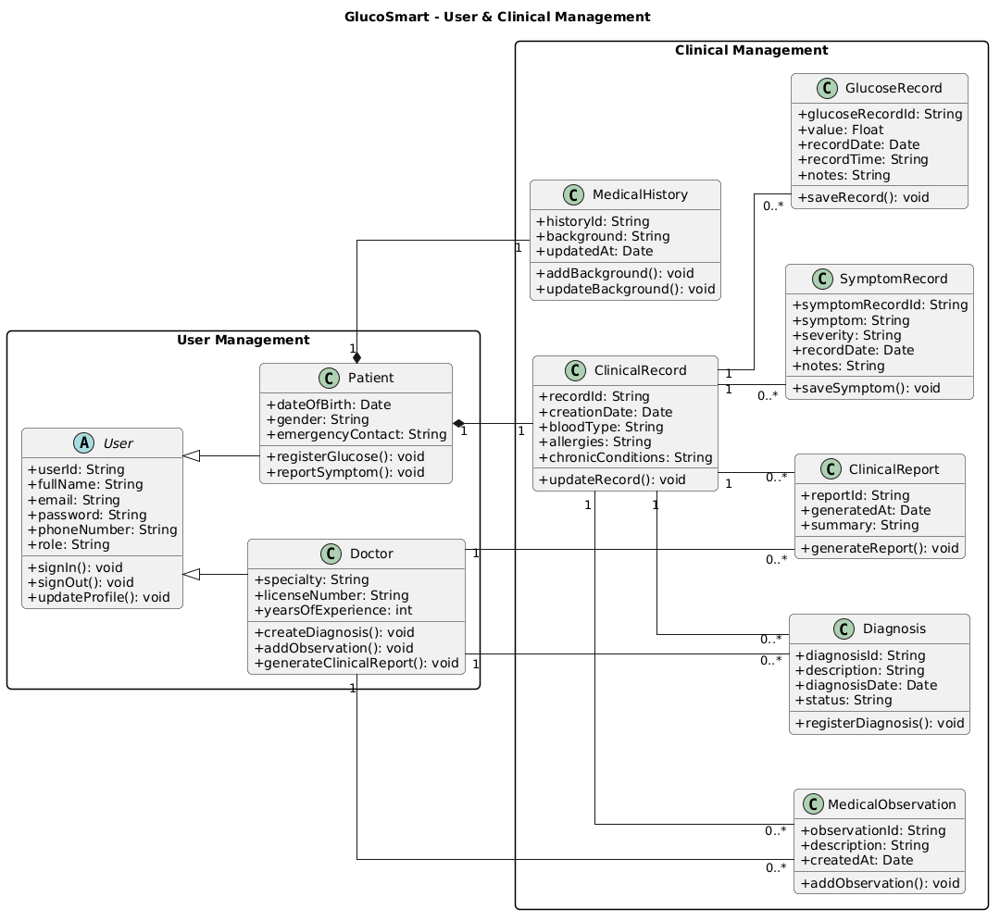
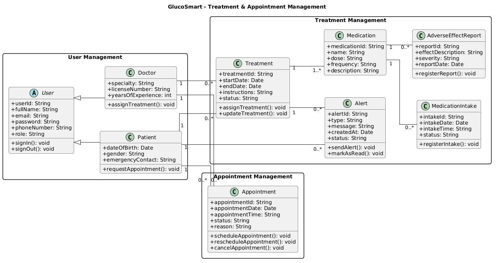
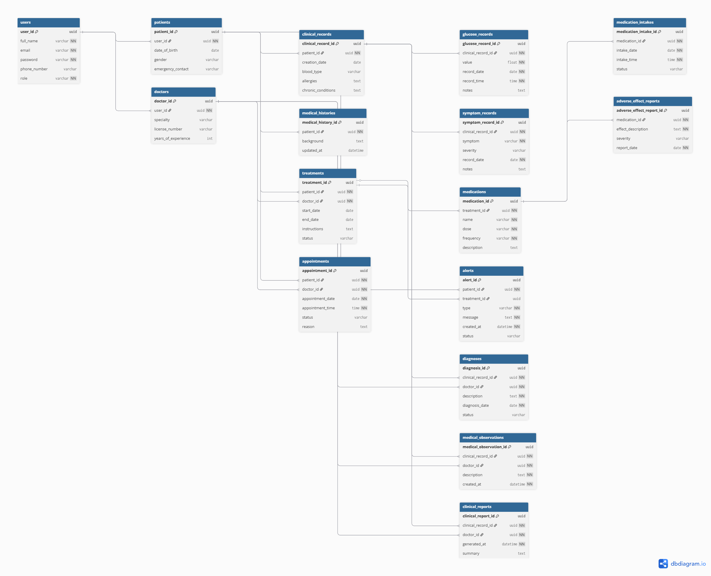

––\

Universidad Peruana de Ciencias Aplicadas

**Facultad de Ingeniería**

Ingenieria de Software

**Desarrollo de Aplicaciones Open Source - 1ASI0729 – 2610**

**Profesor: Juan Antonio Flores Moroco**

"Informe de Trabajo Final"

Startup: MTS

“IntegraVida”

U202414054 – Jean Pool Alexander Arias Tasayco
U202318001 – Abigail Nadhim Raymundo Villarroel 
U202223405 – Juan Sebastian Estupiñan Olortegui

Abril 2026-10

# Registro de Versiones del Informe

| Versión | Fecha |   Autor    | Descripción de Modificación |
| :-----: | :---: | :--------: | :-------------------------: |
|  0\.1   | 01/04 | Jean Arias |                             |

# Project Report Collaboration Insights

- Enlace del Repositorio: <https://github.com/MTS-OpenSource/AquaMatch.git>
- TB1:
  - ¿Qué Problema se encontró?
  - ¿Cómo se resolverá?

Contenido

[**REGISTRO DE VERSIONES DEL INFORME **2\*\*\*\*](#_toc226040379)

[**PROJECT REPORT COLLABORATION INSIGHTS **2\*\*\*\*](#_toc226040380)

[**STUDENT OUTCOME **6\*\*\*\*](#_toc226040381)

[**CAPITULO I: INTRODUCTION **7\*\*\*\*](#_toc226040382)

[1.1 Startup Profile 7](#_toc226040383)

[*1.1.1 Descripción de la Startup *7\*\*](#_toc226040384)

[*1.1.2. Perfiles de integrantes del equipo *7\*\*](#_toc226040385)

[1.2. Solution Profile 7](#_toc226040386)

[*1.2.1 Antecedentes y problemática *7\*\*](#_toc226040387)

[*1.2.2 Lean UX Process *7\*\*](#_toc226040388)

[1.2.2.1 Lean UX Problem Statements 7](#_toc226040389)

[1.2.2.2 Lean UX Assumption 7](#_toc226040390)

[12.2.3 Lean UX Hypothesis Statements 7](#_toc226040391)

[1.2.2.4 Lean UX Canvas 7](#_toc226040392)

[1.3 Segmento Objetivo 7](#_toc226040393)

[**CAPITULO II: REQUIREMENTS ELICITATION & ANALYSIS **7\*\*\*\*](#_toc226040394)

[2.1 Competidores 7](#_toc226040395)

[*2.1.1 Analisis Competitivo *7\*\*](#_toc226040396)

[*2.1.2 Estrategia y tácticas frente a competidores *7\*\*](#_toc226040397)

[2.2 Entrevistas 7](#_toc226040398)

[*2.2.1 Diseño de entrevistas *7\*\*](#_toc226040399)

[*2.2.2 Registro de entrevista *7\*\*](#_toc226040400)

[*2.2.3 Analisis de entrevista *7\*\*](#_toc226040401)

[2.3 Needfinding 7](#_toc226040402)

[*2.3.1 User Personas *7\*\*](#_toc226040403)

[*2.3.2 User Task Matrix *7\*\*](#_toc226040404)

[*2.3.3 User Journey Mapping *7\*\*](#_toc226040405)

[*2.3.4 Empathy Mapping *7\*\*](#_toc226040406)

[2.4 Big Picture Event Storming 7](#_toc226040407)

[2.5 Ubiquitous Language 7](#_toc226040408)

[**CAPITULO III: REQUIREMENTS SPECIFICATION **7\*\*\*\*](#_toc226040409)

[3.1 User Stories 7](#_toc226040410)

[3.2 Impact Mapping 7](#_toc226040411)

[3.3 Product Backlog 7](#_toc226040412)

[**CAPITULO IV: PRODUCT DESIGN **8\*\*\*\*](#_toc226040413)

[4.1. Style Guidelines. 8](#_toc226040414)

[*4.1.1. General Style Guidelines. *8\*\*](#_toc226040415)

[*4.1.2. Web Style Guidelines. *8\*\*](#_toc226040416)

[4.2. Information Architecture. 8](#_toc226040417)

[*4.2.1. Organization Systems. *8\*\*](#_toc226040418)

[*4.2.2. Labeling Systems. *8\*\*](#_toc226040419)

[*4.2.3. SEO Tags and Meta Tags *8\*\*](#_toc226040420)

[*4.2.4. Searching Systems. *8\*\*](#_toc226040421)

[*4.2.5. Navigation Systems. *8\*\*](#_toc226040422)

[4.3. Landing Page UI Design. 8](#_toc226040423)

[*4.3.1. Landing Page Wireframe. *8\*\*](#_toc226040424)

[*4.3.2. Landing Page Mock-up. *8\*\*](#_toc226040425)

[4.4. Web Applications UX/UI Design. 8](#_toc226040426)

[*4.4.1. Web Applications Wireframes. *8\*\*](#_toc226040427)

[*4.4.2. Web Applications Wireflow Diagrams. *8\*\*](#_toc226040428)

[*4.4.2. Web Applications Mock-ups. *8\*\*](#_toc226040429)

[*4.4.3. Web Applications User Flow Diagrams. *8\*\*](#_toc226040430)

[4.5. Web Applications Prototyping. 8](#_toc226040431)

[4.6. Domain-Driven Software Architecture. 8](#_toc226040432)

[*4.6.1. Design-Level Event Storming. *8\*\*](#_toc226040433)

[*4.6.2. Software Architecture Context Diagram. *8\*\*](#_toc226040434)

[*4.6.3. Software Architecture Container Diagrams. *8\*\*](#_toc226040435)

[*4.6.4. Software Architecture Components Diagrams. *8\*\*](#_toc226040436)

[4.7. Software Object-Oriented Design. 8](#_toc226040437)

[*4.7.1. Class Diagrams. *8\*\*](#_toc226040438)

[4.8. Database Design. 8](#_toc226040439)

[*4.8.1. Database Diagrams *8\*\*](#_toc226040440)

[**CAPITULO V: PRODUCT IMPLEMENTATION, VALIDATION & DEPLOYMENT **8\*\*\*\*](#_toc226040441)

[5.1. Software Configuration Management. 8](#_toc226040442)

[*5.1.1. Software Development Environment Configuration. *8\*\*](#_toc226040443)

[*5.1.2. Source Code Management. *8\*\*](#_toc226040444)

[*5.1.3. Source Code Style Guide & Conventions. *8\*\*](#_toc226040445)

[*5.1.4. Software Deployment Configuration. *8\*\*](#_toc226040446)

[5.2. Landing Page, Services & Applications Implementation. 8](#_toc226040447)

[*5.2.X. Sprint n *8\*\*](#_toc226040448)

[*5.2.X.1. Sprint Planning n. *8\*\*](#_toc226040449)

[*5.2.X.2. Aspect Leaders and Collaborators. *8\*\*](#_toc226040450)

[*5.2.X.3. Sprint Backlog n. *8\*\*](#_toc226040451)

[*5.2.X.4. Development Evidence for Sprint Review. *8\*\*](#_toc226040452)

[*5.2.X.5. Execution Evidence for Sprint Review. *8\*\*](#_toc226040453)

[*5.2.X.6. Services Documentation Evidence for Sprint Review. *8\*\*](#_toc226040454)

[*5.2.X.7. Software Deployment Evidence for Sprint Review. *8\*\*](#_toc226040455)

[*5.2.X.8. Team Collaboration Insights during Sprint. *8\*\*](#_toc226040456)

[5.3. Validation Interviews. 8](#_toc226040457)

[*5.3.1. Diseño de Entrevistas. *8\*\*](#_toc226040458)

[*5.3.2. Registro de Entrevistas. *8\*\*](#_toc226040459)

[*5.3.3. Evaluaciones según heurísticas. *8\*\*](#_toc226040460)

[5.4. Video About-the-Product. 8](#_toc226040461)

[**CONCLUSIONES **8\*\*\*\*](#_toc226040462)

[Conclusiones y recomendaciones 8](#_toc226040463)

[Video About-the-Team 8](#_toc226040464)

[**BIBLIOGRAFÍA **8\*\*\*\*](#_toc226040465)

[**ANEXOS **9\*\*\*\*](#_toc226040466)

# Student Outcome

| Criterio Especifico | Acciones Realizadas | Conclusiones |
| :------------------ | :------------------ | :----------- |
|                     |                     |              |

# Capitulo I: Introduction

## 1.1 Startup Profile

IntegraVida es una startup tecnológica del sector HealthTech nacida con la ambición de transformar radicalmente el paradigma del manejo de enfermedades crónicas, con un enfoque inicial en la diabetes. Nos definimos como una organización orientada a la innovación que desarrolla ecosistemas de software abiertos, rompiendo con las limitaciones de las soluciones propietarias y cerradas que fragmentan la información médica. 

Nuestra propuesta de valor reside en la interoperabilidad y la democratización de los datos de salud. A través del uso de arquitecturas distribuidas y modernas, IntegraVida conecta a pacientes, especialistas y sistemas de farmacovigilancia en una red de colaboración en tiempo real. No solo buscamos registrar datos, sino transformarlos en activos clínicos accionables que permitan cerrar la brecha de tratamiento y mejorar la calidad de vida de las poblaciones vulnerables a nivel global. 

Misión 

Empoderar a pacientes que conviven con enfermedades crónicas a través de soluciones de software de código abierto de alto rendimiento, diseñadas para facilitar una gestión integral, autónoma y segura de su salud. Nos comprometemos a proporcionar una infraestructura digital robusta que garantice la trazabilidad terapéutica y la precisión clínica, permitiendo que las decisiones médicas se basen en la analítica de datos en tiempo real y en una comunicación bidireccional efectiva entre el paciente y el equipo multidisciplinario de salud. 

Visión 

Consolidarnos para el año 2030 como la plataforma referente a nivel mundial en el ecosistema de salud abierta, convirtiéndonos en el núcleo digital estándar para la atención médica personalizada. Aspiramos a liderar la integración tecnológica en el sector salud, donde nuestras arquitecturas de software sirvan de base para millones de usuarios, transformando los sistemas de salud tradicionales en modelos predictivos, inclusivos y altamente eficientes, escalando desde nuestra base operativa en Perú hacia mercados internacionales.

### 1.1.1 Descripción de la Startup

### 1.1.2. Perfiles de integrantes del equipo

## 1.2. Solution Profile

### 1.2.1 Antecedentes y problemática

Who (¿A quiénes les afecta?) 

El impacto de esta problemática es sistémico y se distribuye en tres niveles críticos: 

- Pacientes con diabetes: Se ven obligados a gestionar su condición con herramientas que ofrecen datos fragmentados (silos de información), careciendo de una visión holística de su salud. Esto genera "fatiga de datos" y una alarmante ausencia de alertas preventivas que les permitan actuar antes de una crisis. 

- Personal Médico y Clínicas: Los especialistas reciben datos recolectados de forma asíncrona y sin contexto. Al no contar con trazabilidad real sobre la adherencia farmacológica o los efectos adversos, se ven limitados para realizar ajustes terapéuticos precisos, trabajando bajo un modelo de "ensayo y error" reactivo. 

- Sistemas de Salud Públicos y Privados: Estos organismos asumen el impacto financiero de las complicaciones crónicas (nefropatías, neuropatías, etc.) que podrían evitarse con un seguimiento preventivo. La ineficiencia en el manejo ambulatorio dispara los costos operativos y satura los servicios de emergencia. 

What (¿Cuál es el problema?) 

El problema central es la ineficiencia funcional y la desarticulación de datos en el ecosistema mHealth actual. Las aplicaciones convencionales se han limitado al registro cuantitativo de la glucosa, ignorando la integración de pilares fundamentales como la farmacovigilancia y la trazabilidad terapéutica. Existe una brecha crítica entre lo que el médico prescribe (indicación) y lo que el paciente realmente ejecuta (consumo real), lo que convierte a los datos recolectados en información estéril para el análisis clínico profesional. 

Where (¿Dónde surge el problema?) 

La problemática se localiza en la convergencia crítica entre el sector salud y la ingeniería de software (mHealth). No es solo un problema de software, sino de diseño arquitectónico: las interfaces y los flujos de datos no están anclados a los protocolos clínicos del mundo real. Esta desconexión impide que las intervenciones digitales logren su objetivo principal: la reducción sostenida de los niveles de hemoglobina glicosilada (HbA1c) en el paciente. 

When (¿Cu.ándo sucede el problema?) 

El problema persiste de manera ininterrumpida durante todo el ciclo de vida del tratamiento, pero se agudiza drásticamente en el periodo ambulatorio. Es precisamente cuando el paciente sale del entorno controlado del consultorio cuando se pierde el control sobre la adherencia a la medicación y se omiten las señales tempranas de reacciones adversas, rompiendo la continuidad del cuidado médico. 

Why (¿Por qué sucede el problema?) 

Esta situación es consecuencia de una visión técnica limitada que prioriza el registro de números sobre la gestión de la salud. Las herramientas actuales carecen de módulos de retroalimentación profesional y sistemas de apoyo a la decisión clínica. Al no existir una infraestructura integral que conecte la ingesta de fármacos con las variaciones glicémicas, el ciclo terapéutico permanece abierto, impidiendo la identificación de riesgos antes de que se conviertan en complicaciones severas. 

How (¿Cómo sucede el problema?) 

El problema se manifiesta a través de un ecosistema de aplicaciones reactivas e interacciones aisladas. Las apps generan alertas genéricas e irrelevantes que el paciente termina ignorando. Según investigaciones recientes (Tang, 2024), la falta de un diseño interactivo que incluya recordatorios personalizados, soporte profesional y una experiencia de usuario (UX) consistente, degrada la retención del paciente y, por ende, la sostenibilidad de cualquier beneficio clínico inicial. 

How Much (¿Qué impacto tiene?) 

A escala global, la diabetes afecta a 830 millones de personas, con la cifra alarmante de que más del 50% no recibe una terapia adecuada. En el contexto local, IntegraVida identifica en Lima Metropolitana un mercado de alta densidad que requiere soluciones urgentes. Proyectamos que la implementación de GlucoSmart permitirá no solo reducir costos por complicaciones en un porcentaje significativo, sino también escalar la solución a nivel nacional, transformando la brecha de tratamiento en el Perú en un caso de éxito de salud digital distribuida.

### 1.2.2 Lean UX Process

#### _1.2.2.1 Lean UX Problem Statements_

#### _1.2.2.2 Lean UX Assumption_

#### _12.2.3 Lean UX Hypothesis Statements_

#### _1.2.2.4 Lean UX Canvas_

## 1.3 Segmento Objetivo

# Capitulo II: Requirements Elicitation & Analysis

## 2.1 Competidores

### 2.1.1 Analisis Competitivo

| Competitive Analysis Landscape                             |                                                                                                                                                                              |              |              |              |     |     |
| :--------------------------------------------------------- | :--------------------------------------------------------------------------------------------------------------------------------------------------------------------------- | :----------- | :----------- | :----------- | :-- | :-- |
| ¿Por qué llevar a cabo este análisis?                      |                                                                                                                                                                              |              |              |              |     |     |
|                                                            |                                                                                                                                                                              |              |              |              |     |     |
| (En la Cabecera colocar por cada competidor nombre y logo) | Su Startup                                                                                                                                                                   | Competidor 1 | Competidor 2 | Competidor 3 |     |     |
| Perfil                                                     | Overview                                                                                                                                                                     |              |              |              |     |     |
|                                                            | Ventaja Competitiva ¿Qué valor ofrece a los clientes?                                                                                                                        |              |              |              |     |     |
| Perfil de Marketing                                        | Mercado Objetivo                                                                                                                                                             |              |              |              |     |     |
|                                                            | Estrategias de Marketing                                                                                                                                                     |              |              |              |     |     |
| Perfil de Producto                                         | Productos & Servicios                                                                                                                                                        |              |              |              |     |     |
|                                                            | 
Precios & Costos

                                                                                                                                               |              |              |              |     |     |
|                                                            | 
Canales de distribución

(Web y/o Movil)
                                                                                                                         |              |              |              |     |     |
| Análisis SWOT                                              | Realice esto para su startup y sus competidores. Sus fortalezas deberían apoyar sus oportunidades y contribuir a lo que ustedes definen como su posible ventaja competitiva. |              |              |              |     |     |
|                                                            | Fortalezas                                                                                                                                                                   |              |              |              |     |     |
|                                                            | Debilidades                                                                                                                                                                  |              |              |              |     |     |
|                                                            | Oportunidades                                                                                                                                                                |              |              |              |     |     |
|                                                            | Amenazas                                                                                                                                                                     |              |              |              |     |     |

### 2.1.2 Estrategia y tácticas frente a competidores

## 2.2 Entrevistas

### 2.2.1 Diseño de entrevistas

### 2.2.2 Registro de entrevista

### 2.2.3 Analisis de entrevista

## 2.3 Needfinding

### 2.3.1 User Personas

### 2.3.2 User Task Matrix

### 2.3.3 User Journey Mapping

### 2.3.4 Empathy Mapping

## 2.4 Big Picture Event Storming

## 2.5 Ubiquitous Language

El lenguaje ubicuo del proyecto **GlucoSmart** define los términos clave que serán utilizados de manera consistente a lo largo del análisis, diseño e implementación del sistema. Este glosario permite que todos los integrantes del equipo compartan una misma comprensión del dominio de negocio relacionado con el monitoreo y control de la diabetes.

### Términos generales

**1. Platform (Plataforma):**  
Sistema digital de GlucoSmart que permite centralizar la información clínica del paciente y facilitar la interacción con el doctor.

**2. Patient (Paciente):**  
Persona con diabetes que utiliza la plataforma para registrar su información de salud, recibir seguimiento y controlar su tratamiento.

**3. Doctor (Doctor):**  
Profesional de salud encargado de revisar la información del paciente, brindar seguimiento médico y tomar decisiones clínicas.

**4. Diabetes Management (Gestión de la diabetes):**  
Proceso de control, seguimiento y tratamiento continuo de la diabetes mediante registros clínicos, monitoreo y atención médica.

**5. Clinical Information (Información clínica):**  
Conjunto de datos relacionados con el estado de salud del paciente, tales como niveles de glucosa, síntomas, medicamentos y observaciones médicas.

**6. Treatment (Tratamiento):**  
Plan médico definido para el paciente, que incluye medicamentos, indicaciones y controles necesarios para el manejo de la diabetes.

**7. Monitoring (Monitoreo):**  
Seguimiento continuo de los datos de salud del paciente registrados dentro de la plataforma.

**8. Clinical Record (Registro clínico):**  
Historial digital donde se almacena la información médica relevante del paciente para su consulta y seguimiento.

---

### Perfil de usuario – Paciente

**1. Glucose Level (Nivel de glucosa):**  
Valor registrado en la plataforma para representar la concentración de glucosa del paciente en sangre.

**2. Glucose Log (Registro de glucosa):**  
Historial de mediciones de glucosa ingresadas por el paciente para el control de su estado de salud.

**3. Medication (Medicamento):**  
Fármaco indicado al paciente para controlar la diabetes o tratar condiciones relacionadas.

**4. Medication Intake (Toma de medicación):**  
Acción de registrar el consumo de un medicamento en la plataforma.

**5. Symptom (Síntoma):**  
Malestar o señal física reportada por el paciente durante su tratamiento o seguimiento.

**6. Treatment Adherence (Adherencia al tratamiento):**  
Nivel de cumplimiento del paciente respecto a las indicaciones médicas, medicamentos y controles establecidos.

**7. Reminder (Recordatorio):**  
Notificación generada por el sistema para avisar al paciente sobre la toma de medicamentos, controles o citas médicas.

**8. Alert (Alerta):**  
Aviso emitido por la plataforma cuando se detecta una situación que requiere atención, como una medición fuera del rango esperado.

**9. Appointment (Cita médica):**  
Encuentro programado entre el paciente y el doctor para revisión, seguimiento o evaluación del tratamiento.

**10. Health History (Historial de salud):**  
Conjunto de registros del paciente relacionados con su evolución, controles, síntomas y tratamiento.

---

### Perfil de usuario – Doctor

**1. Clinical Review (Revisión clínica):**  
Proceso mediante el cual el doctor analiza la información registrada por el paciente en la plataforma.

**2. Diagnosis (Diagnóstico):**  
Determinación médica sobre la condición de salud del paciente a partir de su evaluación clínica.

**3. Prescription (Prescripción):**  
Indicación médica que define qué medicamentos debe tomar el paciente, en qué dosis y con qué frecuencia.

**4. Clinical Follow-up (Seguimiento clínico):**  
Supervisión periódica realizada por el doctor sobre el estado de salud y evolución del paciente.

**5. Therapeutic Adjustment (Ajuste terapéutico):**  
Modificación del tratamiento en función de la evolución clínica y los datos registrados en la plataforma.

**6. Medical Observation (Observación médica):**  
Comentario o anotación realizada por el doctor sobre el estado, avance o respuesta del paciente al tratamiento.

**7. Medical Decision (Decisión médica):**  
Acción clínica tomada por el doctor a partir de la información analizada en el sistema.

**8. Appointment Schedule (Agenda de citas):**  
Listado de citas médicas programadas que permite al doctor organizar su seguimiento con los pacientes.

---

### Gestión del tratamiento y seguimiento

**1. Dose (Dosis):**  
Cantidad específica de medicamento que el paciente debe consumir según la prescripción médica.

**2. Frequency (Frecuencia):**  
Número de veces o intervalo en el que el paciente debe tomar su medicación.

**3. Schedule (Horario):**  
Momento definido para la toma de medicamentos, controles o citas médicas.

**4. Medical Report (Reporte médico):**  
Resumen organizado de la información clínica del paciente en un periodo determinado.

**5. Traceability (Trazabilidad):**  
Capacidad del sistema para registrar y seguir la evolución del paciente y el cumplimiento de su tratamiento a lo largo del tiempo.

**6. Follow-up History (Historial de seguimiento):**  
Registro cronológico de revisiones, observaciones y cambios realizados durante el control médico del paciente.

---

### Alertas y control de riesgos

**1. Risk Alert (Alerta de riesgo):**  
Notificación emitida cuando el sistema detecta una posible situación peligrosa para la salud del paciente.

**2. Adverse Effect (Efecto adverso):**  
Reacción no deseada que puede presentarse en el paciente como consecuencia de un medicamento o tratamiento.

**3. Preventive Notification (Notificación preventiva):**  
Aviso generado para anticipar posibles complicaciones y promover una acción oportuna.

**4. Clinical Event (Evento clínico):**  
Situación relevante registrada en la plataforma, como una variación anormal de glucosa, un síntoma o un cambio en el tratamiento.

---

### Acceso a la plataforma

**1. Sign Up (Registro):**  
Proceso mediante el cual un usuario crea una cuenta en la plataforma GlucoSmart.

**2. Sign In (Inicio de sesión):**  
Acción de ingresar al sistema mediante credenciales para acceder a sus funcionalidades.

**3. User Account (Cuenta de usuario):**  
Perfil digital asociado a un paciente o doctor dentro de la plataforma.

**4. User Profile (Perfil de usuario):**  
Información personal y profesional registrada en el sistema según el tipo de usuario.

# Capitulo III: Requirements Specification

## 3.1 User Stories

En esta sección se presentan las épicas y las historias de usuario del proyecto **GlucoSmart**, alineadas con las necesidades funcionales de los principales actores del sistema: **pacientes** y **doctores**. Estas historias de usuario servirán como base para la priorización del backlog, el diseño del sistema y la planificación del desarrollo.

### Epics

| Epic ID | Título                               | Descripción                                                                                                                       |
| ------- | ------------------------------------ | --------------------------------------------------------------------------------------------------------------------------------- |
| EP-01   | Landing Page y Captación de Usuarios | Como startup, queremos presentar claramente la propuesta de valor de GlucoSmart para informar y captar potenciales usuarios.      |
| EP-02   | Gestión de Cuenta y Acceso           | Como usuario, queremos registrarnos e iniciar sesión de forma segura para acceder a las funcionalidades de la plataforma.         |
| EP-03   | Perfil y Datos Clínicos del Paciente | Como paciente, queremos gestionar nuestro perfil y antecedentes clínicos para mantener información médica actualizada.            |
| EP-04   | Monitoreo y Registro de Salud        | Como paciente, queremos registrar y consultar nuestros datos de salud para llevar control continuo de la diabetes.                |
| EP-05   | Tratamiento, Medicación y Alertas    | Como paciente y doctor, queremos gestionar tratamientos, medicación y alertas para mejorar la adherencia y prevención de riesgos. |
| EP-06   | Seguimiento Clínico del Doctor       | Como doctor, queremos revisar y registrar información clínica del paciente para realizar un seguimiento médico adecuado.          |
| EP-07   | Gestión de Citas Médicas             | Como usuario, queremos gestionar citas médicas para organizar el seguimiento y la atención de salud.                              |

### User Stories

| Story ID | Título                                       | Descripción                                                                                                                                         | Criterios de Aceptación                                                                                                                                                                                                            | Epic ID |
| -------- | -------------------------------------------- | --------------------------------------------------------------------------------------------------------------------------------------------------- | ---------------------------------------------------------------------------------------------------------------------------------------------------------------------------------------------------------------------------------- | ------- |
| US-01    | Hero section del Landing Page                | Como visitante, quiero visualizar la propuesta de valor principal de GlucoSmart para comprender rápidamente el propósito de la plataforma.          | **Scenario 1:** **Given** the visitor accesses the landing page, **When** the main section is displayed, **Then** the visitor can clearly identify the purpose of GlucoSmart and its focus on diabetes management.        | EP-01   |
| US-02    | Registro de paciente                         | Como paciente, quiero registrarme en la plataforma para acceder a las funcionalidades de monitoreo y seguimiento de mi salud.                       | **Scenario 1:** **Given** the patient completes the registration form with valid data, **When** the patient selects the “Sign Up” option, **Then** the system creates the account successfully.                           | EP-02   |
| US-03    | Registro de doctor                           | Como doctor, quiero registrarme en la plataforma para acceder a la información clínica de mis pacientes y realizar seguimiento médico.              | **Scenario 1:** **Given** the doctor completes the registration form with valid data, **When** the doctor selects the “Sign Up” option, **Then** the system creates the account successfully.                             | EP-02   |
| US-04    | Log in                                       | Como usuario, quiero iniciar sesión con mis credenciales para acceder de forma segura a mi cuenta.                                                  | **Scenario 1:** **Given** the user already has a registered account, **When** the user enters valid credentials, **Then** the system grants access to the account.                                                        | EP-02   |
| US-05    | Recuperación de contraseña                   | Como usuario, quiero recuperar mi contraseña para volver a acceder a mi cuenta si la he olvidado.                                                   | **Scenario 1:** **Given** the user selects the password recovery option, **When** the user enters a valid email address, **Then** the system sends instructions to restore access.                                        | EP-02   |
| US-06    | Cerrar sesión                                | Como usuario, quiero cerrar sesión de manera segura para proteger la privacidad de mi información.                                                  | **Scenario 1:** **Given** the user is authenticated in the platform, **When** the user selects the “Log Out” option, **Then** the system ends the session and redirects the user out of the private area.                 | EP-02   |
| US-07    | Crear perfil de paciente                     | Como paciente, quiero completar mi perfil personal y clínico para contar con un registro base dentro de la plataforma.                              | **Scenario 1:** **Given** the patient accesses the profile section, **When** the patient completes the required personal and clinical information, **Then** the system stores the information successfully.               | EP-03   |
| US-08    | Editar perfil de paciente                    | Como paciente, quiero actualizar mis datos personales y clínicos para mantener mi información correcta y vigente.                                   | **Scenario 1:** **Given** the patient already has a registered profile, **When** the patient edits the data and saves the changes, **Then** the system updates the information successfully.                              | EP-03   |
| US-09    | Registrar antecedentes médicos               | Como paciente, quiero registrar mis antecedentes médicos relevantes para que el doctor disponga de mayor contexto clínico.                          | **Scenario 1:** **Given** the patient accesses the medical history section, **When** the patient enters valid background information, **Then** the system stores it correctly in the clinical record.                     | EP-03   |
| US-10    | Visualizar historial de salud                | Como paciente, quiero consultar mi historial de salud para revisar la evolución de mi condición a lo largo del tiempo.                              | **Scenario 1:** **Given** the patient has previous health records in the platform, **When** the patient accesses the health history section, **Then** the system displays the stored information in an organized way.     | EP-03   |
| US-11    | Consultar perfil y datos clínicos personales | Como paciente, quiero visualizar mi información personal y clínica consolidada para tener una visión general de mi estado de salud.                 | **Scenario 1:** **Given** the patient accesses the profile section, **When** the patient requests to view the registered information, **Then** the system displays the personal and clinical data in a consolidated view. | EP-03   |
| US-12    | Registrar nivel de glucosa                   | Como paciente, quiero registrar mis niveles de glucosa para llevar control sobre mi estado diario de salud.                                         | **Scenario 1:** **Given** the patient accesses the monitoring module, **When** the patient enters a valid glucose measurement, **Then** the system stores the entered value successfully.                                 | EP-04   |
| US-13    | Visualizar historial de glucosa              | Como paciente, quiero consultar el historial de mis mediciones de glucosa para identificar cambios y patrones en el tiempo.                         | **Scenario 1:** **Given** the patient has previous glucose records, **When** the patient accesses the glucose history section, **Then** the system displays the list of records in chronological order.                   | EP-04   |
| US-14    | Registrar síntomas                           | Como paciente, quiero registrar los síntomas que presento para complementar la información clínica de mi seguimiento.                               | **Scenario 1:** **Given** the patient accesses the symptoms section, **When** the patient enters valid symptom information, **Then** the system stores the symptom in the clinical history.                               | EP-04   |
| US-15    | Visualizar evolución de salud                | Como paciente, quiero visualizar el resumen de mi evolución de salud para entender mejor mi progreso y condición actual.                            | **Scenario 1:** **Given** the patient has health information registered in the platform, **When** the patient accesses the health progress panel, **Then** the system displays a summary of the health records.           | EP-04   |
| US-16    | Recibir alerta por glucosa fuera de rango    | Como paciente, quiero recibir alertas cuando mis niveles de glucosa estén fuera de rango para actuar de manera oportuna ante un posible riesgo.     | **Scenario 1:** **Given** the patient registers a glucose measurement outside the expected range, **When** the system validates the entered value, **Then** the system generates an alert for the patient.                | EP-04   |
| US-17    | Visualizar tratamiento actual                | Como paciente, quiero consultar mi tratamiento actual para saber qué indicaciones y medicamentos debo seguir.                                       | **Scenario 1:** **Given** the patient has an active treatment registered, **When** the patient accesses the treatment section, **Then** the system displays the current medical indications.                              | EP-05   |
| US-18    | Registrar tratamiento prescrito              | Como doctor, quiero registrar el tratamiento prescrito del paciente para dejar definidas las indicaciones médicas dentro de la plataforma.          | **Scenario 1:** **Given** the doctor accesses the patient’s clinical profile, **When** the doctor enters a valid treatment plan, **Then** the system stores the treatment successfully.                                   | EP-05   |
| US-19    | Registrar toma de medicación                 | Como paciente, quiero registrar cada toma de mi medicación para llevar control del cumplimiento de mi tratamiento.                                  | **Scenario 1:** **Given** the patient accesses the medication section, **When** the patient records a completed medication intake, **Then** the system stores the information in the corresponding history.               | EP-05   |
| US-20    | Recibir recordatorio de medicación           | Como paciente, quiero recibir recordatorios de medicación para no olvidar mis tomas programadas.                                                    | **Scenario 1:** **Given** the patient has medication schedules configured, **When** the scheduled time is reached, **Then** the system sends a medication reminder.                                                       | EP-05   |
| US-21    | Reportar efectos adversos                    | Como paciente, quiero reportar efectos adversos relacionados con mi medicación para que el doctor pueda evaluarlos oportunamente.                   | **Scenario 1:** **Given** the patient accesses the pharmacovigilance section, **When** the patient records a valid adverse effect report, **Then** the system stores the report successfully.                             | EP-05   |
| US-22    | Consultar adherencia al tratamiento          | Como doctor, quiero consultar el nivel de adherencia del paciente a su tratamiento para evaluar si está cumpliendo correctamente las indicaciones.  | **Scenario 1:** **Given** the doctor accesses the patient’s history, **When** the doctor reviews the recorded medication information, **Then** the system displays the treatment adherence level.                         | EP-05   |
| US-23    | Revisar información clínica del paciente     | Como doctor, quiero revisar la información clínica registrada por el paciente para realizar un seguimiento adecuado de su estado de salud.          | **Scenario 1:** **Given** the doctor accesses the patient record, **When** the doctor reviews the clinical records, **Then** the system displays the patient’s consolidated information.                                  | EP-06   |
| US-24    | Registrar observaciones médicas              | Como doctor, quiero registrar observaciones médicas sobre la evolución del paciente para dejar constancia del seguimiento clínico realizado.        | **Scenario 1:** **Given** the doctor accesses the patient record, **When** the doctor enters a valid medical observation, **Then** the system stores the observation successfully.                                        | EP-06   |
| US-25    | Emitir diagnóstico                           | Como doctor, quiero registrar un diagnóstico dentro de la plataforma para documentar formalmente la evaluación clínica del paciente.                | **Scenario 1:** **Given** the doctor accesses the patient’s clinical history, **When** the doctor enters a valid diagnosis, **Then** the system stores the diagnosis in the clinical record.                              | EP-06   |
| US-26    | Generar reporte clínico del paciente         | Como doctor, quiero generar un reporte clínico del paciente para contar con un resumen organizado de su información médica.                         | **Scenario 1:** **Given** the doctor accesses the patient record, **When** the doctor requests a clinical report, **Then** the system displays a structured clinical summary.                                             | EP-06   |
| US-27    | Solicitar cita médica                        | Como paciente, quiero solicitar una cita médica para recibir atención y seguimiento por parte del doctor.                                           | **Scenario 1:** **Given** the patient accesses the appointment module, **When** the patient submits a request with valid data, **Then** the system schedules the appointment successfully.                                | EP-07   |
| US-28    | Visualizar agenda de citas                   | Como usuario, quiero visualizar mis citas programadas para organizar mejor mi seguimiento médico.                                                   | **Scenario 1:** **Given** the user has registered appointments, **When** the user accesses the agenda section, **Then** the system displays the scheduled appointments in chronological order.                            | EP-07   |
| US-29    | Navegación por el Landing Page               | Como visitante, quiero navegar fácilmente entre las secciones del landing page para encontrar información del producto de manera rápida y ordenada. | **Scenario 1:** **Given** the visitor is on the landing page, **When** the visitor selects a navigation menu option, **Then** the system scrolls to the corresponding section.                                            | EP-01   |
| US-30    | Ver información de la Startup                | Como visitante, quiero visualizar información sobre IntegraVida y GlucoSmart para conocer el contexto y objetivo de la solución.                    | **Scenario 1:** **Given** the visitor accesses the “About Us” section, **When** the visitor reviews its content, **Then** the system displays relevant information about the startup and the product.                     | EP-01   |
| US-31    | Conocer la misión y visión de la Startup     | Como visitante, quiero leer la misión y visión de la startup para entender su enfoque y compromiso con el manejo de la diabetes.                    | **Scenario 1:** **Given** the visitor accesses the “About Us” section, **When** the visitor reviews the information cards, **Then** the system displays the startup’s mission and vision.                                 | EP-01   |
| US-32    | Cambiar idioma del Landing Page              | Como visitante, quiero cambiar el idioma del landing page para visualizar la información en el idioma de mi preferencia.                            | **Scenario 1:** **Given** the visitor is on the landing page, **When** the visitor selects one of the available languages, **Then** the interface content is updated to the selected language.                            | EP-01   |
| US-33    | Contactar al equipo de soporte               | Como visitante, quiero enviar un mensaje al equipo de soporte para resolver dudas o solicitar información sobre la plataforma.                      | **Scenario 1:** **Given** the visitor completes the contact form with valid data, **When** the visitor selects the “Send” option, **Then** the system registers or sends the message successfully.                        | EP-01   |
| US-34    | Reprogramar cita médica                      | Como usuario, quiero reprogramar una cita médica para adaptar el seguimiento a mi disponibilidad.                                                   | **Scenario 1:** **Given** the user has a previously scheduled appointment, **When** the user selects a new valid date and time, **Then** the system updates the appointment successfully.                                 | EP-07   |
| US-35    | Cancelar cita médica                         | Como usuario, quiero cancelar una cita médica para liberar el espacio cuando no pueda asistir.                                                      | **Scenario 1:** **Given** the user has a scheduled appointment, **When** the user selects the “Cancel” option, **Then** the system cancels the registered appointment successfully.                                       | EP-07   |
| US-36    | Recibir recordatorio de cita                 | Como usuario, quiero recibir recordatorios de mis citas médicas para no olvidar mis atenciones programadas.                                         | **Scenario 1:** **Given** the user has an upcoming appointment registered, **When** the appointment date is approaching, **Then** the system sends the corresponding reminder.                                            | EP-07   |

## 3.2 Impact Mapping

## 3.3 Product Backlog

El Product Backlog del proyecto **GlucoSmart** organiza las historias de usuario según su prioridad funcional y valor para el producto. El orden presentado considera el enfoque inicial del proyecto, comenzando por la validación de la propuesta de valor mediante el landing page y continuando con las funcionalidades principales del sistema orientadas al paciente y al doctor. La estimación técnica de cada historia se expresa mediante **Story Points**.

| # Orden | User Story ID | Título                                       | Descripción                                                                                                                                         | Story Point |
| ------- | ------------- | -------------------------------------------- | --------------------------------------------------------------------------------------------------------------------------------------------------- | ----------- |
| 1       | US-01         | Hero section del Landing Page                | Como visitante, quiero visualizar la propuesta de valor principal de GlucoSmart para comprender rápidamente el propósito de la plataforma.          | 2           |
| 2       | US-29         | Navegación por el Landing Page               | Como visitante, quiero navegar fácilmente entre las secciones del landing page para encontrar información del producto de manera rápida y ordenada. | 3           |
| 3       | US-30         | Ver información de la Startup                | Como visitante, quiero visualizar información sobre IntegraVida y GlucoSmart para conocer el contexto y objetivo de la solución.                    | 2           |
| 4       | US-31         | Conocer la misión y visión de la Startup     | Como visitante, quiero leer la misión y visión de la startup para entender su enfoque y compromiso con el manejo de la diabetes.                    | 2           |
| 5       | US-32         | Cambiar idioma del Landing Page              | Como visitante, quiero cambiar el idioma del landing page para visualizar la información en el idioma de mi preferencia.                            | 3           |
| 6       | US-33         | Contactar al equipo de soporte               | Como visitante, quiero enviar un mensaje al equipo de soporte para resolver dudas o solicitar información sobre la plataforma.                      | 3           |
| 7       | US-02         | Registro de paciente                         | Como paciente, quiero registrarme en la plataforma para acceder a las funcionalidades de monitoreo y seguimiento de mi salud.                       | 5           |
| 8       | US-03         | Registro de doctor                           | Como doctor, quiero registrarme en la plataforma para acceder a la información clínica de mis pacientes y realizar seguimiento médico.              | 5           |
| 9       | US-04         | Log in                                       | Como usuario, quiero iniciar sesión con mis credenciales para acceder de forma segura a mi cuenta.                                                  | 3           |
| 10      | US-05         | Recuperación de contraseña                   | Como usuario, quiero recuperar mi contraseña para volver a acceder a mi cuenta si la he olvidado.                                                   | 3           |
| 11      | US-06         | Cerrar sesión                                | Como usuario, quiero cerrar sesión de manera segura para proteger la privacidad de mi información.                                                  | 1           |
| 12      | US-07         | Crear perfil de paciente                     | Como paciente, quiero completar mi perfil personal y clínico para contar con un registro base dentro de la plataforma.                              | 5           |
| 13      | US-08         | Editar perfil de paciente                    | Como paciente, quiero actualizar mis datos personales y clínicos para mantener mi información correcta y vigente.                                   | 3           |
| 14      | US-09         | Registrar antecedentes médicos               | Como paciente, quiero registrar mis antecedentes médicos relevantes para que el doctor disponga de mayor contexto clínico.                          | 3           |
| 15      | US-11         | Consultar perfil y datos clínicos personales | Como paciente, quiero visualizar mi información personal y clínica consolidada para tener una visión general de mi estado de salud.                 | 2           |
| 16      | US-12         | Registrar nivel de glucosa                   | Como paciente, quiero registrar mis niveles de glucosa para llevar control sobre mi estado diario de salud.                                         | 5           |
| 17      | US-13         | Visualizar historial de glucosa              | Como paciente, quiero consultar el historial de mis mediciones de glucosa para identificar cambios y patrones en el tiempo.                         | 3           |
| 18      | US-14         | Registrar síntomas                           | Como paciente, quiero registrar los síntomas que presento para complementar la información clínica de mi seguimiento.                               | 2           |
| 19      | US-15         | Visualizar evolución de salud                | Como paciente, quiero visualizar el resumen de mi evolución de salud para entender mejor mi progreso y condición actual.                            | 5           |
| 20      | US-16         | Recibir alerta por glucosa fuera de rango    | Como paciente, quiero recibir alertas cuando mis niveles de glucosa estén fuera de rango para actuar de manera oportuna ante un posible riesgo.     | 5           |
| 21      | US-17         | Visualizar tratamiento actual                | Como paciente, quiero consultar mi tratamiento actual para saber qué indicaciones y medicamentos debo seguir.                                       | 3           |
| 22      | US-18         | Registrar tratamiento prescrito              | Como doctor, quiero registrar el tratamiento prescrito del paciente para dejar definidas las indicaciones médicas dentro de la plataforma.          | 5           |
| 23      | US-19         | Registrar toma de medicación                 | Como paciente, quiero registrar cada toma de mi medicación para llevar control del cumplimiento de mi tratamiento.                                  | 3           |
| 24      | US-20         | Recibir recordatorio de medicación           | Como paciente, quiero recibir recordatorios de medicación para no olvidar mis tomas programadas.                                                    | 5           |
| 25      | US-21         | Reportar efectos adversos                    | Como paciente, quiero reportar efectos adversos relacionados con mi medicación para que el doctor pueda evaluarlos oportunamente.                   | 3           |
| 26      | US-22         | Consultar adherencia al tratamiento          | Como doctor, quiero consultar el nivel de adherencia del paciente a su tratamiento para evaluar si está cumpliendo correctamente las indicaciones.  | 5           |
| 27      | US-23         | Revisar información clínica del paciente     | Como doctor, quiero revisar la información clínica registrada por el paciente para realizar un seguimiento adecuado de su estado de salud.          | 5           |
| 28      | US-24         | Registrar observaciones médicas              | Como doctor, quiero registrar observaciones médicas sobre la evolución del paciente para dejar constancia del seguimiento clínico realizado.        | 3           |
| 29      | US-25         | Emitir diagnóstico                           | Como doctor, quiero registrar un diagnóstico dentro de la plataforma para documentar formalmente la evaluación clínica del paciente.                | 3           |
| 30      | US-26         | Generar reporte clínico del paciente         | Como doctor, quiero generar un reporte clínico del paciente para contar con un resumen organizado de su información médica.                         | 5           |
| 31      | US-10         | Visualizar historial de salud                | Como paciente, quiero consultar mi historial de salud para revisar la evolución de mi condición a lo largo del tiempo.                              | 3           |
| 32      | US-27         | Solicitar cita médica                        | Como paciente, quiero solicitar una cita médica para recibir atención y seguimiento por parte del doctor.                                           | 5           |
| 33      | US-28         | Visualizar agenda de citas                   | Como usuario, quiero visualizar mis citas programadas para organizar mejor mi seguimiento médico.                                                   | 3           |
| 34      | US-34         | Reprogramar cita médica                      | Como usuario, quiero reprogramar una cita médica para adaptar el seguimiento a mi disponibilidad.                                                   | 3           |
| 35      | US-35         | Cancelar cita médica                         | Como usuario, quiero cancelar una cita médica para liberar el espacio cuando no pueda asistir.                                                      | 2           |
| 36      | US-36         | Recibir recordatorio de cita                 | Como usuario, quiero recibir recordatorios de mis citas médicas para no olvidar mis atenciones programadas.                                         | 3           |

# Capitulo IV: Product Design

## 4.1. Style Guidelines.

### 4.1.1. General Style Guidelines.

### 4.1.2. Web Style Guidelines.

## 4.2. Information Architecture.

### 4.2.1. Organization Systems.

### 4.2.2. Labeling Systems.

### 4.2.3. SEO Tags and Meta Tags

### 4.2.4. Searching Systems.

### 4.2.5. Navigation Systems.

## 4.3. Landing Page UI Design.

### 4.3.1. Landing Page Wireframe.

### 4.3.2. Landing Page Mock-up.

## 4.4. Web Applications UX/UI Design.

### 4.4.1. Web Applications Wireframes.

### 4.4.2. Web Applications Wireflow Diagrams.

### 4.4.2. Web Applications Mock-ups.

### 4.4.3. Web Applications User Flow Diagrams.

## 4.5. Web Applications Prototyping.

## 4.6. Domain-Driven Software Architecture.

### 4.6.1. Design-Level Event Storming.

### 4.6.2. Software Architecture Context Diagram.

### 4.6.3. Software Architecture Container Diagrams.

### 4.6.4. Software Architecture Components Diagrams.

## 4.7. Software Object-Oriented Design.

### 4.7.1. Class Diagrams.

Para representar de manera más clara la estructura orientada a objetos del sistema **GlucoSmart**, el diseño fue dividido en dos diagramas de clases complementarios. Ambos diagramas pertenecen al mismo dominio del sistema y se encuentran relacionados principalmente a través de las clases **Patient** y **Doctor**, que actúan como entidades centrales del modelo.

El primer diagrama, **User & Clinical Management**, presenta la estructura relacionada con la gestión de usuarios y la información clínica del paciente, incluyendo el expediente clínico, historial médico, registros de glucosa, síntomas, diagnósticos, observaciones médicas y reportes clínicos.

El segundo diagrama, **Treatment & Appointment Management**, presenta la estructura relacionada con la gestión de tratamientos, medicamentos, tomas de medicación, reportes de efectos adversos, alertas y citas médicas.

La separación en dos diagramas no implica una división del sistema en módulos independientes, sino una organización visual del mismo modelo orientado a objetos con el fin de mejorar la legibilidad, comprensión y trazabilidad del dominio.

#### Class Diagram 1: User & Clinical Management

#### Class Diagram 2: Treatment & Appointment Management

## 4.8. Database Design.

### 4.8.1. Database Diagrams

El siguiente diagrama entidad-relación representa el diseño de base de datos del sistema **GlucoSmart**, alineado con los diagramas de clases definidos previamente. El modelo relacional considera la gestión de usuarios, pacientes, doctores, expedientes clínicos, historial médico, registros de glucosa, síntomas, tratamientos, medicamentos, tomas de medicación, reportes de efectos adversos, alertas y citas médicas.

La estructura propuesta permite mantener la integridad de los datos y asegurar la trazabilidad clínica del paciente, además de brindar soporte a las principales funcionalidades de monitoreo, tratamiento y seguimiento médico de la plataforma.

# Capitulo V: Product Implementation, Validation & Deployment

## 5.1. Software Configuration Management.

### 5.1.1. Software Development Environment Configuration.

### 5.1.2. Source Code Management.

### 5.1.3. Source Code Style Guide & Conventions.

### 5.1.4. Software Deployment Configuration.

## 5.2. Landing Page, Services & Applications Implementation.

### 5.2.1. Sprint 1

### 5.2.1.1. Sprint Planning 1.

| Sprint #                         | Sprint 1                                                                                                                                                                                                                                                                                                                                                                                              |     |
| :------------------------------- | :---------------------------------------------------------------------------------------------------------------------------------------------------------------------------------------------------------------------------------------------------------------------------------------------------------------------------------------------------------------------------------------------------- | --- |
| **Sprint Planning Background**   |                                                                                                                                                                                                                                                                                                                                                                                                       |     |
| Date                             | 01/042026                                                                                                                                                                                                                                                                                                                                                                                             |     |
| Time                             | 6:00PM                                                                                                                                                                                                                                                                                                                                                                                                |     |
| Location                         | Virtual - Discord                                                                                                                                                                                                                                                                                                                                                                                     |     |
| Prepared By                      | Jean Pool Arias                                                                                                                                                                                                                                                                                                                                                                                       |     |
| Attendees (To planning meeting)  | Jean Pool Arias, Abigail Raymundo                                                                                                                                                                                                                                                                                                                                                                     |     |
| SprinT N-1 Review Summary        |                                                                                                                                                                                                                                                                                                                                                                                                       |     |
| SprinT N-1 Retrospective Summary |                                                                                                                                                                                                                                                                                                                                                                                                       |     |
| **Sprint Goal & User Stories**   |                                                                                                                                                                                                                                                                                                                                                                                                       |     |
| Sprint N Goal                    | Our focus is on delivering the first version of the GlucoSmart Landing Page. We believe it delivers a clear and attractive presentation of the product to potential users and medical professionals. This will be confirmed when the Landing Page is successfully deployed and accessible via a public URL, displaying all key sections including hero, services, about us, testimonials and contact. |     |
| Sprint N Velocity                | 20                                                                                                                                                                                                                                                                                                                                                                                                    |     |
| Sum of Story Points              | 18                                                                                                                                                                                                                                                                                                                                                                                                    |     |

### 5.2.X.2. Aspect Leaders and Collaborators.

| Team Member      | GitHub Username | Landing Page Structure | Navbar & Footer | Hero & Service | About & Testiomonials | Contact Section |
| :--------------- | :-------------- | :--------------------- | :-------------- | :------------- | :-------------------- | --------------- |
| Jean, Arias      | Jean-AT         | L                      | L               | L              | C                     | C               |
| Abigail Raymundo | AbigailRv       | C                      | C               | L              | L                     | L               |

### 5.2.X.3. Sprint Backlog 1.

| Sprint#    |                                   |                |                                                   |                                                                                                 |            |             |        |
| :--------- | :-------------------------------- | :------------- | :------------------------------------------------ | :---------------------------------------------------------------------------------------------- | :--------- | ----------- | ------ |
| User Story |                                   | Work-Item/Task |                                                   |                                                                                                 |            |             |        |
| Id         | Title                             | Id             | Title                                             | Description                                                                                     | Estimation | Assignet To | Status |
| US-29      | Navegacion por el Landing Page    | T01            | Crear estructura base del proyecto Angular        | Inicializar proyecto Angular con la estructura de carpetas definidas (shared,comoponents, core) | 1          | Jean Pool   | Done   |
| US-29      | Navegacion por el LandingPage     | T02            | Implementar Navbar component                      | Crear el componente navbar con logo, link de navegacion y botones de accion                     | 1          | Jean Pool   | Done   |
| US-29      | Navegación por el Landing Page    | T03            | Implementar Footer component                      | Crear el componente footer con logo, links, redes sociales y copyright                          | 1          | Abigail     | To-Do  |
| US-29      | Navegación por el Landing Page    | T04            | Implementar navegación entre secciones            | Configurar scroll suave entre secciones del Landing Page                                        | 0.5        | Jean Pool   | To-Do  |
| US-30      | Ver Información del Startup       | T05            | Implementar sección About                         | Crear el componente about con descripción, misión y visión de IntegraVida                       | 1          | Abigail     | To-Do  |
| US-31      | Conocer la mision de la Startup   | T06            | Agregar cards de Msion y vision                   | Implementar las cards dentro del componente about con su contenido                              | 0.5        | Abigail     | To-Do  |
| US-33      | Contactar al equipo de soporte    | T07            | Implementar seccion contact                       | Crear el componente contact con el formulario e informacion de contacto                         | 2          | Jean Pool   | Done   |
| US-01      | Hero section del Landing Page     | T08            | Implementar la seccion Hero                       | Crear el componente service con imagen y principal call to action                               | 1          | Abigail     | To-Do  |
| US-01      | Hero section del LandingPage      | T09            | Implementar seccion Service                       | Crear el componente con carousel de servicio especializados                                     | 2          | Abigail     | To-Do  |
| US-01      | Hero section del LandingPage      | 10             | Implementar Testimonios                           | Crear el componente testimonial con las cards de usuarios                                       | 1          | Abigai      | To-Do  |
| US-32      | Cambiar el idioma del LandingPage | T11            | Implementar Lenguage Service                      | Crear el servicio de internacionalizacion con traduciones en ES y EN                            | 1.5        | Jean Pool   | Done   |
| U-32       | Cambiar el idioma del LandingPage | T12            | Conectar Language Service a todos los componentes | Inyectar el servicio en cada componente y reemplazar textos estaticos                           | 1.5        | Jean Pool   | Done   |
| US-32      | Cambiar el idioma del LandingPage | T13            | Agregar toggle de idioma en navbar                | Implementar boton EN/ES en el navbar para cambiar idioma                                        | 0.5        | Jean Pool   | To-Do  |

### 5.2.1.4. Development Evidence for Sprint Review.

| Repository  | Branch | Commit Id | Commit Message | Commit Message Body | Commited on |
| :---------- | :----- | :-------- | :------------- | :------------------ | :---------- |
| IntegraVida | main   |           |                |                     |             |

### 5.2.1.5. Execution Evidence for Sprint Review.

En esta entrega el equipo ha desplegado con exito la primera version del LandingPage de IntegraVida 

Enlace del Landing Page desplegado: 

Las Secciones implementadas son: 

- Navbar con toggle de idioma ES/EN
- Hero section con imagen principal 
- Servicios Especializados con carousel
- Sobre Nosotros con cards de Mision y Vision
- Testimonio de usuarios 
- Formulario de Contacto 
- Footer con redes sociales

### 5.2.1.6. Services Documentation Evidence for Sprint Review.

En este Sprint no se implementaron Web Services. El enfoque fue exclusivamente en desarrollo y despliegue del Landing Page estatico

### 5.2.1.7. Software Deployment Evidence for Sprint Review.

Para el despliegue del Landing Page se utilizó GitHub Page. 

Pasos realizados: 

1. Subif el codigo fuentede la organizacion MTS-OpenSource 
2. Ir a Settings del repositorio 
3. Seleccionar el apartado Pages 
4. Eligir la rama ‘main’ y folder ‘/root’ 
5. Confirmar el despliegue y acceder al link generado

### 5.2.1.8. Team Collaboration Insights during Sprint.

Durante este Sprint la tareas fueron distribuidas equitativamente entre los dos integrantes del equipo de desarollo Jean Pool Arias lidero la estructura vase del proyecto, el navbar, el contact y el language service. Abigail Raymundo liero el hero, el about, los testimonio y los servicio 

| Team Member      | Commits   |
| ---------------- | --------- |
| Jean Pool Arias  | 9 commits |
| Abigail Raymundo | commits   |

# Conclusiones

## Conclusiones y recomendaciones

## Video About-the-Team

# Bibliografía

# Anexos
