

  

<h3 align="center">Universidad Peruana de Ciencias Aplicadas</h3>
<h5 align="center">Carrrera de Ingeniería de Software</h5>

<h1 align="center">1ASI0729 – 2610</h1>
<h1 align="center">Desarrollo de Aplicaciones Open Source</h1>
<h5 align="center">NRC</h5>
<h1 align="center">2610</h1>
<h2 align="center">Informe del Trabajo Final</h2>
<h5 align="center">Docente</h5>
<h4 align="center">Juan Antonio Flores Moroco</h4>

<h5 align="center">Equipo</h5>
<h3 align="center">GlucoSmart</h3>
<h5 align="center">Equipo</h5>
<h3 align="center">IntegraVida</h3>

<h4 align="center">Integrantes</h4><h5 align="center">Codigo           Apellidos y Nombres</h5>

U202414054  Arias Tasayco, Jean Pool Alexander

U202218387  Tello Murga, Javier Oswaldo

U202223405  Estupiñan Olortegui, Juan Sebastian

<h5 align="center">Periodo 2026-10</h5>
<h5 align="center">Junio 2026</h5>

---

# Registro de Versiones del Informe

| Versión | Fecha | Autor                    | Descripción de Modificación                                                                                                                                                                                       |
| :-----: | :---: | :----------------------- | :---------------------------------------------------------------------------------------------------------------------------------------------------------------------------------------------------------------- |
|   0.1   | 10/04 | Jean Arias               | Definición del Startup Profile y Lean UX Assumption y Hypotesis Statement (Capítulo I).                                                                                                                           |
|   0.2   | 13/04 | Jean Arias               | Desarrollo de Artefactos de Negocio: Empathy Map, Persona y Journey Map (Capítulo II).                                                                                                                            |
|   0.3   | 16/04 | Jean Arias               | Especificación de requerimientos: Impact Mapping (Capítulo III).                                                                                                                                                  |
|   0.4   | 19/04 | Jean Arias               | Desarrollo e integración de la interfaz de usuario (UI) para la Landing Page de GlucoSmart (Capítulo IV).                                                                                                         |
|   0.5   | 19/04 | Abigail Raymundo         | Creación de wireframes para definir la estructura de contenidos y elaboración de mockups de alta fidelidad en Figma.                                                                                              |
|   0.6   | 21/04 | Jean Arias               | Implementación del Sprint 1, configuración de software y despliegue (Capítulo V).                                                                                                                                 |
|   0.7   | 21/04 | Abigail Raymundo         | Desarrollo e integración de la interfaz de usuario (UI) para la Landing Page de GlucoSmart.                                                                                                                       |
|   0.8   | 21/04 | Javier Tello             | Desarrollo del lenguaje ubicuo del dominio, estimación y priorización del Product Backlog, diagramas de clases y diagrama entidad-relación del sistema GlucoSmart.                                                |
|   0.9   | 23/04 | Jose Muñoz               | Desarrollo de User Stories, diseño UX/UI de la Web Application (wireframes, mockups, wireflows y user flows), prototipo interactivo en Figma y definición de arquitectura mediante Event Storming y diagramas C4. |
|   1.0   | 10/05 | Jean Arias               | Implementación de servicios frontend, integración de API REST, configuración de json-server y despliegue inicial del entorno frontend en Firebase Hosting y Render.com.                                           |
|   1.1   | 12/05 | Abigail Raymundo         | Desarrollo del bounded context Patient Profile Management incluyendo PatientProfileComponent, edición de perfil, mejoras visuales del frontend y experiencia responsive de usuario.                               |
|   1.2   | 13/05 | Juan Sebastian Estupiñan | Implementación del bounded context Glucose Monitoring incluyendo registro de glucosa, historial clínico, filtros y gráficos médicos.                                                                              |
|   1.3   | 14/05 | Javier Tello             | Desarrollo e integración del bounded context Appointment Management y mejoras de navegación dentro de la Web Application.                                                                                         |
|   1.4   | 14/05 | Jose Muñoz               | Implementación de servicios REST, validaciones y lógica de integración para módulos clínicos y alertas médicas.                                                                                                   |
|   1.6   | 25/05 | Abigail Raymundo         | Reordenamiento del Product Backlog por valor de negocio y adición de Technical Stories para el RESTful API (Cap. 3.4).                                                                                            |
|   1.7   | 25/05 | Abigail Raymundo         | Adición de explicaciones por bounded context en Class Diagrams y ampliación de Database Design con descripción por contexto (Cap. 4.7.1, 4.8, 4.8.1).                                                             |
|   1.8   | 25/05 | Abigail Raymundo         | Corrección de Software Configuration Management: herramientas con propósito y referencias, convenciones GitFlow y guías de estilo por lenguaje (Cap. 5.1.1, 5.1.2, 5.1.3).                                        |
|   1.9   | 25/05 | Abigail Raymundo         | Corrección de Sprint 1: introducción en Sprint Planning, Aspect Leaders, Sprint Backlog, Development Evidence, Deployment Evidence y Team Collaboration (Cap. 5.2.1.1–5.2.1.8).                                   |
|   2.0   | 25/05 | Abigail Raymundo         | Corrección de Sprint 2: introducción en Sprint Planning, Aspect Leaders, Sprint Backlog, Development Evidence, Services Documentation, Deployment Evidence y Team Collaboration (Cap. 5.3.1.1–5.3.1.8).           |
|   2.1   | 18/06 | Jean Pool Arias          | Implementacion del Sprint 3                                                                                                                                                                                       |
|   2.2   | 18/06 | Abigail Raymundo         | Implementación del bounded context Profiles (backend Spring Boot: domain, application, infrastructure, interfaces) e integración con el frontend Angular consumiendo `/api/v1/profiles` (Cap. 5.2.3, 5.2.3.6).|
|   2.3   | 18/06 | Javier Tello             | Implementación del bounded context Medical (backend Spring Boot: domain, application, infrastructure e interfaces) e integración del frontend Angular Appointment Management consumiendo `/api/v1/appointments` en localhost. |
|   3.0   | 08/07 | Jean Pool Arias          | Corrección quirúrgica del informe TB2: expansión de Lean UX Assumptions/Hypothesis/Canvas (Cap. I), User Personas/Task Matrix/Journey/Empathy Mapping/Event Storming (Cap. II), Impact Mapping/Technical Stories (Cap. III), Style Guidelines/Components Diagrams/Class Diagrams/Database Design (Cap. IV), Sprint 4/Validation Interviews/About-the-Product/About-the-Team (Cap. V). |

# Project Report Collaboration Insights

- Enlace del Repositorio:
	- [ <https://github.com/MTS-OpenSource/IntegraVida.git>](https://github.com/MTS-OpenSource/IntegraVida)
	- [ <https://github.com/MTS-OpenSource/InformeProyecto.git>](https://github.com/MTS-OpenSource/InformeProyecto)
	- https://github.com/MTS-OpenSource/Integravida-FrontendServices.git
	- https://github.com/MTS-OpenSource/IntegraVida-BackendServices.git

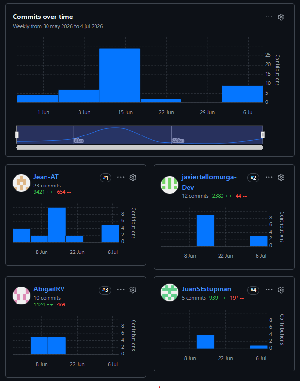

### AV1

**¿Qué Problema se encontró?**

Se detectó una total desarticulación en la fase inicial del proyecto respecto al entendimiento del ecosistema del paciente con diabetes. El equipo carecía de un perfil unificado del negocio (Startup Profile) y no se habían estructurado los supuestos básicos ni hipótesis de valor. En el ámbito técnico, el repositorio del informe no seguía estándares profesionales, careciendo de la implementación de GitFlow, convenciones de idioma y mensajes bajo la especificación de _Conventional Commits_. Además, la propuesta de valor comercial no contaba con una Landing Page estática desplegada para capturar el interés inicial de los dos segmentos objetivo (Pacientes y Médicos).

**¿Cómo se resolverá?**

El problema se resolverá mediante el establecimiento de las bases metodológicas y el despliegue del canal de marketing inicial de la startup a través de las siguientes acciones:

- **Estructuración del Solution Profile:** Definición rigurosa de la problemática utilizando la técnica de las 5 'W's y 2 'H's, y desarrollo completo del proceso Lean UX (Problem Statements, Assumptions, Hypothesis Statements y el Lean UX Canvas inicial).
- **Despliegue de la Landing Page:** Implementación de un sitio web estático responsivo estructurado con HTML5, CSS3 y JavaScript, basado en las guías visuales de Material Design, y desplegado exitosamente en producción.
- **Configuración del Entorno de Gestión de Configuración (SCM):** Establecimiento del flujo de trabajo con GitFlow en GitHub, adoptando nomenclaturas estrictas en inglés y el estándar de _Conventional Commits_ para asegurar la trazabilidad y la colaboración del equipo desde el Sprint 1.

### TB1

**¿Qué Problema se encontró?**

Se identificó que tras el despliegue de la Landing Page en el hito AV1, el informe presentaba una severa desconexión entre la investigación de campo y los requisitos técnicos del sistema. Específicamente, las entrevistas a los segmentos de usuario (Pacientes y Médicos) no contaban con un análisis cuantitativo que respaldara la creación de los arquetipos. Los artefactos de diseño (User Personas, Task Matrix, Journey Mapping y Empathy Maps) se encontraban desordenados o incompletos. Asimismo, la arquitectura de información de la aplicación web carecía de pautas de SEO/Meta Tags, y no se disponía de la primera versión del Frontend funcional en Angular integrado con las historias de usuario priorizadas.

**¿Cómo se resolvió?**

Se ejecutó un proceso profundo de Requirements Elicitation & Analysis y de Product Design estructurado de la siguiente manera:

1. **Consolidación del UX Research:** Registro detallado y descriptivo de las bitácoras de entrevistas (de Jorge, Virgilia, Andy y el Dr. Walter Gómez), analizando patrones críticos en porcentajes estadísticos que justificaron directamente las épicas del Product Backlog.
2. **Especificación de Requisitos y Mockups:** Redacción formal de las User Stories en formato Gherkin (Given-When-Then) e implementación de Wireframes, Wireflows y Mockups adaptativos de alta fidelidad en Figma.
3. **Despliegue de la Frontend Web Application:** Desarrollo del componente inicial transaccional en Angular Framework utilizando TypeScript y la biblioteca Angular Material. Esta primera iteración (Sprint 2) fue desplegada satisfactoriamente en Firebase Hosting, integrando los Call-To-Action (CTA) esenciales validados de la Landing Page para redirigir correctamente a las vistas de inicio de sesión y registro de mediciones.

### AV2

**¿Qué Problema se encontró?**

Se identificó una alta fragmentación y deficiencia en la gestión de la información clínica de pacientes diagnosticados con Diabetes Mellitus. Actualmente, el registro de métricas vitales (como los niveles de glucosa y hemoglobina glicosilada - HbA1c) y el control de la medicación se realizan, en su mayoría, de forma manual, aislada o dependiente de la memoria del paciente. Esta situación genera dos problemas críticos:

1. **En el paciente:** Una baja adherencia al tratamiento debido a olvidos frecuentes de las dosis, sumado a la incertidumbre y falta de un canal directo para reportar efectos secundarios de los fármacos.
2. **En el personal médico:** Pérdida de tiempo valioso durante las consultas al tener que unificar e interpretar historiales desordenados (en papel o Excel). Además, existe una nula capacidad de farmacovigilancia activa, lo que impide a los doctores intervenir preventivamente antes de que un paciente sufra una crisis de hipoglucemia severa o daño orgánico.

**¿Cómo se resolverá?**

El problema se resolverá mediante el desarrollo y despliegue de **IntegraVida (GlucoSmart)**, una plataforma web B2B2C respaldada por una arquitectura de base de datos relacional robusta. Esta solución centralizará la información y conectará en tiempo real a los pacientes con sus médicos tratantes, resolviendo la problemática a través de tres pilares tecnológicos:

- **Sistema de Adherencia Automatizado:** Notificaciones y confirmaciones de toma de medicación que reducen drásticamente los olvidos en los pacientes, implementadas en la interfaz de Angular.
- **Módulo de Farmacovigilancia y Alertas Críticas:** Un canal de registro rápido donde los pacientes reportan reacciones adversas, el cual dispara alertas inmediatas en tiempo real al médico mediante servicios en Spring Boot si los parámetros indican un riesgo vital.
- **Ecosistema de Decisiones Clínicas:** Un panel de control (Dashboard) interactivo para el médico que procesa los datos registrados y los visualiza en gráficos de tendencias, permitiendo optimizar el tiempo de consulta y ajustar los tratamientos de forma rápida y segura basándose en evidencia real estructurada en PostgreSQL.

### TB2

**¿Qué Problema se encontró?**

Se detectó que el informe de TB1 presentaba secciones incompletas en los Capítulos I, II, III, IV y V según la rúbrica de evaluación para la entrega final. Específicamente: Lean UX Canvas no tenía explicación detallada, User Personas carecía de introducción, User Task Matrix y Journey Mapping estaban redactados de forma errónea en modo TO-BE en lugar de AS-IS, faltaban Technical Stories para el backend de Spring Boot, los Style Guidelines no incluían tablas detalladas de tipografía/color/espaciado, los diagramas de componentes y clases de software no seguían la notación Domain-Driven Design (DDD) con segregación CQRS por bounded context, y las secciones críticas del Sprint 4, Validation Interviews (Entrevistas de Validación según Heurísticas de Usabilidad), About-the-Product y About-the-Team estaban completamente ausentes.

**¿Cómo se resolvió?**

Se aplicaron mejoras quirúrgicas estructurales preservando todo el contenido técnico existente:

1. **Expansión de Lean UX:** Se detallaron los Assumptions, Hypothesis Statements y el Lean UX Canvas incorporando tablas explicativas y un checklist de validación.
2. **Reescritura Metodológica a AS-IS:** Se reformularon por completo el User Task Matrix y los User Journey Maps para reflejar el viaje actual de los pacientes (Jorge, Virgilia y Andy) sin el software, mapeando un flujo real de 6 etapas críticas de dolor.
3. **Introducciones y Marcos Conceptuales:** Se adicionaron las introducciones requeridas para las fichas de User Personas y textos de interpretación cualitativa dentro de los Empathy Maps.
4. **Especificación de Requisitos Técnicos:** Se incorporaron 10 Technical Stories (de la TS-11 a la TS-20) enfocadas en la infraestructura del API RESTful de Spring Boot utilizando patrones de DDD y CQRS, además de expandir el Impact Mapping con 4 objetivos de negocio bajo el estándar SMART.
5. **Estandarización de Diseño Visual:** Se estructuraron tablas completas de Web Style Guidelines que definen el branding institucional, paleta cromática, escala tipográfica y la matriz de espaciado adaptativo (spacing).
6. **Arquitectura Dirigida por el Dominio:** Se actualizaron y expandieron los Component Diagrams bajo el estándar del Modelo C4 acoplándolos a la delimitación de contextos (Bounded Contexts) y segregación de lectura/escritura (CQRS).
7. **Cierre de Ciclo de Vida del Software:** Se incorporó en su totalidad el bloque del Sprint 4, el diseño, registro de bitácoras y tablas de evaluación heurística de usabilidad de las Entrevistas de Validación (Sección 5.3) y los esquemas temporales de contenido (timing) para los videos About-the-Product y About-the-Team. Todos los cambios se consolidaron sobre el archivo markdown principal sin eliminar ninguna sección o capítulo previo.

# Contenido

- [Registro de versiones del informe](#_toc226040379)
- [Project Report Collaboration Insights](#_toc226040380)
- [Student Outcome](#_toc226040381)

# Capítulo I: Introduction

- [1.1 Startup Profile](#_toc226040383)
  - [1.1.1 Descripción de la Startup](#_toc226040384)
  - [1.1.2 Perfiles de integrantes del equipo](#_toc226040385)

- [1.2 Solution Profile](#_toc226040386)
  - [1.2.1 Antecedentes y problemática](#_toc226040387)
  - [1.2.2 Lean UX Process](#_toc226040388)
    - [1.2.2.1 Lean UX Problem Statements](#_toc226040389)
    - [1.2.2.2 Lean UX Assumption](#_toc226040390)
    - [1.2.2.3 Lean UX Hypothesis Statements](#_toc226040391)
    - [1.2.2.4 Lean UX Canvas](#_toc226040392)

- [1.3 Segmento Objetivo](#_toc226040393)

# Capítulo II: Requirements Elicitation & Analysis

- [2.1 Competidores](#_toc226040395)
  - [2.1.1 Analisis Competitivo](#_toc226040396)
  - [2.1.2 Estrategia y tácticas frente a competidores](#_toc226040397)

- [2.2 Entrevistas](#_toc226040398)
  - [2.2.1 Diseño de entrevistas](#_toc226040399)
  - [2.2.2 Registro de entrevista](#_toc226040400)
  - [2.2.3 Analisis de entrevista](#_toc226040401)

- [2.3 Needfinding](#_toc226040402)
  - [2.3.1 User Personas](#_toc226040403)
  - [2.3.2 User Task Matrix](#_toc226040404)
  - [2.3.3 User Journey Mapping](#_toc226040405)
  - [2.3.4 Empathy Mapping](#_toc226040406)

- [2.4 Big Picture Event Storming](#_toc226040407)
- [2.5 Ubiquitous Language](#_toc226040408)

# Capítulo III: Requirements Specification

- [3.1 User Stories](#_toc226040410)
- [3.2 Impact Mapping](#_toc226040411)
- [3.3 Product Backlog](#_toc226040412)

# Capítulo IV: Product Design

- [4.1 Style Guidelines](#_toc226040414)
  - [4.1.1 General Style Guidelines](#_toc226040415)
  - [4.1.2 Web Style Guidelines](#_toc226040416)

- [4.2 Information Architecture](#_toc226040417)
  - [4.2.1 Organization Systems](#_toc226040418)
  - [4.2.2 Labeling Systems](#_toc226040419)
  - [4.2.3 SEO Tags and Meta Tags](#_toc226040420)
  - [4.2.4 Searching Systems](#_toc226040421)
  - [4.2.5 Navigation Systems](#_toc226040422)

- [4.3 Landing Page UI Design](#_toc226040423)
  - [4.3.1 Landing Page Wireframe](#_toc226040424)
  - [4.3.2 Landing Page Mock-up](#_toc226040425)

- [4.4 Web Applications UX/UI Design](#_toc226040426)
  - [4.4.1 Web Applications Wireframes](#_toc226040427)
  - [4.4.2 Web Applications Wireflow Diagrams](#_toc226040428)
  - [4.4.3 Web Applications Mock-ups](#_toc226040429)
  - [4.4.4 Web Applications User Flow Diagrams](#_toc226040430)

- [4.5 Web Applications Prototyping](#_toc226040431)

- [4.6 Domain-Driven Software Architecture](#_toc226040432)
  - [4.6.1 Design-Level Event Storming](#_toc226040433)
  - [4.6.2 Software Architecture Context Diagram](#_toc226040434)
  - [4.6.3 Software Architecture Container Diagrams](#_toc226040435)
  - [4.6.4 Software Architecture Components Diagrams](#_toc226040436)

- [4.7 Software Object-Oriented Design](#_toc226040437)
  - [4.7.1 Class Diagrams](#_toc226040438)

- [4.8 Database Design](#_toc226040439)
  - [4.8.1 Database Diagrams](#_toc226040440)

# Capítulo V: Product Implementation, Validation & Deployment

- [5.1 Software Configuration Management](#_toc226040442)
  - [5.1.1 Software Development Environment Configuration](#_toc226040443)
  - [5.1.2 Source Code Management](#_toc226040444)
  - [5.1.3 Source Code Style Guide & Conventions](#_toc226040445)
  - [5.1.4 Software Deployment Configuration](#_toc226040446)

- [5.2 Landing Page, Services & Applications Implementation](#_toc226040447)

## Sprint 1

- [5.2.1 Sprint 1](#_toc226040448)
  - [5.2.1.1 Sprint Planning 1](#_toc226040449)
  - [5.2.1.2 Aspect Leaders and Collaborators](#_toc226040450)
  - [5.2.1.3 Sprint Backlog 1](#_toc226040451)
  - [5.2.1.4 Development Evidence for Sprint Review](#_toc226040452)
  - [5.2.1.5 Execution Evidence for Sprint Review](#_toc226040453)
  - [5.2.1.6 Services Documentation Evidence for Sprint Review](#_toc226040454)
  - [5.2.1.7 Software Deployment Evidence for Sprint Review](#_toc226040455)
  - [5.2.1.8 Team Collaboration Insights during Sprint](#_toc226040456)

## Sprint 2

- [5.2.2 Sprint 2](#_toc226040448)
  - [5.2.2.1 Sprint Planning 2](#_toc226040449)
  - [5.2.2.2 Aspect Leaders and Collaborators](#_toc226040450)
  - [5.2.2.3 Sprint Backlog 2](#_toc226040451)
  - [5.2.2.4 Development Evidence for Sprint Review](#_toc226040452)
  - [5.2.2.5 Execution Evidence for Sprint Review](#_toc226040453)
  - [5.2.2.6 Services Documentation Evidence for Sprint Review](#_toc226040454)
  - [5.2.2.7 Software Deployment Evidence for Sprint Review](#_toc226040455)
  - [5.2.2.8 Team Collaboration Insights during Sprint](#_toc226040456)

## Sprint 3

- [5.2.3 Sprint 3](#_toc226040448)
  - [5.2.3.1 Sprint Planning 3](#_toc226040449)
  - [5.2.3.2 Aspect Leaders and Collaborators](#_toc226040450)
  - [5.2.3.3 Sprint Backlog 3](#_toc226040451)
  - [5.2.3.4 Development Evidence for Sprint Review](#_toc226040452)
  - [5.2.3.5 Execution Evidence for Sprint Review](#_toc226040453)
  - [5.2.3.6 Services Documentation Evidence for Sprint Review](#_toc226040454)
  - [5.2.3.7 Software Deployment Evidence for Sprint Review](#_toc226040455)
  - [5.2.3.8 Team Collaboration Insights during Sprint](#_toc226040456)

## Sprint 4

- [5.2.4 Sprint 4](#_toc226040470)
  - [5.2.4.1 Sprint Planning 4](#_toc226040471)
  - [5.2.4.2 Aspect Leaders and Collaborators](#_toc226040472)
  - [5.2.4.3 Sprint Backlog 4](#_toc226040473)
  - [5.2.4.4 Development Evidence for Sprint Review](#_toc226040474)
  - [5.2.4.5 Execution Evidence for Sprint Review](#_toc226040475)
  - [5.2.4.6 Services Documentation Evidence for Sprint Review](#_toc226040476)
  - [5.2.4.7 Software Deployment Evidence for Sprint Review](#_toc226040477)
  - [5.2.4.8 Team Collaboration Insights during Sprint](#_toc226040478)

## 5.3. Validation Interviews

- [5.3 Validation Interviews](#_toc226040480)
  - [5.3.1 Diseño de Entrevistas de Validación](#_toc226040481)
  - [5.3.2 Resultados de las Entrevistas de Validación](#_toc226040482)
  - [5.3.3 Evaluaciones según heurísticas](#_toc226040483)

## 5.4. About-the-Product

- [5.4 About-the-Product](#_toc226040490)

## 5.5. About-the-Team

- [5.5 About-the-Team](#_toc226040500)

# Conclusiones

- [Conclusiones y recomendaciones](#_toc226040463)

# Bibliografía

- [Bibliografía](#_toc226040465)

# Anexos

- [Anexos](#_toc226040466)

# Student Outcome

El curso contribuye al cumplimiento del Student Outcome ABET:  
**ABET – EAC - Student Outcome 3**

**Criterio:** Capacidad de comunicarse efectivamente con un rango de audiencias.

En el siguiente cuadro se describen las acciones realizadas y conclusiones por parte del grupo, que permiten sustentar el logro del ABET – EAC - Student Outcome 3.

| **Criterio específico**                                                   | **Acciones realizadas**                                                                                                                                                                                                                                                                                                                                                                                                                                                                                                                                                                                                                                                                                                                                                                                                                                                                                                                                                                                                                                                                                                                                                                                                                                                                                                                                                                                                                                                                                                                                                                                                                                                                                                                                                                                                                                                                                                                                                                                                                                                                                                                                                                                                                                                                                                                                                                                                                                                                                                                                                                                                                                                                                                                                                                                                                                                                                                                                                                                                                                                                                                                                                                                                                                                                                                                                                                                                                                                                                                                                                                                                                                                                                                                                                                                                                                                                                                                                                                                                                                                                                                                                                                                                                                                                                                                                    | **Conclusiones**                                                                                                                                                                                                                                                                                                                                                                                                                                                                |
| ------------------------------------------------------------------------- | ---------------------------------------------------------------------------------------------------------------------------------------------------------------------------------------------------------------------------------------------------------------------------------------------------------------------------------------------------------------------------------------------------------------------------------------------------------------------------------------------------------------------------------------------------------------------------------------------------------------------------------------------------------------------------------------------------------------------------------------------------------------------------------------------------------------------------------------------------------------------------------------------------------------------------------------------------------------------------------------------------------------------------------------------------------------------------------------------------------------------------------------------------------------------------------------------------------------------------------------------------------------------------------------------------------------------------------------------------------------------------------------------------------------------------------------------------------------------------------------------------------------------------------------------------------------------------------------------------------------------------------------------------------------------------------------------------------------------------------------------------------------------------------------------------------------------------------------------------------------------------------------------------------------------------------------------------------------------------------------------------------------------------------------------------------------------------------------------------------------------------------------------------------------------------------------------------------------------------------------------------------------------------------------------------------------------------------------------------------------------------------------------------------------------------------------------------------------------------------------------------------------------------------------------------------------------------------------------------------------------------------------------------------------------------------------------------------------------------------------------------------------------------------------------------------------------------------------------------------------------------------------------------------------------------------------------------------------------------------------------------------------------------------------------------------------------------------------------------------------------------------------------------------------------------------------------------------------------------------------------------------------------------------------------------------------------------------------------------------------------------------------------------------------------------------------------------------------------------------------------------------------------------------------------------------------------------------------------------------------------------------------------------------------------------------------------------------------------------------------------------------------------------------------------------------------------------------------------------------------------------------------------------------------------------------------------------------------------------------------------------------------------------------------------------------------------------------------------------------------------------------------------------------------------------------------------------------------------------------------------------------------------------------------------------------------------------------------------------------- | ------------------------------------------------------------------------------------------------------------------------------------------------------------------------------------------------------------------------------------------------------------------------------------------------------------------------------------------------------------------------------------------------------------------------------------------------------------------------------- |
| **Comunica oralmente con efectividad a diferentes rangos de audiencia.**  | **Jean Pool Alexander Arias Tasayco**      **AV1:** Participó activamente en reuniones de validación con usuarios entrevistados para presentar la propuesta de valor de GlucoSmart y recopilar retroalimentación relacionada con funcionalidades médicas y experiencia de usuario.      **TB1:** Lideró las reuniones de coordinación técnica del Sprint 2 explicando la arquitectura frontend, bounded contexts y despliegue de servicios a los integrantes del equipo y usuarios entrevistados.      **AV2:** Participó activamente en el desarrollo del backend de GlucoSmart durante el Sprint 3, implementando aggregates y endpoints para la gestión de pacientes, tratamientos y medicamentos, asegurando la correcta integración de reglas de negocio vinculadas al seguimiento clínico.      **TB2:** Sustentó ante el jurado el proceso de integración continua y el despliegue de los Web Services de Spring Boot en Render, detallando la resolución de latencias mediante parches de corrección urgente (_hotfixes_) en PostgreSQL y la aprobación de Pull Requests (PR) basados en _Conventional Commits_.         **Abigail Nadhim Raymundo Villarroel**      **AV1:** Presentó propuestas visuales mediante wireframes y mockups de alta fidelidad para comunicar la estructura visual de la Landing Page y validar la experiencia de usuario.      **TB1:** Explicó el funcionamiento del módulo Patient Profile Management mostrando la interacción entre interfaces, formularios y servicios REST durante las revisiones funcionales del Sprint 2.      **AV2:** Explicó ante el equipo la arquitectura del bounded context Profiles implementado en Spring Boot (capas domain, application, infrastructure e interfaces) y demostró la integración del frontend Angular con los endpoints reales /api/v1/profiles, sustentando las decisiones de diseño DDD adoptadas (agregados, value objects y ACL facade). Adicionalmente, grabó y expuso la Lección 6 del curso de fundamentos de Java sobre Clases y Objetos para la audiencia estudiantil del equipo.      **TB2:** Expuso oralmente los resultados de las entrevistas de validación heurística aplicadas a los segmentos de pacientes y médicos, sustentando las acciones del plan de acción frente a problemas de accesibilidad del Frontend y demostrando la navegación en vivo de la aplicación web alojada en Firebase Hosting.         **Javier Oswaldo Tello Murga**      **AV1:** Expuso los artefactos de análisis como lenguaje ubicuo, historias de usuario y diagramas técnicos para comunicar la estructura funcional del sistema GlucoSmart.      **TB1:** Participó en reuniones técnicas explicando la lógica del bounded context Appointment Management y su integración con el frontend general.      **TB2:** Presentó en la sustentación síncrona final el mapeo de los flujos de usuario (Wireflows) del Sprint 4, explicando a la audiencia técnica cómo la segregación de consultas y comandos (CQRS) facilitó la interoperabilidad del sistema transaccional.         **Jose Antonio Muñoz Amasifuen**      **AV1:** Presentó el prototipo interactivo desarrollado en Figma y explicó el flujo de navegación de la Web Application orientada a pacientes y médicos.      **TB1:** Explicó la integración de servicios REST y la validación de endpoints utilizados por los módulos clínicos del sistema.      **TB2:** Realizó la demostración interactiva final (_demo_) del ecosistema médico, detallando el funcionamiento del Dashboard en Angular para el monitoreo de pacientes y el disparo de alertas de hipoglucemia en tiempo real.         **Juan Sebastian Estupiñan**      **TB1:** Participó en las revisiones funcionales del Sprint 2 explicando el funcionamiento del módulo Glucose Monitoring, historial clínico y gráficos médicos integrados al sistema.      **TB2:** Explicó de forma presencial las pruebas de aceptación y la validación de la lógica del negocio correspondiente al Bounded Context de Monitoreo Clínico durante la revisión final del Sprint 4. | El trabajo colaborativo realizado durante los Sprints permitió fortalecer las capacidades de comunicación oral del equipo al presentar propuestas visuales, avances funcionales, arquitectura técnica y validaciones del sistema frente a distintos tipos de audiencia. Asimismo, las reuniones de coordinación, revisiones funcionales y demostraciones del producto permitieron comunicar efectivamente ideas técnicas y funcionales relacionadas con el proyecto GlucoSmart. |
| **Comunica por escrito con efectividad a diferentes rangos de audiencia** | **Jean Pool Alexander Arias Tasayco**      **AV1:** Elaboró secciones del informe relacionadas con Startup Profile, Lean UX, Sprint Planning y despliegue del proyecto.      **TB1:** Documentó la arquitectura frontend, servicios REST, configuración de despliegue y evidencias técnicas del Sprint 2.      **AV2:** Elaboró secciones del informe relacionadas con la implementación del backend del Sprint 3, incluyendo el desarrollo de funcionalidades para la gestión de pacientes, tratamientos y medicamentos, así como la integración de servicios del sistema.      **TB2:** Redactó la documentación técnica de despliegue del software en la nube, el archivo de configuración Docker Compose para PostgreSQL, y documentó las bitácoras del Sprint 4 junto con el registro de Pull Requests (PR) validados en GitHub.         **Abigail Nadhim Raymundo Villarroel**      **AV1:** Elaboró documentación visual mediante wireframes y mockups para representar la estructura de la Landing Page y la experiencia de usuario.      **TB1:** Documentó el bounded context Patient Profile Management, evidencias de frontend, integración de componentes y mejoras visuales implementadas en la Web Application.      **AV2:** Documentó la implementación completa del bounded context Profiles en el backend (aggregate Profile, value objects PersonName/EmailAddress/PhoneNumber/DateOfBirth, ProfileCommandService, ProfileQueryService y ProfilesContextFacade), incluyendo la especificación de sus 4 endpoints REST y su documentación en Swagger UI. Redactó además el material didáctico (código completo, archivo starter con TODOs guiados y guion de video) de la Lección 6 del curso de fundamentos de Java.      **TB2:** Redactó formalmente la reescritura metodológica a la situación actual (AS-IS) del User Task Matrix y del User Journey Map. Elaboró los cuadros de evaluación heurística de usabilidad del Anexo D, el plan de acción correctivo y estructuró el guion con las pautas de tiempo (_timing_) del video About-the-Product.         **Javier Oswaldo Tello Murga**      **AV1:** Desarrolló documentación relacionada con historias de usuario, criterios de aceptación y diagramas técnicos del sistema.      **TB1:** Documentó funcionalidades relacionadas con Appointment Management y su integración dentro de la arquitectura modular del frontend.      **TB2:** Estructuró los diagramas UML de Clases y los Component Diagrams bajo el Modelo C4 para el Sprint 4, especificando por escrito los contratos de software y las relaciones relacionales de las tablas en PostgreSQL.         **Juan Sebastian Estupiñan**      **TB1:** Documentó funcionalidades relacionadas con el módulo Glucose Monitoring y evidencias funcionales del historial clínico y gráficos médicos implementados durante el Sprint 2.      **TB2:** Completó la especificación técnica de las 10 Historias Técnicas (TS-11 a TS-20) en Spring Boot utilizando la notación DDD, detallando los criterios de aceptación en formato Gherkin para el API RESTful.                                                                                                                                                                                                                                                                                                                                                                                                                                                                                                                                                                                                                                                                                                                                                                                                                                                                                                                                                                                                                                             | La elaboración continua de documentación técnica, reportes de Sprint, diagramas, evidencias funcionales y artefactos de análisis permitió fortalecer la capacidad del equipo para comunicar información técnica y funcional de manera clara y organizada. Asimismo, la documentación desarrollada facilitó la comprensión del sistema tanto para usuarios como para integrantes técnicos del proyecto.                                                                          |

# Capitulo I: Introduction

## 1.1 Startup Profile

IntegraVida es una startup tecnológica del sector HealthTech nacida con la ambición de transformar radicalmente el paradigma del manejo de enfermedades crónicas, con un enfoque inicial en la diabetes. Nos definimos como una organización orientada a la innovación que desarrolla ecosistemas de software abiertos, rompiendo con las limitaciones de las soluciones propietarias y cerradas que fragmentan la información médica. 

Nuestra propuesta de valor reside en la interoperabilidad y la democratización de los datos de salud. A través del uso de arquitecturas distribuidas y modernas, IntegraVida conecta a pacientes, especialistas y sistemas de farmacovigilancia en una red de colaboración en tiempo real. No solo buscamos registrar datos, sino transformarlos en activos clínicos accionables que permitan cerrar la brecha de tratamiento y mejorar la calidad de vida de las poblaciones vulnerables a nivel global. 

Misión 

Empoderar a pacientes que conviven con enfermedades crónicas a través de soluciones de software de código abierto de alto rendimiento, diseñadas para facilitar una gestión integral, autónoma y segura de su salud. Nos comprometemos a proporcionar una infraestructura digital robusta que garantice la trazabilidad terapéutica y la precisión clínica, permitiendo que las decisiones médicas se basen en la analítica de datos en tiempo real y en una comunicación bidireccional efectiva entre el paciente y el equipo multidisciplinario de salud. 

Visión 

Consolidarnos para el año 2030 como la plataforma referente a nivel mundial en el ecosistema de salud abierta, convirtiéndonos en el núcleo digital estándar para la atención médica personalizada. Aspiramos a liderar la integración tecnológica en el sector salud, donde nuestras arquitecturas de software sirvan de base para millones de usuarios, transformando los sistemas de salud tradicionales en modelos predictivos, inclusivos y altamente eficientes, escalando desde nuestra base operativa en Perú hacia mercados internacionales.

### 1.1.1 Descripción de la Startup

**IntegraVida** es una startup peruana del sector **HealthTech** orientada al desarrollo de soluciones digitales para el seguimiento y control de enfermedades crónicas, con un enfoque inicial en la diabetes. La empresa surge como respuesta a la fragmentación de información clínica, la baja interoperabilidad entre actores del sistema de salud y la falta de herramientas que acompañen de forma continua tanto al paciente como al profesional médico en la toma de decisiones.

La startup propone una visión centrada en la integración de datos y en la construcción de un ecosistema digital accesible, seguro y escalable. En lugar de limitarse al registro aislado de indicadores de salud, **IntegraVida** busca consolidar información clínica relevante, hábitos del paciente, adherencia al tratamiento, alertas preventivas y comunicación médico-paciente dentro de una misma plataforma. De esta manera, se promueve una atención más precisa, preventiva y conectada con el contexto real del usuario.

Como primer producto, desarrolla **GlucoSmart**, una plataforma web que permite monitorear niveles de glucosa, registrar medicamentos, generar recordatorios, visualizar reportes y fortalecer la trazabilidad terapéutica. Esta solución está pensada para atender las necesidades de pacientes con diabetes y de profesionales de salud que requieren información confiable y oportuna para mejorar el seguimiento clínico.

El valor diferencial de la startup radica en combinar tecnología, enfoque centrado en el usuario y principios de software abierto para construir una solución con impacto social. Con ello, **IntegraVida** aspira a contribuir a la modernización del cuidado de la salud, reducir la brecha de tratamiento y mejorar la calidad de vida de las personas que conviven con enfermedades crónicas.

### 1.1.2. Perfiles de integrantes del equipo

Estudiante: **Arias Tasayco, Jean Pool Alexander** Carrera:**Ingeniería de Software** Soy un estudiante de la carrera de Ingeniería de Software. Me considero un apasionado por la tecnología y me dedico a transformar ideas en soluciones digitales eficientes y escalables.  Durante mi formación, he adquirido habilidades en el desarrollo de software y en la creación de soluciones que no solo cumplen con su propósito, sino que buscan innovar. Mi objetivo es utilizar mis conocimientos para resolver problemas reales y generar un impacto positivo a través de la tecnología.    
Estudiante: **Tello Murga, Javier Oswaldo** Carrera: **Ingeniería de Software** Soy un estudiante de la carrera de Ingeniería de Software, actualmente cursando el 6.º ciclo. Me considero una persona responsable, perseverante y comprometida con mi aprendizaje. Me interesa el desarrollo de software y la creación de soluciones digitales que puedan resolver problemas reales. A través del trabajo en equipo, busco aportar con organización, análisis y compromiso para contribuir al desarrollo de un proyecto sólido y de calidad.                                                                                                                                                                                                                                                                                           

## 1.2. Solution Profile

### 1.2.1 Antecedentes y problemática

Who (¿A quiénes les afecta?) 

El impacto de esta problemática es sistémico y se distribuye en tres niveles críticos: 

- Pacientes con diabetes: Se ven obligados a gestionar su condición con herramientas que ofrecen datos fragmentados (silos de información), careciendo de una visión holística de su salud. Esto genera "fatiga de datos" y una alarmante ausencia de alertas preventivas que les permitan actuar antes de una crisis. 
- Personal Médico y Clínicas: Los especialistas reciben datos recolectados de forma asíncrona y sin contexto. Al no contar con trazabilidad real sobre la adherencia farmacológica o los efectos adversos, se ven limitados para realizar ajustes terapéuticos precisos, trabajando bajo un modelo de "ensayo y error" reactivo. 
- Sistemas de Salud Públicos y Privados: Estos organismos asumen el impacto financiero de las complicaciones crónicas (nefropatías, neuropatías, etc.) que podrían evitarse con un seguimiento preventivo. La ineficiencia en el manejo ambulatorio dispara los costos operativos y satura los servicios de emergencia. 

What (¿Cuál es el problema?) 

El problema central es la ineficiencia funcional y la desarticulación de datos en el ecosistema mHealth actual. Las aplicaciones convencionales se han limitado al registro cuantitativo de la glucosa, ignorando la integración de pilares fundamentales como la farmacovigilancia y la trazabilidad terapéutica. Existe una brecha crítica entre lo que el médico prescribe (indicación) y lo que el paciente realmente ejecuta (consumo real), lo que convierte a los datos recolectados en información estéril para el análisis clínico profesional. 

Where (¿Dónde surge el problema?) 

La problemática se localiza en la convergencia crítica entre el sector salud y la ingeniería de software (mHealth). No es solo un problema de software, sino de diseño arquitectónico: las interfaces y los flujos de datos no están anclados a los protocolos clínicos del mundo real. Esta desconexión impide que las intervenciones digitales logren su objetivo principal: la reducción sostenida de los niveles de hemoglobina glicosilada (HbA1c) en el paciente. 

When (¿Cu.ándo sucede el problema?) 

El problema persiste de manera ininterrumpida durante todo el ciclo de vida del tratamiento, pero se agudiza drásticamente en el periodo ambulatorio. Es precisamente cuando el paciente sale del entorno controlado del consultorio cuando se pierde el control sobre la adherencia a la medicación y se omiten las señales tempranas de reacciones adversas, rompiendo la continuidad del cuidado médico. 

Why (¿Por qué sucede el problema?) 

Esta situación es consecuencia de una visión técnica limitada que prioriza el registro de números sobre la gestión de la salud. Las herramientas actuales carecen de módulos de retroalimentación profesional y sistemas de apoyo a la decisión clínica. Al no existir una infraestructura integral que conecte la ingesta de fármacos con las variaciones glicémicas, el ciclo terapéutico permanece abierto, impidiendo la identificación de riesgos antes de que se conviertan en complicaciones severas. 

How (¿Cómo sucede el problema?) 

El problema se manifiesta a través de un ecosistema de aplicaciones reactivas e interacciones aisladas. Las apps generan alertas genéricas e irrelevantes que el paciente termina ignorando. Según investigaciones recientes (Tang, 2024), la falta de un diseño interactivo que incluya recordatorios personalizados, soporte profesional y una experiencia de usuario (UX) consistente, degrada la retención del paciente y, por ende, la sostenibilidad de cualquier beneficio clínico inicial. 

How Much (¿Qué impacto tiene?) 

A escala global, la diabetes afecta a 830 millones de personas, con la cifra alarmante de que más del 50% no recibe una terapia adecuada. En el contexto local, IntegraVida identifica en Lima Metropolitana un mercado de alta densidad que requiere soluciones urgentes. Proyectamos que la implementación de GlucoSmart permitirá no solo reducir costos por complicaciones en un porcentaje significativo, sino también escalar la solución a nivel nacional, transformando la brecha de tratamiento en el Perú en un caso de éxito de salud digital distribuida.

### 1.2.2 Lean UX Process
#### *1.2.2.1 Lean UX Problem Statements*

Actualmente, el manejo de enfermedades crónicas como la diabetes se caracteriza por la fragmentación de datos y el uso de silos de información. Las aplicaciones existentes (mHealth) se limitan al registro cuantitativo de glucosa, pero carecen de una conexión real con los protocolos clínicos y la trazabilidad terapéutica. 

Descripcion del Problema: 

- Problema: La desarticulación de datos y la falta de alertas preventivas en el monitoreo ambulatorio de pacientes diabéticos. 
- Afectados: Pacientes que sufren "fatiga de datos", médicos que trabajan bajo ensayo y error reactivo, y sistemas de salud que asumen altos costos por complicaciones evitables. 
- Impacto: Los pacientes pierden el control sobre su adherencia farmacológica al salir del consultorio, lo que impide la reducción sostenida de niveles de hemoglobina glicosilada. 
- Solución: Una infraestructura de software de código abierto que garantice la interoperabilidad y transforme los datos en activos clínicos accionables en tiempo real.

#### *1.2.2.2 Lean UX Assumption*

Para el desarrollo de la plataforma **GlucoSmart** bajo la startup IntegraVida, hemos formulado los siguientes supuestos (Assumptions) organizados por categoría. Cada supuesto incluye los resultados de negocio esperados (Business Outcomes) y los resultados de usuario esperados (User Outcomes), permitiendo validar nuestro modelo y entender el contexto de uso de la aplicación web.

**Supuestos de Negocio (Business Assumptions):**

1. Creemos que nuestros clientes principales (hospitales, clínicas y consultorios privados) necesitan una plataforma unificada para el monitoreo integral de la diabetes.
   - **Business Outcome:** Reducción de costos operativos en un 15% mediante la automatización del seguimiento ambulatorio.
   - **User Outcome:** Los médicos ahorran hasta 10 minutos por consulta al acceder a un historial clínico consolidado.

2. Creemos que estas instituciones están dispuestas a adoptar un nuevo software si este demuestra optimizar el tiempo de consulta y reducir las complicaciones derivadas de una mala adherencia al tratamiento.
   - **Business Outcome:** Disminución de readmisiones hospitalarias por complicaciones evitables en un 20%.
   - **User Outcome:** Los doctores pueden ajustar tratamientos basándose en datos de adherencia en tiempo real.

3. Creemos que el valor principal que ofrecemos a los centros de salud es la centralización de datos clínicos (glucosa, historial de medicación, farmacovigilancia), lo que permite una toma de decisiones médicas más certera y rápida.
   - **Business Outcome:** Incremento en la retención de pacientes institucionales al ofrecer un servicio de salud digital diferenciado.
   - **User Outcome:** Los pacientes perciben un mayor acompañamiento médico y control sobre su enfermedad.

4. Creemos que las clínicas pequeñas y consultorios independientes están dispuestos a pagar una suscripción SaaS mensual si la plataforma reduce la carga administrativa del personal de salud.
   - **Business Outcome:** Generación de ingresos recurrentes con un ARPU (Average Revenue Per User) de $15-25 mensuales por médico.
   - **User Outcome:** El personal administrativo reduce en un 30% el tiempo dedicado a llamadas de recordatorio y coordinación de citas.

5. Creemos que la plataforma puede escalar a otros países de Latinoamérica adaptando la configuración regulatoria local, lo que abre un mercado de ~60 millones de pacientes crónicos en la región.
   - **Business Outcome:** Expansión geográfica a 3 nuevos mercados en el primer año post-lanzamiento.
   - **User Outcome:** Pacientes en regiones con infraestructura de salud limitada acceden a herramientas de monitoreo de calidad hospitalaria.

**Supuestos del Usuario (User Assumptions):**

1. **¿Quién es el usuario?** Nuestros usuarios principales son, por un lado, pacientes con diabetes (tipo 1 y 2) que requieren un seguimiento constante; y por otro, doctores (endocrinólogos y médicos generales) encargados de su tratamiento.
2. **¿Dónde encaja el producto en su trabajo o vida?** Para los pacientes, encaja en su rutina diaria como una herramienta móvil/web para registrar sus niveles y recibir alertas; para los médicos, encaja en su flujo de trabajo clínico durante y entre las consultas para revisar la evolución del paciente.
3. **¿Qué problemas tiene nuestro producto y cómo los resuelve?** El problema actual es la fragmentación de la información y la falta de seguimiento de la adherencia y reacciones adversas. Nuestro producto resuelve esto al proporcionar un historial clínico consolidado e interactivo.
4. **¿Cuándo y cómo es usado nuestro producto?** El paciente lo usará diariamente para registrar la ingesta de medicamentos (adherencia) y los niveles de glucosa. El médico lo usará durante las consultas para revisar los reportes y tendencias, y recibirá alertas inmediatas en caso de riesgo de hipoglucemia severa o reacciones adversas.
5. **¿Qué preparación necesita el usuario?** Los pacientes requieren una configuración inicial asistida (perfil médico, metas de glucosa y carga de medicación), que puede realizarse durante la primera consulta. Los médicos requieren una capacitación breve (<30 min) en el uso del dashboard clínico.

**Supuestos de Características (Feature Assumptions):**

1. Creemos que la funcionalidad de **registro de farmacovigilancia y reacciones adversas** será una de las más valoradas por los doctores, ya que mejora la seguridad del paciente.
   - **Business Outcome:** Reducción de eventos adversos graves reportados tardíamente en un 40%.
   - **User Outcome:** Los médicos reciben alertas de reacciones adversas en menos de 5 minutos desde el reporte del paciente.

2. Creemos que el **módulo de recordatorios y control de adherencia** incrementará drásticamente la fidelidad de los pacientes a su tratamiento prescrito.
   - **Business Outcome:** Aumento de la adherencia terapéutica medida como porcentaje de tomas confirmadas sobre tomas programadas (objetivo: >80% a los 3 meses).
   - **User Outcome:** Los pacientes reducen los olvidos de medicación de 2-3 veces por mes a menos de 1 vez por mes.

3. Creemos que la **generación de gráficos de tendencias automáticos** permitirá a los médicos optimizar el tiempo de diagnóstico y ajuste de dosis.
   - **Business Outcome:** Reducción del tiempo promedio de consulta de 30 a 20 minutos por paciente.
   - **User Outcome:** Los médicos interpretan la evolución del paciente en menos de 2 minutos.

4. Creemos que el **módulo de compartición de datos en tiempo real** entre paciente y médico fomentará una relación de confianza y reducirá la necesidad de consultas presenciales innecesarias.
   - **Business Outcome:** Disminución de consultas presenciales no críticas en un 25%, liberando agenda para casos urgentes.
   - **User Outcome:** Los pacientes resuelven dudas rápidas mediante la plataforma sin esperar una cita.

5. Creemos que la funcionalidad de **recomendaciones personalizadas (estilo de vida, dieta, ejercicio)** aumentará la adherencia al plan de tratamiento no farmacológico.
   - **Business Outcome:** Mejora del 10% en los niveles de HbA1c de los pacientes activos a los 6 meses.
   - **User Outcome:** Los pacientes reciben recomendaciones contextualizadas según sus patrones de glucosa registrados.

#### *12.2.3 Lean UX Hypothesis Statements*

A partir de nuestros supuestos, hemos formulado las siguientes declaraciones de hipótesis (Hypothesis Statements) que validaremos a lo largo del ciclo de desarrollo de **GlucoSmart**:

- **Hipótesis 1 (Focalizada en la Adherencia del Paciente):** Creemos que lograremos un _incremento en la adherencia a la medicación_ en un 30% dentro de los primeros 3 meses, si los _pacientes con diabetes_ logran _reducir sus episodios de olvido de medicación_ a través de la característica de _un sistema automatizado de alarmas y confirmación de consumo de medicamentos_.
- **Hipótesis 2 (Focalizada en la Eficiencia Médica):** Creemos que lograremos _reducir el tiempo de revisión de historial clínico en las consultas médicas_ en un 20%, si los _endocrinólogos y médicos generales_ logran _interpretar el estado del paciente en menos de 2 minutos_ mediante la característica de _un dashboard interactivo con gráficas de evolución de glucosa (HbA1c) y reportes de adherencia_.
- **Hipótesis 3 (Focalizada en la Farmacovigilancia):** Creemos que _reduciremos las complicaciones de salud evitables por cambios de tratamiento inadecuados_, si los _médicos tratantes_ logran _identificar rápidamente las reacciones adversas a la medicación_ mediante la característica de _un módulo de alertas inmediatas y registros de efectos adversos directamente vinculados a la historia clínica del paciente_.
- **Hipótesis 4 (Focalizada en la Comunicación):** Creemos que _aumentaremos la retención de pacientes en el uso de la plataforma_, si los _pacientes con diabetes_ logran _sentir un mayor acompañamiento médico_ a través de la característica de _compartir reportes en tiempo real con sus médicos y recibir sugerencias personalizadas_.
- **Hipótesis 5 (Focalizada en la Personalización):** Creemos que _mejoraremos el control glucémico de los pacientes_, si los _pacientes con diabetes tipo 2_ logran _recibir recomendaciones personalizadas de estilo de vida_ a través de la característica de _un módulo de sugerencias basado en sus patrones de glucosa, actividad física y alimentación registrados en la plataforma_.
- **Hipótesis 6 (Focalizada en la Escalabilidad del Negocio):** Creemos que _lograremos una adopción sostenida del producto en clínicas pequeñas_, si los _directores médicos y administradores de clínicas_ logran _reducir la carga administrativa del personal de salud_ a través de la característica de _un panel de control institucional que automatice recordatorios de citas y reportes de adherencia agregados por paciente_.
#### *1.2.2.4 Lean UX Canvas*

El Lean UX Canvas sintetiza los hallazgos del proceso Lean UX, organizando en una sola vista el Problem Statement, los segmentos objetivo, las Assumptions (de negocio, usuario y features), las Hypothesis, los Business Outcomes y User Outcomes, las funcionalidades mínimas (MVP) y los criterios de éxito. A continuación se presenta el Lean UX Canvas de **GlucoSmart**, el cual integra los resultados del análisis 5W+2H y las entrevistas realizadas a pacientes y médicos.

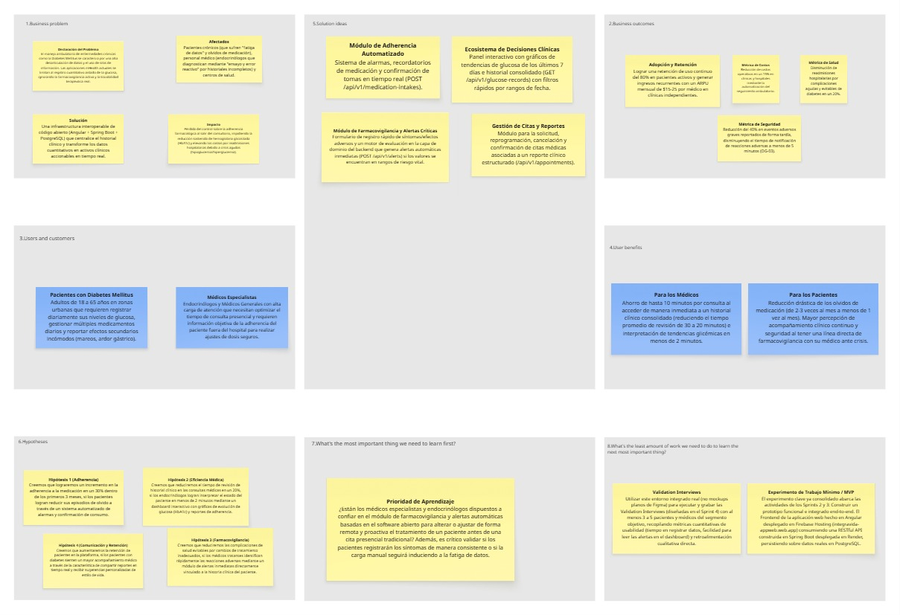
*Lean Ux Canvas realizado en Miro el link al board completo se encuentra en la seccion de anexos*

**Nota:** Se debe verificar que el canvas incluya explícitamente:
- **Problem Statement:** Redactado siguiendo el patrón Lean UX (problema, afectados, impacto, solución).
- **Business Outcomes:** Reducción de costos operativos, mejora de adherencia, disminución de readmisiones.
- **User Outcomes:** Ahorro de tiempo en consulta, reducción de olvidos de medicación, acompañamiento médico percibido.
- **Solutions (MVP):** Módulo de adherencia, dashboard médico, farmacovigilancia, registro de glucosa, agenda de citas.
- **Hypothesis:** Las 6 declaraciones formuladas en la sección 1.2.2.3.
- **What's the most important thing we need to learn first?** Validar si el módulo de farmacovigilancia y alertas es percibido como valor diferencial por los médicos.

## 1.3 Segmento Objetivo

El éxito de GlucoSmart radica en su capacidad para interconectar a los actores principales del ecosistema de salud. Por ello, se han identificado dos segmentos objetivos primarios y uno secundario, definidos a partir de los hallazgos en las entrevistas y el análisis del dominio del problema.

#### 1.3.1 Segmento Primario 1: Pacientes con Diabetes Mellitus (Tipo 1 y 2)

Este segmento comprende a personas que requieren un control constante de sus niveles de glucosa y una gestión rigurosa de su medicación.

- **Perfil Demográfico:** Hombres y mujeres de 18 a 65 años, residentes en zonas urbanas con acceso a dispositivos móviles y conexión a internet.
- **Perfil Psicográfico:** Personas que buscan mayor autonomía en el manejo de su enfermedad, pero que experimentan frustración por el olvido de dosis o la falta de interpretación de sus datos clínicos.
- **Necesidades Críticas:** * Automatización de recordatorios de medicación para mejorar la adherencia.
    
    - Visualización clara (gráficos) de sus niveles de glucosa y hemoglobina glicosilada (HbA1c).
    - Un canal para reportar efectos adversos (farmacovigilancia) y recibir retroalimentación médica.
    - Consejos personalizados sobre nutrición y manejo del estrés.

#### 1.3.2 Segmento Primario 2: Médicos Especialistas y Personal de Salud

Este segmento incluye a endocrinólogos, médicos generales y personal de enfermería encargados del seguimiento de pacientes crónicos.

- **Perfil Profesional:** Médicos de clínicas privadas y hospitales que atienden una alta carga de pacientes con diabetes mensualmente (como el caso del Dr. Walter Gómez, con 40 años de experiencia).
- **Necesidades Críticas:**
    
    - Acceso a una historia clínica centralizada y actualizada en tiempo real.
    - Herramientas de análisis de tendencias para optimizar el tiempo de consulta.
    - Sistemas de alertas tempranas ante crisis de hipoglucemia o hiperglucemia para prevenir daños orgánicos.
    - Registro estructurado de reacciones adversas a medicamentos para ajustar tratamientos de forma segura

# Capitulo II: Requirements Elicitation & Analysis
## 2.1 Competidores

Para comprender el posicionamiento de **GlucoSmart** en el mercado de la salud digital, se ha realizado un análisis competitivo identificando a los principales actores actuales que ofrecen soluciones para el manejo de la diabetes y la integración de datos de salud. A continuación, se detallan los principales competidores directos e indirectos:

#### 1. mySugr

- **Descripción:** Es una de las aplicaciones líderes a nivel mundial para el control de la diabetes. Permite a los pacientes registrar sus niveles de glucosa en sangre, comidas, medicación y actividad física.
- **Fortalezas:** Cuenta con un alto nivel de usabilidad, gamificación para motivar al paciente, y una calculadora de bolos de insulina muy precisa. Además, permite generar informes en PDF o Excel para ser compartidos con los médicos.
- **Debilidades (Oportunidad para GlucoSmart):** mySugr está orientada principalmente al paciente de forma individual. Carece de un entorno o _dashboard_ integral a nivel hospitalario que consolide historiales médicos masivos, y no cuenta con un módulo de farmacovigilancia automatizado para alertar a los médicos sobre reacciones adversas a medicamentos específicos.

#### 2. SocialDiabetes

- **Descripción:** Es una plataforma de origen español orientada al control de la diabetes tipo 1 y 2. Destaca por tener la certificación de dispositivo médico (CE) y busca conectar la información del paciente con el personal sanitario.
- **Fortalezas:** Permite sincronizar datos directamente con múltiples glucómetros y monitores continuos de glucosa (MCG). Ofrece una interfaz tanto para el paciente como para el profesional de la salud, permitiendo ajustes en el tratamiento de manera remota.
- **Debilidades (Oportunidad para GlucoSmart):** Su enfoque es predominantemente insulinodependiente. Además, algunas de las funcionalidades más importantes para las clínicas y la conexión en tiempo real están reservadas para planes corporativos de muy alto costo, lo que dificulta su adopción en clínicas emergentes o de presupuesto moderado.

#### 3. Glucose Buddy

- **Descripción:** Aplicación de registro de salud centrada en el paciente que permite el seguimiento del azúcar en la sangre, los medicamentos administrados, los resultados del laboratorio (como la HbA1c) y la presión arterial.
- **Fortalezas:** Posee una curva de aprendizaje corta y un sistema de recordatorios muy eficiente para que los usuarios no olviden registrar sus datos diarios ni tomar su medicación.
- **Debilidades (Oportunidad para GlucoSmart):** Funciona como un diario electrónico personal y no como una base de datos relacional médica. No facilita una comunicación bidireccional ágil con el médico tratante, y la gestión de dietas o el reporte de efectos adversos está muy limitado, dejando de lado el seguimiento clínico integral.

#### Ventaja Competitiva de GlucoSmart (IntegraVida)

A diferencia de los competidores mencionados, que actúan principalmente como diarios digitales o herramientas aisladas para el usuario final, **GlucoSmart** se posiciona como una solución integral _B2B2C_. Nuestra plataforma destaca por su robusta arquitectura de base de datos relacional orientada no solo al registro, sino al **control de la adherencia** y a la **farmacovigilancia**. Al proporcionar a los hospitales y consultorios un historial clínico centralizado y alertas inmediatas ante reacciones adversas, GlucoSmart empodera la toma de decisiones clínicas y garantiza la seguridad del paciente de manera más efectiva que las aplicaciones convencionales.
### 2.1.1 Analisis Competitivo

| **Perfil**                   | **Su Startup: IntegraVida (GlucoSmart)**                                                  | **Competidor 1: mySugr**                                                       | **Competidor 2: SocialDiabetes**                                                | **Competidor 3: Glucose Buddy**                                    |
| ---------------------------- | ----------------------------------------------------------------------------------------- | ------------------------------------------------------------------------------ | ------------------------------------------------------------------------------- | ------------------------------------------------------------------ |
| **Logo / Nombre**            | **IntegraVida**                                                                           | **mySugr**                                                                     | **SocialDiabetes**                                                              | **Glucose Buddy**                                                  |
| **Overview**                 | Plataforma integral B2B2C para el monitoreo de diabetes con enfoque en farmacovigilancia. | Aplicación móvil enfocada en el registro diario y gamificación para pacientes. | Plataforma certificada para la interconexión de dispositivos y ajuste de dosis. | Diario digital para el seguimiento de métricas de glucosa y dieta. |
| **Ventaja Competitiva**      | Centralización de historial clínico para médicos y alertas de reacciones adversas.        | Interfaz altamente intuitiva y "monstruo" de diabetes para gamificación.       | Alta compatibilidad con hardware (glucómetros y bombas) y certificación CE.     | Simplicidad de uso y amplia base de datos de alimentos.            |
| **Mercado Objetivo**         | Clínicas, hospitales, endocrinólogos y pacientes crónicos.                                | Pacientes con diabetes tipo 1 y 2 que buscan autogestión.                      | Usuarios avanzados que requieren sincronización con dispositivos médicos.       | Usuarios que buscan un registro manual sencillo y gratuito.        |
| **Estrategias de Marketing** | Venta directa a instituciones de salud y marketing de contenidos médicos.                 | Alianzas con farmacéuticas (Roche) y posicionamiento en App Stores.            | Enfoque en certificaciones médicas y prescripción por profesionales.            | Modelo Freemium con publicidad y presencia orgánica en móviles.    |
| **Productos & Servicios**    | Dashboard médico, App para pacientes, Módulo de Farmacovigilancia.                        | Diario de azúcar, Calculadora de bolos, Reportes médicos.                      | Registro de carbohidratos, Conector en la nube, Telemedicina.                   | Diario de glucosa, seguimiento de presión arterial y peso.         |
| **Precios & Costos**         | Modelo SaaS por suscripción institucional o premium para pacientes.                       | Gratis (Básico) / Suscripción Pro (SaaS).                                      | Suscripción mensual/anual para funciones premium.                               | Gratuito con anuncios / Versión Premium sin anuncios.              |
| **Canales de Distribución**  | Web (Panel Médico) y Móvil (Paciente).                                                    | Principalmente Móvil (iOS/Android).                                            | Web y Móvil.                                                                    | Móvil (iOS/Android).                                               |
#### Análisis SWOT (FODA)

**1. IntegraVida (Su Startup)**

- **Fortalezas:** Base de datos relacional robusta, enfoque único en farmacovigilancia, interoperabilidad médico-paciente.
- **Debilidades:** Marca nueva en el mercado, dependencia de la adopción por parte de instituciones médicas.
- **Oportunidades:** Creciente digitalización del sector salud en la región, falta de herramientas que consoliden reacciones adversas.
- **Amenazas:** Regulaciones gubernamentales estrictas sobre datos de salud (Ley de Protección de Datos Personales).

**2. mySugr**

- **Fortalezas:** Gran base de usuarios, respaldo de Roche, excelente experiencia de usuario (UX).
- **Debilidades:** Poca profundidad en el análisis de farmacovigilancia para el médico.
- **Oportunidades:** Expansión a mercados emergentes.
- **Amenazas:** Nuevas aplicaciones con IA que automaticen el registro sin intervención del usuario.

**3. SocialDiabetes**

- **Fortalezas:** Certificaciones sanitarias europeas, conectividad con hardware médico.
- **Debilidades:** Costo elevado para integración en clínicas pequeñas.
- **Oportunidades:** Alianzas con sistemas de salud pública.
- **Amenazas:** Competencia directa de fabricantes de glucómetros que lanzan sus propias apps.

**4. Glucose Buddy**

- **Fortalezas:** Facilidad de uso, marca establecida desde los inicios de las App Stores.
- **Debilidades:** Funcionalidades limitadas para el seguimiento médico profesional.
- **Oportunidades:** Mejora de su plataforma web para telemedicina.
- **Amenazas:** Pérdida de usuarios que migran a apps más especializadas o gamificadas.
### 2.1.2 Estrategia y tácticas frente a competidores

Para asegurar la penetración en el mercado de **IntegraVida** frente a los competidores analizados, se plantean las siguientes estrategias:

1. **Diferenciación Técnica (Frente a mySugr y Glucose Buddy):**
    
    - Mientras los competidores se centran en el "diario del paciente", nuestra táctica será el **"Ecosistema de Decisiones Clínicas"**. Implementaremos reportes automáticos de farmacovigilancia que los competidores no poseen, permitiendo que el médico identifique si un síntoma es una reacción adversa al medicamento, algo que las apps de registro manual ignoran.
    
2. **Estrategia de Alianzas Institucionales (Frente a SocialDiabetes):**
    
    - En lugar de competir solo por el usuario final, IntegraVida buscará convenios con clínicas locales para que el uso de **GlucoSmart** sea el estándar de seguimiento en sus consultas. La táctica incluye ofrecer un "Dashboard de Gestión" gratuito para el médico por cada _N_ pacientes referidos, facilitando la adopción tecnológica en centros de salud.
    
3. **Táctica de Contenido y Confianza:**
    
    - Publicaremos casos de estudio sobre cómo la centralización de datos en una base de datos relacional (nuestra arquitectura) reduce errores en la prescripción, atacando la debilidad de las aplicaciones "diario" que mantienen la información aislada del flujo de trabajo del doctor.
    
4. **Optimización de Canales:**
    
    - A diferencia de mySugr, que es casi 100% móvil, fortaleceremos nuestra **plataforma Web** con visualizaciones de datos complejas (gráficos de tendencia de HbA1c), orientadas específicamente a la pantalla del consultorio médico, mejorando la experiencia de revisión en la cita presencial o virtual.

## 2.2 Entrevistas

### 2.2.1 Diseño de entrevistas

Segmento 1: Pacientes con Diabetes 

1. ¿Cómo describes tu experiencia diaria gestionando su diabetes con las herramientas o apps que usa actualmente?.
2. ¿Ha sentido alguna vez "fatiga de datos" o agotamiento por tener que registrar manualmente sus niveles de glucosa constantemente?  
3. ¿Qué tan difícil le resulta mantener el control y la adherencia a sus medicamentos cuando se encuentra fuera del consultorio o centro médico?  
4. ¿Siente que las apps actuales le brindan alertas preventivas realmente útiles antes de sufrir una crisis o descompensación?  
5. ¿Alguna vez ha ignorado notificaciones de salud por considerarlas poco relevantes para su situación específica?  
6. ¿Le resultaría valioso que sus registros de glucosa se cruzaran automáticamente con los horarios en que toma sus medicamentos?  
7. ¿Qué opina de la posibilidad de que su médico pueda visualizar sus datos en tiempo real sin esperar a su próxima cita presencial? 
8. ¿Estaría dispuesto a usar nuestra nueva app que garantice la transparencia y la seguridad de su información médica?  
9. ¿Cómo cree que mejoraría su calidad de vida si tuviera una visión completa de su tratamiento (dieta, medicamentos, glucosa) en una sola aplicación?  
10. Al conocer la propuesta de GlucoSmart, ¿qué función le parece que resolvería mejor sus problemas diarios?  
11. ¿Qué otras funciones no anunciadas en la propuesta de la app le gustaría agregar y cómo le resultaría de uso importante?  
12. ¿Estaría dispuesto a usar GlucoSmart como su herramienta principal de gestión de glucosa si estuviera disponible hoy mismo? 

Segmento 2: Doctores 

1. ¿Qué tan complicado le resulta a usted realizar ajustes terapéuticos precisos utilizando solo los datos manuales que el paciente trae a consulta? 
2. ¿Considera que los actuales silos de información en salud dificultan obtener una visión más precisa de la condición de sus pacientes? 
3. ¿Cómo afecta a su diagnóstico el hecho de recibir datos recolectados de forma asíncrona y sin un contexto clínico real? 
4. ¿Ha sentido que su tratamiento a veces se basa en realizar ensayo y error debido a la falta de trazabilidad del paciente? 
5. ¿Qué importancia le asigna a la brecha existente entre lo que usted recomienda a sus pacientes y lo que el paciente realmente consume en su periodo ambulatorio? 
6. ¿Cree que una app o plataforma facilitaría la integración de datos entre diferentes instituciones de salud? 
7. ¿Qué valor le daría a contar con herramientas de analítica de datos en tiempo real para apoyar su toma de decisiones clínicas? 
8. ¿De qué manera una app podría mejorar la precisión en el seguimiento de enfermedades crónicas que suelen considerarse complejas? 
9. ¿Le interesaría una plataforma que conecte directamente el sistema de farmacovigilancia con las variaciones glicémicas del paciente? 
10. ¿Cómo evaluaría una solución digital cuyo diseño esté estrictamente anclado a los protocolos clínicos del mundo real? 
11. ¿Considera que acceder a datos accionables en tiempo real ayudaría a reducir las complicaciones severas y los costos operativos en salud? 
12. ¿Integraría GlucoSmart en su flujo de trabajo clínico si esto le permitiera cerrar el ciclo terapéutico de manera proactiva?
### 2.2.2 Registro de entrevista

- Entrevista a Pacientes con Diabetes (Segmento 1)
	
	Nombre: Jorge
	Apellidos: Quispe 
	Edad: 19 años
	Distrito: San Miguel
	
	
	
	[Entrevista_a_Paciente01.mp4](https://youtu.be/siAso9B_aSc)
	
	- Resumen de la entrevista a Paciente
	
	La entrevista fue realizada a Jorge Quispe, de 19 años y residente de San Miguel, quien fue diagnosticado con diabetes tipo 2 hace aproximadamente 7 u 8 años.
	
	Control de Glucosa y Medicación:
	
	- Medición: Mide sus niveles de glucosa diariamente, por las mañanas, utilizando un glucómetro.
	- Episodios: En el último mes, experimentó dos episodios de hiperglucemia.
	- Medicamentos: Actualmente utiliza metformina y glibenclamida.
	- Adherencia: Ocasionalmente olvida o retrasa una dosis, lo que ocurre aproximadamente una o dos veces al mes.
	- Efectos Secundarios: Ha experimentado efectos secundarios leves, como mareos.
	
	Hábitos y Estilo de Vida:
	
	- Actividad Física: Realiza actividad física tres veces por semana, saliendo a caminar y a andar en bicicleta.
	- Alimentación: Sigue una dieta con restricción de azúcares y frituras.
	- Factores Adicionales: El estrés afecta sus niveles de glucosa, causando un aumento.
	
	Uso de Tecnología y Apoyo Digital:
	
	- Recordatorios: Le gustaría recibir recordatorios para la toma de medicamentos.
	- Visualización de Datos: Le parece útil ver gráficos de la evolución de su glucosa para monitorear su salud.
	- Recomendaciones: Le gustaría que una aplicación le sugiera recetas y recomendaciones personalizadas.
	- Compartir Datos: Estaría dispuesto a compartir sus datos de salud con su médico a través de una aplicación para facilitar las consultas.
	
	Sugerencia de Valor Añadido: Propone la adición de un chat en la aplicación con profesionales (nutricionistas o doctores) para resolver dudas rápidas, lo que le brindaría mayor confianza.

- Entrevista a Pacientes con Diabetes (Segmento 1)
    
    Nombre: Virgilia
    Apellidos: Velasque Huarcalla
	Edad: 49 años
	
	
	
	Distrito: callao
	[Entrevista a paciente 02.mp4](https://youtu.be/RhP6C_cGmqs)
	
	- Resumen de la entrevista a Paciente
    
	La entrevista fue realizada a Virgilia Velasque, de 49 años y residente del Callao, quien fue diagnosticada con diabetes tipo 2 hace aproximadamente 15 años.
	
	Control de Glucosa y Medicación:
	
	- Medición: Mide sus niveles de glucosa cada 2-3 meses, dependiendo de cómo se siente, utilizando un glucómetro en postas o farmacias.
	- Episodios: A lo largo de 15 años ha tenido dos episodios de hipoglucemia.
	- Medicamentos: Uso metformina durante 10 años; desde hace 6 meses cambio a otra medicación.
	- Adherencia: En los primeros años tomaba tratamiento de forma desordenada, pero desde hace 6 años cumple al pie de la letra las indicaciones de su médico.
	- Efectos Secundarios: Con la metformina tuvo ardor gástrico; con la nueva medicación presentó maremotos leves, que con el tiempo disminuyeron por la adaptación de su propio cuerpo.
	
	Hábitos y Estilo de Vida:
	
	- Actividad Física: Hace 6 años realizaba ejercicio con el peso corporal y desde hace 1 año y medio entrena con pesas, principalmente para controlar sus niveles de estrés.
	- Alimentación: Su dieta se basa en un mayor consumo de proteínas y verduras, con baja ingesta de carbohidratos; solo en raras ocasiones consume grandes cantidades de estos
	- Factores Adicionales: El estrés afecta directamente sus niveles de glucosa, generando descompensaciones y falta de sueño.
	
	Uso de Tecnología y Apoyo Digital:
	
	- Recordatorios: Considera muy útil recibir alarmas o recordatorios que le ayuden a no olvidar la toma de sus medicamentos.
	- Visualización de Datos: Le interesa contar con gráficos que muestran cómo evoluciona o se dispara su glucosa a lo largo del tiempo.
	- Recomendaciones:Le gustaría recibir sugerencias personalizadas relacionadas con su tratamiento, principalmente enfocadas en alarmas para recordar la medicación.
	- Compartir Datos: Vería beneficioso poder compartir sus registros directamente con el médico a través de la aplicación, especialmente en citas virtuales personalizadas.
	- Sugerencia de Valor Añadido: Destaca la importancia de contar con citas virtuales enfocadas en el paciente, pues le dan mayor confianza y apoyo en su control.

- Entrevista a Pacientes con Diabetes (Segmento 1)
	
	Nombre: Andy Jermy Ascalla Venancio
	Edad: 18
	Distrito: San Martin de Porres
	
	
	
	[Entrevista a paciente 03.mp4](https://youtu.be/rn8sOZuT5MM)
	
	Resumen de la entrevista a Paciente
	
	La entrevista fue realizada a Andy Jermy Ascalla Venancio, de 18 años y residente de San Miguel, quien fue diagnosticado con diabetes tipo 1 hace aproximadamente 5  años.
	
	Control de Glucosa y Medicación:
	
	- Medición: Mide sus niveles de glucosa diariamente, por las mañanas, utilizando un glucómetro.
	- Episodios: En el último mes, experimentó dos episodios de hiperglucemia.
	- Medicamentos: Actualmente utiliza metformina y glibenclamida.
	- Adherencia: Ocasionalmente olvida o retrasa una dosis, lo que ocurre aproximadamente una o dos veces al mes.
	- Efectos Secundarios: Ha experimentado efectos secundarios leves, como mareos.
	
	Hábitos y Estilo de Vida:
	
	- Actividad Física: Realiza actividad física tres veces por semana, saliendo a caminar y a andar en bicicleta.
	- Alimentación: Sigue una dieta con restricción de azúcares y frituras.
	- Factores Adicionales: El estrés afecta sus niveles de glucosa, causando un aumento.
	
	Uso de Tecnología y Apoyo Digital:
	
	- Recordatorios: Le gustaría recibir recordatorios para la toma de medicamentos.
	- Visualización de Datos: Le parece útil ver gráficos de la evolución de su glucosa para monitorear su salud.
	- Recomendaciones: Le gustaría que una aplicación le sugiera recetas y recomendaciones personalizadas.
	- Compartir Datos: Estaría dispuesto a compartir sus datos de salud con su médico a través de una aplicación para facilitar las consultas.

- Entrevista a medicos (Segmento 2
	
	Nombre: Walter
	Apellidos: Gomez Navarro
	Edad: 70 años
	Distrito: La Molina
	
	
	
	[Entrevista a medico 01.mp4](https://youtu.be/O9gIC_WXCfg)
	
	- Resumen de la entrevista a Paciente
	
	La entrevista se realizó con Walter Gómez Navarro (70), médico con 40 años de experiencia. Destaca la hemoglobina glicosilada como clave en el control de la diabetes, señala problemas de adherencia al tratamiento y considera muy útiles los gráficos y alertas en tiempo real para prevenir riesgos.
	
	Manejo de la diabetes: 
	
	- Pacientes atendidos: 5 pacientes diabéticos mensuales
	- Monitoreo de glucosa: Revisión cada 3 meses.
	- Métodos: Benedict (menos preciso) y hemoglobina glicosilada (HbA1c), considerado el estándar internacional, porque refleja el promedio de glucosa de los últimos 3 meses.
	- Indicadores clave: HbA1c por debajo de 7 indica buen control; por encima, diabetes mal controlada.
	- Registro: Historia clínica como unidad central, complementada con bases de datos personales y hojas Excel.
	
	Tratamiento y adherencia:
	
	- Adherencia: Problema frecuente, muchos pacientes olvidan la medicación.. Un olvido aislado no es grave, pero múltiples omisiones desencadenan riesgo de hiperglucemia, coma diabético y estado premortem.
	- Ajustes de tratamiento: Según evolución del paciente. Dificultad: los pacientes no cumplen dietas y fallan los hipoglucemiantes orales.
	- Efectos adversos: Considera muy importante registrarlos. 
	
	Uso de Tecnología y Apoyo Digital:
	
	- Dispositivos: Recomienda glucómetros de punción digital.
	- Datos en gráficos: Considera que ver tendencias gráficas de glucosa es muy útil para entender la evolución del paciente rápidamente. Incluso lo ve como indicador de calidad en la práctica médica.
	- Alertas inmediatas: Considera esencial recibir avisos de hipoglucemia para la prevención de daños cerebrales, cardíacos, hepáticos y renales, además de riesgo de muerte.

### 2.2.3 Analisis de entrevista

Tras el procesamiento de las entrevistas realizadas a los segmentos de pacientes y al médico especialista (Dr. Walter Gómez), se han identificado patrones críticos que justifican la arquitectura y funcionalidades de **GlucoSmart**. El análisis se divide en los siguientes hallazgos clave, los cuales son la base directa para las Historias de Usuario de nuestro Product Backlog:

1. **Deficiencia en la Adherencia y Necesidad de Automatización:** Los pacientes jóvenes (Jorge y Andy, 18-19 años) reportan olvidos mensuales de medicación, mientras que Virgilia (49 años) destaca la importancia de las alarmas. El Dr. Gómez advierte que estos olvidos "aislados" incrementan el riesgo de coma diabético. Esto valida la prioridad alta de un **sistema automatizado de recordatorios**.
2. **Monitoreo Basado en Evidencia y Tendencias:** El Dr. Gómez señala que la revisión cada 3 meses debe basarse en la hemoglobina glicosilada (HbA1c) y tendencias gráficas, ya que son indicadores de calidad. Los tres pacientes entrevistados solicitaron ver su evolución visualmente en lugar de datos aislados. Esto justifica la creación de un **Dashboard de Tendencias** interactivo.
3. **Gestión de Seguridad del Paciente: Farmacovigilancia:** Se identificaron efectos secundarios reales: ardor gástrico en Virgilia y mareos en Jorge. El Dr. Gómez califica como "esencial" recibir alertas inmediatas de hipoglucemia para prevenir daños cerebrales o muerte. Estos hallazgos fundamentan el **Registro de Efectos Adversos** y el **Sistema de Alertas Críticas** en tiempo real.
4. **Colaboración y Telemedicina:** Los pacientes expresaron su total disposición a compartir datos para facilitar consultas virtuales (especialmente Virgilia y Jorge). Jorge propuso un chat directo con profesionales para resolver dudas rápidas, lo que incrementaría su confianza. Esto da soporte al **Módulo de Compartición de Datos** y al **Chat de Consultas**.
5. **Educación y Factores Externos:** El análisis reveló que el estrés afecta directamente los niveles de glucosa de todos los pacientes. Jorge y Andy solicitaron recetas y recomendaciones personalizadas. Esto justifica la inclusión de **Sugerencias de Estilo de Vida** para un manejo integral de la enfermedad.
## 2.3 Needfinding

### 2.3.1 User Personas

A partir del análisis de las entrevistas realizadas a los segmentos objetivo (pacientes con diabetes y médicos especialistas), así como del estudio competitivo de aplicaciones existentes en el mercado (mySugr, SocialDiabetes, Glucose Buddy), se construyeron dos User Personas que representan a los actores principales del ecosistema de GlucoSmart. Estas personas sintetizan los patrones de comportamiento, necesidades, frustraciones y objetivos identificados en la investigación, permitiendo al equipo de desarrollo mantener un enfoque centrado en el usuario durante todo el ciclo de diseño e implementación.

User Persona Segmento 1 — Paciente con Diabetes:

User Persona Segmento 2 — Médico Especialista:

### 2.3.2 User Task Matrix

La siguiente matriz presenta las tareas que los usuarios de cada segmento objetivo (pacientes con diabetes y médicos especialistas) realizan actualmente **sin la intervención de GlucoSmart (situación AS-IS)**. El análisis se centra en describir cómo ejecutan estas tareas hoy en día —con métodos manuales, herramientas genéricas o aplicaciones fragmentadas—, qué dificultades enfrentan y con qué frecuencia las realizan. Esta línea base permite identificar los puntos de dolor que GlucoSmart resolverá, y servirá como referencia para medir la mejora en la situación TO-BE.

#### Segmento 1: Pacientes con Diabetes (AS-IS)

| Tarea (AS-IS)                          | Descripción de la situación actual                                                                 | Herramienta actual       | Frecuencia             | Dificultad                                 |
| --------------------------------------- | -------------------------------------------------------------------------------------------------- | ------------------------ | ---------------------- | ------------------------------------------ |
| Medición de glucosa                     | Se pincha el dedo con un glucómetro manual y anota el valor en una libreta o en una app genérica. | Glucómetro + libreta/app | Diaria (mañanas)       | Alta: olvida registrar, pierde la libreta |
| Toma de medicación                      | Toma la medicación según su memoria o blister, sin registro de confirmación.                       | Blister / Caja de pastillas | Diaria (según receta)  | Alta: olvidos frecuentes (1-2/mes)        |
| Reporte de síntomas o efectos adversos  | Solo lo comenta verbalmente en la próxima consulta médica; no hay registro inmediato.             | Memoria / Papel          | Ocasional (evento)     | Alta: puede olvidar detalles               |
| Seguimiento de citas médicas            | Anota la cita en una agenda física o en el calendario del celular.                                | Agenda / Google Calendar | Mensual / Trimestral   | Media: a veces olvida o confunde la fecha  |
| Comunicación con el médico entre citas | No existe; debe esperar a la próxima consulta para resolver dudas.                                 | Teléfono / WhatsApp      | Solo en emergencias    | Muy alta: sin canal formal                 |
| Control de dieta y ejercicio            | Lleva un registro mental o en notas sueltas; no hay correlación con los niveles de glucosa.       | Memoria / Notas sueltas  | Diaria / Semanal       | Alta: falta de organización                |

#### Segmento 2: Médicos Especialistas (AS-IS)

| Tarea (AS-IS)                                  | Descripción de la situación actual                                                                 | Herramienta actual       | Frecuencia             | Dificultad                                 |
| ---------------------------------------------- | -------------------------------------------------------------------------------------------------- | ------------------------ | ---------------------- | ------------------------------------------ |
| Revisión de historial clínico del paciente      | El paciente trae una libreta o papeles sueltos; el médico debe interpretar datos desordenados.     | Historia clínica física / Excel | Cada consulta (trimestral) | Alta: pierde tiempo, datos incompletos      |
| Evaluación de adherencia al tratamiento        | Pregunta verbalmente al paciente si tomó sus medicamentos; no hay forma de verificarlo.           | Historia clínica / Pregunta oral | Cada consulta         | Alta: información poco confiable            |
| Identificación de efectos adversos             | Solo se entera si el paciente lo menciona; no hay registro sistemático.                           | Pregunta oral            | Ocasional             | Muy alta: puede pasar desapercibido         |
| Ajuste de tratamiento                          | Basado en la información fragmentada que el paciente recuerda y en la HbA1c de laboratorio.        | Historia clínica + laboratorio | Trimestral             | Media: decisiones con datos incompletos     |
| Gestión de agenda de citas                     | Coordina citas por teléfono o con secretaria; registro en agenda física o Excel.                  | Agenda / Excel           | Diaria                | Media: requiere llamadas y coordinación     |
| Generación de reportes clínicos                | Los reportes se elaboran manualmente durante la consulta o después, sin plantillas estandarizadas. | Word / Historia clínica | Cada consulta         | Alta: consume tiempo de consulta           |
### 2.3.3 User Journey Mapping

El siguiente User Journey Mapping representa la experiencia actual del paciente con diabetes **en la situación AS-IS**, es decir, cómo vive el proceso de gestión de su enfermedad **sin la intervención de GlucoSmart**. El recorrido abarca desde el diagnóstico inicial hasta la consulta de seguimiento, evidenciando los puntos de fricción, las emociones negativas y las oportunidades de mejora que nuestra plataforma busca resolver. Este mapa se construyó a partir de los testimonios recogidos en las entrevistas a pacientes (Jorge, Virgilia y Andy) y al médico especialista (Dr. Walter Gómez).

#### User Journey — Situación AS-IS (Paciente con Diabetes)

| **Etapa**          | **Diagnóstico**                                    | **Vida Diaria**                                          | **Crisis / Síntoma**                                    | **Pre-Consulta**                                         | **Consulta Médica**                                        | **Post-Consulta**                                     |
| ------------------ | --------------------------------------------------- | -------------------------------------------------------- | ------------------------------------------------------- | -------------------------------------------------------- | ---------------------------------------------------------- | ----------------------------------------------------- |
| **Acciones**       | Recibe el diagnóstico de diabetes; le recetan medicación y le indican controles. | Toma medicación de memoria; mide glucosa cuando recuerda; anota en libreta. | Siente mareo o malestar; no sabe si es efecto adverso; espera a la consulta. | Busca la libreta con anotaciones; intenta recordar eventos importantes. | Lleva papeles sueltos al consultorio; el médico revisa datos desordenados. | Olvida las indicaciones del médico; retoma la rutina sin cambios. |
| **Pensamientos**   | "¿Cómo voy a controlar esto toda mi vida?"          | "Ojalá tuviera un recordatorio, a veces se me pasa la dosis." | "¿Será normal esto o es grave? No quiero molestar al doctor." | "Espero no haber olvidado nada importante."               | "Ojalá el doctor pudiera ver mis datos de todo el mes."      | "Ya me explicó, pero no recuerdo todo lo que dijo."   |
| **Emociones**      | Miedo / Incertidumbre                               | Frustración / Cansancio (fatiga de datos)                | Preocupación / Soledad                                  | Ansiedad / Estrés                                         | Vergüenza (datos incompletos) / Esperanza                   | Confusión / Desmotivación                             |
| **Puntos de dolor** | Falta de orientación digital sobre la enfermedad.  | Olvidos frecuentes de medicación; registro inconsistente. | No hay canal para reportar síntomas en el momento.      | Datos dispersos y difíciles de organizar.                | Pérdida de tiempo revisando apuntes desordenados.          | Baja adherencia a las recomendaciones post-consulta.  |
| **Oportunidades**  | Tutorial interactivo de onboarding al diagnóstico. | Recordatorios automatizados + gamificación.              | Botón de reporte rápido de efectos adversos + alerta al médico. | Generación automática de resumen clínico.                | Dashboard con gráficos de tendencias y adherencia.         | Resumen digital de la consulta + plan personalizado.  |

### 2.3.4 Empathy Mapping

Los mapas de empatía permiten profundizar en la comprensión del estado emocional y cognitivo de cada segmento de usuario, complementando la información de las User Personas con una vista de qué piensan, sienten, ven, oyen, dicen y hacen los actores en su contexto actual (AS-IS). A continuación se presentan los mapas de empatía para ambos segmentos objetivo, construidos a partir de las entrevistas realizadas y el análisis de la competencia.

#### Mapa de Empatía — Segmento 1: Paciente con Diabetes

**Interpretación del mapa:** El paciente con diabetes experimenta una mezcla de frustración por la carga manual del registro diario y preocupación por no saber si sus síntomas son normales. Su entorno (familia, médico) le recomienda llevar un control, pero las herramientas actuales no le facilitan la tarea. Desea sentirse acompañado y tener claridad sobre su evolución, pero la fatiga de datos y la falta de recordatorios inteligentes lo llevan a abandonar los registros.

#### Mapa de Empatía — Segmento 2: Médico Especialista

**Interpretación del mapa:** El médico valora la precisión de los datos clínicos pero recibe información fragmentada y desordenada del paciente. Sabe que la adherencia al tratamiento es el factor más crítico, pero no tiene herramientas para medirla objetivamente. Escucha de sus pacientes las mismas excusas ("se me olvidó", "no tuve tiempo") y desea contar con un sistema que le muestre la realidad del cumplimiento terapéutico para poder ajustar tratamientos con evidencia concreta.
## 2.4 Big Picture Event Storming

*Big Picture Event Storming realizado en Miro el link al board completo se encuentra en la seccion de anexos*

El análisis de _Big Picture Event Storming_ se ha realizado con el objetivo de comprender la complejidad del dominio de la gestión de la diabetes y la farmacovigilancia. Esta dinámica nos permitió visualizar cronológicamente cómo interactúan los pacientes, los médicos y el sistema a lo largo del proceso de tratamiento.

Para este análisis se ha definido la siguiente leyenda estándar de Event Storming:

- **Domain Events (Naranja):** Hechos inmutables que ocurren en el dominio, expresados en tiempo pasado (Ej. "Glucosa Registrada", "Alerta Generada", "Tratamiento Ajustado").
- **Commands (Azul):** Intenciones o acciones ejecutadas por un actor que disparan un Domain Event (Ej. "Registrar Glucosa", "Confirmar Dosis").
- **Aggregates (Amarillo):** Entidades del dominio alrededor de las cuales ocurren los eventos (Ej. "Patient", "GlucoseRecord", "Alert").
- **Policies / Business Rules (Púrpura):** Reglas de negocio que reaccionan automáticamente a un Domain Event para disparar otro comando (Ej. "Si glucosa > 180 mg/dL, generar alerta").
- **Read Models (Verde):** La información que un actor visualiza para tomar decisiones (Ej. "Dashboard de Tendencias", "Historial de Farmacovigilancia").
- **External Systems (Rosado):** Sistemas de terceros con los que el dominio interactúa (Ej. "Servicio de Notificaciones Push").
- **Actors (Amarillo claro):** Personas o roles que ejecutan comandos (Paciente, Médico, Sistema).

#### Flujo Cronológico del Dominio (GlucoSmart)

El flujo del negocio se ha dividido en cuatro fases principales, basadas en las necesidades identificadas en las entrevistas de validación:

**Fase 1: Configuración Inicial y Vinculación**

- **Actor:** Paciente / Médico.
    
- **Comando:** Crear cuenta de usuario $\rightarrow$ **Evento:** Cuenta Creada.
    
- **Comando:** Configurar plan de medicación $\rightarrow$ **Evento:** Plan de Medicación Establecido.
    
- **Comando:** Generar código de acceso clínico $\rightarrow$ **Evento:** Código de Acceso Generado.
    
- **Comando:** Ingresar código de paciente $\rightarrow$ **Evento:** Paciente Vinculado al Médico.
    

**Fase 2: Monitoreo Diario y Adherencia (Prevención de Olvidos)**

- **Actor:** Sistema Automatizado.
- **Comando:** Evaluar horario de medicación $\rightarrow$ **Evento:** Recordatorio Disparado.
- **Sistema Externo:** Servicio de Notificaciones Push notifica al usuario.
- **Actor:** Paciente.
- **Comando:** Confirmar ingesta de medicamento $\rightarrow$ **Evento:** Medicación Confirmada.
- **Comando:** Ingresar nivel de glucosa matutino $\rightarrow$ **Evento:** Medición de Glucosa Registrada.

**Fase 3: Farmacovigilancia y Gestión de Crisis**

- **Actor:** Paciente.
- **Modelo de Lectura:** Formulario de síntomas.
- **Comando:** Registrar reacción adversa (Ej. mareos/ardor) $\rightarrow$ **Evento:** Efecto Adverso Registrado.
- **Actor:** Sistema Automatizado.
- **Comando:** Evaluar umbral de riesgo clínico $\rightarrow$ **Evento:** Límite de Hipoglucemia Excedido.
- **Comando:** Generar alerta de riesgo $\rightarrow$ **Evento:** Alerta Crítica Generada.
- **Sistema Externo:** Servicio de Mensajería (Email/SMS) envía aviso al médico tratante.

**Fase 4: Consulta y Ajuste de Tratamiento**

- **Actor:** Médico (Ej. Dr. Gómez).
- **Modelo de Lectura:** Dashboard de Tendencias de HbA1c y Registro de Farmacovigilancia.
- **Comando:** Visualizar evolución trimestral $\rightarrow$ **Evento:** Historial Clínico Consultado.
- **Comando:** Modificar dosis o tipo de medicamento $\rightarrow$ **Evento:** Tratamiento Ajustado.
- **Actor:** Sistema Automatizado.
- **Comando:** Actualizar plan del paciente $\rightarrow$ **Evento:** Plan de Medicación Actualizado (Cierra el ciclo volviendo a la Fase 2).

#### Análisis de Puntos Críticos (Cuellos de Botella)

Durante el Event Storming, se identificaron dos áreas de fricción (representadas con notas adhesivas rojas en el diseño visual) que el software debe mitigar de forma prioritaria:

1. **Fricción en el Registro Manual:** La dependencia de que el paciente ingrese manualmente sus niveles de glucosa puede generar vacíos en la base de datos.
2. **Tiempo de Reacción ante Alertas:** La alerta crítica de hipoglucemia debe ser bidireccional; si el médico no está disponible de inmediato, el sistema debe proporcionar instrucciones de primeros auxilios básicas al paciente para mitigar el daño orgánico inmediato.
## 2.5 Ubiquitous Language

El lenguaje ubicuo del proyecto **GlucoSmart** define los términos clave que serán utilizados de manera consistente a lo largo del análisis, diseño e implementación del sistema. Este glosario permite que todos los integrantes del equipo compartan una misma comprensión del dominio de negocio relacionado con el monitoreo y control de la diabetes.

### Términos generales

**1. Platform (Plataforma):**  
Sistema digital de GlucoSmart que permite centralizar la información clínica del paciente y facilitar la interacción con el doctor.

**2. Patient (Paciente):**  
Persona con diabetes que utiliza la plataforma para registrar su información de salud, recibir seguimiento y controlar su tratamiento.

**3. Doctor (Doctor):**  
Profesional de salud encargado de revisar la información del paciente, brindar seguimiento médico y tomar decisiones clínicas.

**4. Diabetes Management (Gestión de la diabetes):**  
Proceso de control, seguimiento y tratamiento continuo de la diabetes mediante registros clínicos, monitoreo y atención médica.

**5. Clinical Information (Información clínica):**  
Conjunto de datos relacionados con el estado de salud del paciente, tales como niveles de glucosa, síntomas, medicamentos y observaciones médicas.

**6. Treatment (Tratamiento):**  
Plan médico definido para el paciente, que incluye medicamentos, indicaciones y controles necesarios para el manejo de la diabetes.

**7. Monitoring (Monitoreo):**  
Seguimiento continuo de los datos de salud del paciente registrados dentro de la plataforma.

**8. Clinical Record (Registro clínico):**  
Historial digital donde se almacena la información médica relevante del paciente para su consulta y seguimiento.

---

### Perfil de usuario – Paciente

**1. Glucose Level (Nivel de glucosa):**  
Valor registrado en la plataforma para representar la concentración de glucosa del paciente en sangre.

**2. Glucose Log (Registro de glucosa):**  
Historial de mediciones de glucosa ingresadas por el paciente para el control de su estado de salud.

**3. Medication (Medicamento):**  
Fármaco indicado al paciente para controlar la diabetes o tratar condiciones relacionadas.

**4. Medication Intake (Toma de medicación):**  
Acción de registrar el consumo de un medicamento en la plataforma.

**5. Symptom (Síntoma):**  
Malestar o señal física reportada por el paciente durante su tratamiento o seguimiento.

**6. Treatment Adherence (Adherencia al tratamiento):**  
Nivel de cumplimiento del paciente respecto a las indicaciones médicas, medicamentos y controles establecidos.

**7. Reminder (Recordatorio):**  
Notificación generada por el sistema para avisar al paciente sobre la toma de medicamentos, controles o citas médicas.

**8. Alert (Alerta):**  
Aviso emitido por la plataforma cuando se detecta una situación que requiere atención, como una medición fuera del rango esperado.

**9. Appointment (Cita médica):**  
Encuentro programado entre el paciente y el doctor para revisión, seguimiento o evaluación del tratamiento.

**10. Health History (Historial de salud):**  
Conjunto de registros del paciente relacionados con su evolución, controles, síntomas y tratamiento.

---

### Perfil de usuario – Doctor

**1. Clinical Review (Revisión clínica):**  
Proceso mediante el cual el doctor analiza la información registrada por el paciente en la plataforma.

**2. Diagnosis (Diagnóstico):**  
Determinación médica sobre la condición de salud del paciente a partir de su evaluación clínica.

**3. Prescription (Prescripción):**  
Indicación médica que define qué medicamentos debe tomar el paciente, en qué dosis y con qué frecuencia.

**4. Clinical Follow-up (Seguimiento clínico):**  
Supervisión periódica realizada por el doctor sobre el estado de salud y evolución del paciente.

**5. Therapeutic Adjustment (Ajuste terapéutico):**  
Modificación del tratamiento en función de la evolución clínica y los datos registrados en la plataforma.

**6. Medical Observation (Observación médica):**  
Comentario o anotación realizada por el doctor sobre el estado, avance o respuesta del paciente al tratamiento.

**7. Medical Decision (Decisión médica):**  
Acción clínica tomada por el doctor a partir de la información analizada en el sistema.

**8. Appointment Schedule (Agenda de citas):**  
Listado de citas médicas programadas que permite al doctor organizar su seguimiento con los pacientes.

---

### Gestión del tratamiento y seguimiento

**1. Dose (Dosis):**  
Cantidad específica de medicamento que el paciente debe consumir según la prescripción médica.

**2. Frequency (Frecuencia):**  
Número de veces o intervalo en el que el paciente debe tomar su medicación.

**3. Schedule (Horario):**  
Momento definido para la toma de medicamentos, controles o citas médicas.

**4. Medical Report (Reporte médico):**  
Resumen organizado de la información clínica del paciente en un periodo determinado.

**5. Traceability (Trazabilidad):**  
Capacidad del sistema para registrar y seguir la evolución del paciente y el cumplimiento de su tratamiento a lo largo del tiempo.

**6. Follow-up History (Historial de seguimiento):**  
Registro cronológico de revisiones, observaciones y cambios realizados durante el control médico del paciente.

---

### Alertas y control de riesgos

**1. Risk Alert (Alerta de riesgo):**  
Notificación emitida cuando el sistema detecta una posible situación peligrosa para la salud del paciente.

**2. Adverse Effect (Efecto adverso):**  
Reacción no deseada que puede presentarse en el paciente como consecuencia de un medicamento o tratamiento.

**3. Preventive Notification (Notificación preventiva):**  
Aviso generado para anticipar posibles complicaciones y promover una acción oportuna.

**4. Clinical Event (Evento clínico):**  
Situación relevante registrada en la plataforma, como una variación anormal de glucosa, un síntoma o un cambio en el tratamiento.

---

### Acceso a la plataforma

**1. Sign Up (Registro):**  
Proceso mediante el cual un usuario crea una cuenta en la plataforma GlucoSmart.

**2. Sign In (Inicio de sesión):**  
Acción de ingresar al sistema mediante credenciales para acceder a sus funcionalidades.

**3. User Account (Cuenta de usuario):**  
Perfil digital asociado a un paciente o doctor dentro de la plataforma.

**4. User Profile (Perfil de usuario):**  
Información personal y profesional registrada en el sistema según el tipo de usuario.

# Capitulo III: Requirements Specification

## 3.1 User Stories

En esta sección se presentan las épicas y las historias de usuario del proyecto **GlucoSmart**, alineadas con las necesidades funcionales de los principales actores del sistema: **pacientes** y **doctores**. Estas historias de usuario servirán como base para la priorización del backlog, el diseño del sistema y la planificación del desarrollo.

Los criterios de aceptacion de las historias se complementan con escenarios Given-When-Then que cubren el flujo principal, un flujo alternativo y un caso de error o validacion.

### Epics

| Epic ID | Título                               | Descripción                                                                                                                       |
| ------- | ------------------------------------ | --------------------------------------------------------------------------------------------------------------------------------- |
| EP-01   | Landing Page y Captación de Usuarios | Como startup, queremos presentar claramente la propuesta de valor de GlucoSmart para informar y captar potenciales usuarios.      |
| EP-02   | Gestión de Cuenta y Acceso           | Como usuario, queremos registrarnos e iniciar sesión de forma segura para acceder a las funcionalidades de la plataforma.         |
| EP-03   | Perfil y Datos Clínicos del Paciente | Como paciente, queremos gestionar nuestro perfil y antecedentes clínicos para mantener información médica actualizada.            |
| EP-04   | Monitoreo y Registro de Salud        | Como paciente, queremos registrar y consultar nuestros datos de salud para llevar control continuo de la diabetes.                |
| EP-05   | Tratamiento, Medicación y Alertas    | Como paciente y doctor, queremos gestionar tratamientos, medicación y alertas para mejorar la adherencia y prevención de riesgos. |
| EP-06   | Seguimiento Clínico del Doctor       | Como doctor, queremos revisar y registrar información clínica del paciente para realizar un seguimiento médico adecuado.          |
| EP-07   | Gestión de Citas Médicas             | Como usuario, queremos gestionar citas médicas para organizar el seguimiento y la atención de salud.                              |

### User Stories

| Story ID | Título                                       | Descripción                                                                                                                                         | Criterios de Aceptación                                                                                                                                                                                                            | Epic ID |
| -------- | -------------------------------------------- | --------------------------------------------------------------------------------------------------------------------------------------------------- | ---------------------------------------------------------------------------------------------------------------------------------------------------------------------------------------------------------------------------------- | ------- |
| US-01    | Hero section del Landing Page                | Como visitante, quiero visualizar la propuesta de valor principal de GlucoSmart para comprender rápidamente el propósito de la plataforma.          | **Scenario 1:** **Given** the visitor accesses the landing page, **When** the main section is displayed, **Then** the visitor can clearly identify the purpose of GlucoSmart and its focus on diabetes management.        | EP-01   |
| US-02    | Registro de paciente                         | Como paciente, quiero registrarme en la plataforma para acceder a las funcionalidades de monitoreo y seguimiento de mi salud.                       | **Scenario 1:** **Given** the patient completes the registration form with valid data, **When** the patient selects the “Sign Up” option, **Then** the system creates the account successfully.                           | EP-02   |
| US-03    | Registro de doctor                           | Como doctor, quiero registrarme en la plataforma para acceder a la información clínica de mis pacientes y realizar seguimiento médico.              | **Scenario 1:** **Given** the doctor completes the registration form with valid data, **When** the doctor selects the “Sign Up” option, **Then** the system creates the account successfully.                             | EP-02   |
| US-04    | Log in                                       | Como usuario, quiero iniciar sesión con mis credenciales para acceder de forma segura a mi cuenta.                                                  | **Scenario 1:** **Given** the user already has a registered account, **When** the user enters valid credentials, **Then** the system grants access to the account.                                                        | EP-02   |
| US-05    | Recuperación de contraseña                   | Como usuario, quiero recuperar mi contraseña para volver a acceder a mi cuenta si la he olvidado.                                                   | **Scenario 1:** **Given** the user selects the password recovery option, **When** the user enters a valid email address, **Then** the system sends instructions to restore access.                                        | EP-02   |
| US-06    | Cerrar sesión                                | Como usuario, quiero cerrar sesión de manera segura para proteger la privacidad de mi información.                                                  | **Scenario 1:** **Given** the user is authenticated in the platform, **When** the user selects the “Log Out” option, **Then** the system ends the session and redirects the user out of the private area.                 | EP-02   |
| US-07    | Crear perfil de paciente                     | Como paciente, quiero completar mi perfil personal y clínico para contar con un registro base dentro de la plataforma.                              | **Scenario 1:** **Given** the patient accesses the profile section, **When** the patient completes the required personal and clinical information, **Then** the system stores the information successfully.               | EP-03   |
| US-08    | Editar perfil de paciente                    | Como paciente, quiero actualizar mis datos personales y clínicos para mantener mi información correcta y vigente.                                   | **Scenario 1:** **Given** the patient already has a registered profile, **When** the patient edits the data and saves the changes, **Then** the system updates the information successfully.                              | EP-03   |
| US-09    | Registrar antecedentes médicos               | Como paciente, quiero registrar mis antecedentes médicos relevantes para que el doctor disponga de mayor contexto clínico.                          | **Scenario 1:** **Given** the patient accesses the medical history section, **When** the patient enters valid background information, **Then** the system stores it correctly in the clinical record.                     | EP-03   |
| US-10    | Visualizar historial de salud                | Como paciente, quiero consultar mi historial de salud para revisar la evolución de mi condición a lo largo del tiempo.                              | **Scenario 1:** **Given** the patient has previous health records in the platform, **When** the patient accesses the health history section, **Then** the system displays the stored information in an organized way.     | EP-03   |
| US-11    | Consultar perfil y datos clínicos personales | Como paciente, quiero visualizar mi información personal y clínica consolidada para tener una visión general de mi estado de salud.                 | **Scenario 1:** **Given** the patient accesses the profile section, **When** the patient requests to view the registered information, **Then** the system displays the personal and clinical data in a consolidated view. | EP-03   |
| US-12    | Registrar nivel de glucosa                   | Como paciente, quiero registrar mis niveles de glucosa para llevar control sobre mi estado diario de salud.                                         | **Scenario 1:** **Given** the patient accesses the monitoring module, **When** the patient enters a valid glucose measurement, **Then** the system stores the entered value successfully.                                 | EP-04   |
| US-13    | Visualizar historial de glucosa              | Como paciente, quiero consultar el historial de mis mediciones de glucosa para identificar cambios y patrones en el tiempo.                         | **Scenario 1:** **Given** the patient has previous glucose records, **When** the patient accesses the glucose history section, **Then** the system displays the list of records in chronological order.                   | EP-04   |
| US-14    | Registrar síntomas                           | Como paciente, quiero registrar los síntomas que presento para complementar la información clínica de mi seguimiento.                               | **Scenario 1:** **Given** the patient accesses the symptoms section, **When** the patient enters valid symptom information, **Then** the system stores the symptom in the clinical history.                               | EP-04   |
| US-15    | Visualizar evolución de salud                | Como paciente, quiero visualizar el resumen de mi evolución de salud para entender mejor mi progreso y condición actual.                            | **Scenario 1:** **Given** the patient has health information registered in the platform, **When** the patient accesses the health progress panel, **Then** the system displays a summary of the health records.           | EP-04   |
| US-16    | Recibir alerta por glucosa fuera de rango    | Como paciente, quiero recibir alertas cuando mis niveles de glucosa estén fuera de rango para actuar de manera oportuna ante un posible riesgo.     | **Scenario 1:** **Given** the patient registers a glucose measurement outside the expected range, **When** the system validates the entered value, **Then** the system generates an alert for the patient.                | EP-04   |
| US-17    | Visualizar tratamiento actual                | Como paciente, quiero consultar mi tratamiento actual para saber qué indicaciones y medicamentos debo seguir.                                       | **Scenario 1:** **Given** the patient has an active treatment registered, **When** the patient accesses the treatment section, **Then** the system displays the current medical indications.                              | EP-05   |
| US-18    | Registrar tratamiento prescrito              | Como doctor, quiero registrar el tratamiento prescrito del paciente para dejar definidas las indicaciones médicas dentro de la plataforma.          | **Scenario 1:** **Given** the doctor accesses the patient’s clinical profile, **When** the doctor enters a valid treatment plan, **Then** the system stores the treatment successfully.                                   | EP-05   |
| US-19    | Registrar toma de medicación                 | Como paciente, quiero registrar cada toma de mi medicación para llevar control del cumplimiento de mi tratamiento.                                  | **Scenario 1:** **Given** the patient accesses the medication section, **When** the patient records a completed medication intake, **Then** the system stores the information in the corresponding history.               | EP-05   |
| US-20    | Recibir recordatorio de medicación           | Como paciente, quiero recibir recordatorios de medicación para no olvidar mis tomas programadas.                                                    | **Scenario 1:** **Given** the patient has medication schedules configured, **When** the scheduled time is reached, **Then** the system sends a medication reminder.                                                       | EP-05   |
| US-21    | Reportar efectos adversos                    | Como paciente, quiero reportar efectos adversos relacionados con mi medicación para que el doctor pueda evaluarlos oportunamente.                   | **Scenario 1:** **Given** the patient accesses the pharmacovigilance section, **When** the patient records a valid adverse effect report, **Then** the system stores the report successfully.                             | EP-05   |
| US-22    | Consultar adherencia al tratamiento          | Como doctor, quiero consultar el nivel de adherencia del paciente a su tratamiento para evaluar si está cumpliendo correctamente las indicaciones.  | **Scenario 1:** **Given** the doctor accesses the patient’s history, **When** the doctor reviews the recorded medication information, **Then** the system displays the treatment adherence level.                         | EP-05   |
| US-23    | Revisar información clínica del paciente     | Como doctor, quiero revisar la información clínica registrada por el paciente para realizar un seguimiento adecuado de su estado de salud.          | **Scenario 1:** **Given** the doctor accesses the patient record, **When** the doctor reviews the clinical records, **Then** the system displays the patient’s consolidated information.                                  | EP-06   |
| US-24    | Registrar observaciones médicas              | Como doctor, quiero registrar observaciones médicas sobre la evolución del paciente para dejar constancia del seguimiento clínico realizado.        | **Scenario 1:** **Given** the doctor accesses the patient record, **When** the doctor enters a valid medical observation, **Then** the system stores the observation successfully.                                        | EP-06   |
| US-25    | Emitir diagnóstico                           | Como doctor, quiero registrar un diagnóstico dentro de la plataforma para documentar formalmente la evaluación clínica del paciente.                | **Scenario 1:** **Given** the doctor accesses the patient’s clinical history, **When** the doctor enters a valid diagnosis, **Then** the system stores the diagnosis in the clinical record.                              | EP-06   |
| US-26    | Generar reporte clínico del paciente         | Como doctor, quiero generar un reporte clínico del paciente para contar con un resumen organizado de su información médica.                         | **Scenario 1:** **Given** the doctor accesses the patient record, **When** the doctor requests a clinical report, **Then** the system displays a structured clinical summary.                                             | EP-06   |
| US-27    | Solicitar cita médica                        | Como paciente, quiero solicitar una cita médica para recibir atención y seguimiento por parte del doctor.                                           | **Scenario 1:** **Given** the patient accesses the appointment module, **When** the patient submits a request with valid data, **Then** the system schedules the appointment successfully.                                | EP-07   |
| US-28    | Visualizar agenda de citas                   | Como usuario, quiero visualizar mis citas programadas para organizar mejor mi seguimiento médico.                                                   | **Scenario 1:** **Given** the user has registered appointments, **When** the user accesses the agenda section, **Then** the system displays the scheduled appointments in chronological order.                            | EP-07   |
| US-29    | Navegación por el Landing Page               | Como visitante, quiero navegar fácilmente entre las secciones del landing page para encontrar información del producto de manera rápida y ordenada. | **Scenario 1:** **Given** the visitor is on the landing page, **When** the visitor selects a navigation menu option, **Then** the system scrolls to the corresponding section.                                            | EP-01   |
| US-30    | Ver información de la Startup                | Como visitante, quiero visualizar información sobre IntegraVida y GlucoSmart para conocer el contexto y objetivo de la solución.                    | **Scenario 1:** **Given** the visitor accesses the “About Us” section, **When** the visitor reviews its content, **Then** the system displays relevant information about the startup and the product.                     | EP-01   |
| US-31    | Conocer la misión y visión de la Startup     | Como visitante, quiero leer la misión y visión de la startup para entender su enfoque y compromiso con el manejo de la diabetes.                    | **Scenario 1:** **Given** the visitor accesses the “About Us” section, **When** the visitor reviews the information cards, **Then** the system displays the startup’s mission and vision.                                 | EP-01   |
| US-32    | Cambiar idioma del Landing Page              | Como visitante, quiero cambiar el idioma del landing page para visualizar la información en el idioma de mi preferencia.                            | **Scenario 1:** **Given** the visitor is on the landing page, **When** the visitor selects one of the available languages, **Then** the interface content is updated to the selected language.                            | EP-01   |
| US-33    | Contactar al equipo de soporte               | Como visitante, quiero enviar un mensaje al equipo de soporte para resolver dudas o solicitar información sobre la plataforma.                      | **Scenario 1:** **Given** the visitor completes the contact form with valid data, **When** the visitor selects the “Send” option, **Then** the system registers or sends the message successfully.                        | EP-01   |
| US-34    | Reprogramar cita médica                      | Como usuario, quiero reprogramar una cita médica para adaptar el seguimiento a mi disponibilidad.                                                   | **Scenario 1:** **Given** the user has a previously scheduled appointment, **When** the user selects a new valid date and time, **Then** the system updates the appointment successfully.                                 | EP-07   |
| US-35    | Cancelar cita médica                         | Como usuario, quiero cancelar una cita médica para liberar el espacio cuando no pueda asistir.                                                      | **Scenario 1:** **Given** the user has a scheduled appointment, **When** the user selects the “Cancel” option, **Then** the system cancels the registered appointment successfully.                                       | EP-07   |
| US-36    | Recibir recordatorio de cita                 | Como usuario, quiero recibir recordatorios de mis citas médicas para no olvidar mis atenciones programadas.                                         | **Scenario 1:** **Given** the user has an upcoming appointment registered, **When** the appointment date is approaching, **Then** the system sends the corresponding reminder.                                            | EP-07   |
| US-37    | Visualizar gráficos de glucosa               | Como paciente, quiero visualizar gráficos de mis niveles de glucosa para identificar patrones en mi evolución de salud. | **Scenario 1:** **Given** the patient has registered glucose data, **When** the patient accesses the analytics section, **Then** the system displays graphical representations of the glucose levels over time. | EP-04 |
| US-38    | Filtrar historial de glucosa                 | Como paciente, quiero filtrar mi historial de glucosa por fechas para analizar periodos específicos de mi evolución. | **Scenario 1:** **Given** the patient accesses the glucose history, **When** the patient applies a valid date filter, **Then** the system displays the filtered results accordingly. | EP-04 |
| US-39    | Editar registro de glucosa                   | Como paciente, quiero editar un registro de glucosa para corregir errores en la información ingresada. | **Scenario 1:** **Given** the patient has an existing glucose record, **When** the patient edits and saves the data, **Then** the system updates the record successfully. | EP-04 |
| US-40    | Eliminar registro de glucosa                 | Como paciente, quiero eliminar un registro de glucosa para mantener mi historial limpio y preciso. | **Scenario 1:** **Given** the patient has an existing glucose record, **When** the patient selects the delete option, **Then** the system removes the record successfully. | EP-04 |
| US-41    | Visualizar alertas generadas                 | Como paciente, quiero ver el historial de alertas generadas para comprender eventos críticos anteriores. | **Scenario 1:** **Given** the patient has received alerts, **When** the patient accesses the alerts section, **Then** the system displays the list of alerts. | EP-05 |
| US-42    | Configurar rango de glucosa                  | Como paciente, quiero configurar mis rangos de glucosa personalizados para recibir alertas más precisas. | **Scenario 1:** **Given** the patient accesses settings, **When** the patient defines valid glucose ranges, **Then** the system stores the configuration successfully. | EP-05 |
| US-43    | Confirmar lectura de alerta                  | Como paciente, quiero marcar una alerta como leída para llevar control de las notificaciones atendidas. | **Scenario 1:** **Given** the patient has unread alerts, **When** the patient marks an alert as read, **Then** the system updates its status. | EP-05 |
| US-44    | Visualizar efectos adversos registrados      | Como paciente, quiero consultar los efectos adversos registrados para llevar control de mis reacciones. | **Scenario 1:** **Given** the patient has recorded adverse effects, **When** the patient accesses the pharmacovigilance section, **Then** the system displays the recorded information. | EP-05 |
| US-45    | Evaluar efectos adversos                     | Como doctor, quiero analizar los efectos adversos reportados para ajustar el tratamiento del paciente. | **Scenario 1:** **Given** the doctor accesses patient data, **When** the doctor reviews adverse effect records, **Then** the system displays the corresponding details. | EP-05 |
| US-46    | Visualizar dashboard de pacientes            | Como doctor, quiero visualizar un listado de mis pacientes para acceder rápidamente a su información clínica. | **Scenario 1:** **Given** the doctor has registered patients, **When** the doctor accesses the dashboard, **Then** the system displays the patient list. | EP-06 |
| US-47    | Buscar paciente                              | Como doctor, quiero buscar pacientes por nombre o identificación para acceder rápidamente a su información. | **Scenario 1:** **Given** the doctor accesses the patient module, **When** the doctor enters a valid search parameter, **Then** the system displays matching results. | EP-06 |
| US-48    | Visualizar evolución gráfica del paciente    | Como doctor, quiero visualizar gráficos de evolución del paciente para analizar su progreso clínico. | **Scenario 1:** **Given** the patient has health records, **When** the doctor accesses the analytics section, **Then** the system displays graphical data. | EP-06 |
| US-49    | Actualizar tratamiento                       | Como doctor, quiero modificar el tratamiento del paciente para adaptarlo a su evolución clínica. | **Scenario 1:** **Given** the doctor accesses the treatment module, **When** the doctor updates the information, **Then** the system saves the changes successfully. | EP-05 |
| US-50    | Compartir información clínica                | Como paciente, quiero compartir mi información con mi doctor para facilitar el seguimiento médico. | **Scenario 1:** **Given** the patient authorizes access, **When** the doctor requests information, **Then** the system grants access securely. | EP-06 |
| US-51    | Recibir recomendaciones médicas              | Como paciente, quiero recibir recomendaciones del doctor para mejorar el control de mi salud. | **Scenario 1:** **Given** the doctor provides recommendations, **When** the patient accesses the notifications section, **Then** the system displays the message. | EP-06 |
| US-52    | Notificar cancelación de cita                | Como usuario, quiero recibir una notificación cuando una cita sea cancelada para reorganizar mi agenda. | **Scenario 1:** **Given** an appointment is canceled, **When** the system processes the update, **Then** the user receives a notification. | EP-07 |
| US-53    | Validar disponibilidad de citas              | Como paciente, quiero ver horarios disponibles para agendar citas correctamente. | **Scenario 1:** **Given** the patient accesses scheduling, **When** the system retrieves availability, **Then** the system displays available time slots. | EP-07 |
| US-54    | Confirmar cita médica                        | Como usuario, quiero confirmar una cita programada para asegurar mi atención médica. | **Scenario 1:** **Given** the appointment is scheduled, **When** the user confirms it, **Then** the system updates the status. | EP-07 |
| US-55    | Visualizar resumen general del sistema       | Como usuario, quiero ver un resumen general de mi información para tener una visión rápida de mi estado de salud. | **Scenario 1:** **Given** the user accesses the dashboard, **When** the system loads the data, **Then** the system displays a summarized view of health data. | EP-04 |

#### Acceptance Criteria detallados

| Story ID | Scenario 1 - Happy path | Scenario 2 - Alternative flow | Scenario 3 - Error or validation |
| --- | --- | --- | --- |
| US-01 | Given the visitor enters the landing page, when the hero section loads, then the value proposition and diabetes management purpose are visible. | Given the visitor uses a mobile device, when the hero section is displayed, then the content remains readable and responsive. | Given the main image cannot load, when the hero section is rendered, then the key text and call to action remain available. |
| US-02 | Given the patient enters valid registration data, when the form is submitted, then the system creates a patient account. | Given the patient includes optional clinical data, when registration is completed, then the system stores it with the account. | Given the email is duplicated or required fields are missing, when the form is submitted, then the system shows validation messages. |
| US-03 | Given the doctor enters valid professional data, when the form is submitted, then the system creates a doctor account. | Given the doctor adds specialty information, when registration is completed, then the system associates it with the profile. | Given professional data is incomplete, when the form is submitted, then the system blocks registration and requests correction. |
| US-04 | Given the user has an account, when valid credentials are entered, then the system grants access. | Given the user has a role, when login succeeds, then the system redirects to the corresponding dashboard. | Given credentials are invalid, when login is attempted, then the system denies access and displays an error. |
| US-05 | Given the user enters a registered email, when recovery is requested, then the system sends reset instructions. | Given the user opens a valid recovery link, when a new password is submitted, then the password is updated. | Given the email is invalid or not registered, when recovery is requested, then the system displays a validation message. |
| US-06 | Given the user is authenticated, when Log Out is selected, then the session is closed. | Given the session expires, when the user continues browsing, then the system redirects to login. | Given a logged-out user accesses a protected route, when the request is made, then the system blocks access. |
| US-07 | Given the patient completes required profile fields, when the profile is saved, then the data is stored. | Given optional sections are incomplete, when required fields are valid, then the profile remains editable and valid. | Given required fields are empty or invalid, when saving is attempted, then field-level errors are shown. |
| US-08 | Given the patient has a profile, when data is edited and saved, then the profile is updated. | Given the patient cancels editing, when the form closes, then previous data remains unchanged. | Given invalid values are entered, when saving is attempted, then the update is rejected. |
| US-09 | Given the patient enters valid medical background, when it is submitted, then it is stored in the clinical record. | Given the patient adds multiple antecedents, when the list is saved, then all entries are displayed. | Given an antecedent is incomplete, when saving is attempted, then the system requests missing information. |
| US-10 | Given the patient has health records, when history is opened, then records are shown in an organized timeline. | Given the patient filters by period, when the filter is applied, then matching records are displayed. | Given no records exist for the selected period, when history loads, then an empty-state message is shown. |
| US-11 | Given the patient opens the profile view, when data is available, then personal and clinical information is shown together. | Given optional fields are empty, when the profile loads, then available data is still displayed correctly. | Given profile data cannot be loaded, when the view is requested, then an error and retry option are shown. |
| US-12 | Given the patient enters a valid glucose value, when the record is saved, then the measurement is stored. | Given the patient adds notes, when the record is saved, then notes are linked to the measurement. | Given the glucose value is missing or invalid, when submitting, then saving is prevented and feedback is shown. |
| US-13 | Given the patient has glucose records, when history is opened, then records are listed chronologically. | Given the patient changes sorting or pagination, when the list updates, then records remain consistent. | Given records cannot be retrieved, when the section loads, then the system shows an error message. |
| US-14 | Given the patient enters valid symptom information, when it is submitted, then the symptom is stored. | Given the patient selects symptom intensity, when the record is saved, then intensity is shown with the symptom. | Given required symptom details are missing, when submitting, then the system requests completion. |
| US-15 | Given the patient has health data, when the progress panel opens, then a health evolution summary is displayed. | Given the patient selects another period, when the summary refreshes, then values are recalculated. | Given there is insufficient data, when the panel loads, then the system explains that more records are needed. |
| US-16 | Given a glucose value is outside range, when it is validated, then the system generates an alert. | Given the value is within range, when it is validated, then no risk alert is generated. | Given range configuration is unavailable, when validation runs, then default thresholds are used or the patient is informed. |
| US-17 | Given the patient has an active treatment, when the treatment section opens, then current indications are displayed. | Given multiple medications are active, when the section loads, then all schedules are listed. | Given no active treatment exists, when the section opens, then an empty-state message is shown. |
| US-18 | Given the doctor enters a valid treatment plan, when it is saved, then the prescription is stored. | Given the doctor edits dosage before saving, when submitted, then the latest values are stored. | Given medication or dosage data is missing, when saving is attempted, then the system blocks the action. |
| US-19 | Given the patient confirms a scheduled medication intake, when saved, then the intake is recorded. | Given the patient marks a dose as delayed, when saved, then the history reflects the delay. | Given the selected medication is inactive, when confirmation is attempted, then the system prevents the record. |
| US-20 | Given medication schedules are configured, when the scheduled time arrives, then the system sends a reminder. | Given the dose was already confirmed, when reminder time arrives, then duplicate reminders are avoided. | Given notifications are disabled, when a reminder should be sent, then the system informs that permissions are required. |
| US-21 | Given the patient completes an adverse effect report, when submitted, then the report is stored. | Given the effect is severe, when submitted, then the system prioritizes it for medical review. | Given required report details are missing, when submitted, then validation messages are displayed. |
| US-22 | Given the doctor opens adherence information, when intake records exist, then adherence level is displayed. | Given the doctor filters by date, when applied, then adherence is recalculated. | Given there is insufficient intake data, when adherence is requested, then the system indicates the metric cannot be calculated reliably. |
| US-23 | Given the doctor opens a patient record, when clinical information exists, then consolidated data is displayed. | Given the doctor switches sections, when a section is selected, then relevant data is shown. | Given the doctor is not authorized, when the record is requested, then access is denied. |
| US-24 | Given the doctor enters a valid observation, when saved, then it is stored in the patient record. | Given the doctor adds recommendations, when saved, then recommendations are linked to the note. | Given the observation is empty, when saving is attempted, then content is required. |
| US-25 | Given the doctor enters a valid diagnosis, when submitted, then it is stored in the clinical history. | Given the doctor adds supporting notes, when saved, then notes are associated with the diagnosis. | Given diagnosis information is incomplete, when submitted, then saving is prevented. |
| US-26 | Given the doctor requests a clinical report, when patient data exists, then a structured summary is generated. | Given the doctor selects a period, when generated, then the report includes only that period. | Given no clinical data exists, when requested, then the system shows that the report cannot be generated. |
| US-27 | Given the patient submits a valid appointment request, when the slot is available, then the appointment is scheduled. | Given multiple doctors are available, when one is selected, then the appointment is linked to that doctor. | Given the slot is unavailable, when submitted, then another date or time is requested. |
| US-28 | Given the user has appointments, when the agenda is opened, then appointments are displayed chronologically. | Given the user filters by status, when applied, then matching appointments are shown. | Given no appointments exist, when the agenda loads, then an empty-state message is displayed. |
| US-29 | Given the visitor selects a menu option, when the landing page responds, then it scrolls to the correct section. | Given the visitor uses mobile navigation, when an option is selected, then the menu closes and the section is shown. | Given the target section is unavailable, when selected, then navigation does not break. |
| US-30 | Given the visitor opens About Us, when content loads, then startup and product information is displayed. | Given the visitor scrolls from another section, when About Us appears, then content remains consistent. | Given a media asset is unavailable, when the section loads, then text content remains visible. |
| US-31 | Given the visitor opens mission and vision, when the cards are displayed, then both statements are readable. | Given the visitor changes language, when the section reloads, then content is shown in the selected language. | Given translated content is unavailable, when language changes, then default language content is shown. |
| US-32 | Given the visitor selects an available language, when applied, then interface text changes language. | Given the visitor refreshes the page, when it loads again, then the language preference is preserved. | Given a translation key is missing, when the interface renders, then fallback text is shown. |
| US-33 | Given the visitor completes the contact form, when the message is sent, then it is registered or sent successfully. | Given optional details are provided, when submitted, then those details are included. | Given required fields or email format are invalid, when submitted, then validation errors are shown. |
| US-34 | Given the user has a scheduled appointment, when a valid new date and time are selected, then the appointment is updated. | Given another available doctor is selected, when confirmed, then the appointment is reassigned. | Given the new slot is unavailable, when confirmed, then the change is rejected. |
| US-35 | Given the user has a scheduled appointment, when cancellation is confirmed, then the appointment is canceled. | Given the user declines confirmation, when the dialog closes, then the appointment remains scheduled. | Given the appointment is completed or canceled, when cancellation is requested, then the action is prevented. |
| US-36 | Given the user has an upcoming appointment, when reminder time arrives, then the system sends the reminder. | Given the appointment is rescheduled, when reminders are recalculated, then the new date is used. | Given notifications are unavailable, when a reminder should be sent, then the issue is recorded or reported. |
| US-37 | Given the patient has glucose data, when analytics open, then glucose charts are displayed over time. | Given the patient selects another period, when charts update, then the selected range is reflected. | Given there is no data for the period, when analytics load, then an empty chart state is shown. |
| US-38 | Given the patient applies a valid date filter, when history updates, then matching records are displayed. | Given the patient clears the filter, when applied, then the full history is displayed again. | Given the start date is after the end date, when applied, then a validation error is shown. |
| US-39 | Given the patient edits an existing glucose record with valid data, when saved, then the record is updated. | Given the patient cancels editing, when the modal closes, then the original record remains unchanged. | Given invalid glucose data is entered, when saving is attempted, then the update is rejected. |
| US-40 | Given the patient confirms deletion of a glucose record, when executed, then the record is removed. | Given the patient cancels confirmation, when the dialog closes, then the record remains. | Given the record no longer exists, when deletion is requested, then an error is shown or the list refreshes. |
| US-41 | Given the patient has alerts, when the alerts section opens, then alert history is displayed. | Given the patient filters by status, when applied, then matching alerts are shown. | Given alerts cannot be loaded, when the section opens, then an error state is displayed. |
| US-42 | Given the patient defines valid glucose ranges, when settings are saved, then the configuration is stored. | Given only one threshold changes, when saved, then the other threshold is preserved. | Given minimum range is greater than maximum, when saved, then a validation error is shown. |
| US-43 | Given the patient has an unread alert, when it is marked as read, then the status is updated. | Given the patient marks all alerts as read, when confirmed, then all unread alerts are updated. | Given the alert is already resolved, when marked as read, then duplicate changes are avoided. |
| US-44 | Given the patient has adverse effect records, when the section opens, then records are displayed. | Given the patient filters by severity or date, when applied, then matching reports are shown. | Given no reports exist, when the section loads, then an empty-state message is shown. |
| US-45 | Given the doctor opens adverse effects, when reports exist, then details are displayed for evaluation. | Given the doctor marks an effect as reviewed, when saved, then the report status is updated. | Given the doctor lacks access, when reports are requested, then access is denied. |
| US-46 | Given the doctor has assigned patients, when the dashboard opens, then the patient list is displayed. | Given the doctor sorts or filters the list, when applied, then the list updates. | Given no patients are assigned, when the dashboard loads, then an empty-state message is shown. |
| US-47 | Given the doctor enters a valid search parameter, when search runs, then matching patients are displayed. | Given the doctor clears search, when the list refreshes, then all assigned patients are displayed. | Given there are no matches, when search runs, then a no-results message is shown. |
| US-48 | Given a patient has evolution data, when analytics open, then graphical evolution is displayed. | Given the doctor changes metric or period, when the chart updates, then selected data is shown. | Given insufficient records exist, when analytics open, then the system explains that charts cannot be generated. |
| US-49 | Given the doctor updates treatment with valid information, when saved, then treatment is updated. | Given the doctor schedules a future change, when saved, then the effective date is recorded. | Given dosage or medication data is invalid, when saving is attempted, then the update is blocked. |
| US-50 | Given the patient authorizes sharing, when the doctor requests access, then secure access is granted. | Given the patient revokes permission, when the doctor requests data again, then access is removed. | Given authorization is missing, when the doctor requests information, then access is denied. |
| US-51 | Given the doctor sends a recommendation, when the patient opens notifications, then the recommendation is displayed. | Given the patient marks it as read, when saved, then the status is updated. | Given the recommendation cannot be loaded, when notifications open, then an error state is displayed. |
| US-52 | Given an appointment is canceled, when processed, then affected users receive a notification. | Given the appointment is rescheduled, when processed, then the notification includes the new schedule. | Given notification delivery fails, when cancellation is processed, then the failure is recorded for retry. |
| US-53 | Given the patient opens scheduling, when availability is retrieved, then available slots are displayed. | Given the patient changes doctor or date, when availability refreshes, then slots update. | Given no slots are available, when scheduling loads, then a no-availability message is shown. |
| US-54 | Given an appointment is scheduled, when the user confirms it, then the appointment status is updated. | Given doctor confirmation is required, when the doctor confirms it, then the patient is notified. | Given the appointment was canceled before confirmation, when confirmation is attempted, then the status change is prevented. |
| US-55 | Given the user opens the dashboard, when system data loads, then a general health summary is displayed. | Given some widgets have no recent data, when the dashboard loads, then available widgets are shown with empty states. | Given summary data cannot be retrieved, when the dashboard opens, then an error and retry option are displayed. |

## 3.2 Impact Mapping

*Impact Mapping realizado en Miro el link al board completo se encuentra en la seccion de anexos*

Para asegurar que las funcionalidades de **GlucoSmart** estén alineadas con los objetivos estratégicos de **IntegraVida**, se ha desarrollado un Impact Mapping. Esta técnica nos permite visualizar cómo los entregables de software generarán un cambio de comportamiento en nuestros usuarios, logrando así el impacto de negocio deseado.

A continuación, se detalla la estructura del mapa de impacto:

#### 1. Objetivos del Negocio (WHY / ¿Por qué?)

Los objetivos de negocio se han definido siguiendo el criterio **SMART** (Specific, Measurable, Achievable, Relevant, Time-bound):

- **OG-01 (Retención de Pacientes):** Lograr una retención de uso continuo del 80% en pacientes durante los primeros 3 meses posteriores al alta médica, midiendo la proporción de usuarios que registran al menos 4 lecturas de glucosa por semana.
- **OG-02 (Eficiencia Médica):** Reducir el tiempo promedio de revisión de historial clínico en las consultas médicas de 30 a 20 minutos (una reducción del 33%) al finalizar el primer trimestre de operación.
- **OG-03 (Seguridad del Paciente):** Disminuir en un 40% el tiempo de notificación de reacciones adversas graves, pasando de un reporte verbal en consulta (días/semanas) a una alerta digital en menos de 5 minutos desde el evento.
- **OG-04 (Adherencia Terapéutica):** Incrementar la adherencia a la medicación en pacientes activos del 60% (línea base de entrevistas) al 80% en los primeros 6 meses de uso de la plataforma.

#### 2. Actores (WHO / ¿Quién?)

Para alcanzar estas metas, dependemos de los dos segmentos principales identificados en nuestras entrevistas:

- **Actor 1:** Paciente con Diabetes (Ej. Jorge, Virgilia, Andy).
- **Actor 2:** Médico Especialista (Ej. Dr. Walter Gómez).
- **Actor 3 (Indirecto):** Administrador de clínica / sistema de salud (beneficiario de la reducción de costos).

#### 3. Impactos (HOW / ¿Cómo?)

¿Cómo necesitamos que cambie el comportamiento de estos actores para lograr nuestras metas?

- **Para el Paciente:**
    
    - _Impacto 1.1:_ Que registre su glucosa y confirme la ingesta de su medicación diariamente sin olvidos.
    - _Impacto 1.2:_ Que reporte los efectos adversos o síntomas inusuales en el momento en que ocurren.
    - _Impacto 1.3:_ Que consulte sus gráficos de evolución y se sienta motivado a mantener el control.
    
- **Para el Médico:**
    
    - _Impacto 2.1:_ Que interprete la evolución de la hemoglobina glicosilada (HbA1c) en segundos, en lugar de revisar apuntes desordenados.
    - _Impacto 2.2:_ Que intervenga de forma preventiva antes de que un paciente sufra daño orgánico por hipoglucemia.
    - _Impacto 2.3:_ Que pueda ajustar tratamientos de forma remota basándose en datos de adherencia objetivos.

#### 4. Entregables / Funcionalidades (WHAT / ¿Qué?)

¿Qué vamos a construir (desarrollar) en la plataforma para facilitar esos impactos?

- **Para lograr el Impacto 1.1 (Registro diario):**
    - _Entregable:_ Sistema automatizado de recordatorios y confirmación de dosis.
- **Para lograr el Impacto 1.2 (Reporte de síntomas):**
    - _Entregable:_ Módulo de registro rápido de farmacovigilancia y reacciones adversas.
- **Para lograr el Impacto 1.3 (Motivación):**
    - _Entregable:_ Dashboard con gráficos de tendencias y estadísticas semanales/mensuales.
- **Para lograr el Impacto 2.1 (Interpretación rápida):**
    - _Entregable:_ Dashboard interactivo con gráficos de tendencias de glucosa y filtros históricos.
- **Para lograr el Impacto 2.2 (Intervención preventiva):**
    - _Entregable:_ Sistema de alertas críticas enviadas en tiempo real ante niveles fuera del rango seguro.
- **Para lograr el Impacto 2.3 (Ajuste remoto):**
    - _Entregable:_ Panel de control médico con vista de adherencia por paciente y recomendación de ajuste.

## 3.3 Product Backlog

El Product Backlog de **GlucoSmart** ha sido priorizado en función del valor de negocio que cada historia aporta al producto. El orden sigue la secuencia recomendada: primero las historias relacionadas con la **Landing Page** (visibilidad y propuesta de valor), luego los **CRUDs fundamentales** (autenticación y perfiles), después el **core de negocio** (monitoreo de glucosa, alertas y adherencia), seguido de las **Technical Stories** para el RESTful API y el despliegue, y finalmente las historias secundarias de gestión médica.

**URL pública del Product Backlog:** https://trello.com/invite/b/6a4e64494b5bffc899ec3b0e/ATTI4356e6f50a007be86b2cf9b2aca5dcac26194524/integravida

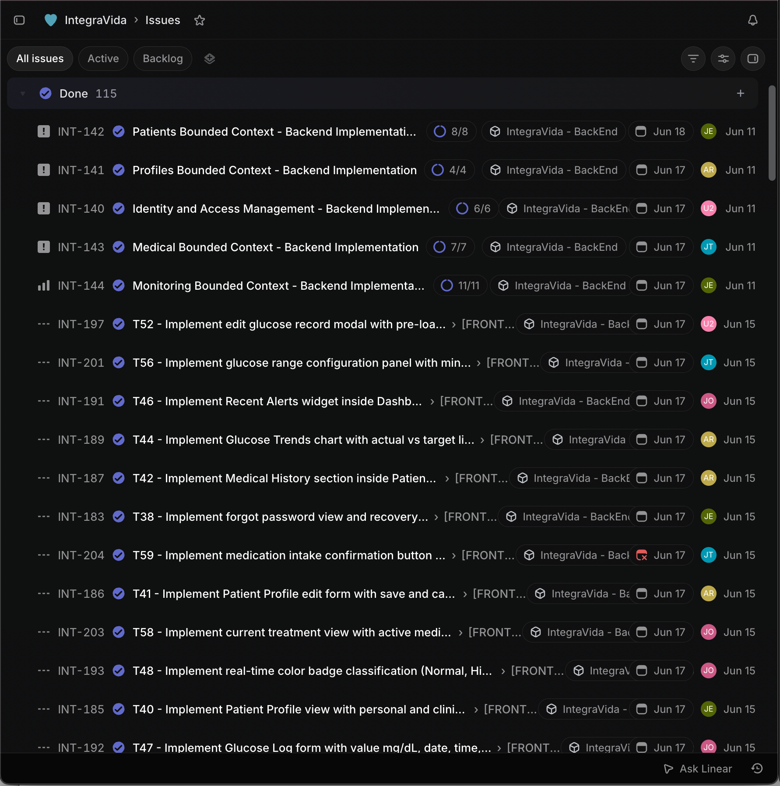

La estimación técnica de cada historia se expresa mediante **Story Points**.

| # Orden | User Story ID | Título | Descripción | Story Points | Prioridad |
| :---: | :---: | :--- | :--- | :---: | :---: |
| 1 | US-01 | Hero section del Landing Page | Como visitante, quiero visualizar la propuesta de valor principal de GlucoSmart para comprender rápidamente el propósito de la plataforma. | 2 | Alta |
| 2 | US-29 | Navegación por el Landing Page | Como visitante, quiero navegar fácilmente entre las secciones del landing page para encontrar información del producto de manera rápida y ordenada. | 3 | Alta |
| 3 | US-30 | Ver información de la Startup | Como visitante, quiero visualizar información sobre IntegraVida y GlucoSmart para conocer el contexto y objetivo de la solución. | 2 | Alta |
| 4 | US-31 | Conocer la misión y visión de la Startup | Como visitante, quiero leer la misión y visión de la startup para entender su enfoque y compromiso con el manejo de la diabetes. | 2 | Alta |
| 5 | US-32 | Cambiar idioma del Landing Page | Como visitante, quiero cambiar el idioma del landing page para visualizar la información en el idioma de mi preferencia. | 3 | Media |
| 6 | US-33 | Contactar al equipo de soporte | Como visitante, quiero enviar un mensaje al equipo de soporte para resolver dudas o solicitar información sobre la plataforma. | 3 | Media |
| 7 | US-02 | Registro de paciente | Como paciente, quiero registrarme en la plataforma para acceder a las funcionalidades de monitoreo y seguimiento de mi salud. | 5 | Alta |
| 8 | US-03 | Registro de doctor | Como doctor, quiero registrarme en la plataforma para acceder a la información clínica de mis pacientes y realizar seguimiento médico. | 5 | Alta |
| 9 | US-04 | Log in | Como usuario, quiero iniciar sesión con mis credenciales para acceder de forma segura a mi cuenta. | 3 | Alta |
| 10 | US-06 | Cerrar sesión | Como usuario, quiero cerrar sesión de manera segura para proteger la privacidad de mi información. | 1 | Alta |
| 11 | US-07 | Crear perfil de paciente | Como paciente, quiero completar mi perfil personal y clínico para contar con un registro base dentro de la plataforma. | 5 | Alta |
| 12 | US-08 | Editar perfil de paciente | Como paciente, quiero actualizar mis datos personales y clínicos para mantener mi información correcta y vigente. | 3 | Alta |
| 13 | US-11 | Consultar perfil y datos clínicos personales | Como paciente, quiero visualizar mi información personal y clínica consolidada para tener una visión general de mi estado de salud. | 2 | Alta |
| 14 | US-12 | Registrar nivel de glucosa | Como paciente, quiero registrar mis niveles de glucosa para llevar control sobre mi estado diario de salud. | 5 | Alta |
| 15 | US-13 | Visualizar historial de glucosa | Como paciente, quiero consultar el historial de mis mediciones de glucosa para identificar cambios y patrones en el tiempo. | 3 | Alta |
| 16 | US-37 | Visualizar gráficos de glucosa | Como paciente, quiero visualizar gráficos de mis niveles de glucosa para identificar patrones en mi evolución de salud. | 5 | Alta |
| 17 | US-38 | Filtrar historial de glucosa | Como paciente, quiero filtrar mi historial de glucosa por fechas para analizar periodos específicos de mi evolución. | 3 | Alta |
| 18 | US-39 | Editar registro de glucosa | Como paciente, quiero editar un registro de glucosa para corregir errores en la información ingresada. | 3 | Media |
| 19 | US-40 | Eliminar registro de glucosa | Como paciente, quiero eliminar un registro de glucosa para mantener mi historial limpio y preciso. | 2 | Media |
| 20 | US-16 | Recibir alerta por glucosa fuera de rango | Como paciente, quiero recibir alertas cuando mis niveles de glucosa estén fuera de rango para actuar de manera oportuna ante un posible riesgo. | 5 | Alta |
| 21 | US-41 | Visualizar alertas generadas | Como paciente, quiero ver el historial de alertas generadas para comprender eventos críticos anteriores. | 3 | Alta |
| 22 | US-42 | Configurar rango de glucosa | Como paciente, quiero configurar mis rangos de glucosa personalizados para recibir alertas más precisas. | 5 | Alta |
| 23 | US-43 | Confirmar lectura de alerta | Como paciente, quiero marcar una alerta como leída para llevar control de las notificaciones atendidas. | 2 | Media |
| 24 | US-17 | Visualizar tratamiento actual | Como paciente, quiero consultar mi tratamiento actual para saber qué indicaciones y medicamentos debo seguir. | 3 | Alta |
| 25 | US-19 | Registrar toma de medicación | Como paciente, quiero registrar cada toma de mi medicación para llevar control del cumplimiento de mi tratamiento. | 3 | Alta |
| 26 | US-55 | Visualizar resumen general del sistema | Como usuario, quiero ver un resumen general de mi información para tener una visión rápida de mi estado de salud. | 5 | Alta |
| 27 | TS-01 | Configurar json-server como Fake RESTful API | Como equipo de desarrollo necesitamos configurar un servidor fake con json-server que exponga los endpoints necesarios para el frontend. | 3 | Alta |
| 28 | TS-02 | Implementar endpoints CRUD /users | Como equipo técnico necesitamos endpoints de autenticación GET y POST /users para implementar login y registro en el frontend. | 2 | Alta |
| 29 | TS-03 | Implementar endpoints CRUD /patients | Como equipo técnico necesitamos endpoints de gestión de perfil de paciente para conectar el frontend con la capa de datos. | 3 | Alta |
| 30 | TS-04 | Implementar endpoints CRUD /glucose_records | Como equipo técnico necesitamos endpoints de gestión de registros de glucosa para conectar el módulo de monitoreo. | 3 | Alta |
| 31 | TS-05 | Implementar endpoints CRUD /alerts | Como equipo técnico necesitamos endpoints de gestión de alertas para conectar el módulo de notificaciones. | 2 | Alta |
| 32 | TS-06 | Implementar endpoints GET/PUT /glucose_ranges | Como equipo técnico necesitamos endpoints de configuración de rangos para personalizar los umbrales de alerta por paciente. | 2 | Media |
| 33 | TS-07 | Implementar endpoints CRUD /medications | Como equipo técnico necesitamos endpoints de gestión de medicamentos para el módulo de tratamiento. | 3 | Media |
| 34 | TS-08 | Implementar endpoint POST /medication_intakes | Como equipo técnico necesitamos un endpoint de confirmación de tomas para el módulo de adherencia a la medicación. | 2 | Media |
| 35 | TS-09 | Configurar despliegue en Firebase Hosting | Como equipo técnico necesitamos desplegar el frontend en Firebase Hosting para que esté disponible públicamente. | 3 | Alta |
| 36 | TS-10 | Configurar despliegue de json-server en Render | Como equipo técnico necesitamos desplegar el servidor fake en Render para que el frontend pueda consumirlo en producción. | 3 | Alta |
| 37 | US-05 | Recuperación de contraseña | Como usuario, quiero recuperar mi contraseña para volver a acceder a mi cuenta si la he olvidado. | 3 | Media |
| 38 | US-09 | Registrar antecedentes médicos | Como paciente, quiero registrar mis antecedentes médicos relevantes para que el doctor disponga de mayor contexto clínico. | 3 | Media |
| 39 | US-14 | Registrar síntomas | Como paciente, quiero registrar los síntomas que presento para complementar la información clínica de mi seguimiento. | 2 | Media |
| 40 | US-15 | Visualizar evolución de salud | Como paciente, quiero visualizar el resumen de mi evolución de salud para entender mejor mi progreso y condición actual. | 5 | Media |
| 41 | US-18 | Registrar tratamiento prescrito | Como doctor, quiero registrar el tratamiento prescrito del paciente para dejar definidas las indicaciones médicas dentro de la plataforma. | 5 | Media |
| 42 | US-20 | Recibir recordatorio de medicación | Como paciente, quiero recibir recordatorios de medicación para no olvidar mis tomas programadas. | 5 | Media |
| 43 | US-21 | Reportar efectos adversos | Como paciente, quiero reportar efectos adversos relacionados con mi medicación para que el doctor pueda evaluarlos oportunamente. | 3 | Media |
| 44 | US-22 | Consultar adherencia al tratamiento | Como doctor, quiero consultar el nivel de adherencia del paciente a su tratamiento para evaluar si está cumpliendo correctamente las indicaciones. | 5 | Media |
| 45 | US-23 | Revisar información clínica del paciente | Como doctor, quiero revisar la información clínica registrada por el paciente para realizar un seguimiento adecuado de su estado de salud. | 5 | Media |
| 46 | US-24 | Registrar observaciones médicas | Como doctor, quiero registrar observaciones médicas sobre la evolución del paciente para dejar constancia del seguimiento clínico realizado. | 3 | Media |
| 47 | US-25 | Emitir diagnóstico | Como doctor, quiero registrar un diagnóstico dentro de la plataforma para documentar formalmente la evaluación clínica del paciente. | 3 | Baja |
| 48 | US-26 | Generar reporte clínico del paciente | Como doctor, quiero generar un reporte clínico del paciente para contar con un resumen organizado de su información médica. | 5 | Baja |
| 49 | US-27 | Solicitar cita médica | Como paciente, quiero solicitar una cita médica para recibir atención y seguimiento por parte del doctor. | 5 | Media |
| 50 | US-28 | Visualizar agenda de citas | Como usuario, quiero visualizar mis citas programadas para organizar mejor mi seguimiento médico. | 3 | Media |
| 51 | US-34 | Reprogramar cita médica | Como usuario, quiero reprogramar una cita médica para adaptar el seguimiento a mi disponibilidad. | 3 | Baja |
| 52 | US-35 | Cancelar cita médica | Como usuario, quiero cancelar una cita médica para liberar el espacio cuando no pueda asistir. | 2 | Baja |
| 53 | US-36 | Recibir recordatorio de cita | Como usuario, quiero recibir recordatorios de mis citas médicas para no olvidar mis atenciones programadas. | 3 | Baja |
| 54 | US-44 | Visualizar efectos adversos registrados | Como paciente, quiero consultar los efectos adversos registrados para llevar control de mis reacciones. | 3 | Baja |
| 55 | US-45 | Evaluar efectos adversos | Como doctor, quiero analizar los efectos adversos reportados para ajustar el tratamiento del paciente. | 5 | Baja |
| 56 | US-46 | Visualizar dashboard de pacientes | Como doctor, quiero visualizar un listado de mis pacientes para acceder rápidamente a su información clínica. | 5 | Baja |
| 57 | US-47 | Buscar paciente | Como doctor, quiero buscar pacientes por nombre o identificación para acceder rápidamente a su información. | 3 | Baja |
| 58 | US-48 | Visualizar evolución gráfica del paciente | Como doctor, quiero visualizar gráficos de evolución del paciente para analizar su progreso clínico. | 5 | Baja |
| 59 | US-49 | Actualizar tratamiento | Como doctor, quiero modificar el tratamiento del paciente para adaptarlo a su evolución clínica. | 5 | Baja |
| 60 | US-50 | Compartir información clínica | Como paciente, quiero compartir mi información con mi doctor para facilitar el seguimiento médico. | 3 | Baja |
| 61 | US-10 | Visualizar historial de salud | Como paciente, quiero consultar mi historial de salud para revisar la evolución de mi condición a lo largo del tiempo. | 3 | Baja |
| 62 | TS-11 | Configurar estructura DDD + CQRS en Spring Boot | Como equipo técnico, necesitamos inicializar el proyecto Spring Boot con la estructura de paquetes (domain, application, infrastructure, interfaces) para los 4 bounded contexts. | 3 | Alta |
| 63 | TS-12 | Implementar Aggregate Profile con value objects | Como equipo técnico, necesitamos implementar el aggregate Profile con PersonName, EmailAddress, PhoneNumber y DateOfBirth para el BC Profiles. | 5 | Alta |
| 64 | TS-13 | Implementar aggregate GlucoseRecord y Alert con CQRS | Como equipo técnico, necesitamos los aggregates GlucoseRecord y Alert con servicios command/query separados para el BC Monitoring. | 5 | Alta |
| 65 | TS-14 | Implementar aggregate Patient, Treatment y Medication | Como equipo técnico, necesitamos los aggregates Patient, Treatment y Medication para el BC Patients con persistencia JPA. | 5 | Alta |
| 66 | TS-15 | Implementar aggregate Appointment y Diagnosis | Como equipo técnico, necesitamos los aggregates Appointment, Diagnosis y ClinicalReport para el BC Medical. | 5 | Alta |
| 67 | TS-16 | Configurar PostgreSQL con Docker y conectar Spring Boot | Como equipo técnico, necesitamos configurar un contenedor Docker con PostgreSQL y conectar el datasource de Spring Boot para persistencia real. | 3 | Alta |
| 68 | TS-17 | Documentar endpoints REST con Swagger/OpenAPI | Como equipo técnico, necesitamos integrar SpringDoc OpenAPI y anotar todos los endpoints con @Operation y @ApiResponse para generar documentación interactiva. | 3 | Alta |
| 69 | TS-18 | Implementar Anti-Corruption Layer (ACL) entre bounded contexts | Como equipo técnico, necesitamos implementar facades ACL (ProfilesContextFacade, PatientContextFacade) para que los BCs se comuniquen sin acoplamiento directo. | 3 | Alta |
| 70 | TS-19 | Configurar JWT y Spring Security para autenticación | Como equipo técnico, necesitamos implementar autenticación stateless con JWT, filtro de seguridad y endpoints sign-up/sign-in protegidos. | 5 | Alta |
| 71 | TS-20 | Configurar CORS y desplegar backend en Render | Como equipo técnico, necesitamos configurar CORS para el frontend Angular y desplegar el backend Spring Boot en Render como Web Service. | 3 | Alta |

# Capitulo IV: Product Design

## 4.1. Style Guidelines.

El propósito de esta sección es establecer los lineamientos visuales y de diseño de interacción para la plataforma GlucoSmart de la startup IntegraVida. Estas directrices aseguran que la interfaz de usuario (UI) sea coherente, profesional y transmita confianza, factores críticos en un sistema de gestión de salud y farmacovigilancia tanto para pacientes como para personal médico.
### 4.1.1. General Style Guidelines.

Los lineamientos generales definen la identidad visual de la marca **IntegraVida** y los elementos base que componen todas las interfaces del sistema **GlucoSmart**. Estas directrices aseguran consistencia visual en todos los puntos de contacto digital con el usuario, transmitiendo profesionalismo, confianza y tecnología médica.

#### Branding
La marca **IntegraVida** se presenta con un logotipo compuesto por un símbolo (corazón/pulso estilizado) y el nombre en tipografía sans-serif. El logotipo se posiciona en la esquina superior izquierda del header en todas las pantallas. La marca verbal utiliza un tono de comunicación **profesional, empático y claro** —ni demasiado técnico para el paciente, ni demasiado simple para el médico— priorizando la claridad sobre la jerga. El lenguaje es formal pero cercano, en español neutro con soporte de internacionalización EN/ES.

#### Typography
Para garantizar la máxima legibilidad de los datos clínicos (niveles de glucosa, registros de HbA1c), se ha seleccionado la familia tipográfica **Poppins** (sans-serif). Esta fuente ofrece claridad en pantallas digitales de cualquier tamaño y cuenta con una amplia gama de pesos. Se establece la siguiente jerarquía:

| Elemento                   | Fuente   | Peso        | Tamaño | Uso                                          |
| -------------------------- | -------- | ----------- | ------ | -------------------------------------------- |
| **H1 (Título principal)**  | Poppins  | Bold (700)  | 32px   | Hero section, landing page                   |
| **H2 (Subtítulo)**         | Poppins  | SemiBold (600) | 24px   | Títulos de sección en dashboard              |
| **H3 (Encabezado de card)**| Poppins  | Medium (500) | 18px   | Títulos de cards: módulos, alertas           |
| **Body (Cuerpo de texto)** | Poppins  | Regular (400) | 14px   | Tablas, formularios, descripciones           |
| **Caption (Etiquetas)**    | Poppins  | Regular (400) | 12px   | Labels de campos, metadatos, badges          |
| **Data (Datos clínicos)**  | Poppins  | SemiBold (600) | 16px   | Valores numéricos de glucosa, HbA1c, alertas |

#### Color Palette
La selección de colores busca transmitir limpieza, tranquilidad y tecnología médica, evitando la fatiga visual del doctor durante la revisión de historiales.

| Tipo               | Color           | Código HEX | Uso principal                                                |
| ------------------ | --------------- | ---------- | ------------------------------------------------------------ |
| **Primario**       | Azul IntegraVida | `#1A73E8`  | Botones CTA, enlaces, header, acentos principales            |
| **Secundario**     | Verde Menta      | `#34A853`  | Estados de éxito, confirmaciones, badges de meta alcanzada   |
| **Fondo principal**| Blanco           | `#FFFFFF`  | Fondos de pantalla, cards, contenedores                       |
| **Fondo secundario**| Gris claro      | `#F5F7FA`  | Fondos de secciones alternas, sidebar                         |
| **Texto primario** | Gris oscuro      | `#202124`  | Títulos, cuerpo de texto                                     |
| **Texto secundario**| Gris medio     | `#5F6368`  | Subtítulos, metadatos, placeholders                          |
| **Alerta crítica** | Rojo             | `#D93025`  | Alertas de hipoglucemia severa, efectos adversos críticos     |
| **Advertencia**    | Amarillo         | `#F9AB00`  | Alertas preventivas, valores cerca del límite                |
| **Éxito / Estable**| Verde            | `#1E8E3E`  | Confirmaciones, rangos normales de glucosa                   |
| **Info**           | Azul claro       | `#1967D2`  | Notificaciones informativas, recordatorios                   |

#### Spacing
Se adopta un sistema de espaciado basado en una unidad base de 4px, siguiendo el estándar de Material Design. Las distancias se definen en múltiplos de esta unidad:

| Token  | Valor | Uso                                               |
| ------ | ----- | ------------------------------------------------- |
| `4px`  | 4px   | Padding interno en badges, íconos pequeños         |
| `8px`  | 8px   | Gap entre elementos de formulario, margen interno de cards |
| `16px` | 16px  | Padding estándar de cards, margen entre secciones  |
| `24px` | 24px  | Margen entre bloques de contenido, padding de contenedores |
| `32px` | 32px  | Separación entre secciones mayores                 |
| `48px` | 48px  | Margen superior de página, separación hero-content  |

#### Tono de comunicación y lenguaje
- **Pacientes:** Tono empático, claro y motivacional. Se usa segunda persona ("tú") y vocabulario accesible. Ejemplo: "Registra tu glucosa y recibe alertas cuando la necesites."
- **Médicos:** Tono profesional, preciso y directo. Se usa tercera persona o "usted". Ejemplo: "Revise la evolución de HbA1c de sus pacientes y ajuste tratamientos con datos objetivos."
- **General:** Frases cortas, avoids jerga innecesaria, uso consistente de términos del Ubiquitous Language.

#### Logotipo e Iconografía
El logotipo de IntegraVida se mantendrá constante en la cabecera (_header_) del sistema. La iconografía empleada debe ser minimalista, de trazos limpios y consistentes, facilitando el reconocimiento rápido de secciones clave como "Farmacovigilancia", "Dashboard Médico" y "Recordatorios". Se utiliza la librería **Material Icons** (Outlined style) para garantizar consistencia en todo el ecosistema.
### 4.1.2. Web Style Guidelines.

Estas directrices especifican cómo los elementos generales se aplican directamente a la experiencia e interacción dentro de la aplicación web de **GlucoSmart**, asegurando que los usuarios completen sus tareas de manera eficiente.

- **Estructura y Disposición (Layout):** La plataforma está diseñada bajo los principios de diseño web adaptable (_Responsive Web Design_). Para la vista del médico, se implementa una estructura de panel de control (_Dashboard_) dividida en una barra lateral (_sidebar_) para la navegación principal, y una sección principal (_main view_) donde se despliegan las tablas de pacientes y los gráficos de tendencias. En la vista del paciente, se utiliza un layout de una sola columna con cards apiladas priorizando el contenido más relevante (glucosa del día, próximas dosis).

- **Responsive Web Design Breakpoints:**
    - **Desktop (≥1200px):** Layout completo con sidebar expandida, tablas con todas las columnas visibles, gráficos de tamaño completo.
    - **Tablet (768px–1199px):** Sidebar colapsable (hamburger menu), tablas con columnas esenciales, gráficos redimensionados al 80%.
    - **Mobile (<768px):** Navegación inferior (bottom nav), cards en una columna, tablas convertidas a listas verticales, botones CTA de ancho completo.
    - **Small Mobile (<400px):** Tipografía reducida a 12px body, espaciado mínimo de 8px, formularios de una sola columna.

- **Componentes de Interacción:**
    
    - **Botones (Buttons):** Los botones de llamada a la acción (CTA), como "Registrar Glucosa" o "Notificar Reacción Adversa", utilizarán el color primario con texto en alto contraste (blanco). Todo botón debe contar con estados visuales definidos (_hover_, _active_, _disabled_) para proporcionar retroalimentación inmediata al interactuar con ellos. Altura mínima: 44px (pauta de accesibilidad táctil).
    - **Formularios de Entrada (Forms):** Los campos para ingresar la medicación o actualizar la historia clínica tendrán bordes sutiles y etiquetas descriptivas claras. Los mensajes de validación (errores al ingresar datos anómalos) aprovecharán los colores semánticos para guiar al usuario a corregir la información. Los campos numéricos (glucosa, dosis) usarán input type="number" con validación en tiempo real.
    - **Tablas de Datos:** Las tablas de historial clínico, listado de pacientes y registros de glucosa deben incluir: encabezados fijos al hacer scroll, filas con alternancia de color (zebra striping) para facilitar la lectura, paginación cada 10 registros, y columna de acciones (editar/eliminar) con íconos.
    - **Visualización de Datos (Gráficos):** Las gráficas de evolución y reportes de adherencia deben respetar el contraste establecido por las pautas de accesibilidad (WCAG AA mínimo). Se utiliza Chart.js para gráficos de línea (tendencias de glucosa) y dona (proporción de alertas). Los tooltips deben mostrar el valor exacto al hacer hover. Se prioriza el uso de espacios en blanco (_white space_) para separar los bloques de información, evitando el uso excesivo de líneas divisorias.
    - **Cards:** Cada módulo del dashboard se presenta en una card con: ícono representativo, título, valor principal (grande), indicador de estado (color semántico) y enlace opcional a detalle.
    - **Diálogos y Modales:** Confirmaciones de acciones destructivas (eliminar registro, cancelar cita) usan modal con botón de confirmación en rojo y botón de cancelar secundario.

- **Accesibilidad:**
    - Contraste de color mínimo WCAG AA (4.5:1 para texto normal, 3:1 para texto grande).
    - Todos los elementos interactivos deben ser accesibles por teclado (Tab, Enter, Escape).
    - Atributo `alt` descriptivo en todas las imágenes.
    - Labels asociados a inputs mediante `for`/`id`.
    - Mensajes de error visibles y legibles por lectores de pantalla (`aria-live`).

## 4.2. Information Architecture.

### 4.2.1. Organization Systems.

Para estructurar el contenido de la plataforma, se han implementado los siguientes sistemas:

- **Esquema Jerárquico:** Se utiliza para la navegación principal, permitiendo profundizar desde una visión general (Dashboard) hacia detalles específicos (Historial de dosis o Reporte de Farmacovigilancia).
- **Organización Orientada a Tareas:** Las interfaces están agrupadas según las acciones prioritarias identificadas en el _Task Mapping_: "Registrar Medición", "Consultar Alertas" y "Generar Reporte".
- **Esquema Matricial:** En el panel del médico, la información se organiza permitiendo múltiples puntos de acceso; un médico puede llegar a un reporte de efectos adversos filtrando por el nombre del paciente o por la gravedad de la alerta.

### 4.2.2. Labeling Systems.

El sistema de etiquetado busca un equilibrio entre la precisión clínica y la claridad para el paciente, evitando ambigüedades:

- **Etiquetas para Médicos:** Se emplea terminología técnica estandarizada como _"HbA1c"_ (Hemoglobina Glicosilada), _"Farmacovigilancia"_ y _"Adherencia Terapéutica"_.
- **Etiquetas para Pacientes:** Se utilizan términos familiares y directos como _"Mi Glucosa"_, _"Mis Recordatorios"_ y _"¿Cómo me siento?"_ (para el registro de síntomas).
- **Iconografía Predictiva:** Se acompañan las etiquetas con iconos universales (ej. una campana para alarmas, un gráfico para tendencias) para acelerar el reconocimiento visual.

### 4.2.3. SEO Tags and Meta Tags

Para posicionar a **IntegraVida** como un referente en salud digital y facilitar el acceso a la plataforma, se han definido los siguientes metadatos:

- **Index Title:** `IntegraVida | GlucoSmart - Control Inteligente de Diabetes y Farmacovigilancia`.
    
- **Meta Description:** `Plataforma integral para el monitoreo de diabetes. Conecta a médicos y pacientes en tiempo real para el seguimiento de glucosa, adherencia a medicación y prevención de efectos adversos.`
    
- **Keywords:** `Control de diabetes`, `monitoreo de glucosa`, `farmacovigilancia digital`, `salud digital Perú`, `historial clínico interactivo`.

### 4.2.4. Searching Systems.

Dada la naturaleza crítica de los datos médicos, el sistema de búsqueda está optimizado para la velocidad:

- **Búsqueda Global (Médico):** Permite localizar pacientes por nombre, DNI o nivel de riesgo actual.
- **Filtros Avanzados:** En los reportes, el usuario puede filtrar por "Rango de Fechas", "Tipo de Síntoma" o "Nivel de Glucosa" (Hipoglucemia/Hiperglucemia).
- **Autocompletado:** El sistema sugiere nombres de medicamentos comunes para evitar errores ortográficos en el registro de dosis.

### 4.2.5. Navigation Systems.

Se han implementado tres capas de navegación para garantizar que el usuario nunca se sienta perdido:

- **Navegación Global (Navbar):** Ubicada en la parte superior, permite el acceso a las secciones principales (Inicio, Mi Perfil, Soporte) y el cambio de idioma.
- **Navegación Local (Sidebar):** Una barra lateral persistente en el _Dashboard_ que permite conmutar entre las herramientas de gestión (Gráficos, Alarmas, Farmacovigilancia).
- **Navegación Contextual (Breadcrumbs):** Migas de pan que indican la ruta actual (ej. _Inicio > Pacientes > Jorge Quispe > Historial Mensual_), facilitando el retorno a niveles superiores sin usar el botón de retroceso del navegador.

## 4.3. Landing Page UI Design.

### 4.3.1. Landing Page Wireframe.

### 4.3.2. Landing Page Mock-up.

## 4.4. Web Applications UX/UI Design.

### 4.4.1. Web Applications Wireframes.
Se desarrollaron wireframes para representar la estructura base de la aplicación, enfocándose en la distribución de los elementos sin considerar aspectos visuales avanzados.

Los wireframes diseñados incluyen las siguientes pantallas:

- Login / Register
- Dashboard del paciente
- Registro de glucosa
- Historial de salud
- Alertas y notificaciones
- Perfil del paciente

Estos wireframes permiten definir la organización de la información y la navegación del sistema.

#### Wireframes

### 4.4.2. Web Applications Wireflow Diagrams.

Los wireflow diagrams representan la secuencia de pantallas, acciones del usuario, respuestas del sistema y validaciones principales de la Web Application de **GlucoSmart**. A diferencia de un wireframe individual, cada wireflow permite visualizar la continuidad de la experiencia y la forma en que el usuario avanza entre vistas para completar un objetivo específico.

Para esta propuesta se definieron wireflows asociados a los user goals principales del producto, priorizando los flujos de mayor valor para pacientes y profesionales de salud: acceso a la plataforma, registro de glucosa, revisión de historial, gestión de alertas, edición de perfil, gestión de citas y seguimiento médico de pacientes.

#### Wireflow Diagrams por User Goal

##### Wireflow 1: Registro e Inicio de Sesión

**User Goal:** acceder a la plataforma de forma segura según el rol del usuario.

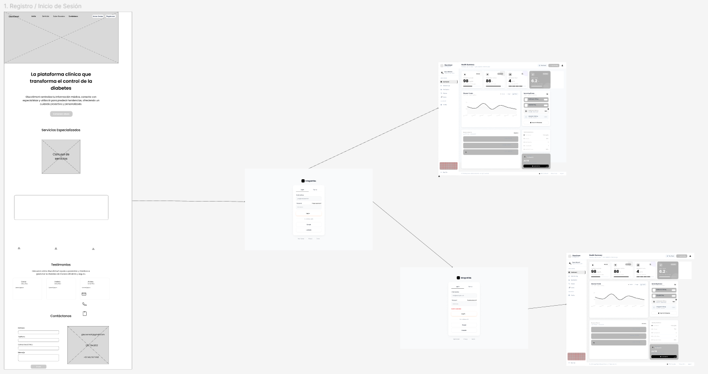
*Wireflow diagram elaborado en Figma. El enlace al board completo se encuentra en la sección de anexos.*

| Elemento | Descripción |
| :--- | :--- |
| Actor principal | Visitante, paciente o médico |
| Punto de inicio | Landing Page |
| Punto de cierre | Dashboard correspondiente al rol autenticado |
| Flujo principal | Landing Page → botón `Iniciar sesión` o `Registrarse` → pantalla Login/Register → selección de rol → ingreso de datos → validación del sistema → acceso al dashboard del paciente o dashboard médico |
| Flujo alternativo | El usuario cambia entre login y registro antes de enviar el formulario, manteniendo el contexto de acceso a la plataforma. |
| Validación o error | Si existen credenciales inválidas, campos incompletos o correo ya registrado, el sistema muestra mensajes de validación y permite corregir la información antes de reintentar. |

##### Wireflow 2: Registro de Glucosa

**User Goal:** registrar una medición diaria de glucosa para mantener actualizado el control de salud.

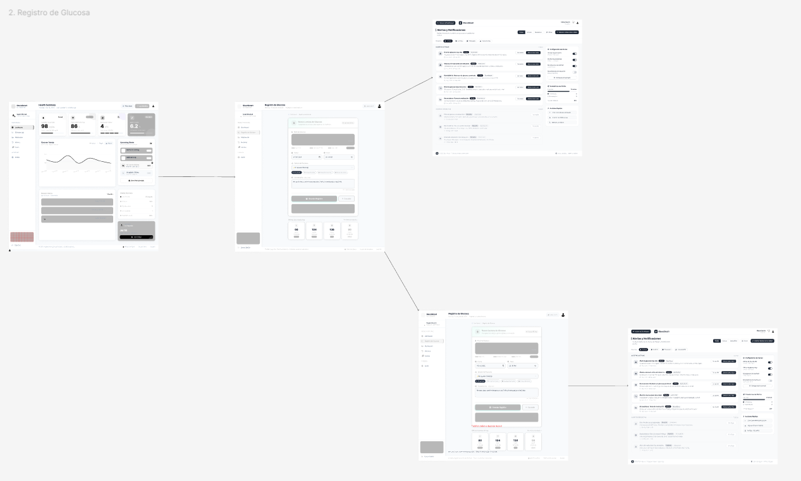
*Wireflow diagram elaborado en Figma. El enlace al board completo se encuentra en la sección de anexos.*

| Elemento | Descripción |
| :--- | :--- |
| Actor principal | Paciente |
| Punto de inicio | Dashboard del paciente |
| Punto de cierre | Lectura guardada y reflejada en el historial |
| Flujo principal | Dashboard del paciente → botón `Registrar glucosa` → formulario Nueva Lectura → ingreso de valor mg/dL, fecha, hora, estado y comentario opcional → validación del sistema → registro guardado → historial actualizado |
| Flujo alternativo | Si el valor registrado se encuentra fuera del rango configurado, el sistema guarda la lectura y genera una alerta preventiva asociada. |
| Validación o error | Si el valor está vacío, tiene un formato inválido o se encuentra fuera de los límites permitidos de entrada, el sistema muestra el mensaje correspondiente y solicita corrección. |

##### Wireflow 3: Revisión de Historial y Gráficos

**User Goal:** consultar la evolución de los niveles de glucosa e identificar patrones en el tiempo.

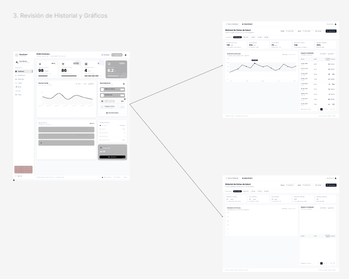
*Wireflow diagram elaborado en Figma. El enlace al board completo se encuentra en la sección de anexos.*

| Elemento | Descripción |
| :--- | :--- |
| Actor principal | Paciente |
| Punto de inicio | Dashboard del paciente |
| Punto de cierre | Historial filtrado y gráfico de evolución consultado |
| Flujo principal | Dashboard del paciente → menú `Historial` → pantalla Historial de Glucosa → visualización de tabla de lecturas → selección de filtro por periodo → actualización de resultados → cambio a vista de gráficos → revisión de tendencias |
| Flujo alternativo | El usuario puede alternar entre periodos predefinidos, como última semana, último mes, tres meses o rango personalizado. |
| Validación o error | Si no existen registros para el periodo seleccionado, el sistema presenta un estado vacío indicando que aún no hay información disponible. |

##### Wireflow 4: Gestión de Alertas

**User Goal:** revisar, comprender y atender las alertas generadas por valores críticos o eventos relevantes.

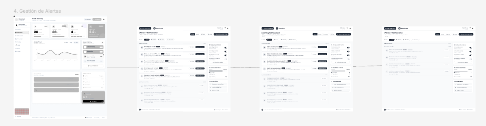
*Wireflow diagram elaborado en Figma. El enlace al board completo se encuentra en la sección de anexos.*

| Elemento | Descripción |
| :--- | :--- |
| Actor principal | Paciente |
| Punto de inicio | Dashboard del paciente |
| Punto de cierre | Alerta revisada o marcada como leída |
| Flujo principal | Dashboard del paciente → widget `Alertas recientes` → pantalla Alertas → selección de pestaña Todas, Activas o Resueltas → selección de alerta → visualización de detalle → marcado como leída |
| Flujo alternativo | Si existen varias alertas pendientes, el usuario puede ejecutar una acción masiva para marcar todas como leídas. |
| Validación o error | Si no existen alertas registradas, el sistema muestra un estado vacío. Si la alerta ya fue resuelta, evita duplicar el cambio de estado. |

##### Wireflow 5: Edición de Perfil

**User Goal:** actualizar la información personal, clínica y de contacto del paciente.

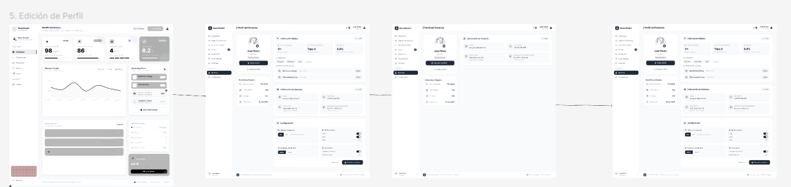
*Wireflow diagram elaborado en Figma. El enlace al board completo se encuentra en la sección de anexos.*

| Elemento | Descripción |
| :--- | :--- |
| Actor principal | Paciente |
| Punto de inicio | Dashboard del paciente |
| Punto de cierre | Perfil actualizado o cambios descartados |
| Flujo principal | Dashboard del paciente → menú `Perfil` → pantalla Perfil del Paciente → botón `Editar` → formulario habilitado → modificación de datos personales, contacto, tipo de diabetes, datos clínicos y preferencias → botón `Guardar cambios` → validación → confirmación |
| Flujo alternativo | El usuario puede cancelar la edición antes de guardar, conservando la información anterior. |
| Validación o error | Si existen campos obligatorios incompletos o valores inválidos, el sistema muestra validaciones por campo y no actualiza el perfil hasta que la información sea corregida. |

##### Wireflow 6: Solicitud y Reprogramación de Cita Médica

**User Goal:** solicitar o modificar una cita médica según la disponibilidad del paciente y del profesional de salud.

| Elemento | Descripción |
| :--- | :--- |
| Actor principal | Paciente |
| Punto de inicio | Dashboard del paciente o módulo de Citas |
| Punto de cierre | Cita programada, reprogramada o solicitud rechazada por falta de disponibilidad |
| Flujo principal | Dashboard del paciente → menú `Citas` → pantalla Agenda/Citas → botón `Solicitar cita` → selección de médico, fecha, hora y motivo → validación de disponibilidad → confirmación de cita |
| Flujo alternativo | Desde una cita existente, el usuario selecciona `Reprogramar`, elige una nueva fecha u hora disponible y confirma el cambio. |
| Validación o error | Si el horario seleccionado no está disponible, el sistema muestra horarios alternativos y solicita una nueva selección. |

##### Wireflow 7: Seguimiento Médico de Pacientes

**User Goal:** revisar el estado clínico de un paciente y registrar acciones médicas de seguimiento.

| Elemento | Descripción |
| :--- | :--- |
| Actor principal | Médico |
| Punto de inicio | Dashboard médico |
| Punto de cierre | Observación, diagnóstico, tratamiento o reporte clínico registrado |
| Flujo principal | Login como médico → Dashboard médico → búsqueda o filtrado de paciente → selección de paciente → detalle clínico → revisión de perfil, historial de glucosa, alertas, tratamiento, adherencia y citas → registro de acción médica |
| Flujo alternativo | El médico puede cambiar entre secciones clínicas antes de registrar una observación, emitir un diagnóstico, actualizar tratamiento o generar un reporte. |
| Validación o error | Si el paciente no tiene información suficiente o el médico no cuenta con acceso autorizado, el sistema muestra el mensaje correspondiente y bloquea la acción restringida. |

### 4.4.2. Web Applications Mock-ups.

Los mockups representan la versión visual final de la aplicación, incorporando elementos de diseño como colores, tipografía y estilo visual.

Se mantuvo coherencia con la landing page de IntegraVida, utilizando un diseño limpio, moderno y enfocado en el sector salud.

#### Mockups

### 4.4.3. Web Applications User Flow Diagrams.

<!-- TODO: Agregar User Flow Diagrams por cada User Goal y cubrir happy path + flujos alternativos. Incluir al menos los objetivos de paciente y médico definidos en el Product Backlog para evidenciar trazabilidad con las User Stories. -->

El flujo de usuario se diseñó considerando como segmento objetivo principal a pacientes con diabetes, quienes requieren monitorear constantemente su estado de salud.

El flujo principal describe el proceso de uso diario de la aplicación:

1. El paciente inicia sesión en la aplicación
2. Accede al dashboard donde visualiza su estado actual
3. Registra su nivel de glucosa
4. El sistema procesa la información
5. Se actualiza el historial de salud
6. En caso de valores críticos, se generan alertas

Adicionalmente, el usuario puede acceder a:

- Historial de salud para revisar registros anteriores
- Alertas y notificaciones para monitorear riesgos
- Perfil del paciente para gestionar su información

Este flujo permite garantizar una experiencia centrada en el monitoreo continuo y la prevención de complicaciones.

## 4.5. Web Applications Prototyping.

* *Link del Prototyping: https://www.figma.com/design/lu1p4NLglhTYnbHWT8lDl4/GlucoSmart-Prototype?node-id=0-1&t=TQ9to3YM80qq0e3Q-1

Se desarrolló un prototipo interactivo de la aplicación GlucoSmart utilizando la herramienta Figma, con el objetivo de simular la navegación y la interacción real del usuario dentro del sistema antes de su implementación.

El prototipo considera como segmento objetivo principal a pacientes con diabetes mellitus tipo 1 y tipo 2, quienes representan el usuario con mayor nivel de interacción dentro de la plataforma. Asimismo, se contempla de manera secundaria la participación de profesionales de salud en el proceso de monitoreo y seguimiento clínico.

Las principales interacciones implementadas incluyen:

- Inicio de sesión y acceso al dashboard del paciente
- Navegación desde el dashboard hacia el registro de glucosa
- Registro y almacenamiento de niveles de glucosa
- Visualización del historial de salud y evolución del paciente
- Acceso a alertas y notificaciones generadas por el sistema
- Consulta y edición del perfil del paciente
- Retorno al dashboard desde las distintas funcionalidades

El prototipo fue construido a partir de los diagramas de Wireflow y User Flow, permitiendo mantener coherencia con la arquitectura de navegación definida previamente.

Asimismo, se implementaron enlaces interactivos entre pantallas en Figma, simulando el comportamiento real de la aplicación mediante acciones de usuario, lo que permitió validar la usabilidad, identificar mejoras en la experiencia de usuario y reducir riesgos antes de la fase de desarrollo.

El prototipo representa el flujo completo de uso diario del paciente, asegurando una navegación intuitiva, eficiente y alineada con los objetivos del sistema.

#### Prototipo de la aplicación

## 4.6. Domain-Driven Software Architecture.

### 4.6.1. Design-Level Event Storming.

Se aplicó la técnica de **Design-Level Event Storming** con el objetivo de identificar los principales comandos, eventos de dominio, entidades centrales y políticas de negocio del sistema **GlucoSmart**. Esta técnica permitió analizar el comportamiento del sistema desde una perspectiva de negocio antes de pasar al diseño técnico de la arquitectura.

GlucoSmart es una solución HealthTech orientada al monitoreo de pacientes con diabetes mellitus tipo 1 y tipo 2, permitiendo el registro de niveles de glucosa, seguimiento clínico, generación de alertas, reporte de efectos adversos y gestión de citas médicas con profesionales de salud.

Para organizar el dominio, el Event Storming fue dividido en seis áreas funcionales principales:

- **Account Management**
- **Patient Profile Management**
- **Glucose Monitoring**
- **Alerts & Pharmacovigilance**
- **Medical Follow-up**
- **Appointment Management**

Cada área representa un conjunto de responsabilidades relacionadas dentro del sistema. En el tablero se utilizaron notas adhesivas de diferentes colores para diferenciar los elementos del modelo:

- Las notas **azules** representan comandos o acciones ejecutadas por los usuarios.
- Las notas **naranjas** representan eventos de dominio, es decir, hechos que ocurren después de ejecutar una acción.
- Las notas **amarillas** representan entidades o aggregates principales del dominio.
- Las notas **moradas** representan políticas o reglas de negocio.

En el contexto de **Account Management**, se identificó la entidad principal **User**, relacionada con comandos como `Register user`, `Log in`, `Recover password` y `Logout`. Estos comandos generan eventos como `User registered`, `User logged in`, `Password recovered` y `Session closed`. Además, se consideraron políticas como la validación de credenciales y la emisión de tokens JWT para manejar la autenticación del usuario.

En **Patient Profile Management**, se identificaron las entidades **Patient** y **Profile**, asociadas a comandos como `Create profile`, `Update profile` y `Add medical history`. Como resultado de estas acciones se generan eventos como `Profile created`, `Profile updated` y `Medical history added`. Este contexto permite gestionar la información personal y clínica inicial del paciente.

En **Glucose Monitoring**, la entidad principal es **Glucose Record**, encargada de representar las mediciones de glucosa registradas por el paciente. Dentro de este contexto se identificaron comandos como `Register glucose level`, `Edit glucose record`, `Delete glucose record` y `Evaluate glucose level`. Estos comandos generan eventos como `Glucose recorded`, `Glucose updated`, `Glucose deleted` y `Glucose level evaluated`. Además, se establecieron políticas para evaluar los niveles de glucosa frente al rango configurado y activar alertas cuando los valores se encuentren fuera de los límites permitidos.

En **Alerts & Pharmacovigilance**, se identificaron las entidades **Alert**, **Glucose Range** y **Adverse Effect Report**. Este contexto permite configurar rangos de glucosa, reportar efectos adversos y marcar alertas como leídas. Entre los eventos generados se encuentran `Glucose range configured`, `Alert generated`, `Alert acknowledged` y `Adverse effect reported`. Las políticas principales de este contexto están relacionadas con la generación de alertas cuando los niveles de glucosa están fuera de rango y el envío de notificaciones al usuario.

En **Medical Follow-up**, se identificaron entidades como **Clinical Record**, **Diagnosis**, **Clinical Report** y **Treatment**. Este contexto agrupa acciones realizadas por el profesional de salud, como revisar datos del paciente, agregar observaciones médicas, crear diagnósticos, generar reportes clínicos y actualizar tratamientos. Los eventos resultantes incluyen `Patient data reviewed`, `Observation recorded`, `Diagnosis created`, `Clinical report generated` y `Treatment updated`. También se consideraron políticas como la verificación de la relación doctor-paciente y el uso del historial de glucosa para apoyar la revisión clínica.

Finalmente, en **Appointment Management**, la entidad principal es **Appointment**, encargada de representar las citas médicas entre pacientes y profesionales de salud. En este contexto se identificaron comandos como `Schedule appointment`, `Reschedule appointment`, `Cancel appointment`, `Confirm appointment` y `Complete appointment`. Estos comandos generan eventos como `Appointment scheduled`, `Appointment updated`, `Appointment cancelled`, `Appointment confirmed` y `Appointment completed`. Asimismo, se definieron políticas importantes como resolver la identidad del paciente mediante JWT y verificar la existencia de un doctor asignado antes de programar una cita.

El Design-Level Event Storming permitió comprender mejor el flujo de eventos del sistema, identificar responsabilidades por contexto y definir una base sólida para la arquitectura posterior basada en **Domain-Driven Design (DDD)**. Además, sirvió como insumo para la elaboración de los diagramas C4 y los diagramas de clases UML, asegurando que el diseño técnico del sistema esté alineado con las reglas y procesos principales del dominio.

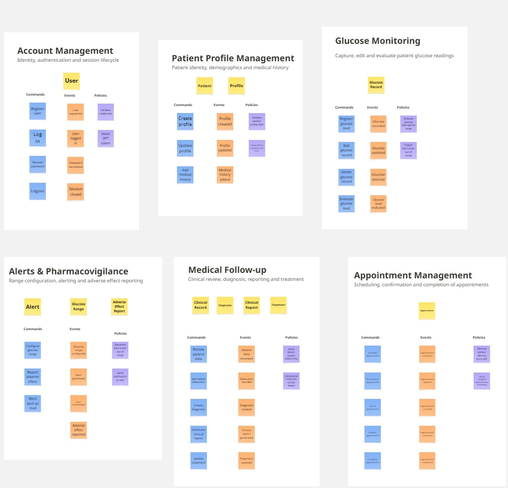

**Figura 4.6.1. Design-Level Event Storming del sistema GlucoSmart.**

### 4.6.2. Software Architecture Context Diagram.

El diagrama de contexto representa la interacción entre el sistema GlucoSmart y los actores externos que forman parte del ecosistema de salud.

En este caso, se identifican dos segmentos principales:

- Pacientes con diabetes mellitus tipo 1 y tipo 2, quienes utilizan la aplicación para registrar sus niveles de glucosa, consultar su historial de salud y recibir alertas preventivas.
- Profesionales de salud (médicos especialistas y personal de salud), quienes acceden al sistema para monitorear la evolución clínica del paciente y apoyar su seguimiento.

Adicionalmente, el sistema se integra con un servicio externo de notificaciones encargado de enviar alertas y recordatorios relevantes.

Este diagrama permite visualizar el alcance del sistema y su relación con los actores principales, proporcionando una visión general de su funcionamiento dentro del ecosistema.

### 4.6.3. Software Architecture Container Diagrams.

El diagrama de contenedores describe la arquitectura interna del sistema GlucoSmart, mostrando los principales componentes tecnológicos y su interacción, organizados bajo el enfoque **Domain-Driven Design (DDD)** con separación por bounded contexts.

El sistema se compone de los siguientes contenedores:

- **Web Application (Angular):** Interfaz de usuario desarrollada en Angular que permite la interacción de pacientes y profesionales de salud con el sistema. Se organiza internamente por bounded contexts siguiendo una arquitectura de capas (domain, application, infrastructure, presentation).
- **RESTful API (Spring Boot):** Backend desarrollado en Spring Boot encargado de procesar la lógica de negocio. Sigue el patrón DDD + CQRS, organizado en los bounded contexts: Profiles, Patients, Monitoring y Medical. Cada bounded context expone sus propios endpoints REST y mantiene su propio esquema de persistencia.
- **PostgreSQL Database:** Base de datos relacional donde se almacenan los registros de cada bounded context: perfiles, pacientes, monitoreo de glucosa, datos médicos y citas. Cada bounded context tiene su propio conjunto de tablas.
- **Notification Service (Externo):** Servicio externo encargado del envío de alertas y recordatorios al usuario (integración futura con Firebase Cloud Messaging o SendGrid).
- **Docker Container:** Contenedor que aloja la instancia de PostgreSQL, permitiendo un entorno de base de datos portable y reproducible.

La comunicación entre el frontend y el backend se realiza mediante solicitudes HTTP/REST, con autenticación basada en JWT. Cada bounded context del backend expone su propia ruta base (`/api/v1/profiles`, `/api/v1/patients`, `/api/v1/glucose-records`, `/api/v1/appointments`, etc.).

Este nivel permite comprender cómo se estructura técnicamente el sistema y cómo fluye la información entre sus componentes principales.

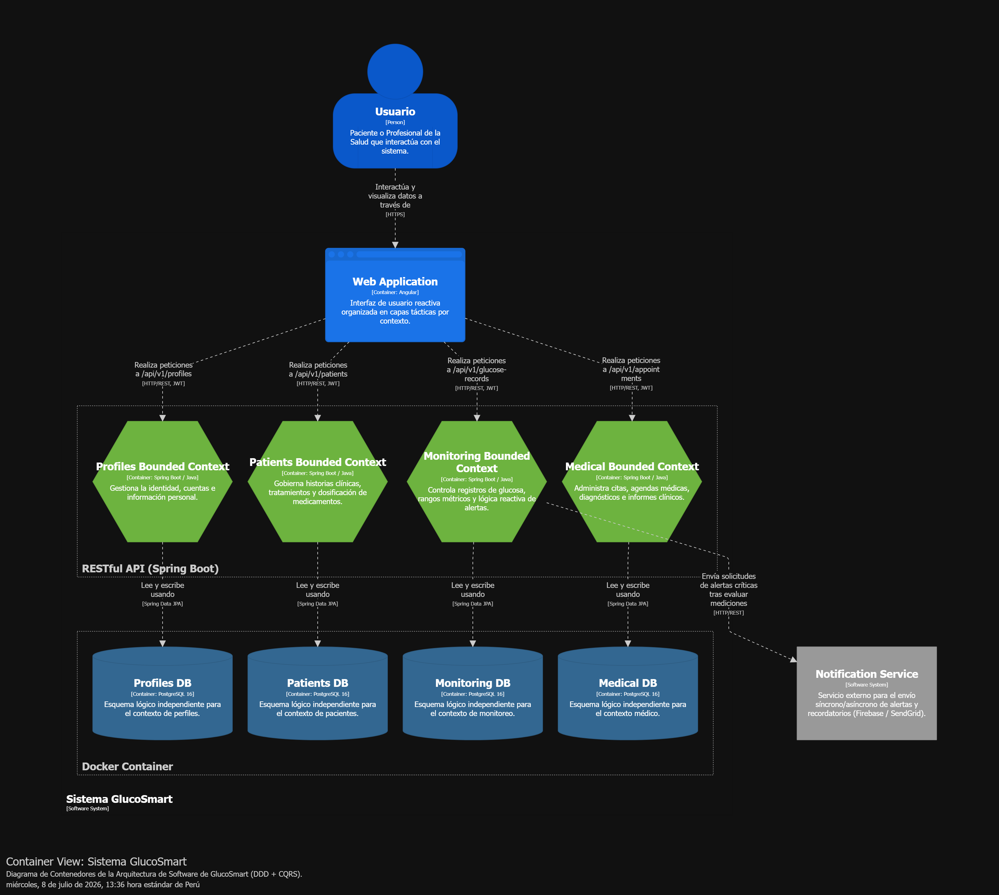

### 4.6.4. Software Architecture Components Diagrams.

El diagrama de componentes presenta una vista detallada de la arquitectura interna de cada bounded context del backend, siguiendo el patrón **Domain-Driven Design (DDD) con CQRS (Command Query Responsibility Segregation)** . Cada bounded context se organiza en las siguientes capas:

- **Interfaces (Controllers):** Gestionan las solicitudes HTTP entrantes y las respuestas. Se separan en comandos (mutaciones: POST, PUT, DELETE) y consultas (lecturas: GET). Cada endpoint está anotado con su descripción OpenAPI.
- **Application (Services CQRS):** Contienen la lógica de aplicación separada en dos flux:
    - **Command Services:** Procesan comandos (crear, actualizar, eliminar) y disparan Domain Events.
    - **Query Services:** Atienden consultas de lectura sin efectos secundarios.
- **Domain (Aggregates, Value Objects, Domain Events):** Contienen el modelo de negocio puro: aggregates raíz (Profile, Patient, GlucoseRecord, Appointment, etc.), value objects inmutables (PersonName, GlucoseValue, TreatmentStatus) y domain events (GlucoseRecorded, AlertGenerated, AppointmentScheduled).
- **Infrastructure (Repositories JPA, Mappers, ACL):** Implementan la persistencia mediante JPA/Hibernate, incluyendo:
    - **Entity Mappers:** Convierten entre entidades JPA y aggregates de dominio.
    - **Repository Adapters:** Implementan los puertos definidos en la capa de dominio.
    - **Anti-Corruption Layer (ACL) Facades:** Componentes de salida que consultan datos de otros bounded contexts a través de interfaces desacopladas (ej. ProfilesContextFacade, ExternalPatientService).

La aplicación del patrón CQRS permite que las operaciones de escritura (command) y lectura (query) tengan modelos optimizados de forma independiente, mejorando la escalabilidad y facilitando la evolución del modelo de dominio.

* *Monitoring Bounded

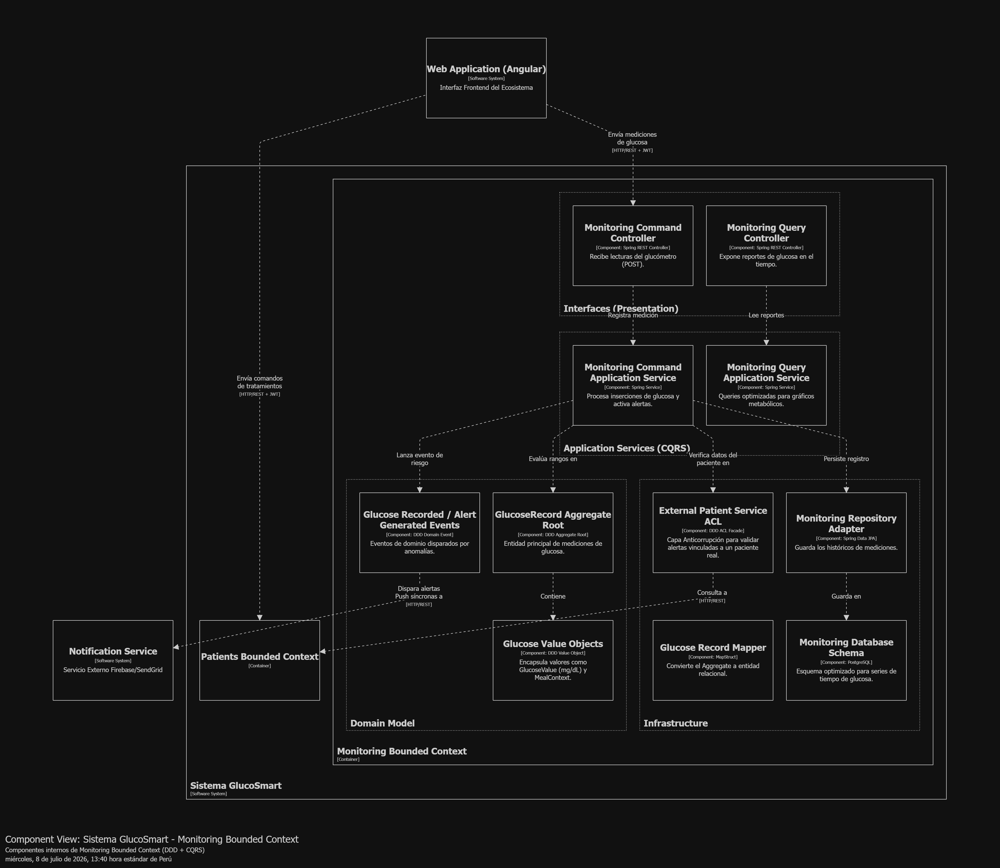

* *Profiles Bounded

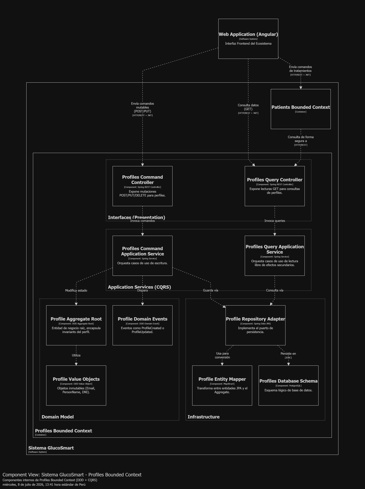

* *Patients Bounded

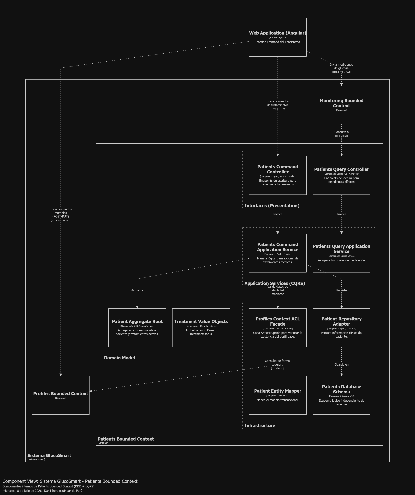

* *Medical Bounded

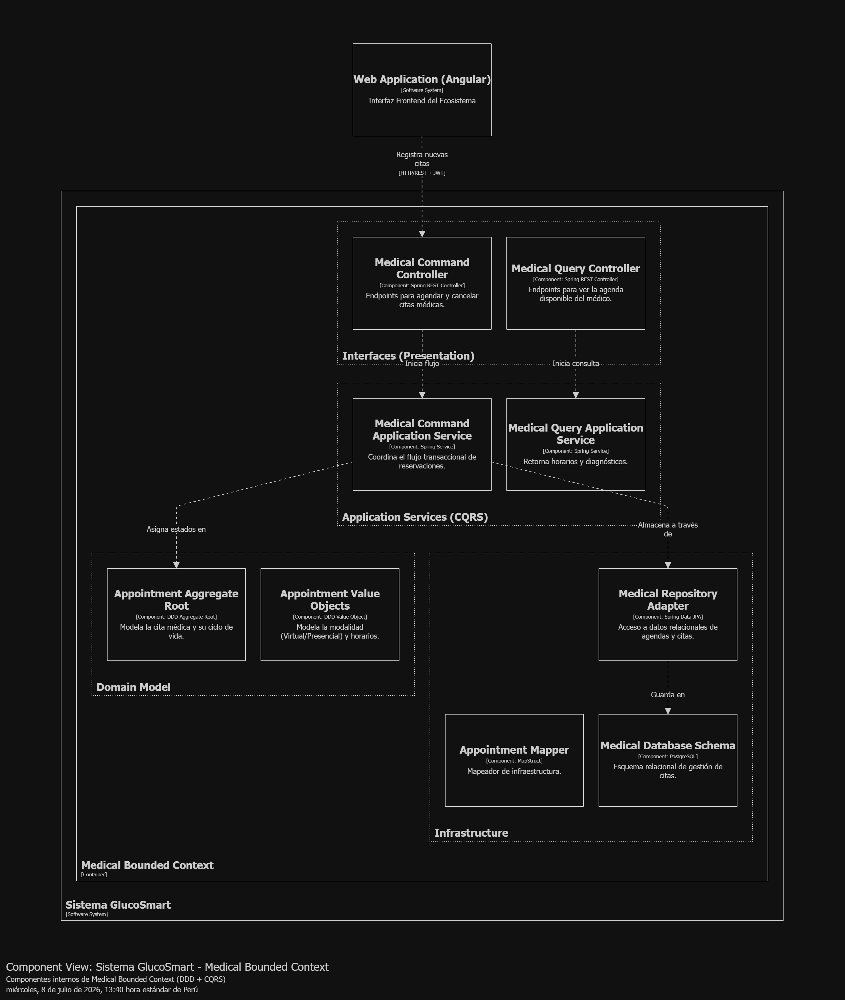

## 4.7. Software Object-Oriented Design.

### 4.7.1. Class Diagrams

El diseño orientado a objetos de GlucoSmart se representa mediante diagramas de clases UML organizados por bounded context. A diferencia de un único diagrama general, esta separación permite visualizar con mayor claridad las responsabilidades internas de cada contexto, manteniendo coherencia con el enfoque Domain-Driven Design aplicado en la arquitectura del sistema.

Cada diagrama incluye los aggregates raíz, value objects, domain events, repositorios y relaciones con otros bounded contexts mediante ACL Facades. Esta estructura evita el acoplamiento directo entre contextos y permite que cada módulo evolucione de manera independiente.

Los bounded contexts modelados son:

- **Profiles Bounded Context**
- **Patients Bounded Context**
- **Monitoring Bounded Context**
- **Medical Bounded Context**

#### Profiles Bounded Context

El **Profiles Bounded Context** gestiona la información personal del usuario, como nombres, correo electrónico, número telefónico y fecha de nacimiento. Su aggregate raíz principal es `Profile`, el cual encapsula value objects como `PersonName`, `EmailAddress`, `PhoneNumber` y `DateOfBirth`.

Este contexto publica eventos como `ProfileCreatedEvent` y `ProfileUpdatedEvent`, los cuales representan cambios importantes en el perfil del usuario. Además, se comunica con el contexto de IAM mediante `IamContextFacade`, evitando un acoplamiento directo con la lógica de autenticación.

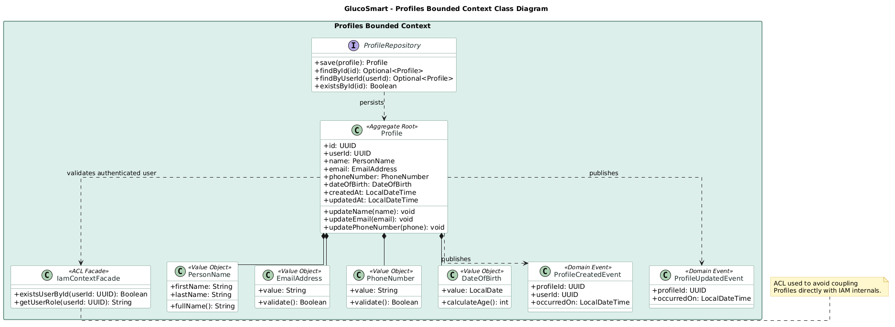

**Figura 4.7.1. Profiles Bounded Context Class Diagram.**

#### Patients Bounded Context

El **Patients Bounded Context** contiene la información clínica base del paciente y las relaciones necesarias para su seguimiento médico. Sus aggregates principales son `Patient`, `PatientDoctor` y `Treatment`.

El aggregate `PatientDoctor` representa la asignación entre un paciente y un doctor, relación necesaria para procesos como la gestión de citas médicas. Asimismo, `Treatment` modela los tratamientos asignados al paciente y se relaciona con la entidad `Medication`.

Este contexto utiliza value objects como `PatientId` y `DoctorId`, y publica eventos como `PatientRegisteredEvent`, `DoctorAssignedToPatientEvent` y `TreatmentUpdatedEvent`. También se comunica con otros contextos mediante `ProfilesContextFacade` e `IamContextFacade`.

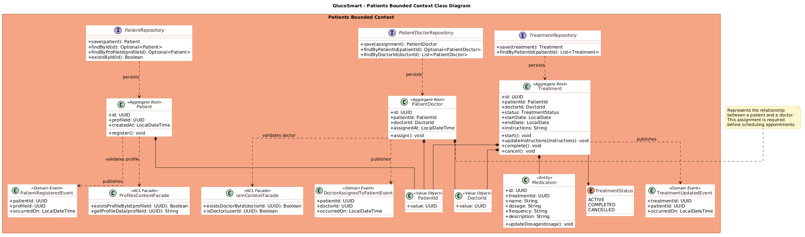

**Figura 4.7.2. Patients Bounded Context Class Diagram.**

#### Monitoring Bounded Context

El **Monitoring Bounded Context** gestiona el registro y evaluación de mediciones de glucosa. Sus aggregates principales son `GlucoseRecord`, `GlucoseRange` y `Alert`.

`GlucoseRecord` representa una medición de glucosa registrada por el paciente y se compone de value objects como `GlucoseValue`, `MealContext` y `PatientId`. La medición es evaluada contra un rango configurado mediante `GlucoseRange`. Si el valor se encuentra fuera del rango permitido, se genera una alerta mediante el aggregate `Alert`.

Este contexto publica eventos como `GlucoseRecordedEvent`, `GlucoseLevelEvaluatedEvent` y `AlertGeneratedEvent`. Además, consulta la existencia del paciente mediante `PatientsContextFacade` y puede comunicarse con un servicio externo de notificaciones mediante `NotificationServiceFacade`.

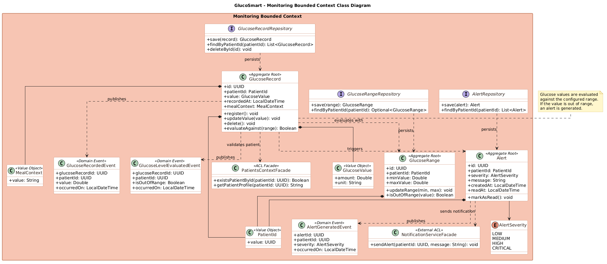

**Figura 4.7.3. Monitoring Bounded Context Class Diagram.**

#### Medical Bounded Context

El **Medical Bounded Context** agrupa la lógica relacionada con citas médicas, diagnósticos y reportes clínicos. Sus aggregates principales son `Appointment`, `Diagnosis` y `ClinicalReport`.

`Appointment` representa una cita médica entre un paciente y un doctor, incluyendo la fecha programada, motivo y estado de la cita. `Diagnosis` permite registrar diagnósticos médicos y recomendaciones, mientras que `ClinicalReport` permite generar reportes clínicos a partir de la información del paciente.

Este contexto utiliza value objects como `PatientId` y `DoctorId`, así como enumeraciones de estado como `AppointmentStatus`, `DiagnosisStatus` y `ClinicalReportStatus`. También publica eventos como `AppointmentScheduledEvent`, `AppointmentUpdatedEvent`, `AppointmentCancelledEvent`, `DiagnosisCreatedEvent` y `ClinicalReportGeneratedEvent`.

La relación con otros bounded contexts se realiza mediante ACL Facades. `PatientsContextFacade` permite verificar la existencia del paciente y obtener el doctor asignado, mientras que `MonitoringContextFacade` permite consultar el historial de glucosa para apoyar diagnósticos y reportes clínicos. Además, el contexto médico utiliza `JwtClaimsExtractor` para resolver la identidad del usuario autenticado mediante JWT.

En la gestión de citas, el frontend no solicita manualmente `patientId` ni `doctorId`. El `patientId` se obtiene desde el JWT del paciente autenticado y el `doctorId` se obtiene a partir de la relación doctor-paciente existente. Esto mejora la seguridad, reduce errores de entrada y evita exponer identificadores técnicos al usuario final.

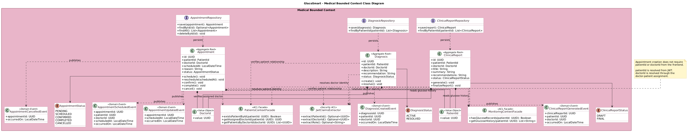

**Figura 4.7.4. Medical Bounded Context Class Diagram.**

## 4.8. Database Design.

El diseño de base de datos de **GlucoSmart** sigue un modelo relacional organizado por bounded contexts, en coherencia con la arquitectura Domain-Driven Design del sistema. Cada bounded context tiene su propio conjunto de tablas con claves primarias y foráneas que garantizan la integridad referencial. Las principales decisiones de diseño son:

1. **Separación por bounded context:** Cada contexto de dominio (Profiles, Patients, Monitoring, Medical) gestiona sus propias tablas, minimizando el acoplamiento entre contextos.
2. **Agregados como raíz de persistencia:** Cada aggregate raíz (Profile, Patient, GlucoseRecord, Appointment) tiene su propia tabla, y sus value objects se almacenan como columnas embebidas o tablas hijas.
3. **Identificadores UUID:** Todas las claves primarias utilizan UUID en lugar de enteros auto-incrementales, facilitando la identificación única en una arquitectura distribuida.
4. **Auditoría:** Cada tabla incluye campos `created_at` y `updated_at` para trazabilidad de cambios.
5. **Integridad referencial entre bounded contexts:** Las relaciones entre contextos se manejan mediante IDs de referencia (ej. `patient_id` en `glucose_records` hace referencia al UUID del paciente en el BC Patients), sin claves foráneas físicas entre bases de datos separadas.

### 4.8.1. Database Diagrams

Los siguientes diagramas de base de datos están organizados por bounded context, mostrando las tablas, atributos, tipos de datos y relaciones entre entidades para cada dominio del sistema GlucoSmart.

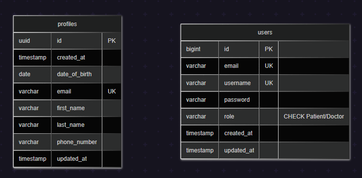
**Bounded Context 1: Profiles** — incluye las tablas `profiles` (datos personales: nombres, email, teléfono, fecha de nacimiento) y `users` (credenciales de autenticación con email, password hash y rol). El aggregate raíz es `Profile`, y `User` actúa como entidad de autenticación asociada.

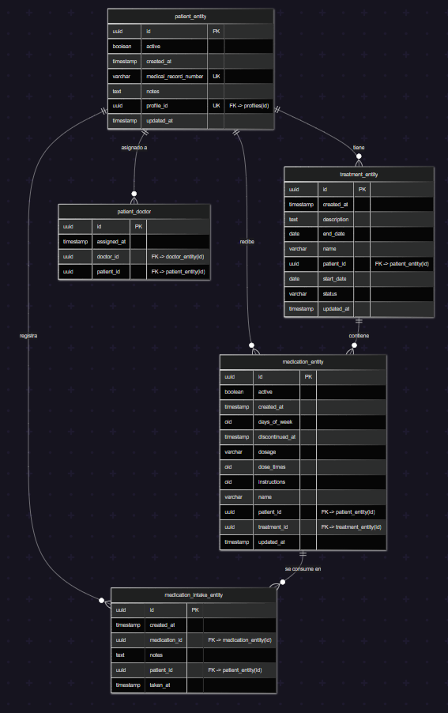
**Bounded Context 2: Patients** — incluye las tablas `patients` (datos clínicos: tipo de diabetes, fecha de diagnóstico, HbA1c objetivo), `treatments` (planes de tratamiento con fecha inicio/fin y estado), `medications` (medicamentos prescritos con dosis, frecuencia y horario) y `medication_intakes` (registro de cada toma con fecha/hora y estado). El aggregate raíz es `Patient`.

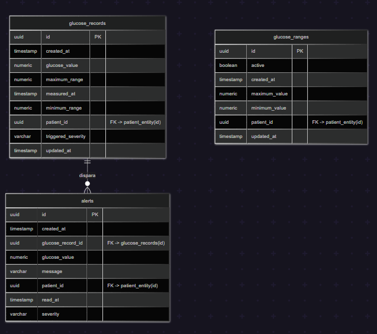
**Bounded Context 3: Monitoring** — incluye las tablas `glucose_records` (lecturas de glucosa con valor, fecha, hora, estado del paciente y notas), `glucose_ranges` (umbrales personalizados por paciente: mínimo, máximo y etiqueta) y `alerts` (alertas generadas con tipo, severidad, mensaje, estado de lectura y referencia al record de glucosa). El aggregate raíz es `GlucoseRecord`.

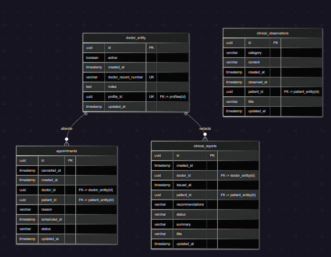
**Bounded Context 4: Medical** — incluye las tablas `appointments` (citas médicas con fecha, hora, estado: SCHEDULED/CONFIRMED/COMPLETED/CANCELLED), `diagnoses` (diagnósticos con código, descripción y fecha), `clinical_reports` (reportes clínicos con resumen estructurado y referencias a records de glucosa y alertas) y `clinical_observations` (observaciones médicas con texto y fecha). El aggregate raíz es `Appointment`.

# Capitulo V: Product Implementation, Validation & Deployment

## 5.1. Software Configuration Management.

La gestión de configuración del software del proyecto **IntegraVida** se definió con el objetivo de asegurar la organización del código fuente, la consistencia del entorno de desarrollo, la estandarización de convenciones técnicas y la correcta publicación del producto. Debido a que la solución implementada corresponde a una **Landing Page** desarrollada con **Angular**, **HTML**, **CSS** y **TypeScript**, se establecieron lineamientos simples pero formales para mantener la trazabilidad de cambios y facilitar el trabajo colaborativo del equipo.

### 5.1.1. Software Development Environment Configuration.

Esta sección describe todas las herramientas y tecnologías utilizadas por el equipo de IntegraVida para el ciclo de vida completo del proyecto GlucoSmart, organizadas por categoría funcional. Para cada herramienta se indica su nombre, el propósito específico dentro del proyecto y la referencia o ruta de descarga.

**Project Management**

| Herramienta | Propósito en el proyecto | Referencia |
| :--- | :--- | :--- |
| **Trello** | Gestión del Product Backlog y Sprint Backlogs. Se usan tableros con columnas To Do, In Process, To Review y Done para el seguimiento de tareas durante cada Sprint. | https://trello.com |
| **Discord** | Comunicación sincrónica y asincrónica del equipo. Se usan canales separados por bounded context para coordinar decisiones técnicas. | https://discord.com |
| **WhatsApp** | Coordinación rápida e informal entre integrantes para avisos y acuerdos de reuniones. | https://whatsapp.com |

**Requirements Management**

| Herramienta | Propósito en el proyecto | Referencia |
| :--- | :--- | :--- |
| **GitHub (InformeProyecto)** | Repositorio donde se documenta el informe, incluyendo User Stories, Product Backlog, diagramas y evidencias de cada Sprint. | https://github.com/MTS-OpenSource/InformeProyecto |
| **Miro** | Elaboración del Event Storming (Big Picture y Design Level) para identificar bounded contexts y eventos de dominio. | https://miro.com |

**Product UX/UI Design**

| Herramienta | Propósito en el proyecto | Referencia |
| :--- | :--- | :--- |
| **Figma** | Diseño de wireframes, mockups de alta fidelidad y prototipo interactivo de la Web Application (GlucoSmart). Permite colaboración en tiempo real entre los miembros del equipo. | https://figma.com |
| **Lucidchart** | Elaboración de diagramas UML (Class Diagrams), diagramas C4 y diagramas de base de datos. | https://lucidchart.com |

**Software Development**

| Herramienta | Propósito en el proyecto | Referencia / Descarga |
| :--- | :--- | :--- |
| **Visual Studio Code** | Editor de código principal del equipo. Se usa para el desarrollo del frontend en Angular/TypeScript y la edición del informe en Markdown. | https://code.visualstudio.com |
| **Node.js v18 LTS** | Entorno de ejecución de JavaScript necesario para ejecutar Angular CLI, json-server y las dependencias del proyecto frontend. | https://nodejs.org |
| **Angular CLI v17** | Framework principal para el desarrollo del Frontend Web Application. Provee la estructura de componentes, servicios, módulos y routing del proyecto. | `npm install -g @angular/cli` |
| **TypeScript 5.x** | Lenguaje de programación tipado utilizado en el frontend Angular. Aporta seguridad de tipos y mejor mantenibilidad del código. | Incluido con Angular CLI |
| **json-server** | Herramienta que simula un servidor RESTful a partir del archivo `db.json`. Permite desarrollar el frontend con una API funcional sin necesidad de un backend real. | `npm install -g json-server` |
| **Git 2.x** | Sistema de control de versiones distribuido. Permite el trabajo colaborativo mediante ramas, commits y pull requests. | https://git-scm.com |
| **GitHub Desktop** | Cliente gráfico de Git que facilita la gestión de ramas y commits a los integrantes del equipo. | https://desktop.github.com |

**Software Deployment**

| Herramienta | Propósito en el proyecto | Referencia |
| :--- | :--- | :--- |
| **Firebase Hosting** | Plataforma de despliegue del Frontend Web Application (Integravida-FrontendServices). Provee hosting estático con HTTPS y CDN global. | https://firebase.google.com/products/hosting |
| **Render** | Plataforma de despliegue del servidor json-server (Fake RESTful API). Expone el `db.json` como una API pública accesible desde el frontend desplegado. | https://render.com |
| **Firebase CLI** | Herramienta de línea de comandos para desplegar el frontend en Firebase Hosting mediante los comandos `firebase login`, `firebase init` y `firebase deploy`. | `npm install -g firebase-tools` |

**Software Documentation**

| Herramienta | Propósito en el proyecto | Referencia |
| :--- | :--- | :--- |
| **GitHub (InformeProyecto)** | Repositorio central del informe del proyecto. El informe está escrito en Markdown y es editado colaborativamente por todos los integrantes. | https://github.com/MTS-OpenSource/InformeProyecto |
| **Markdown** | Lenguaje de marcado ligero utilizado para redactar el informe del proyecto. Permite incluir tablas, imágenes, listas y código dentro de los archivos del repositorio. | https://www.markdownguide.org |

### 5.1.2. Source Code Management.

La administración del código fuente se realizó mediante **Git** y los repositorios remotos fueron alojados en **GitHub** bajo la organización [MTS-OpenSource](https://github.com/MTS-OpenSource). El equipo adopta **GitFlow** como workflow de gestión de ramas para todos los repositorios del proyecto.

**Repositorios del proyecto:**

| Producto | Repositorio | URL |
| :--- | :--- | :--- |
| Landing Page | IntegraVida | https://github.com/MTS-OpenSource/IntegraVida |
| Frontend Web Application | Integravida-FrontendServices | https://github.com/MTS-OpenSource/Integravida-FrontendServices |
| Fake RESTful API (json-server) | JsondbData | https://github.com/MTS-OpenSource/JsondbData |
| Informe del Proyecto | InformeProyecto | https://github.com/MTS-OpenSource/InformeProyecto |

<!-- TODO: Agregar el repositorio del Server-Side Software real (Spring Boot Backend Services) dentro de la tabla de repositorios y verificar que las URLs de Landing Page, Frontend Web Application, Backend Services e Informe coincidan con los repositorios finales usados para TF. -->

**Estructura de ramas (GitFlow):**

| Tipo de rama | Nombre | Propósito |
| :--- | :--- | :--- |
| Producción | `main` | Código estable desplegado en producción. Solo recibe merges desde `release` o `hotfix`. |
| Desarrollo | `develop` | Rama de integración principal. Todas las features se fusionan aquí antes de pasar a producción. |
| Funcionalidades | `feature/<nombre-del-feature>` | Desarrollo de una nueva funcionalidad. Se crea desde `develop` y se fusiona de vuelta en `develop`. |
| Lanzamientos | `release/<versión>` | Preparación para un nuevo release. Se crea desde `develop` cuando el Sprint está listo. |
| Correcciones críticas | `hotfix/<descripción>` | Corrección de bugs críticos en producción. Se crea desde `main` y se fusiona en `main` y `develop`. |

**Convenciones de nomenclatura para feature branches:**

El nombre debe ser descriptivo, en minúsculas, con palabras separadas por guiones, siguiendo el patrón: `feature/<bounded-context>-<descripcion-corta>`.

Ejemplos: `feature/glucose-monitoring-history-table`, `feature/patient-profile-edit-form`, `feature/auth-login-component`, `feature/alerts-mark-as-read`.

**Convenciones para release branches:**

Se aplica **Semantic Versioning (SemVer)**: `release/<MAJOR>.<MINOR>.<PATCH>`. Ejemplos: `release/1.0.0` (Sprint 1), `release/1.1.0` (Sprint 2), `release/1.1.1` (corrección menor).

**Convenciones para hotfix branches:**

Patrón: `hotfix/<descripcion-breve-del-bug>`. Ejemplos: `hotfix/glucose-record-null-pointer`, `hotfix/login-redirect-loop`, `hotfix/firebase-cors-config`.

**Convenciones de commits (Conventional Commits):**

Formato: `<tipo>(<alcance>): <descripción en imperativo, minúsculas>`. Tipos usados: `feat` (nueva funcionalidad), `fix` (corrección de bug), `docs` (documentación), `style` (formato), `refactor`, `test`, `chore` (mantenimiento).

Ejemplos: `feat(glucose): add new reading form component`, `fix(auth): correct login redirect after logout`, `docs(sprint2): add development evidence table`.

### 5.1.3. Source Code Style Guide & Conventions.

El equipo adopta las siguientes guías de estilo y convenciones estándar de la industria para garantizar consistencia, legibilidad y mantenibilidad del código en todos los repositorios del proyecto.

**HTML — Google HTML/CSS Style Guide**

Referencia: https://google.github.io/styleguide/htmlcssguide.html

Convenciones aplicadas: usar siempre minúsculas para nombres de elementos y atributos HTML; 2 espacios como indentación (no tabs); definir siempre el atributo `alt` en imágenes; atributos booleanos sin valor (`<input disabled>`); codificación UTF-8 declarada en el `<head>`.

**CSS — Google HTML/CSS Style Guide**

Referencia: https://google.github.io/styleguide/htmlcssguide.html

Convenciones aplicadas: clases con minúsculas y guiones (`.glucose-card`, `.patient-header`); evitar IDs para estilos; propiedades CSS ordenadas alfabéticamente dentro de cada regla; uso de propiedades shorthand; variables CSS para colores y tipografías del sistema de diseño.

**JavaScript — Airbnb JavaScript Style Guide**

Referencia: https://github.com/airbnb/javascript

Convenciones aplicadas: usar `const` por defecto y `let` solo cuando la variable cambia; arrow functions para funciones anónimas; template literals en lugar de concatenación; punto y coma obligatorio; nombres de variables en `camelCase`; nombres de clases en `PascalCase`; constantes globales en `UPPER_SNAKE_CASE`.

**TypeScript — Angular Style Guide (oficial de Google)**

Referencia: https://angular.io/guide/styleguide

Convenciones aplicadas: componentes con sufijo `Component` (`GlucoseLogComponent`); servicios con sufijo `Service` (`GlucoseService`); un componente por archivo; imports ordenados (Angular → terceros → propios); uso explícito de `private` y `public`; inyección de dependencias siempre mediante el constructor. Estructura de carpetas: `core/` (singletons, guards), `shared/` (reutilizables), `features/<bounded-context>/` (módulos por dominio).

**Java — Google Java Style Guide**

Referencia: https://google.github.io/styleguide/javaguide.html

Convenciones aplicadas (para el backend en sprints futuros): indentación de 2 espacios; clases en `UpperCamelCase`; métodos y variables en `lowerCamelCase`; constantes en `UPPER_SNAKE_CASE`; llaves `{}` obligatorias en todos los bloques; longitud máxima de línea de 100 caracteres.

### 5.1.4. Software Deployment Configuration.

La configuración de despliegue del proyecto **IntegraVida** fue definida para publicar la Landing Page en **GitHub Pages**, permitiendo que el sistema sea accesible mediante una URL pública sin requerir infraestructura de servidor adicional.

El proceso de despliegue se encuentra vinculado al repositorio del proyecto y utiliza un archivo de configuración **`static.yaml`** ubicado dentro de la carpeta **`.github`**, el cual define el comportamiento necesario para la publicación del sitio estático. A partir de esta configuración, la versión compilada de la aplicación puede ser generada y publicada automáticamente en el entorno de GitHub Pages.

De manera general, el flujo de despliegue contempla las siguientes actividades:

1. Compilar la aplicación Angular para generar los archivos estáticos de producción.
2. Publicar la versión generada en la rama o entorno configurado para GitHub Pages.
3. Verificar que la URL pública cargue correctamente la Landing Page y sus recursos asociados.

Esta configuración permitió contar con un mecanismo de despliegue simple, reproducible y adecuado para un producto web estático orientado a presentación institucional y validación temprana de la propuesta de valor.

## 5.2. Landing Page, Services & Applications Implementation.

### 5.2.1. Sprint 1

### 5.2.1.1. Sprint Planning 1.

Esta sección documenta la planificación del primer Sprint del proyecto GlucoSmart. El objetivo principal de este Sprint fue diseñar e implementar la **Landing Page** de GlucoSmart, que sirve como punto de entrada público a la plataforma y comunica la propuesta de valor del producto a visitantes y potenciales usuarios. Al finalizar el Sprint, la Landing Page debía estar desplegada en una URL pública y ser completamente responsive.

| Sprint #                         | Sprint 1                                                                                                                                                                                                                                                                                                                                                                                                                                                                                                                                                                                                                      |
| :------------------------------- | :---------------------------------------------------------------------------------------------------------------------------------------------------------------------------------------------------------------------------------------------------------------------------------------------------------------------------------------------------------------------------------------------------------------------------------------------------------------------------------------------------------------------------------------------------------------------------------------------------------------------------- |
| Sprint Planning Background       |                                                                                                                                                                                                                                                                                                                                                                                                                                                                                                                                                                                                                               |
| Date                             | 01/04/2026 - 25/04/2026                                                                                                                                                                                                                                                                                                                                                                                                                                                                                                                                                                                                       |
| Time                             | 6:00 PM                                                                                                                                                                                                                                                                                                                                                                                                                                                                                                                                                                                                                       |
| Location                         | Virtual - Discord                                                                                                                                                                                                                                                                                                                                                                                                                                                                                                                                                                                                             |
| Prepared By                      | Jean Pool Arias                                                                                                                                                                                                                                                                                                                                                                                                                                                                                                                                                                                                               |
| Attendees (To planning meeting)  | Jean Pool Arias, Abigail Raymundo                                                                                                                                                                                                                                                                                                                                                                                                                                                                                                                                                                                             |
| Sprint N-1 Review Summary        | No aplica, debido a que corresponde al primer Sprint del proyecto.                                                                                                                                                                                                                                                                                                                                                                                                                                                                                                                                                            |
| Sprint N-1 Retrospective Summary | No aplica, debido a que corresponde al primer Sprint del proyecto.                                                                                                                                                                                                                                                                                                                                                                                                                                                                                                                                                            |
| Sprint Goal & User Stories       |                                                                                                                                                                                                                                                                                                                                                                                                                                                                                                                                                                                                                               |
| Sprint N Goal                    | El enfoque principal del Sprint 1 fue desarrollar y desplegar la primera versión de la Landing Page de GlucoSmart. Durante este Sprint, únicamente Jean Pool Arias y Abigail Raymundo participaron en el proceso de diseño e implementación, enfocándose en construir la identidad visual de IntegraVida mediante Angular, componentes standalone, diseño responsive y despliegue en Firebase Hosting. El Sprint se considerará exitoso cuando la Landing Page esté desplegada y accesible mediante una URL pública mostrando correctamente las secciones principales como hero, servicios, about us, testimonios y contacto. |
| Sprint N Velocity                | 20                                                                                                                                                                                                                                                                                                                                                                                                                                                                                                                                                                                                                            |
| Sum of Story Points              | 20                                                                                                                                                                                                                                                                                                                                                                                                                                                                                                                                                                                                                            |

### 5.2.1.2. Aspect Leaders and Collaborators.

En el Sprint 1, los principales aspectos de trabajo fueron: la estructura base del proyecto Angular, la implementación del Navbar y Footer, el desarrollo del Hero y secciones de contenido (About, Testimonios, Servicios), la sección de Contacto y el despliegue en Firebase. Se indica con **L** al líder responsable de las decisiones técnicas del aspecto y con **C** al colaborador de apoyo.

| Team Member | GitHub Username | Landing Page Structure | Navbar & Footer | Hero & Services | About & Testimonials | Contact Section | Firebase Deployment |
| :--- | :--- | :--- | :--- | :--- | :--- | :--- | :--- |
| Jean Pool Arias | Jean-AT | L | L | C | C | C | L |
| Abigail Raymundo | AbigailRv | C | C | L | L | L | C |

### 5.2.1.3. Sprint Backlog 1.

El objetivo principal del Sprint 1 fue desarrollar y desplegar la primera versión de la Landing Page de GlucoSmart. Esta página estática es el primer punto de contacto con el usuario y comunica claramente la propuesta de valor de la plataforma. Al finalizar el Sprint, la Landing Page debía estar desplegada en una URL pública, ser completamente responsive y mostrar correctamente las secciones de hero, servicios, about us, testimonios y contacto.

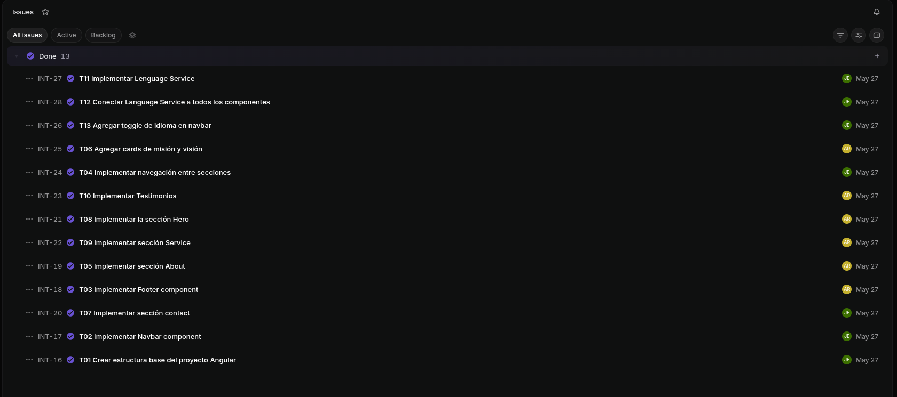
**URL del Board del Sprint 1:** `https://linear.app/aplicaciones-web/team/INT/all`

| Sprint#    |                                   |                |                                                   |                                                                                                 |            |             |        |
| :--------- | :-------------------------------- | :------------- | :------------------------------------------------ | :---------------------------------------------------------------------------------------------- | :--------- | ----------- | ------ |
| User Story |                                   | Work-Item/Task |                                                   |                                                                                                 |            |             |        |
| Id         | Title                             | Id             | Title                                             | Description                                                                                     | Estimation | Assignet To | Status |
| US-29      | Navegacion por el Landing Page    | T01            | Crear estructura base del proyecto Angular        | Inicializar proyecto Angular con la estructura de carpetas definidas (shared,comoponents, core) | 1          | Jean Pool   | Done   |
| US-29      | Navegacion por el LandingPage     | T02            | Implementar Navbar component                      | Crear el componente navbar con logo, link de navegacion y botones de accion                     | 1          | Jean Pool   | Done   |
| US-29      | Navegación por el Landing Page    | T03            | Implementar Footer component                      | Crear el componente footer con logo, links, redes sociales y copyright                          | 1          | Abigail     | Done   |
| US-29      | Navegación por el Landing Page    | T04            | Implementar navegación entre secciones            | Configurar scroll suave entre secciones del Landing Page                                        | 0.5        | Jean Pool   | Done   |
| US-30      | Ver Información del Startup       | T05            | Implementar sección About                         | Crear el componente about con descripción, misión y visión de IntegraVida                       | 1          | Abigail     | Done   |
| US-31      | Conocer la mision de la Startup   | T06            | Agregar cards de Msion y vision                   | Implementar las cards dentro del componente about con su contenido                              | 0.5        | Abigail     | Done   |
| US-33      | Contactar al equipo de soporte    | T07            | Implementar seccion contact                       | Crear el componente contact con el formulario e informacion de contacto                         | 2          | Jean Pool   | Done   |
| US-01      | Hero section del Landing Page     | T08            | Implementar la seccion Hero                       | Crear el componente service con imagen y principal call to action                               | 1          | Abigail     | Done   |
| US-01      | Hero section del LandingPage      | T09            | Implementar seccion Service                       | Crear el componente con carousel de servicio especializados                                     | 2          | Abigail     | Done   |
| US-01      | Hero section del LandingPage      | 10             | Implementar Testimonios                           | Crear el componente testimonial con las cards de usuarios                                       | 1          | Abigai      | Done   |
| US-32      | Cambiar el idioma del LandingPage | T11            | Implementar Lenguage Service                      | Crear el servicio de internacionalizacion con traduciones en ES y EN                            | 1.5        | Jean Pool   | Done   |
| U-32       | Cambiar el idioma del LandingPage | T12            | Conectar Language Service a todos los componentes | Inyectar el servicio en cada componente y reemplazar textos estaticos                           | 1.5        | Jean Pool   | Done   |
| US-32      | Cambiar el idioma del LandingPage | T13            | Agregar toggle de idioma en navbar                | Implementar boton EN/ES en el navbar para cambiar idioma                                        | 0.5        | Jean Pool   | Done   |

### 5.2.1.4. Development Evidence for Sprint Review.

Durante el Sprint 1 se realizó la implementación completa de la Landing Page de GlucoSmart. Los principales avances incluyeron: la estructuración del repositorio con la aplicación de GitFlow, el desarrollo de todas las secciones de la Landing Page (navbar, hero, servicios, about us, testimonios, contacto y footer) con diseño responsive y soporte de internacionalización ES/EN, y el despliegue exitoso en Firebase Hosting. A continuación se presenta la tabla de commits realizados durante el Sprint.

| Repository  | Branch                 | Commit Id                                | Commit Message                          | Commit Message Body                                                 | Committed on   |
| :---------- | :--------------------- | :--------------------------------------- | :-------------------------------------- | :------------------------------------------------------------------ | :------------- |
| IntegraVida | main                   | 79f9b95c9283ad21816efd8f2f5297a71ec4798d | Initial commit                          | Initial project structure and configuration.                        | Abril 02, 2026 |
| IntegraVida | feature/button         | fad9eebb2bf9f8f036b123f834cff54a39c728e2 | Done the component Button               | Complete the reusable button component, ready for integration.      | Abril 12, 2026 |
| IntegraVida | feature/navbar         | 86686462672580b3e6f3212036c498fb613bfcf2 | Done the component Navbar               | Created the navigation bar component with responsive links.         | Abril 12, 2026 |
| IntegraVida | feature/hero           | dc48b680b66be028595bdef4daf27bb3aca86b50 | Done the component Hero                 | Implementation of the Hero section with main call to action.        | Abril 12, 2026 |
| IntegraVida | feature/contact        | a330beb680a6ebc9e8a27463225811fc3e4af0db | Finish contact component & mail service | Added contact cards and form using FormSubmit for email handling.   | Abril 13, 2026 |
| IntegraVida | feature/toggleLanguage | 9fe7cee533381a7edfbd94216b838ebc7efc68f8 | Feature/toggle language                 | Added ToggleButtonLanguage and reorganized the Page directory.      | Abril 22, 2026 |
| IntegraVida | feature/servicios      | e4faec0224cc0568449160b2ea86379c07fe4c94 | feat: carousel de servicios             | Implementation of the services section using a carousel layout.     | Abril 23, 2026 |
| IntegraVida | feature/about-us       | 028db5cf2348fa06e091a2b2ee51536ebc3bf8ba | feat: sección Sobre Nosotros            | Implemented the About Us section with overlapping card design.      | Abril 23, 2026 |
| IntegraVida | feature/testimonials   | 2bfa2fae2524283bb540924a440c0cf2877a4a14 | feat: sección de testimonios            | Completed testimonials section with wave design and responsiveness. | Abril 23, 2026 |
| IntegraVida | feature/footer         | 8524ebc7508136c9b56f6e82d7a44bc2c0643c11 | feat: footer e identidad visual         | Completed footer with social icons and stylized text logo.          | Abril 23, 2026 |

### 5.2.1.5. Execution Evidence for Sprint Review.

En esta entrega el equipo ha desplegado con exito la primera version del LandingPage de IntegraVida 

**URL de la Landing Page desplegada:** https://mts-opensource.github.io/IntegraVida/

Las Secciones implementadas son: 

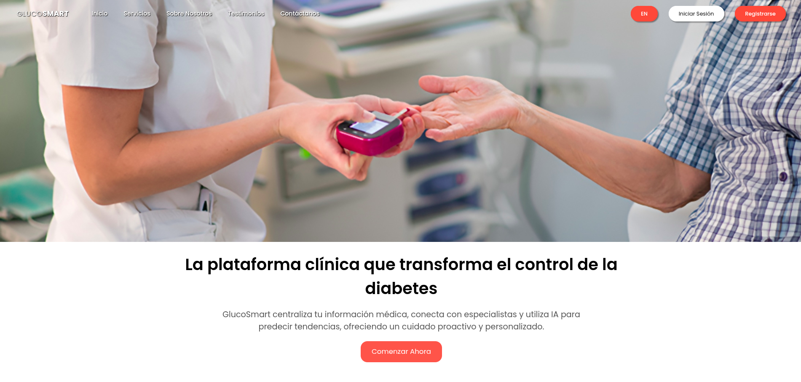

- Navbar con toggle de idioma ES/EN
- Hero section con imagen principal 

- Servicios Especializados con carousel

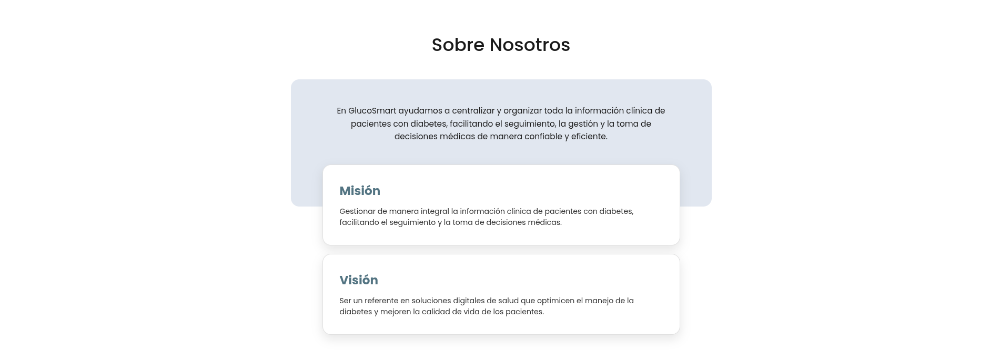

- Sobre Nosotros con cards de Mision y Vision

 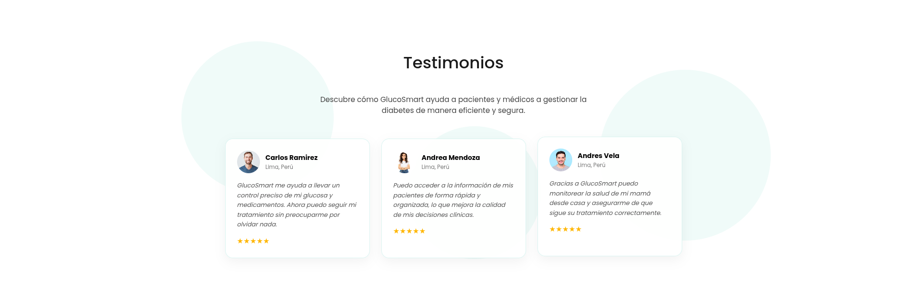

- Testimonio de usuarios 

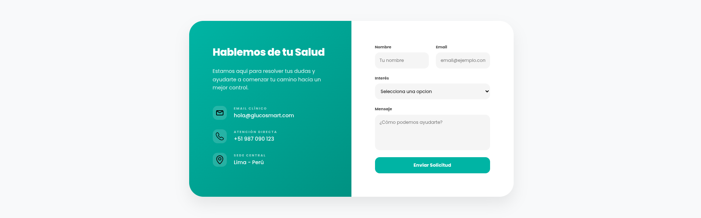

- Formulario de Contacto 

- Footer con redes sociales

### 5.2.1.6. Services Documentation Evidence for Sprint Review.

En este Sprint no se implementaron Web Services. El enfoque fue exclusivamente en desarrollo y despliegue del Landing Page estatico

### 5.2.1.7. Software Deployment Evidence for Sprint Review.

Durante el Sprint 1 se realizó el despliegue de la Landing Page de GlucoSmart, lo que permitió disponer de una URL pública accesible desde cualquier dispositivo. A continuación se detallan los pasos realizados durante el proceso de despliegue:

1. Se subió el código fuente al repositorio `IntegraVida` de la organización MTS-OpenSource en GitHub, asegurando que la rama `main` contuviera la versión final aprobada del proyecto.
2. Se navegó a la sección **Settings** del repositorio en GitHub.
3. Se seleccionó el apartado **Pages** en el menú lateral izquierdo.
4. Se eligió la rama `main` y la carpeta `/root` como fuente de publicación.
5. Se confirmó la configuración y se esperó a que GitHub generara la URL pública del sitio.
6. Se accedió al enlace generado para verificar el correcto funcionamiento de la Landing Page y la carga de todos sus assets (CSS, imágenes, componentes Angular).

**URL de la Landing Page desplegada:** https://mts-opensource.github.io/IntegraVida/

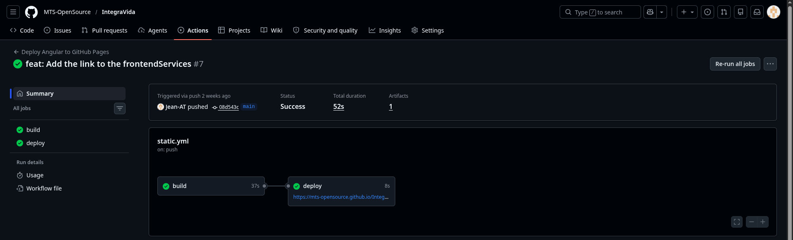

### 5.2.1.8. Team Collaboration Insights during Sprint.

Durante el Sprint 1, las actividades de implementación fueron distribuidas entre los dos integrantes del equipo activos en este Sprint. Jean Pool Arias lideró la estructura base del proyecto Angular, la implementación del Navbar, la sección de Contacto con FormSubmit y el Language Service para internacionalización ES/EN. Abigail Raymundo lideró la implementación del Hero section, la sección About Us con misión y visión, los Testimonios y la sección de Servicios con carousel.

El trabajo colaborativo se llevó a cabo mediante el uso de ramas feature en GitHub, donde cada integrante desarrolló su módulo de forma independiente y realizó commits descriptivos. La coordinación y toma de decisiones de diseño se realizó vía Discord.

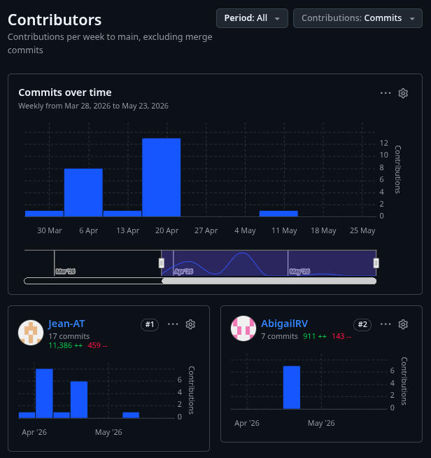

| Team Member      | Commits    |
| :--- | :--- |
| Jean Pool Arias  | 17 commits |
| Abigail Raymundo | 11 commits |

### 5.2.2. Sprint 2

### 5.2.2.1. Sprint Planning 2.

Esta sección documenta la planificación del segundo Sprint del proyecto GlucoSmart. El objetivo principal de este Sprint fue desarrollar e implementar las vistas funcionales del **Frontend Web Application** conectadas a una **Fake RESTful API** (json-server), cubriendo los bounded contexts de autenticación, Patient Profile Management, Glucose Monitoring, Alerts y Appointment Management. Al finalizar el Sprint, los usuarios debían poder navegar por la aplicación, registrar lecturas de glucosa, ver su historial con gráficos y gestionar sus alertas.

| Sprint #                         | Sprint 2                                                                                                                                                                                                                                                                                                                                                                                                                                       |     |
| :------------------------------- | :--------------------------------------------------------------------------------------------------------------------------------------------------------------------------------------------------------------------------------------------------------------------------------------------------------------------------------------------------------------------------------------------------------------------------------------------- | --- |
| **Sprint Planning Background**   |                                                                                                                                                                                                                                                                                                                                                                                                                                                |     |
| Date                             | 04/05/2026 - 16/05/2026                                                                                                                                                                                                                                                                                                                                                                                                                        |     |
| Time                             | 11:00PM                                                                                                                                                                                                                                                                                                                                                                                                                                        |     |
| Location                         | Virtual - Discord                                                                                                                                                                                                                                                                                                                                                                                                                              |     |
| Prepared By                      | Jean Pool Arias                                                                                                                                                                                                                                                                                                                                                                                                                                |     |
| Attendees (To planning meeting)  | Jean Pool Alexander Arias Tasayco Abigail Nadhim Raymundo Villarroel  Juan Sebastian Estupiñan Olortegui Javier Oswaldo Tello Murga Jose Antonio Muñoz Amasifuen                                                                                                                                                                                                                                                                   |     |
| SprinT N-1 Review Summary        | El objetivo principal de este Sprint es implementar las vistas funcionales de la Web Application de GlucoSmart conectadas a json-server mediante servicios Angular, cubriendo los flujos de autenticación, monitoreo de glucosa, historial de salud, alertas y perfil del paciente.                                                                                                                                                            |     |
| SprinT N-1 Retrospective Summary | El equipo identificó como acierto la distribución clara de componentes entre los integrantes. Como oportunidad de mejora se señaló la necesidad de establecer convenciones de commits desde el inicio y mejorar la sincronización de ramas para evitar conflictos en Git. Para este Sprint se acordó usar prefijos feat/fix/chore en todos los commits.                                                                                        |     |
| **Sprint Goal & User Stories**   |                                                                                                                                                                                                                                                                                                                                                                                                                                                |     |
| Sprint N Goal                    | Our focus is on delivering the core functional views of the GlucoSmart web application connected to a fake REST API. We believe it delivers a navigable and data-driven experience to patients managing their diabetes. This will be confirmed when patients can log in, register glucose readings, view their health history with charts, manage alerts and consult their profile — all consuming data from json-server via Angular services. |     |
| Sprint N Velocity                | 45                                                                                                                                                                                                                                                                                                                                                                                                                                             |     |
| Sum of Story Points              | 43                                                                                                                                                                                                                                                                                                                                                                                                                                             |     |
|                                  |                                                                                                                                                                                                                                                                                                                                                                                                                                                |     |

### 5.2.2.2. Aspect Leaders and Collaborators.
En el Sprint 2, los principales aspectos de trabajo se organizaron por bounded context del Frontend Web Application. Los aspectos cubiertos fueron: Authentication (login/register/logout), Dashboard, Glucose Monitoring (registro, historial y gráficos), Alerts & Notifications, Patient Profile Management, Appointment Management, Services & Fake API y Deployment. Se indica con **L** al líder del aspecto y con **C** al colaborador de apoyo.

| Team Member      | GitHub Username | Login service | Glucose Lecture | Dashboard Service | Deploy | Design |
| :--------------- | :-------------- | :------------ | :-------------- | :---------------- | :----- | ------ |
| Jean Arias       | Jean-AT         | L             | L               | L                 | L      | C      |
| Abigail Raymundo | AbigailRv       | C             | C               | C                 | C      | L      |
| Juan Sebastian   | JuanSEstupinan  | C             | C               | C                 | C      | L      |
| Javier Oswaldo   | JavierTello20   | C             | C               | C                 | C      | C      |
| Jose Antonio     | joseam05        | C             | C               | C                 | C      | C      |

### 5.2.2.3. Sprint Backlog 2.
El objetivo principal de este Sprint es implementar las vistas funcionales de la Web Application de GlucoSmart conectadas a json-server mediante servicios Angular, cubriendo los flujos de autenticación, monitoreo de glucosa, historial de salud, alertas y perfil del paciente.

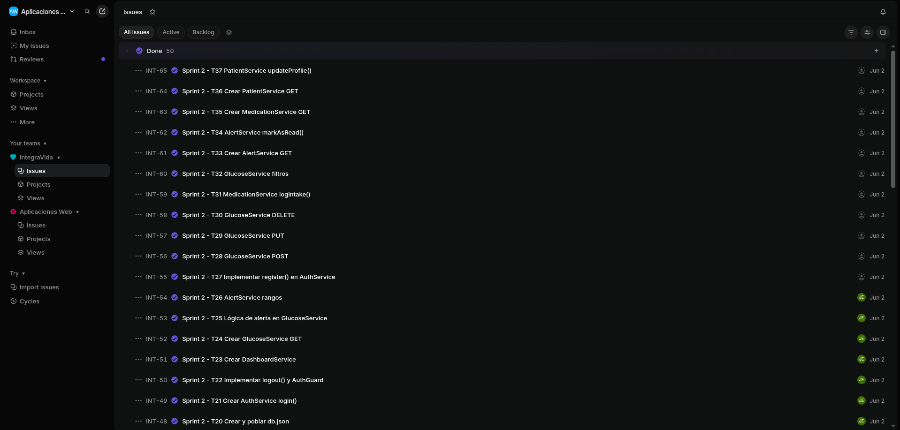
**URL del Board del Sprint 1:** `https://linear.app/aplicaciones-web/team/INT/all`

|Sprint#|Sprint 2|||||||
|---|---|---|---|---|---|---|---|
|**User Story**||**Work-Item/Task**||||||
|**Id**|**Title**|**Id**|**Title**|**Description**|**Estimation**|**Assigned To**|**Status**|
|US-04|Log in|T01|Crear LoginComponent|Implementar formulario de login con email/password, toggle show/hide password y botones Google/LinkedIn|3|Abigail|To-Do|
|US-02|Registro de paciente|T02|Crear RegisterComponent|Implementar formulario de registro con tabs Login/Sign Up y validaciones reactivas|3|Abigail|To-Do|
|US-06|Cerrar sesión|T03|Implementar logout en Sidebar|Agregar botón Sign Out en sidebar, limpiar localStorage y redirigir al login|1|Abigail|To-Do|
|US-55|Visualizar resumen general|T04|Crear DashboardComponent|Implementar Health Summary con cards de Current Glucose, Treatment Status, Readings Today y HbA1c|5|Abigail|To-Do|
|US-37|Gráficos de glucosa|T05|Implementar Glucose Trends chart|Integrar librería de gráficos con línea Actual vs Target de los últimos 7 días|5|Abigail|To-Do|
|US-17|Visualizar tratamiento actual|T06|Crear Upcoming Doses widget|Implementar lista de medicamentos del día con estados Done/Next/Later en el dashboard|3|Abigail|To-Do|
|US-41|Alertas en dashboard|T07|Crear Recent Alerts widget|Implementar sección Recent Alerts con badges High/Missed/Info en el dashboard|3|Abigail|To-Do|
|US-11|Consultar perfil del paciente|T08|Crear PatientProfileComponent|Implementar vista de perfil con secciones: info médica, contacto y configuración|3|Abigail|To-Do|
|US-08|Editar perfil de paciente|T09|Implementar edición de perfil|Habilitar botón Editar en secciones de info médica y contacto, con botón Guardar cambios|3|Abigail|To-Do|
|US-12|Registrar nivel de glucosa|T10|Crear GlucoseLogComponent|Implementar formulario Nueva Lectura con valor mg/dL, fecha, hora, estado del paciente y comentarios|3|943775190|To-Do|
|US-16|Alerta por glucosa fuera de rango|T11|Implementar lógica de color por rango|Mostrar badge Normal/Alto/Bajo según valor ingresado con colores semánticos en tiempo real|2|943775190|To-Do|
|US-13|Visualizar historial de glucosa|T12|Crear HealthHistoryComponent|Implementar tabla de registros con columnas Fecha, Hora, Glucosa, Estado y paginación|3|943775190|To-Do|
|US-38|Filtrar historial por fechas|T13|Implementar filtros en historial|Agregar filtros Desde/Hasta con accesos rápidos: Última semana, Último mes, 3 meses, 6 meses|3|943775190|To-Do|
|US-37|Evolución de glucosa en historial|T14|Implementar gráfico en historial|Integrar gráfico de línea con límite superior e inferior, estadísticas TIR, hiper, hipo y CV|3|943775190|To-Do|
|US-39|Editar registro de glucosa|T15|Implementar edición en tabla historial|Agregar botón editar en tabla, abrir modal con datos pre-cargados|2|943775190|To-Do|
|US-40|Eliminar registro de glucosa|T16|Implementar eliminación en tabla|Agregar botón eliminar con confirmación modal en tabla del historial|1|943775190|To-Do|
|US-41|Visualizar alertas y notificaciones|T17|Crear AlertsComponent|Implementar página de alertas con tabs Todas/Activas/Resueltas y lista con severidad|3|943775190|To-Do|
|US-43|Marcar alerta como leída|T18|Implementar "Marcar como visto"|Agregar botón por alerta y botón global "Marcar todas como vistas"|2|943775190|To-Do|
|US-42|Configurar rango de glucosa|T19|Implementar panel Configuración de Alertas|Agregar toggles para alertas de glucosa alta/baja y recordatorios en sidebar de alertas|2|943775190|To-Do|
||Poblar base de datos|T20|~~Crear y poblar db.json~~|~~Estructurar db.json con datos fake para: users, patients, glucose_records, medications, medication_intakes, alerts, glucose_ranges~~|3| Jean Arias |**Done**|
|US-04|Log in|T21|Crear AuthService - login()|GET /users, validar email+password, guardar sesión en localStorage|3|Jean Arias |Done|
|US-06|Cerrar sesión|T22|Implementar logout() + AuthGuard|Limpiar localStorage, redirigir al login e implementar guard en rutas protegidas|1|Jean Arias |Done|
|US-55|Dashboard data|T23|Crear DashboardService|Agregar llamadas a glucose_records, medications y alerts para armar resumen del dashboard|5|Jean Arias |Done|
|US-13|Historial de glucosa|T24|Crear GlucoseService - GET|Método getReadings(patientId) GET /glucose_records?patientId=, ordenar por fecha desc|3|Jean Arias |Done|
|US-16|Generar alerta automática|T25|Lógica de alerta en GlucoseService|Al guardar lectura evaluar vs glucose_ranges y hacer POST /alerts si está fuera de rango|3|Jean Arias |Done|
|US-42|Rangos de glucosa|T26|AlertService - rangos|Métodos GET y PUT /glucose_ranges?patientId= para leer y guardar configuración|2|Jean Arias |Done|
|US-02|Registro de paciente|T27|Implementar register() en AuthService|POST /users, verificar email duplicado antes de registrar|3|Josue|To-Do|
|US-12|Registrar glucosa|T28|GlucoseService - POST|Método saveReading() POST /glucose_records con validación de rango incluida|3|Josue|To-Do|
|US-39|Editar glucosa|T29|GlucoseService - PUT|Método updateReading() PUT /glucose_records/:id con validaciones|2|Josue|To-Do|
|US-40|Eliminar glucosa|T30|GlucoseService - DELETE|Método deleteReading() DELETE /glucose_records/:id|1|Josue|To-Do|
|US-19|Registrar toma de medicación|T31|MedicationService - logIntake()|POST /medication_intakes para confirmar toma de medicamento|2|Josue|To-Do|
|US-38|Filtrar historial|T32|GlucoseService - filtros|Método getReadingsByDateRange(from, to) usando query params en json-server|2|935598887|To-Do|
|US-41|Alertas|T33|Crear AlertService - GET|getAlerts(patientId) GET /alerts?patientId=, filtrar por status activo/resuelto|3|935598887|To-Do|
|US-43|Marcar alerta leída|T34|AlertService - markAsRead()|PATCH /alerts/:id con { read: true, status: 'resolved' }|2|935598887|To-Do|
|US-17|Medicación actual|T35|Crear MedicationService - GET|getMedications(patientId) GET /medications?patientId= filtrando activos|3|935598887|To-Do|
|US-11|Perfil paciente|T36|Crear PatientService - GET|getProfile(patientId) GET /patients/:id con todos los datos clínicos|2|935598887|To-Do|
|US-08|Editar perfil|T37|PatientService - updateProfile()|PUT /patients/:id para actualizar datos personales, médicos y configuración|3|935598887|To-Do|

### 5.2.2.4. Development Evidence for Sprint Review.
Durante el Sprint 2 se implementaron los principales módulos del Frontend Web Application de GlucoSmart. Los avances más destacados incluyen: la implementación de los bounded contexts de autenticación, dashboard, perfil del paciente, monitoreo de glucosa (con historial y gráficos), panel de alertas y gestión de citas; la configuración completa del json-server con el `db.json` poblado con datos de prueba; el desarrollo de todos los servicios Angular para la comunicación con la Fake API; y el despliegue del frontend en Firebase Hosting y del json-server en Render. A continuación se presenta la tabla de commits realizados durante el Sprint.

| Repository | Branch | Commit Id | Commit Message | Commit Message Body | Committed on |
| :--- | :--- | :--- | :--- | :--- | :--- |
| Integravida-FrontendServices | main | f24b0d08ac2c3ce093814aaf0e2c87fd417e4da6 | Initial commit | Initial Proyect & fake db added | Mayo 14, 2026 |
| Integravida-FrontendServices | feature/loginService-US04 | 24a5e388b70a82b858878f5b274cbfca2d4ddbb7 | feat: Add Log UserApi & signIn() | feat: Add Log UserApi & signIn() | Mayo 14, 2026 |
| Integravida-FrontendServices | feature/logOutService-US06 | e95291ab00b14a624dc027d24d8bda8a1c0408bf | feat: Implement AuthStore & signOut Service | feat: Implement AuthStore & signOut Service | Mayo 14, 2026 |
| Integravida-FrontendServices | feature/logOutService-US06 | d32b6a6882c4b89dd12b369fcc0d234e5a5609fd | feat: Change the ApiURL & delete FakedbData | feat: Change the ApiURL & delete FakedbData | Mayo 14, 2026 |
| Integravida-FrontendServices | feature/dashboardData-US55 | 81b1b2f5894fcfcb3355bd0a7535068ddbe1f8af | feat: Implement dashboardServices & testing to check the load data from a Json-ServerUrl | feat: Implement dashboardServices & testing to check the load data from a Json-ServerUrl | Mayo 14, 2026 |
| Integravida-FrontendServices | feature/GlucoseReadings-US13 | 5204d51062bd47f8cfd1fdf6ea024608261845fa | feat: Implement glucoseReadings and testing in the dashboard test | feat: Implement glucoseReadings and testing in the dashboard test | Mayo 14, 2026 |
| Integravida-FrontendServices | development | 8d1abf1ccf5c433cf046ae26991f139117bdc32b | hotfix: explain needs code to run the fake data | hotfix: explain needs code to run the fake data | Mayo 14, 2026 |
| Integravida-FrontendServices | development | 095b016d4b13ad98d4c2a4736a63b84c8f3c8606 | Merge pull request #1 from MTS-OpenSource/feature/loginService-US04 | feat: Add Log UserApi & signIn() | Mayo 14, 2026 |
| Integravida-FrontendServices | development | ad206c1756829f2e5c79e0435af9056443e821c3 | Merge pull request #2 from MTS-OpenSource/feature/logOutService-US06 | Feature/log out service us06 | Mayo 14, 2026 |
| Integravida-FrontendServices | development | fba16e93fbc4404a00fb00f8d047898f879dd7d1 | Merge pull request #3 from MTS-OpenSource/feature/dashboardData-US55 | feat: Implement dashboardServices & testing to check the load data from a Json-ServerUrl | Mayo 14, 2026 |
| Integravida-FrontendServices | development | 724b4215209f89c4c3864df985ad139a28717404 | Merge pull request #5 from MTS-OpenSource/feature/GlucoseReadings-US13 | feat: Implement glucoseReadings and testing in the dashboard test | Mayo 14, 2026 |
| Integravida-FrontendServices | main | ad206c1756829f2e5c79e0435af90325325f325 | feat: fixed alert bugs | feat: fixed alert bugs | Mayo 14, 2026 |
| Integravida-FrontendServices | feature/patient-profile-management-frontend | f2ea363ea7642b93d5f71fdbe14723928bb3aab3 | feat: add patient profile management flows | Added Patient Profile Management flows following layered frontend architecture using domain, application, infrastructure and presentation folders | Mayo 14, 2026 |
| Integravida-FrontendServices | feature/frontend-ddd-cleanup-glucose | 1687481cf18e789c67bcb259b8cf22e65b8b94ab| Merge pull request #10 from MTS-OpenSource/feature/frontend-ddd-cleanup-glucose | Integrated frontend cleanup and bounded context organization using Domain-Driven Design architecture | Mayo 14, 2026 |
| Integravida-FrontendServices | feature/Medical-Followup-Dashboard | b5bd92b63d18784f5613765dea6c8f05526a89c4 | Merge pull request #13 from MTS-OpenSource/feature/Medical-Followup-Dashboard | Integrated Medical Follow-up Dashboard module into development branch | Mayo 14, 2026 |
| Integravida-FrontendServices | feature/appointment-management-javier | c937102e6aeb3fa2530804ca77ba18e12cb86298 | Merge pull request #12 from MTS-OpenSource/feature/appointment-management-javier | Integrated Appointment Management frontend module into the application | Mayo 14, 2026 |
| Integravida-FrontendServices | feature/patient-profile-management-frontend | 94fd770ff0ff5717fbbc639faf90d323336639e2 | Improve patient profile UI and editing experience | Improved Patient Profile interface, responsive layout and profile editing experience for Patient Profile Management bounded context | Mayo 15, 2026 |
| Integravida-FrontendServices | feature/Medical-Followup-Dashboard | 0a801d4aae1fb232caea198942142ed8fdc836d3 | Added files via upload | Revised TypeScript files for Medical Followup features in Dashboard | Mayo 15, 2026 |
| Integravida-FrontendServices | feature/Medical-Followup-Dashboard | 269291a2c12d7e86ce9ccaa5980c1b095f47b430 | Added files via upload | Added modified components for dashboard and glucose charts | Mayo 15, 2026 |
| Integravida-FrontendServices | feature/Medical-Followup-Dashboard | d55c27aa5d0bafb7b4b633d5e89ac3b69652b464 | Added files via upload from cloned repository | Added HTML changes for show Dashboard with the features of Medical Followup including Charts, Recent Alerts, and Medications List | Mayo 15, 2026 |

### 5.2.2.5. Execution Evidence for Sprint Review.

En este Sprint se implementaron las principales vistas funcionales de la Web Application de GlucoSmart. Las secciones desarrolladas incluyen:

- **Login / Register** — autenticación con validaciones y toggle de contraseña
- **Dashboard** — resumen de salud con gráfico de tendencias y medicamentos del día
- **Registro de Glucosa** — formulario con clasificación en tiempo real Normal/Alto/Bajo
- **Historial de Salud** — tabla paginada con filtros de fecha y gráfico de evolución
- **Alertas y Notificaciones** — gestión de alertas activas y resueltas con configuración de rangos
- **Perfil del Paciente** — datos clínicos, contacto y configuración editable

URL del FrontEnd Desplegado: **https://integravida-appweb.web.app/**
### Video Demonstration

El siguiente video muestra la ejecución funcional de la Frontend Web Application de IntegraVida durante el Sprint 2, incluyendo autenticación, dashboard médico, Patient Profile Management, historial de glucosa y despliegue de la aplicación.

https://youtu.be/_JOh925f1DE

### 5.2.2.6. Services Documentation Evidence for Sprint Review.
Durante el Sprint 2 se configuró e implementó la Fake RESTful API mediante json-server, utilizando el repositorio `JsondbData`. Este servidor expone todos los endpoints necesarios para que el frontend pueda realizar operaciones CRUD sobre las entidades del sistema. Los endpoints se consumen desde la URL base `https://integravida-data.onrender.com`. La tabla a continuación documenta cada endpoint disponible con su verbo HTTP, descripción, parámetros y servicio Angular asignado.

### Services Documentation Evidence for Sprint Review

Todos los endpoints se consumen mediante json-server corriendo en https://integravida-data.onrender.com.

| Endpoint             | Verbo HTTP | Descripción                    | Parámetros                                    | Assigned Service  |
| -------------------- | ---------- | ------------------------------ | --------------------------------------------- | ----------------- |
| /users               | GET        | Obtener usuarios para login    | email, password (query)                       | AuthService       |
| /users               | POST       | Registrar nuevo usuario        | body: { email, password, role }               | AuthService       |
| /patients/:id        | GET        | Obtener perfil del paciente    | id (path)                                     | PatientService    |
| /patients/:id        | PUT        | Actualizar perfil del paciente | id (path), body completo                      | PatientService    |
| /glucose_records     | GET        | Obtener lecturas de glucosa    | patientId (query)                             | GlucoseService    |
| /glucose_records     | POST       | Guardar nueva lectura          | body: { patientId, value, date, time, state } | GlucoseService    |
| /glucose_records/:id | PUT        | Editar lectura existente       | id (path), body actualizado                   | GlucoseService    |
| /glucose_records/:id | DELETE     | Eliminar lectura               | id (path)                                     | GlucoseService    |
| /alerts              | GET        | Obtener alertas del paciente   | patientId (query)                             | AlertService      |
| /alerts              | POST       | Crear alerta automática        | body: { patientId, type, value }              | AlertService      |
| /alerts/:id          | PATCH      | Marcar alerta como leída       | id (path), body: { read: true }               | AlertService      |
| /glucose_ranges      | GET        | Obtener rangos configurados    | patientId (query)                             | AlertService      |
| /glucose_ranges/:id  | PUT        | Actualizar rangos de glucosa   | id (path), body: { min, max }                 | AlertService      |
| /medications         | GET        | Obtener medicamentos activos   | patientId (query)                             | MedicationService |
| /medication_intakes  | POST       | Registrar toma de medicamento  | body: { medicationId, patientId, takenAt }    | MedicationService |

### 5.2.2.7. Software Deployment Evidence for Sprint Review.

Durante el Sprint 2 se realizaron dos despliegues: el **Frontend Web Application** en Firebase Hosting y el **json-server (Fake API)** en Render. Ambos servicios están disponibles públicamente y son consumidos de forma integrada.

**Despliegue del Frontend en Firebase Hosting:**

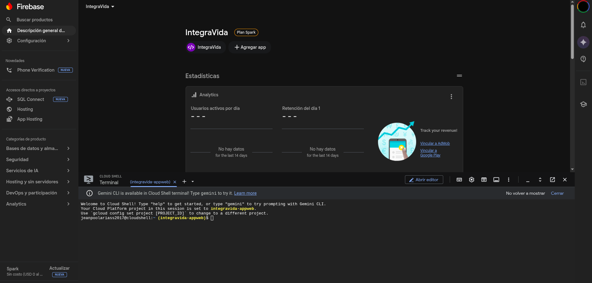

1. Instalar Firebase CLI: `npm install -g firebase-tools`
2. Autenticarse: `firebase login`
3. Inicializar Firebase en el proyecto `Integravida-FrontendServices`: `firebase init hosting`
   - Seleccionar el proyecto de Firebase de GlucoSmart.
   - Public directory: `dist/integravida-frontend-services`
   - Configurar como Single Page App: Sí
4. Compilar Angular para producción: `ng build --configuration production`
5. Desplegar: `firebase deploy --only hosting`
6. URL generada: **https://integravida-appweb.web.app/**

**Despliegue del json-server en Render:**

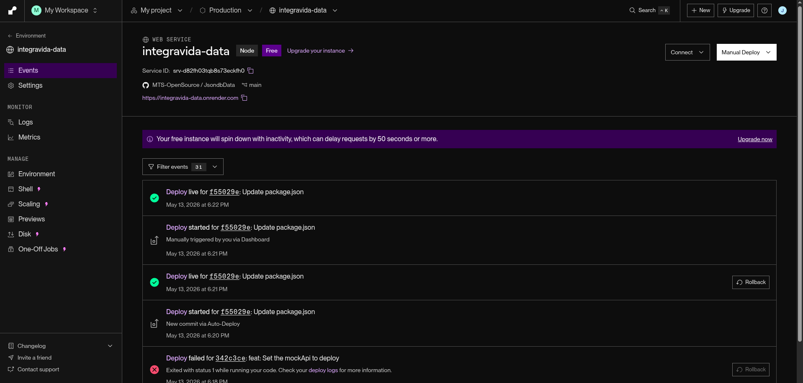

1. Se aseguró que el repositorio `JsondbData` en GitHub tuviera el `db.json` y el `package.json` con el script: `"start": "json-server --watch db.json --port 3000"`.
2. Se creó un nuevo servicio "Web Service" en Render apuntando al repositorio `JsondbData`.
3. Se configuró: Environment: Node, Build Command: `npm install`, Start Command: `npm start`.
4. Render generó la URL pública del servicio: **https://integravida-data.onrender.com/**
5. Se actualizó la variable `API_BASE_URL` en el frontend con la URL de Render.

### 5.2.2.8. Team Collaboration Insights during Sprint.

Durante el Sprint 2, las tareas fueron distribuidas colaborativamente entre todos los integrantes del equipo de desarrollo utilizando GitHub Flow, Pull Requests y ramas independientes por funcionalidad. Jean Pool Arias lideró la integración general del frontend, la configuración de servicios y la arquitectura base del proyecto. Abigail Raymundo lideró el desarrollo del módulo Patient Profile Management, incluyendo la interfaz de perfil, edición de datos y mejoras visuales. Juan Sebastian Estupiñan participó en los módulos de monitoreo y registro de glucosa. Javier Oswaldo Tello desarrolló funcionalidades del bounded context Appointment Management. Jose Antonio Muñoz colaboró en la implementación de servicios REST y lógica de integración.

Asimismo, el equipo organizó el frontend utilizando una arquitectura basada en Domain-Driven Design y separación por capas domain, application, infrastructure y presentation, permitiendo una mejor modularidad, escalabilidad e integración entre Bounded Contexts.

| Team Member              | GitHub Username      | Commits    | Insertions | Deletions |
| :----------------------- | :------------------- | :--------- | :--------- | :-------- |
| Jean Pool Arias          | Jean-AT              | 14 commits | 17,009 ++  | 1,972 --  |
| Abigail Raymundo         | AbigailRV            | 7 commits  | 3,118 ++   | 4,569 --  |
| Juan Sebastian Estupiñan | JuanSEstupinan       | 6 commits  | 8,071 ++   | 8,090 --  |
| Javier Oswaldo Tello     | javiertellomurga-Dev | 1 commit   | 1,106 ++   | 2,959 --  |
| Jose Antonio Muñoz       | joseam05             | 1 commit   | 863 ++     | 1 --      |
|                          |                      |            |            |           |

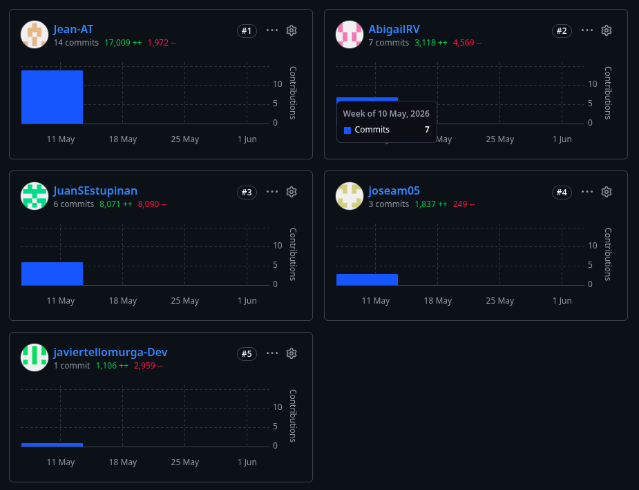

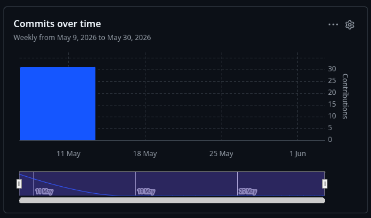

### 5.2.3. Sprint 3

## 5.2.3.1. Sprint Planning 3

Esta sección documenta la planificación del tercer Sprint del proyecto GlucoSmart. El objetivo principal de este Sprint fue implementar el **backend RESTful API** en Spring Boot siguiendo arquitectura DDD + CQRS distribuido en los 5 bounded contexts (IAM, Profiles, Patients, Medical, Monitoring), migrar la persistencia desde json-server hacia **PostgreSQL** desplegado mediante **Docker**, documentar todos los endpoints con **Swagger/OpenAPI**, y completar las vistas pendientes del **Frontend Web Application** que quedaron fuera del alcance del Sprint 2. Al finalizar el Sprint, el sistema debía operar de punta a punta: Angular consumiendo la API real de Spring Boot, con persistencia en PostgreSQL y documentación interactiva disponible en Swagger UI.

|Sprint #|Sprint 3|
|:--|:--|
|**Sprint Planning Background**||
|Date|03/06/2026 - 18/06/2026|
|Time|7:00 PM|
|Location|Virtual - Discord|
|Prepared By|Jean Pool Arias|
|Attendees (To planning meeting)|Jean Pool Alexander Arias Tasayco Abigail Nadhim Raymundo Villarroel Juan Sebastian Estupiñan Olortegui Javier Oswaldo Tello Murga Jose Antonio Muñoz Amasifuen|
|Sprint N-1 Review Summary|El Sprint 2 culminó con la implementación exitosa de las vistas funcionales del Frontend Web Application conectadas a json-server, incluyendo autenticación, dashboard, monitoreo de glucosa, alertas y perfil del paciente. El equipo identificó que el siguiente paso crítico era reemplazar la Fake API por un backend real en Spring Boot con persistencia relacional, además de completar las vistas pendientes del lado del médico (Doctor Dashboard, diagnósticos, reportes clínicos) y de citas médicas.|
|Sprint N-1 Retrospective Summary|El equipo identificó como acierto la organización del frontend en capas DDD (domain, application, infrastructure, presentation), lo que facilitó la incorporación de nuevos bounded contexts. Como oportunidad de mejora se señaló la necesidad de definir contratos de API (DTOs y endpoints) antes de iniciar el desarrollo paralelo de frontend y backend, para evitar reproceso al momento de la integración real.|
|**Sprint Goal & User Stories**||
|Sprint N Goal|Our focus is on delivering a fully functional backend RESTful API built with Spring Boot following Domain-Driven Design and CQRS principles, persisted on PostgreSQL via Docker, and documented through Swagger. We believe it provides a production-ready service layer for IntegraVida. This will be confirmed when the Angular frontend consumes the real Spring Boot API instead of json-server, all five bounded contexts (IAM, Profiles, Patients, Medical, Monitoring) expose working endpoints, and the remaining frontend views (Doctor Dashboard, Appointments, Clinical Reports) are completed and integrated.|
|Sprint N Velocity|230|
|Sum of Story Points|230|

---

## 5.2.3.2. Aspect Leaders and Collaborators

En el Sprint 3, los principales aspectos de trabajo se dividieron entre la implementación del backend Spring Boot por bounded context y la finalización de las vistas pendientes del Frontend Web Application. Se indica con **L** al líder responsable de las decisiones técnicas del aspecto y con **C** al colaborador de apoyo.

| Team Member              | GitHub Username | IAM Backend | Profiles Backend | Patients Backend | Medical Backend | Monitoring Backend | Frontend Completion | DB & Docker | Swagger Docs |
| :----------------------- | :-------------- | :---------- | :--------------- | :--------------- | :-------------- | :----------------- | :------------------ | :---------- | :----------- |
| Jean Pool Arias          | Jean-AT         | C           | C                | C                | C               | L                  | L                   | L           | L            |
| Abigail Raymundo         | AbigailRv       | C           | L                | C                | C               | C                  | C                   | C           | C            |
| Juan Sebastian Estupiñan | JuanSEstupinan  | C           | C                | C                | L               | C                  | C                   | C           | C            |
| Javier Oswaldo Tello     | JavierTello20   | C           | C                | L                | C               | C                  | C                   | C           | C            |
| Jose Antonio Muñoz       | joseam05        | C           | C                | C                | L               | L                  | C                   | C           | C            |

---

## 5.2.3.3. Sprint Backlog 3

El objetivo principal de este Sprint es migrar el sistema GlucoSmart desde una Fake API (json-server) hacia un backend real desarrollado en Spring Boot con arquitectura DDD + CQRS, persistido en PostgreSQL mediante contenedores Docker y documentado con Swagger/OpenAPI. En paralelo, se completan las vistas pendientes del Frontend Web Application, principalmente las orientadas al rol de médico (Doctor Dashboard, diagnósticos, reportes clínicos) y al módulo de citas.

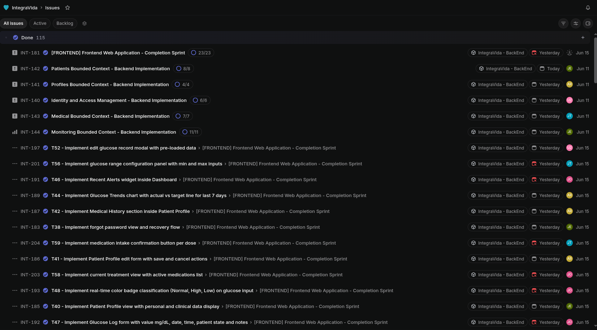

**URL del Board del Sprint 3:** [`https://linear.app/integravida/team/INT/all`](https://linear.app/aplicaciones-web/team/INT/all)

|Sprint#|Sprint 3|||||||
|---|---|---|---|---|---|---|---|
|**User Story**||**Work-Item/Task**||||||
|**Id**|**Title**|**Id**|**Title**|**Description**|**Estimation**|**Assigned To**|**Status**|
|US-02, US-03|Registro de paciente / doctor|T01|Create DDD package structure|Inicializar estructura de paquetes interfaces, application, domain, infrastructure para el contexto IAM|1|Jean Pool|To-Do|
|US-02, US-03|Registro de paciente / doctor|T02|Implement User aggregate with value objects|Crear el aggregate User con value objects de Roles (Patient/Doctor)|3|Jean Pool|To-Do|
|US-02, US-03, US-04|Registro y login|T03|Implement UserCommandService + UserQueryService|Servicios CQRS para creación y consulta de usuarios|3|Jean Pool|To-Do|
|US-04, US-06|Log in / Cerrar sesión|T04|Configure JWT filter + SecurityConfig|Filtro de seguridad stateless con JWT y configuración de Spring Security|3|Jean Pool|To-Do|
|US-02, US-03, US-04|Registro y login|T05|Implement endpoints POST /api/v1/authentication/sign-up and sign-in|Endpoints de registro y autenticación que retornan JWT|3|Jean Pool|To-Do|
|—|—|T06|Create IamContextFacade ACL|Facade de acceso controlado para que otros contextos consulten datos de IAM|2|Jean Pool|To-Do|
|US-07, US-08, US-11|Perfil del paciente|T07|Implement Profile aggregate with value objects|Aggregate Profile con PersonName, EmailAddress, DateOfBirth|3|Abigail|To-Do|
|US-07, US-08|Crear / editar perfil|T08|Implement ProfileCommandService + ProfileQueryService|Servicios CQRS para gestión de perfiles|3|Abigail|To-Do|
|—|—|T09|Create ProfilesContextFacade ACL|Facade de acceso para que Patients consuma datos de Profiles|2|Abigail|To-Do|
|US-07, US-08, US-11|Perfil del paciente|T10|Implement endpoints GET/POST/PUT /api/v1/profiles|Endpoints REST de creación, consulta y edición de perfil|3|Abigail|To-Do|
|US-07, US-08, US-11|Perfil del paciente|T11|Implement Patient aggregate|Aggregate Patient vinculado al perfil mediante ProfileId|3|Javier|To-Do|
|US-17, US-18, US-49|Tratamiento|T12|Implement Treatment aggregate with TreatmentStatus|Aggregate Treatment con value object TreatmentStatus (Active/Completed)|3|Javier|To-Do|
|US-17, US-19, US-20|Medicación|T13|Implement Medication aggregate with MedicationSchedule|Aggregate Medication con horarios y dosis programadas|3|Javier|To-Do|
|—|—|T14|Implement ExternalProfileService ACL outbound|Servicio de salida que consulta ProfilesContextFacade|2|Javier|To-Do|
|US-07, US-08, US-11|Perfil del paciente|T15|Implement endpoints GET/POST /api/v1/patients|Endpoints REST de pacientes|3|Javier|To-Do|
|US-17, US-18, US-49|Tratamiento|T16|Implement endpoints GET/POST/PUT /api/v1/treatments|Endpoints REST de tratamientos|3|Javier|To-Do|
|US-17, US-19, US-20|Medicación|T17|Implement endpoints GET/POST /api/v1/medications|Endpoints REST de medicamentos|3|Javier|To-Do|
|US-19|Toma de medicación|T18|Implement endpoint POST /api/v1/medication-intakes|Endpoint para confirmar la toma de un medicamento|2|Javier|To-Do|
|US-25|Diagnóstico|T19|Implement Diagnosis aggregate|Aggregate Diagnosis con DiagnosisCode|2|Jose Antonio|To-Do|
|US-26|Reporte clínico|T20|Implement ClinicalReport aggregate|Aggregate ClinicalReport con resumen estructurado|3|Jose Antonio|To-Do|
|US-27, US-28, US-34, US-35|Citas médicas|T21|Implement Appointment aggregate with AppointmentStatus|Aggregate Appointment con ciclo Scheduled→Confirmed→Completed/Cancelled|5|Jose Antonio|To-Do|
|—|—|T22|Implement ExternalPatientService + ExternalMonitoringService ACL outbound|Servicios de salida para consultar Patients y Monitoring|2|Jose Antonio|To-Do|
|US-25|Diagnóstico|T23|Implement endpoints GET/POST /api/v1/diagnoses|Endpoints REST de diagnósticos|2|Jose Antonio|To-Do|
|US-26|Reporte clínico|T24|Implement endpoints GET/POST /api/v1/clinical-reports|Endpoints REST de reportes clínicos|3|Jose Antonio|To-Do|
|US-27, US-28, US-34, US-35, US-36|Citas médicas|T25|Implement endpoints GET/POST/PUT/DELETE /api/v1/appointments|Endpoints REST completos de citas médicas|5|Jose Antonio|To-Do|
|US-12, US-13, US-39, US-40|Glucosa|T26|Implement GlucoseRecord aggregate with command and query services|Aggregate GlucoseRecord con CRUD CQRS completo|5|Juan Sebastian|To-Do|
|US-16, US-41, US-43|Alertas|T27|Implement Alert aggregate with auto-generation logic when glucose is out of range|Aggregate Alert que se dispara automáticamente al evaluar GlucoseValue fuera de rango|5|Juan Sebastian|To-Do|
|US-42|Rango de glucosa|T28|Implement GlucoseRange aggregate with command and query services|Aggregate GlucoseRange configurable por paciente|3|Juan Sebastian|To-Do|
|US-24|Observaciones médicas|T29|Implement ClinicalObservation aggregate with command and query services|Aggregate ClinicalObservation vinculado al paciente|3|Juan Sebastian|To-Do|
|—|—|T30|Implement ExternalPatientService ACL outbound|Servicio de salida para validar existencia del paciente|2|Juan Sebastian|To-Do|
|US-12, US-13, US-39, US-40|Glucosa|T31|Implement endpoints GET/POST/PUT/DELETE /api/v1/glucose-records|Endpoints REST completos de registros de glucosa|5|Juan Sebastian|To-Do|
|US-37, US-38|Gráficos / Filtros|T32|Implement endpoints GET /api/v1/glucose-records with date range filter|Endpoint con query params from/to para filtrado histórico|3|Juan Sebastian|To-Do|
|US-41, US-43|Alertas|T33|Implement endpoints GET/PATCH /api/v1/alerts|Endpoints REST de alertas y marcado como leída|3|Juan Sebastian|To-Do|
|US-42|Rango de glucosa|T34|Implement endpoints GET/PUT /api/v1/glucose-ranges|Endpoints REST de configuración de rangos|3|Juan Sebastian|To-Do|
|US-24|Observaciones médicas|T35|Implement endpoints GET/POST /api/v1/clinical-observations|Endpoints REST de observaciones clínicas|3|Juan Sebastian|To-Do|
|US-12, US-16, US-41, US-42|Glucosa / Alertas|T36|Implement unit and integration tests for GlucoseRecord, Alert and GlucoseRange|Pruebas unitarias e integración del core clínico|3|Juan Sebastian|To-Do|
|US-02, US-03, US-04|Login / Registro|T37|Implement Login and Register views with reactive form validations and role selector|Vista de login y registro con selector Patient/Doctor|5|Abigail|To-Do|
|US-05|Recuperar contraseña|T38|Implement forgot password view and recovery flow|Vista de recuperación de contraseña vía email|2|Abigail|To-Do|
|US-04, US-06|Sesión|T39|Implement AuthGuard and route protection for private views|Guard de Angular para proteger rutas privadas|1|Abigail|To-Do|
|US-07, US-11|Perfil|T40|Implement Patient Profile view with personal and clinical data display|Vista de perfil consolidada|3|Abigail|To-Do|
|US-08|Editar perfil|T41|Implement Patient Profile edit form with save and cancel actions|Formulario de edición de perfil|3|Abigail|To-Do|
|US-09, US-10|Antecedentes médicos|T42|Implement Medical History section inside Patient Profile|Sección de antecedentes médicos dentro del perfil|2|Abigail|To-Do|
|US-55|Resumen general|T43|Implement Dashboard summary cards|Cards de Current Glucose, HbA1c, Readings Today, Treatment Status|5|Abigail|To-Do|
|US-37|Gráficos de glucosa|T44|Implement Glucose Trends chart with actual vs target line for last 7 days|Gráfico de línea de tendencias de los últimos 7 días|5|Abigail|To-Do|
|US-17, US-20|Tratamiento / Recordatorios|T45|Implement Upcoming Doses widget with medication status|Widget de próximas dosis con estados Done/Next/Later|3|Abigail|To-Do|
|US-41|Alertas|T46|Implement Recent Alerts widget inside Dashboard|Widget de alertas recientes en el dashboard|2|Abigail|To-Do|
|US-12|Registrar glucosa|T47|Implement Glucose Log form with value, date, time, state and notes|Formulario de nueva lectura de glucosa|3|Juan Sebastian|To-Do|
|US-16|Alerta por rango|T48|Implement real-time color badge classification on glucose input|Badge en tiempo real Normal/Alto/Bajo|2|Juan Sebastian|To-Do|
|US-13|Historial de glucosa|T49|Implement Health History table with paginated glucose records|Tabla paginada de historial de glucosa|3|Juan Sebastian|To-Do|
|US-38|Filtro por fechas|T50|Implement date range filters in Health History|Filtros rápidos: última semana, mes, 3 y 6 meses|3|Juan Sebastian|To-Do|
|US-37, US-15|Evolución de salud|T51|Implement evolution chart in Health History with TIR stats|Gráfico de evolución con estadísticas TIR/hiper/hipo/CV|5|Juan Sebastian|To-Do|
|US-39|Editar registro|T52|Implement edit glucose record modal with pre-loaded data|Modal de edición de registro de glucosa|2|Juan Sebastian|To-Do|
|US-40|Eliminar registro|T53|Implement delete glucose record with confirmation modal|Confirmación de eliminación de registro|1|Juan Sebastian|To-Do|
|US-41|Alertas|T54|Implement Alerts view with tabs All, Active and Resolved|Vista de alertas con tabs por estado|3|Juan Sebastian|To-Do|
|US-43|Marcar leída|T55|Implement mark single alert as read and mark all as read actions|Acciones de marcado individual y masivo|2|Juan Sebastian|To-Do|
|US-42|Configurar rango|T56|Implement glucose range configuration panel|Panel de configuración de rangos min/max|2|Juan Sebastian|To-Do|
|US-21, US-44|Efectos adversos|T57|Implement Adverse Effects register form and history list|Formulario y listado de farmacovigilancia|3|Javier|To-Do|
|US-17|Tratamiento actual|T58|Implement current treatment view with active medications list|Vista de tratamiento activo|2|Javier|To-Do|
|US-19|Confirmar toma|T59|Implement medication intake confirmation button per dose|Botón de confirmación de toma por dosis|2|Javier|To-Do|
|US-27|Solicitar cita|T60|Implement Appointment request form with date, time and doctor selector|Formulario de solicitud de cita|3|Javier|To-Do|
|US-28|Agenda de citas|T61|Implement Appointments agenda view with scheduled appointments|Vista de agenda cronológica|3|Javier|To-Do|
|US-34|Reprogramar cita|T62|Implement reschedule appointment modal|Modal de reprogramación de cita|2|Javier|To-Do|
|US-35|Cancelar cita|T63|Implement cancel appointment action with confirmation dialog|Confirmación de cancelación de cita|1|Javier|To-Do|
|US-46|Dashboard médico|T64|Implement Doctor Dashboard with patient list and quick access|Dashboard del médico con listado de pacientes|5|Javier|To-Do|
|US-47|Buscar paciente|T65|Implement patient search by name or ID inside Doctor Dashboard|Búsqueda de pacientes por nombre o DNI|2|Javier|To-Do|
|US-48|Evolución gráfica|T66|Implement patient glucose evolution chart view for Doctor|Vista de evolución de glucosa para el médico|3|Javier|To-Do|
|US-24|Observación médica|T67|Implement medical observation register form inside patient record|Formulario de observaciones médicas|2|Jose Antonio|To-Do|
|US-25|Diagnóstico|T68|Implement diagnosis register form inside patient clinical history|Formulario de diagnóstico|2|Jose Antonio|To-Do|
|US-26|Reporte clínico|T69|Implement clinical report generator view with structured summary|Generador de reporte clínico estructurado|5|Jose Antonio|To-Do|
|US-49|Actualizar tratamiento|T70|Implement treatment update form for Doctor to modify prescriptions|Formulario de ajuste terapéutico para el médico|3|Jose Antonio|To-Do|
|US-45|Evaluar efectos adversos|T71|Implement adverse effects evaluation view for Doctor|Vista de evaluación de efectos adversos|3|Jose Antonio|To-Do|
|US-22|Adherencia|T72|Implement treatment adherence view for Doctor with compliance percentage|Vista de porcentaje de adherencia al tratamiento|3|Jose Antonio|To-Do|
|US-50|Compartir información|T73|Implement shared clinical information access flow between Patient and Doctor|Flujo de compartición de datos clínicos|3|Jose Antonio|To-Do|
|US-51|Recomendaciones|T74|Implement doctor recommendations notification view for Patient|Vista de notificación de recomendaciones médicas|2|Abigail|To-Do|
|US-52|Notificar cancelación|T75|Implement appointment cancellation notification for Patient and Doctor|Notificación de cancelación de cita|2|Abigail|To-Do|
|US-53|Disponibilidad de citas|T76|Implement available appointment slots validation before scheduling|Validación de horarios disponibles|2|Abigail|To-Do|
|US-54|Confirmar cita|T77|Implement appointment confirmation action with status update|Confirmación de cita con cambio de estado|1|Abigail|To-Do|
|US-02, US-03, US-04, US-12, US-13, US-16, US-41, US-42|Integración general|T78|Implement Angular services connection to backend REST API replacing json-server|Reemplazo completo de json-server por la API real de Spring Boot|5|Jean Pool|To-Do|
|US-02, US-04, US-12|Manejo de errores|T79|Implement global error handler and HTTP interceptor for API error responses|Interceptor HTTP y manejo centralizado de errores|3|Jean Pool|To-Do|
|US-01, US-29|Responsive|T80|Implement responsive layout adjustments for all views|Ajustes responsive para mobile y tablet en todas las vistas|3|Abigail|To-Do|
|—|—|T81|Configure PostgreSQL database via Docker container|Definir `docker-compose.yml` con servicio PostgreSQL, volumen persistente y variables de entorno|3|Jean Pool|To-Do|
|—|—|T82|Configure Spring Boot datasource connection to PostgreSQL|Configurar `application-prod.properties` con credenciales y URL de conexión JDBC|2|Jean Pool|To-Do|
|—|—|T83|Configure SpringDoc OpenAPI / Swagger UI|Integrar dependencia `springdoc-openapi` y exponer `/swagger-ui/index.html`|2|Jean Pool|To-Do|
|—|—|T84|Document all REST endpoints with OpenAPI annotations|Anotar controllers con `@Operation`, `@ApiResponse` y esquemas de DTOs|3|Jean Pool|To-Do|

---

## 5.2.3.4. Development Evidence for Sprint Review

Durante el Sprint 3 se implementó el backend completo de GlucoSmart en Spring Boot, organizado en los 5 bounded contexts definidos (IAM, Profiles, Patients, Medical, Monitoring), siguiendo el patrón DDD + CQRS ya validado en el proyecto base. Se migró la persistencia desde json-server hacia **PostgreSQL**, desplegado mediante un contenedor **Docker**, y se documentaron todos los endpoints mediante **Swagger/OpenAPI**. En paralelo, se completaron las vistas pendientes del Frontend Web Application orientadas al médico (Doctor Dashboard, diagnósticos, reportes clínicos, adherencia) y al módulo de citas médicas, además de reemplazar las llamadas a json-server por la API real.

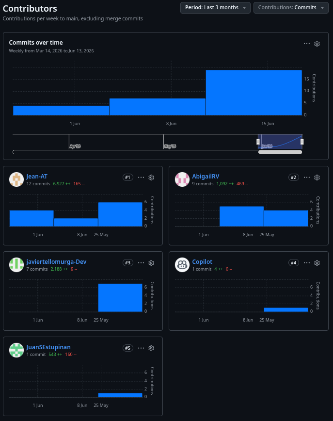

| #   | Rama Asociada                          | Commit ID                                | Autor                | Mensaje del Commit                                                                                            | Fecha               |
| --- | -------------------------------------- | ---------------------------------------- | -------------------- | ------------------------------------------------------------------------------------------------------------- | ------------------- |
| 1   | main                                   | 17885d9c13cb9025829a4ed859dc244b17c74e7b | Jean-AT              | feat: Update OpenApi Documentation                                                                            | 2026-06-20 21:36:25 |
| 2   | main                                   | 3aa474ba1e5b7bab9cc402ccc0bb342a6507f54e | Jean-AT              | feat: Prepare to deploy                                                                                       | 2026-06-20 21:27:02 |
| 3   | main                                   | 5050eb15fe37018983712a2b73d2db0c78cd4606 | Jean-AT              | feat: Implement the Public Database                                                                           | 2026-06-20 20:55:42 |
| 4   | main                                   | adfb087533b48c4752f1f6b22d2e42bb9fc71590 | AbigailRV            | Merge fix/cors-frontend-connection: enable CORS for frontend localhost:4200                                   | 2026-06-20 15:19:45 |
| 5   | develop                                | 6a16d76aa4230ad142b79f7342bfe413d160b3a5 | JavierTello20        | Merge pull request #10 from MTS-OpenSource/feature/appointment-aggregate                                      | 2026-06-19 10:00:57 |
| 6   | feature/appointment-aggregate          | beae4c38f5823b9e7d1860e12c6681dd36f30bbc | javiertellomurga-Dev | Merge remote-tracking branch 'origin/main' into feature/appointment-aggregate                                 | 2026-06-19 09:58:01 |
| 7   | fix/cors-frontend-connection           | fbf17fddb426de5f744acafb1b34e4eb8b22c75e | AbigailRV            | fix(cors): allow frontend localhost:4200 to call /api/v1/** endpoints                                         | 2026-06-19 06:25:30 |
| 8   | feature/appointment-aggregate          | 7711c7ebc7abae161e601d316b99eac80d2b55dc | javiertellomurga-Dev | fix(appointments): allow frontend origin for appointment endpoints                                            | 2026-06-19 02:43:52 |
| 9   | feature/appointment-aggregate          | 1b93f4318cffdd095cd369138c978eb906a33219 | javiertellomurga-Dev | fix(medical): use unique external patient adapter bean name                                                   | 2026-06-19 02:43:35 |
| 10  | feature/patient                        | 22e0d7ee8c3dcece020767f6acf2e6b6274c725e | Jean-AT              | hotfix: Update patients boundend                                                                              | 2026-06-19 00:59:07 |
| 11  | main                                   | c1e5cd4ee380c2af58709563f8a0d928405b6c5b | JuanSEstupinan       | Delete src/main/java/com/integravida/IntegraVidaBackend/iam/application/package-info.java                     | 2026-06-18 20:22:14 |
| 12  | main                                   | 5db203afad0c8f6c859169318c8d450ec6cd5abf | JuanSEstupinan       | Delete src/main/java/com/integravida/IntegraVidaBackend/iam/infrastructure/package-info.java                  | 2026-06-18 20:21:55 |
| 13  | main                                   | 4e6001a92cfa141781af47146086bb987bfcc856 | JuanSEstupinan       | Delete src/main/java/com/integravida/IntegraVidaBackend/iam/interfaces/rest/package-info.java                 | 2026-06-18 20:21:19 |
| 14  | develop                                | 66996d3668142a67f11b324b61caf61b29e07dce | Jean-AT              | Merge pull request #8 from MTS-OpenSource/develop                                                             | 2026-06-18 16:24:28 |
| 15  | develop                                | 8e9c135b40a43b250eb3a83dbbc4dbd2a1408175 | Jean-AT              | Merge pull request #7 from MTS-OpenSource/feature/patient                                                     | 2026-06-18 16:23:21 |
| 16  | feature/patient                        | 7c8ae5c4ddc93504e521805f8963ca2e71cc6f4e | Jean-AT              | feat: Expose API medications/intakes                                                                          | 2026-06-18 15:40:50 |
| 17  | feature/patient                        | cd5cc14dcdbc69dea4e6e3488c4d74d6aa387c48 | Jean-AT              | feat: Expose api pacients/tratments                                                                           | 2026-06-18 15:40:20 |
| 18  | feature/patient                        | 045849339928fabd8380e9cde3a28ea985d6c7b2 | Jean-AT              | feat: Add applications services                                                                               | 2026-06-18 15:39:40 |
| 19  | feature/patient                        | 1666dc092520070e15f6e58357bdbb48caa054e9 | Jean-AT              | feat: Implement acl + ports + persistents                                                                     | 2026-06-18 15:38:55 |
| 20  | feature/patient                        | ae51dba269f277e71ad220327cb1aa4af0b57d82 | Jean-AT              | feat: Add the patient domaind                                                                                 | 2026-06-18 15:38:06 |
| 21  | feature/patient                        | 8e8decf65fb1644117a118e7d5fe5c362cc8d01a | Jean-AT              | hotfix: Configure the spring postsgresql database                                                             | 2026-06-18 14:21:28 |
| 22  | main                                   | a9ab5debe831a016269e4bd1f3a75e3f8c472694 | Jean-AT              | Merge pull request #5 from MTS-OpenSource/feature/appointment-aggregate                                       | 2026-06-18 12:51:42 |
| 23  | main                                   | 1859539df3f51c5a957eab4bdb337fe6614ea0a4 | Jean-AT              | Merge pull request #6 from MTS-OpenSource/feature/T01-T06-backend                                             | 2026-06-18 12:51:42 |
| 24  | feature/appointment-aggregate          | 4b052718493b974cec4e719bac3844c0f9d055ce | javiertellomurga-Dev | feat(medical): add external ACL services                                                                      | 2026-06-18 03:34:08 |
| 25  | feature/T01-T06-backend                | 8579b96a2a5beef5f7385a0971ccc19c7c6f4795 | JuanSEstupinan       | Implementación T01 - T06                                                                                      | 2026-06-18 01:14:21 |
| 26  | feature/appointment-aggregate          | 0afb5a20a9ddafa9ecc97e1972e29875b57a9270 | javiertellomurga-Dev | feat(medical): add clinical report REST endpoints                                                             | 2026-06-18 00:25:27 |
| 27  | feature/appointment-aggregate          | 5c590695cea5ff26155721e47fb5470fa8763320 | javiertellomurga-Dev | feat(medical): add diagnosis REST endpoints                                                                   | 2026-06-18 00:06:20 |
| 28  | feature/appointment-aggregate          | 8e78f47a5c1dce9aa4822b3400920740878d5adc | javiertellomurga-Dev | feat(medical): add clinical report aggregate                                                                  | 2026-06-17 23:43:49 |
| 29  | feature/appointment-aggregate          | 673e9672e290a6eeb521fd0513892ffdb685fd1b | javiertellomurga-Dev | feat(medical): add diagnosis aggregate                                                                        | 2026-06-17 23:38:31 |
| 30  | feature/appointment-aggregate          | 583cc933d045f36892a8240ac860ef588ea2c712 | javiertellomurga-Dev | feat(medical): add appointment REST endpoints                                                                 | 2026-06-17 23:29:11 |
| 31  | feature/appointment-aggregate          | 61aee4bc1d6691b410ff430d03478b013a5633c9 | javiertellomurga-Dev | feat(medical): add appointment aggregate                                                                      | 2026-06-17 21:18:31 |
| 32  | main                                   | ece199e3b4622f58b3a5fa1a3cb01182e1d48bbb | JuanSEstupinan       | Merge pull request #4 from MTS-OpenSource/copilot/t02-create-user-aggregate-root                              | 2026-06-17 07:37:44 |
| 33  | copilot/t02-create-user-aggregate-root | 6482e5e7e481c4574fe5e426b0cd2145b97f412c | Copilot (Bot)        | Initial plan                                                                                                  | 2026-06-17 07:36:48 |
| 34  | main                                   | 3d90ff20bb1965efcccdb6f9cf81926b9fe1bcd4 | JuanSEstupinan       | Merge pull request #3 from MTS-OpenSource/copilot/create-iam-context                                          | 2026-06-17 07:31:39 |
| 35  | copilot/create-iam-context             | aae584592e4d94bd9b91a487852d31cba66a7915 | Copilot (Bot)        | Scaffold iam bounded context packages                                                                         | 2026-06-17 07:22:38 |
| 36  | copilot/create-iam-context             | 14023bf1218cebc30c067d546874e26c055444c7 | Copilot (Bot)        | Initial plan                                                                                                  | 2026-06-17 07:19:15 |
| 37  | main                                   | 7b1d371453fd1b7f6f709e6184942a5a4869b569 | AbigailRV            | Merge pull request #2 from MTS-OpenSource/feature/profiles                                                    | 2026-06-17 03:16:33 |
| 38  | feature/profiles                       | 062aa45c23f5844a69d1ef9a07ec05c514931987 | AbigailRV            | feat(profiles): add interfaces layer — ProfilesController, resources and ProfilesContextFacade ACL            | 2026-06-17 03:09:06 |
| 39  | feature/profiles                       | 3ed28b4709233028faa6050267d8cdbabf77b1a8 | AbigailRV            | feat(profiles): add infrastructure layer — ProfileEntity, ProfileJpaMapper and ProfileRepositoryAdapter       | 2026-06-17 03:09:01 |
| 40  | feature/profiles                       | 84a5220652fb8885b8de0ecf9e98220a10b31942 | AbigailRV            | feat(profiles): add application layer — ProfileCommandService, ProfileQueryService and ProfileRepository port | 2026-06-17 03:08:57 |
| 41  | feature/profiles                       | 8dc56df6e553de2d2aab2bc869f3752c6b45e79c | AbigailRV            | feat(profiles): add domain layer — Profile aggregate, value objects and ProfileCreatedEvent                   | 2026-06-17 03:08:52 |
| 42  | feature/monitoring                     | fc955b2e64b9cd3ef5c94eb8484aa1513188de6a | AbigailRV            | chore(config): add application.properties with PostgreSQL, JPA and Swagger configuration                      | 2026-06-11 06:38:15 |
| 43  | feature/profiles                       | 4cf0a085bdcc68b218689b45c570db4e1d86b6d8 | AbigailRV            | feat(profiles): add interfaces layer — ProfilesController, resources, assembler and ACL facade                | 2026-06-11 06:38:10 |
| 44  | feature/profiles                       | 3839d4b3f1894746c29c54d7b730910462bd17dd | AbigailRV            | feat(profiles): add application layer — ProfileCommandServiceImpl and ProfileQueryServiceImpl                 | 2026-06-11 06:38:05 |
| 45  | feature/profiles                       | ed7ca3c952a9bd519fdedd5582cbabfb4f2fbca3 | AbigailRV            | feat(profiles): add infrastructure layer — ProfileRepository JPA                                              | 2026-06-11 06:37:56 |
| 46  | feature/profiles                       | 919d7f579af80a0da49bdd3b37c00f52138b39a8 | AbigailRV            | feat(profiles): add domain layer — Profile aggregate, value objects and domain event                          | 2026-06-11 06:37:56 |
| 47  | main                                   | 649236c96e9b013188eb856885d06a72efb04f09 | Jean-AT              | Merge pull request #1 from MTS-OpenSource/feature/monitoring                                                  | 2026-06-13 18:54:20 |
| 48  | feature/monitoring                     | 80f4fe99eb8f3a0906433b201249e0378317ea5a | Jean-AT              | feat: Update the readme to clarify the context                                                                | 2026-06-13 18:53:23 |
| 49  | feature/monitoring                     | b88ee044d7c81e0803dfbafae99747ed0078d678 | Jean-AT              | feat: Add the boundendContext Monitoring and documentation in the swagger ui                                  | 2026-06-13 18:44:09 |
| 50  | feature/monitoring                     | 466da496b34beb1dc27f79bbaef3f0c2c72c953a | Jean-AT              | feat: Add the Structure of Backend Java Spring                                                                | 2026-06-03 06:23:56 |
| 51  | main                                   | bc9a08c1cdbe682f8590200ec401e06b3ec966cf | Jean-AT              | feat: Readme update                                                                                           | 2026-06-02 21:32:45 |
| 52  | main                                   | 78f6c8848fc598767f7de6918e866625120d3b9a | Jean-AT              | feat: Expand README with architecture and context details                                                     | 2026-06-02 21:29:59 |
| 53  | main                                   | 1034e7f1a99ab9bf7d90cad6af756e1912ded34b | Jean-AT              | Initial commit                                                                                                | 2026-06-02 21:28:24 |

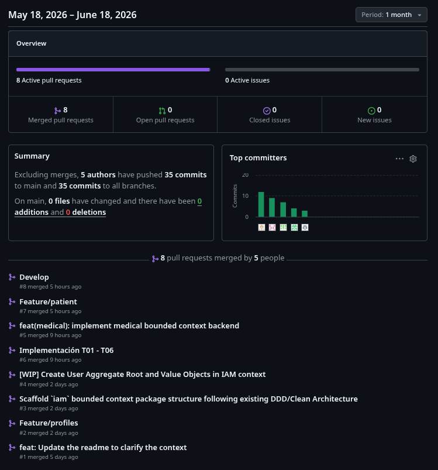

---

## 5.2.3.5. Execution Evidence for Sprint Review

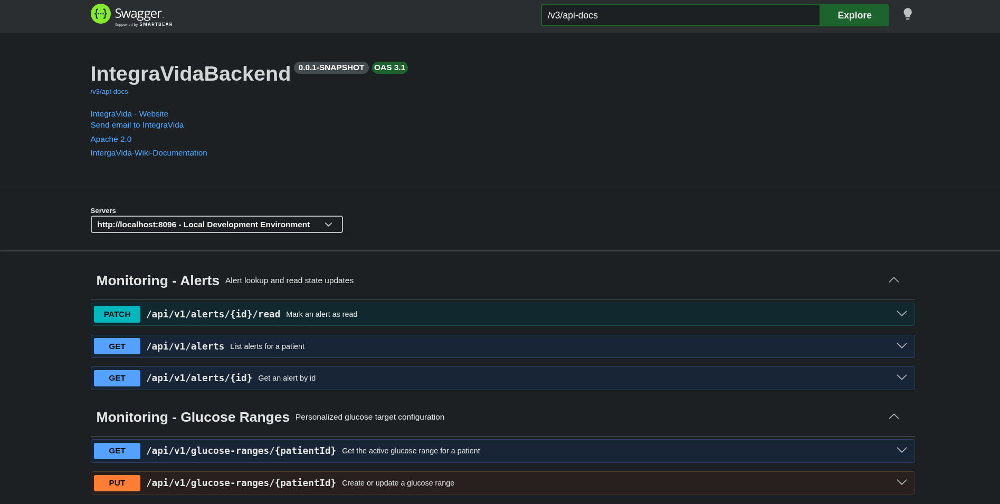
Captura: pantalla de Swagger UI (`/swagger-ui/index.html`) mostrando los 5 grupos de endpoints por bounded context.

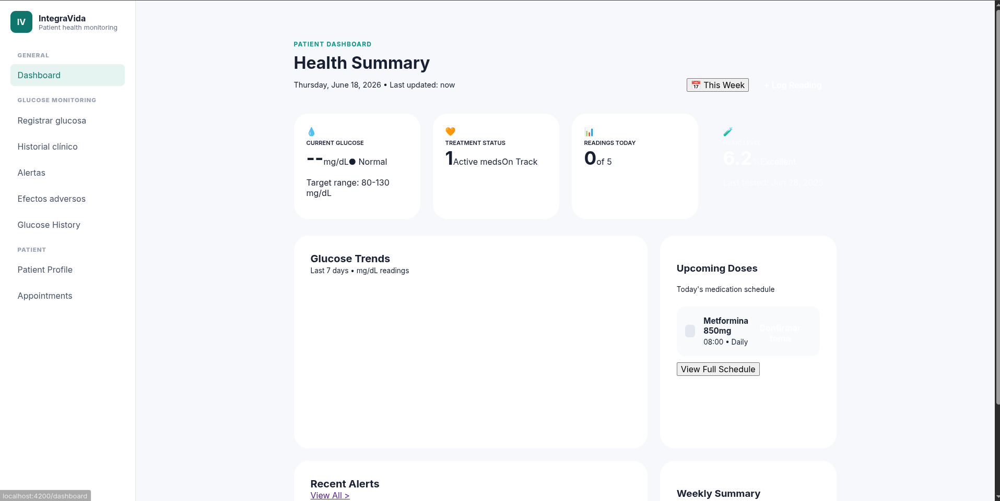
Captura: vista del Doctor Dashboard funcionando en el frontend con el listado de pacientes.

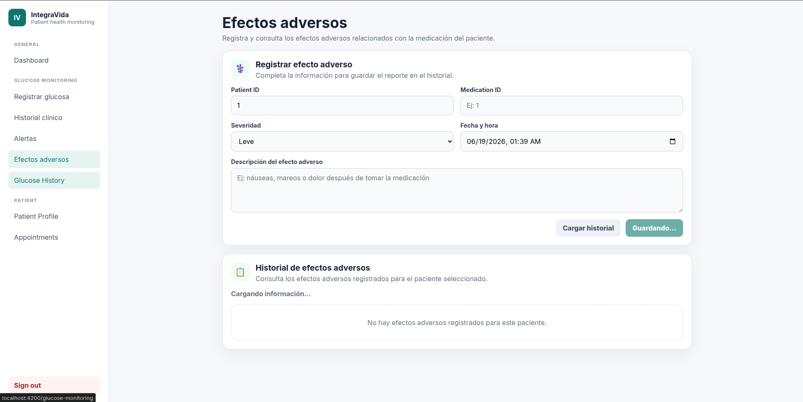
> Captura: vista del Efectos Adversos.

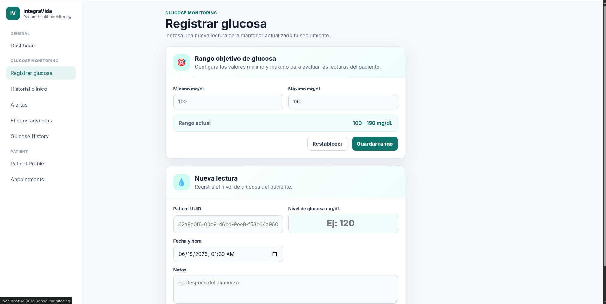
Captura: Postman o navegador mostrando una petición real al endpoint `/api/v1/glucose-records` del backend Spring Boot, con respuesta JSON.

En este Sprint se completó la migración del sistema hacia un backend real:

- **Backend Spring Boot** — los 5 bounded contexts (IAM, Profiles, Patients, Medical, Monitoring) implementados con arquitectura DDD + CQRS
- **Base de datos PostgreSQL** — desplegada mediante contenedor Docker, reemplazando el `db.json` de json-server
- **Documentación Swagger** — todos los endpoints documentados e interactivos en Swagger UI
- **Doctor Dashboard** — listado de pacientes, búsqueda y evolución gráfica para el médico
- **Módulo de Citas** — solicitud, agenda, reprogramación y cancelación de citas médicas
- **Integración real** — el frontend Angular consume la API de Spring Boot en lugar de json-server

URL del Backend desplegado: **https://integravida-backendservices.onrender.com**
URL del Backend desplegado en el SwaggerUI: **https://integravida-backendservices.onrender.com/swagger-ui/index.html#/**
URL del Frontend actualizado: **https://integravida-appweb.web.app/**

### Video Demonstration

Enlace al video de YouTube no listado mostrando la ejecución del Sprint 3, incluyendo Swagger UI, el flujo completo de autenticación contra PostgreSQL, y el módulo de citas

https://youtu.be/a06rm4RD69A?si=0fuZAe-IBr8WJ01h

---

## 5.2.3.6. Services Documentation Evidence for Sprint Review

Durante el Sprint 3 se reemplazó el servidor json-server por una **RESTful API real construida en Spring Boot**, persistida en **PostgreSQL** y desplegada mediante **Docker**. La documentación de los endpoints ya no se mantiene manualmente en una tabla del informe, sino que se genera automáticamente mediante **SpringDoc OpenAPI**, disponible en tiempo real en `/swagger-ui/index.html`.

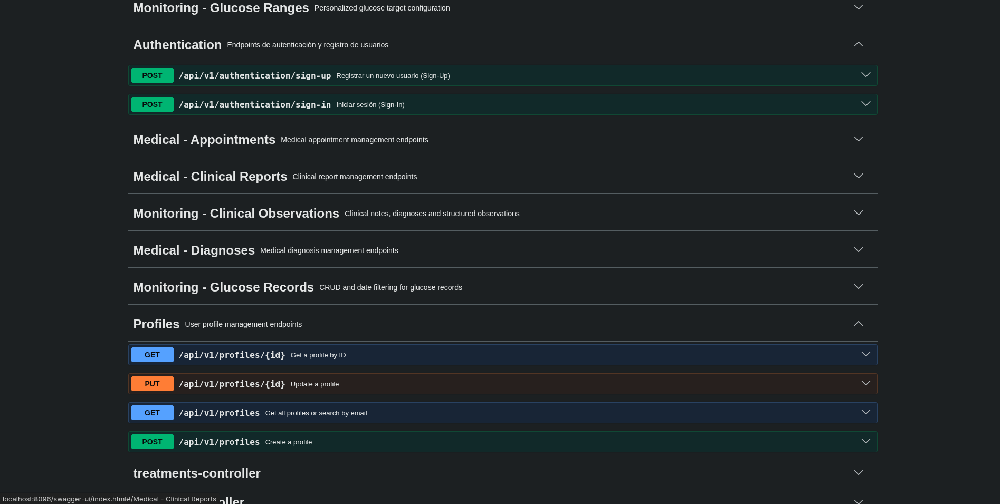
Captura: sección de Swagger UI correspondiente a los endpoints de `/api/v1/authentication` y `/api/v1/users`.

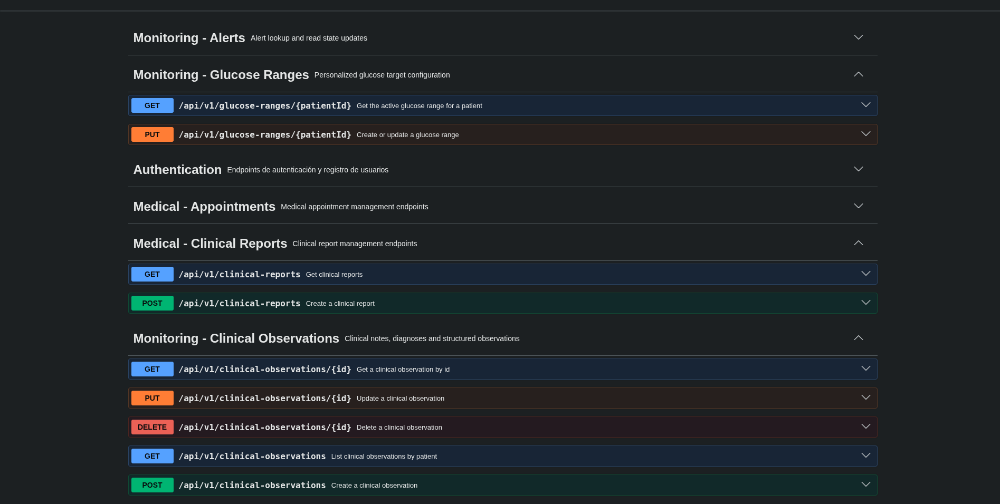
Captura: sección de Swagger UI correspondiente a los endpoints de `/api/v1/glucose-records`, `/api/v1/alerts` y `/api/v1/glucose-ranges`.

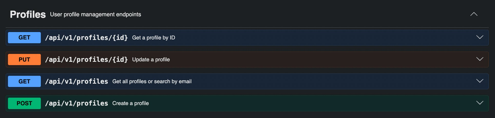
Captura: sección de Swagger UI correspondiente a los endpoints de `/api/v1/profiles` (POST, GET, GET por ID, PUT), implementados como parte del bounded context Profiles.

A continuación se documentan los endpoints principales por bounded context, ya migrados desde la Fake API hacia el backend real:

| Endpoint                       | Verbo HTTP          | Descripción                        | Bounded Context |
| :----------------------------- | :------------------ | :--------------------------------- | :-------------- |
| /api/v1/authentication/sign-up | POST                | Registrar nuevo usuario            | IAM             |
| /api/v1/authentication/sign-in | POST                | Autenticar sin JWT                 | IAM             |
| /api/v1/profiles               | GET/POST/PUT        | Gestión de perfiles de usuario     | Profiles        |
| /api/v1/patients               | GET/POST            | Gestión de pacientes               | Patients        |
| /api/v1/treatments             | GET/POST/PUT        | Gestión de tratamientos            | Patients        |
| /api/v1/medications            | GET/POST            | Gestión de medicamentos            | Patients        |
| /api/v1/medication-intakes     | POST                | Registro de toma de medicación     | Patients        |
| /api/v1/glucose-records        | GET/POST/PUT/DELETE | CRUD de registros de glucosa       | Monitoring      |
| /api/v1/alerts                 | GET/PATCH           | Consulta y marcado de alertas      | Monitoring      |
| /api/v1/glucose-ranges         | GET/PUT             | Configuración de rangos de glucosa | Monitoring      |
| /api/v1/clinical-observations  | GET/POST            | Observaciones médicas              | Monitoring      |
| /api/v1/diagnoses              | GET/POST            | Diagnósticos médicos               | Medical         |
| /api/v1/clinical-reports       | GET/POST            | Reportes clínicos                  | Medical         |
| /api/v1/appointments           | GET/POST/PUT/DELETE | Gestión de citas médicas           | Medical         |

---

## 5.2.3.7. Software Deployment Evidence for Sprint Review

Durante el Sprint 3 se configuró el despliegue de la base de datos **PostgreSQL** mediante un contenedor **Docker**, y se actualizó la configuración de Spring Boot para conectarse a dicha base de datos en lugar de la configuración por defecto en memoria.

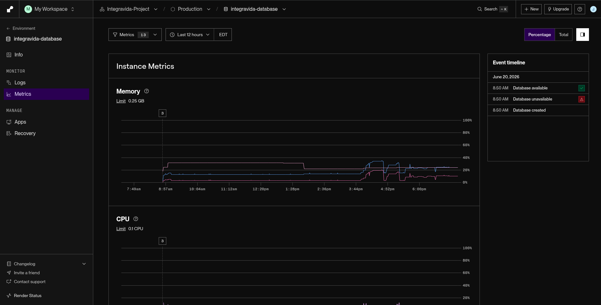

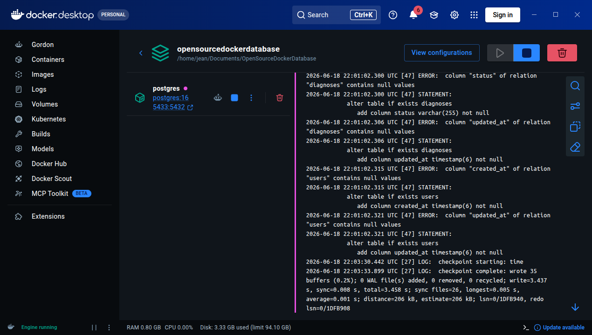
Captura: terminal mostrando `docker ps` con el contenedor de PostgreSQL corriendo, o Docker Desktop con el contenedor activo.

**Despliegue de PostgreSQL mediante Docker:**

1. Se definió un archivo `docker-compose.yml` en la raíz del repositorio `Integravida-BackendServices` con el servicio de PostgreSQL, exponiendo el puerto `5432` y definiendo un volumen persistente para los datos.
2. Se configuraron las variables de entorno `DATABASE_URL`, `DATABASE_PORT`, `DATABASE_NAME`, `DATABASE_USER` y `DATABASE_PASSWORD` consistentes con `application-prod.properties`.
3. Se levantó el contenedor con `docker compose up -d`, validando la conexión mediante un cliente PostgreSQL (pgAdmin o `psql`).
4. Se actualizó `application-prod.properties` en el backend Spring Boot apuntando al contenedor local o a la instancia desplegada.
5. Se ejecutó `./mvnw clean spring-boot:run` con el perfil `prod` activo, validando que las tablas se generaran correctamente mediante Hibernate (`ddl-auto`).
6. Se creó una instancia de base de datos administrada **PostgreSQL** dentro de la plataforma Render.
7. Se generaron automáticamente las credenciales de acceso seguras (Database Name, User, Password) y las URLs de conexión correspondientes.
8. Se proporcionó la conectividad a la base de datos remota utilizando un cliente externo de PostgreSQL (`pgAdmin` o `psql`) a través de la _External Connection String_ para verificar el acceso inicial.
9. Se estructuró la configuración en el entorno de Spring Boot para mapear dinámicamente las credenciales productivas mediante variables de entorno, evitando exponer datos sensibles en el repositorio.
10. Se verificó la conexión de manera que las tablas se crearan de forma automática en la nube mediante las propiedades de Hibernate (`ddl-auto`).

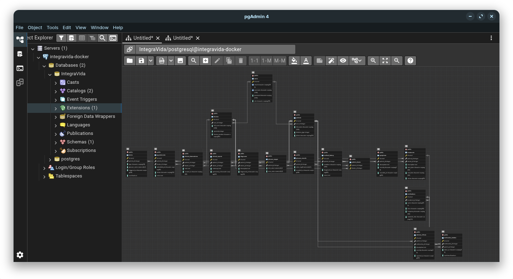
Captura: pgAdmin o consola psql mostrando las tablas generadas en PostgreSQL para los 5 bounded contexts.

**Despliegue del backend Spring Boot en Render (Web Service):**

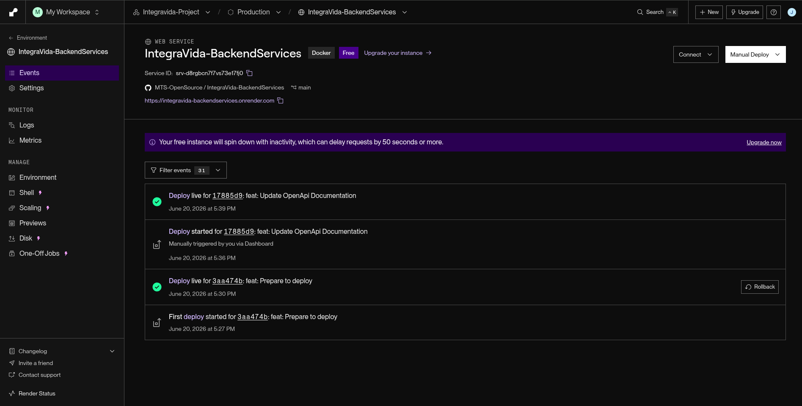

- Se creó un **Web Service** en Render (modalidad requerida para aplicaciones ejecutables con servidor embebido como Spring Boot) y se vinculó al repositorio de GitHub `Integravida-BackendServices`.
- Se configuró el comando de construcción (_Build Command_) utilizando la herramienta de empaquetado de Maven: `./mvnw clean package -DskipTests`
- Se configuró el comando de inicio (_Start Command_) para ejecutar el archivo JAR generado por Spring Boot: `java -jar target/*.jar`
- Se definieron las variables de entorno directamente en el panel de configuración de Render para inyectar las credenciales de forma segura sin exponerlas en el código fuente:
    - `SPRING_PROFILES_ACTIVE=prod`
    - `SPRING_DATASOURCE_URL=jdbc:postgresql://<HOST_DE_RENDER>:<PUERTO>/<DB_NAME>`
    - `SPRING_DATASOURCE_USERNAME=<USUARIO_DE_RENDER>`
    - `SPRING_DATASOURCE_PASSWORD=<PASSWORD_DE_RENDER>`
    
- Se ejecutó el despliegue automático y se validó a través de los logs de la plataforma que el backend levantó correctamente el contexto de Spring, estableció la conexión con el servicio PostgreSQL de Render y mapeó de forma exitosa las entidades de los bounded contexts en la base de datos remota.

URL del Backend desplegado: **https://integravida-backendservices.onrender.com**
URL del Backend desplegado en el SwaggerUI: **https://integravida-backendservices.onrender.com/swagger-ui/index.html#/**

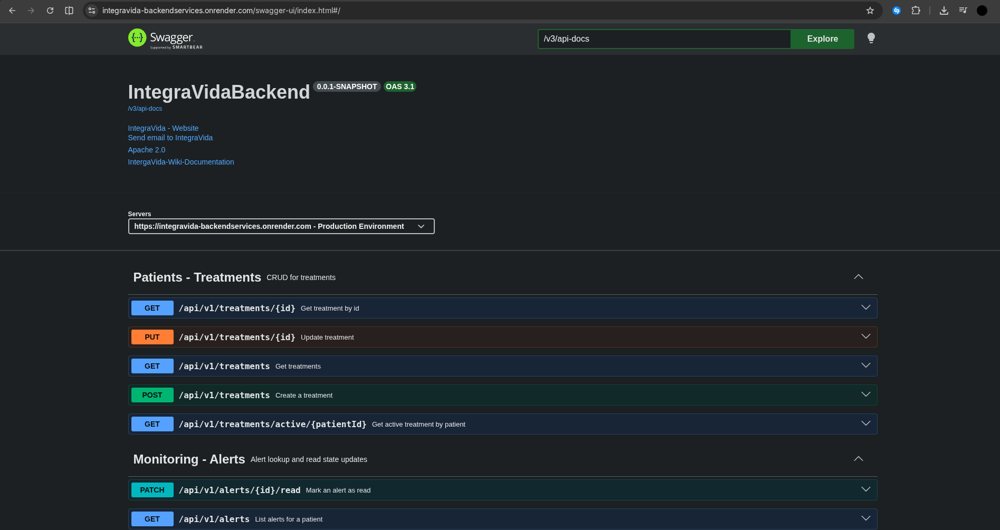

**Despliegue del Frontend en Firebase Hosting:**

1. Instalar Firebase CLI: `npm install -g firebase-tools`
2. Autenticarse: `firebase login`
3. Inicializar Firebase en el proyecto `Integravida-FrontendServices`: `firebase init hosting`
   - Seleccionar el proyecto de Firebase de GlucoSmart.
   - Public directory: `dist/integravida-frontend-services`
   - Configurar como Single Page App: Sí
4. Compilar Angular para producción: `ng build --configuration production`
5. Desplegar: `firebase deploy --only hosting`
6. URL generada: **https://integravida-appweb.web.app/**

---

## 5.2.3.8. Team Collaboration Insights during Sprint

Durante el Sprint 3, las tareas fueron distribuidas colaborativamente entre los 5 integrantes del equipo, separando el trabajo de backend (Spring Boot + PostgreSQL + Swagger) del trabajo de finalización del frontend (Doctor Dashboard, citas, integración real con la API). Jean Pool Arias lideró el bounded context IAM, la configuración de Docker/PostgreSQL, la documentación Swagger y la integración final del frontend con la API real. Abigail Raymundo lideró el bounded context Profiles en el backend y completó las vistas restantes de Patient Profile Management y notificaciones en el frontend. Juan Sebastian Estupiñan lideró el bounded context Monitoring, el núcleo clínico más crítico del sistema (glucosa, alertas y rangos), tanto en backend como en las vistas asociadas del frontend. Javier Oswaldo Tello lideró el bounded context Patients en el backend y el Doctor Dashboard junto con el módulo de Appointment Management en el frontend. Jose Antonio Muñoz lideró el bounded context Medical (diagnósticos, reportes clínicos y citas) y las vistas de seguimiento médico en el frontend.

La coordinación se realizó íntegramente vía **Discord**, mediante reuniones de sincronización y canales separados por bounded context para resolver bloqueos técnicos durante la migración de json-server hacia la API real.

| Team Member                | Commits   |
| :------------------------- | :-------- |
| Jean Pool Arias            | 16        |
| Abigail Raymundo           | 10        |
| Juan Sebastian Estupiñan   | 9         |
| Javier Oswaldo Tello       | 5         |
| -------------------------- | --------- |

### 5.2.4. Sprint 4

## 5.2.4.1. Sprint Planning 4

Esta sección documenta la planificación del cuarto Sprint del proyecto GlucoSmart. El objetivo principal de este Sprint fue **consolidar la integración end-to-end**, realizar **pruebas de aceptación con usuarios reales**, ejecutar las **Validation Interviews** grabadas, y preparar los artefactos finales del proyecto (About-the-Product, About-the-Team y Student Outcome).

| Sprint #                         | Sprint 4                                                                                                                                                                                                                                                                                                                                                                                                                                                                                                                                                                                                                                                                                                                            |
| :------------------------------- | :---------------------------------------------------------------------------------------------------------------------------------------------------------------------------------------------------------------------------------------------------------------------------------------------------------------------------------------------------------------------------------------------------------------------------------------------------------------------------------------------------------------------------------------------------------------------------------------------------------------------------------------------------------------------------------------------------------------------------------- |
| **Sprint Planning Background**   |                                                                                                                                                                                                                                                                                                                                                                                                                                                                                                                                                                                                                                                                                                                                     |
| Date                             | 28/06 - 06/07                                                                                                                                                                                                                                                                                                                                                                                                                                                                                                                                                                                                                                                                                                                       |
| Time                             | 11:59PM                                                                                                                                                                                                                                                                                                                                                                                                                                                                                                                                                                                                                                                                                                                             |
| Location                         | Virtual - Discord                                                                                                                                                                                                                                                                                                                                                                                                                                                                                                                                                                                                                                                                                                                   |
| Prepared By                      | Jean Pool Alexander Arias Tasayco                                                                                                                                                                                                                                                                                                                                                                                                                                                                                                                                                                                                                                                                                                   |
| Attendees (To planning meeting)  | Jean Pool Alexander Arias Tasayco Juan Sebastian Estupiñan Olortegui Javier Oswaldo Tello Murga                                                                                                                                                                                                                                                                                                                                                                                                                                                                                                                                                                                                                               |
| Sprint N-1 Review Summary        | El Sprint 3 culminó con la implementación del backend real en Spring Boot con DDD+CQRS, PostgreSQL desplegado en Docker, documentación Swagger, y la integración del frontend Angular con la API real. Todos los bounded contexts (IAM, Profiles, Patients, Monitoring, Medical) expusieron endpoints funcionales, y las vistas de Doctor Dashboard, Appointment Management y Clinical Reports fueron completadas.                                                                                                                                                                                                                                                                                                                  |
| Sprint N-1 Retrospective Summary | El equipo destacó como principal acierto la adopción de DDD + CQRS en el backend, lo que permitió una separación clara de responsabilidades y facilitó el trabajo paralelo por bounded contexts. Como oportunidad de mejora se identificó la necesidad de realizar pruebas de integración tempranas entre frontend y backend real para evitar bloqueos de última hora, así como la importancia de grabar las validation interviews con usuarios reales para cumplir con la rúbrica de TB2.                                                                                                                                                                                                                                          |
| **Sprint Goal & User Stories**   |                                                                                                                                                                                                                                                                                                                                                                                                                                                                                                                                                                                                                                                                                                                                     |
| Sprint N Goal                    | Our focus is on validating the complete GlucoSmart solution with real users through recorded Validation Interviews, consolidating all software artifacts, and preparing the final deliverables (About-the-Product video, About-the-Team video, and Student Outcome evidence). We believe this provides a validated, production-ready healthcare platform for diabetes management. This will be confirmed when: (1) at least <!-- TODO: insertar número --> Validation Interviews are conducted and recorded with representatives of each user segment, (2) the About-the-Product intro video is published, (3) the About-the-Team retrospective video is published, and (4) all Student Outcome evidence is compiled and submitted. |
| Sprint 4 Velocity                | 35                                                                                                                                                                                                                                                                                                                                                                                                                                                                                                                                                                                                                                                                                                                                  |
| Sum of Story Points              | 41                                                                                                                                                                                                                                                                                                                                                                                                                                                                                                                                                                                                                                                                                                                                  |

## 5.2.4.2. Aspect Leaders and Collaborators

| Aspect                   | Jean Pool Arias | Juan Sebastian Estupiñan | Javier Oswaldo Tello |
| :----------------------- | :-------------: | :----------------------: | :------------------: |
| Validation Interviews    |        L        |            C             |          C           |
| About-the-Product Video  |        L        |            C             |          C           |
| About-the-Team Video     |        L        |            C             |          C           |
| Bug Fixing & Polish      |        L        |            C             |          C           |
| Student Outcome Evidence |        C        |            C             |          C           |

## 5.2.4.3. Sprint Backlog 4

**URL pública del Board Sprint 4:** https://trello.com/invite/b/6a4e64494b5bffc899ec3b0e/ATTI4356e6f50a007be86b2cf9b2aca5dcac26194524/integravida

| Sprint#  | User Story                                      | Work-Item / Task | Assigned To                    | Status | Id      | Title                                                                                                                                    |
| -------- | ----------------------------------------------- | ---------------- | ------------------------------ | ------ | ------- | ---------------------------------------------------------------------------------------------------------------------------------------- |
| Sprint 4 | —                                               | Work-Item        | u202223405@upc.edu.pe          | Done   | INT-205 | [IAM] IAM Bounded Context - JWT Enhancement & Claims Integration                                                                         |
| Sprint 4 | US-04, US-06                                    | Task             | u202223405@upc.edu.pe          | Done   | INT-211 | T01 - Extend JWT claims to include userId, role, profileId, patientId and doctorId (conditional on role)                                 |
| Sprint 4 | US-04, US-06                                    | Task             | u202223405@upc.edu.pe          | Done   | INT-212 | T02 - Update TokenService to sign and extract extended claims from JWT                                                                   |
| Sprint 4 | US-04, US-06                                    | Task             | u202223405@upc.edu.pe          | Done   | INT-213 | T03 - Create JwtClaimsExtractor utility to resolve userId, role, patientId, profileId and doctorId from SecurityContext                  |
| Sprint 4 | US-04                                           | Task             | u202223405@upc.edu.pe          | Done   | INT-214 | T04 - Update sign-in endpoint to populate all required claims at authentication time                                                     |
| Sprint 4 | US-02, US-03                                    | Task             | u202223405@upc.edu.pe          | Done   | INT-215 | T05 - Update sign-up flow to assign role-specific context (patientId or doctorId) before issuing the token                               |
| Sprint 4 | US-04, US-06                                    | Task             | u202223405@upc.edu.pe          | Done   | INT-216 | T06 - Validate JWT claims integrity on protected endpoints using JwtClaimsExtractor                                                      |
| Sprint 4 | —                                               | Work-Item        | jeanpoolariass2020@hotmail.com | Done   | INT-206 | [PROFILES] Profiles Bounded Context - JWT Integration Update                                                                             |
| Sprint 4 | US-07, US-08                                    | Task             | jeanpoolariass2020@hotmail.com | Done   | INT-217 | T10 - Refactor ProfileCommandService to resolve profileId from JWT claims instead of request body                                        |
| Sprint 4 | US-07, US-11                                    | Task             | jeanpoolariass2020@hotmail.com | Done   | INT-218 | T11 - Refactor ProfileQueryService to filter by profileId extracted from JWT                                                             |
| Sprint 4 | US-07, US-08, US-11                             | Task             | jeanpoolariass2020@hotmail.com | Done   | INT-219 | T12 - Remove profileId from all profile request DTOs and resolve it exclusively from JWT                                                 |
| Sprint 4 | —                                               | Work-Item        | jeanpoolariass2020@hotmail.com | Done   | INT-207 | [PATIENTS] Patients Bounded Context - JWT Integration Update                                                                             |
| Sprint 4 | US-07, US-08                                    | Task             | jeanpoolariass2020@hotmail.com | Done   | INT-220 | T13 - Refactor PatientCommandService to resolve patientId from JWT claims instead of request body                                        |
| Sprint 4 | US-17, US-18, US-49                             | Task             | jeanpoolariass2020@hotmail.com | Done   | INT-221 | T14 - Refactor TreatmentCommandService and TreatmentQueryService to scope all operations to the patientId from JWT                       |
| Sprint 4 | US-17, US-19, US-20                             | Task             | jeanpoolariass2020@hotmail.com | Done   | INT-222 | T15 - Refactor MedicationCommandService and MedicationQueryService to scope all operations to the patientId from JWT                     |
| Sprint 4 | US-19                                           | Task             | jeanpoolariass2020@hotmail.com | Done   | INT-223 | T16 - Refactor MedicationIntakeCommandService to resolve patientId from JWT                                                              |
| Sprint 4 | US-07, US-17, US-19                             | Task             | jeanpoolariass2020@hotmail.com | Done   | INT-224 | T17 - Remove patientId from all patient, treatment, medication and medication-intake request DTOs                                        |
| Sprint 4 | —                                               | Work-Item        | Javier Tello                   | Done   | INT-208 | [MEDICAL] Medical Bounded Context - JWT Integration Update                                                                               |
| Sprint 4 | US-27, US-28, US-34, US-35                      | Task             | Javier Tello                   | Done   | INT-225 | T18 - Refactor AppointmentCommandService to resolve patientId and doctorId from JWT claims                                               |
| Sprint 4 | US-25                                           | Task             | Javier Tello                   | Done   | INT-226 | T19 - Refactor DiagnosisCommandService to scope operations to doctorId from JWT                                                          |
| Sprint 4 | US-26                                           | Task             | Javier Tello                   | Done   | INT-227 | T20 - Refactor ClinicalReportCommandService to resolve both patientId and doctorId from JWT                                              |
| Sprint 4 | US-25, US-26, US-27                             | Task             | Javier Tello                   | Done   | INT-228 | T21 - Remove patientId and doctorId from all medical request DTOs and resolve exclusively from JWT                                       |
| Sprint 4 | —                                               | Work-Item        | jeanpoolariass2020@hotmail.com | Done   | INT-209 | [MONITORING] Monitoring Bounded Context - JWT Integration Update                                                                         |
| Sprint 4 | US-12, US-39, US-40                             | Task             | jeanpoolariass2020@hotmail.com | Done   | INT-229 | T22 - Refactor GlucoseRecordCommandService to resolve patientId from JWT claims instead of request body                                  |
| Sprint 4 | US-13, US-37, US-38                             | Task             | jeanpoolariass2020@hotmail.com | Done   | INT-230 | T23 - Refactor GlucoseRecordQueryService to filter all queries by patientId from JWT                                                     |
| Sprint 4 | US-41, US-43                                    | Task             | jeanpoolariass2020@hotmail.com | Done   | INT-231 | T24 - Refactor AlertQueryService and AlertCommandService to scope alerts to patientId from JWT                                           |
| Sprint 4 | US-42                                           | Task             | jeanpoolariass2020@hotmail.com | Done   | INT-232 | T25 - Refactor GlucoseRangeCommandService and GlucoseRangeQueryService to scope ranges to patientId from JWT                             |
| Sprint 4 | US-24                                           | Task             | jeanpoolariass2020@hotmail.com | Done   | INT-233 | T26 - Refactor ClinicalObservationCommandService to resolve patientId from JWT                                                           |
| Sprint 4 | US-12, US-24, US-42                             | Task             | jeanpoolariass2020@hotmail.com | Done   | INT-234 | T27 - Remove patientId from all monitoring request DTOs and resolve exclusively from JWT                                                 |
| Sprint 4 | —                                               | Work-Item        | jeanpoolariass2020@hotmail.com | Done   | INT-210 | [FRONTEND] Frontend - Backend Integration & UI Completion                                                                                |
| Sprint 4 | US-04, US-06                                    | Task             | jeanpoolariass2020@hotmail.com | Done   | INT-235 | T28 - Update AuthStore to persist userId, role, patientId, profileId and doctorId decoded from JWT on login                              |
| Sprint 4 | US-07, US-12, US-13, US-17, US-27, US-41, US-42 | Task             | jeanpoolariass2020@hotmail.com | Done   | INT-236 | T29 - Refactor all Angular services to read patientId, profileId and doctorId from AuthStore instead of hardcoded values or route params |
| Sprint 4 | US-07, US-08, US-12, US-17, US-27               | Task             | jeanpoolariass2020@hotmail.com | Done   | INT-237 | T30 - Remove all UUID and ID inputs from frontend forms that are now resolved from JWT                                                   |
| Sprint 4 | US-04, US-06, US-46                             | Task             | jeanpoolariass2020@hotmail.com | Done   | INT-238 | T31 - Implement role-based route guard to redirect Patient and Doctor to their respective dashboards after login                         |
| Sprint 4 | US-06, US-46                                    | Task             | jeanpoolariass2020@hotmail.com | Done   | INT-239 | T32 - Implement role-based navbar and sidebar that renders different options for Patient and Doctor roles                                |
| Sprint 4 | US-02, US-03, US-04                             | Task             | jeanpoolariass2020@hotmail.com | Done   | INT-240 | T33 - Connect Login and Register views to real Spring Boot authentication endpoints                                                      |
| Sprint 4 | US-07, US-11                                    | Task             | jeanpoolariass2020@hotmail.com | Done   | INT-241 | T34 - Connect Patient Profile view to real GET /api/v1/profiles endpoint using profileId from JWT                                        |
| Sprint 4 | US-08                                           | Task             | jeanpoolariass2020@hotmail.com | Done   | INT-242 | T35 - Connect Patient Profile edit form to real PUT /api/v1/profiles endpoint                                                            |
| Sprint 4 | US-55                                           | Task             | jeanpoolariass2020@hotmail.com | Done   | INT-243 | T36 - Connect Dashboard summary cards to real backend endpoints using patientId from JWT                                                 |
| Sprint 4 | US-37                                           | Task             | jeanpoolariass2020@hotmail.com | Done   | INT-244 | T37 - Connect Glucose Trends chart to real GET /api/v1/glucose-records endpoint filtered by patientId from JWT                           |
| Sprint 4 | US-17, US-20                                    | Task             | jeanpoolariass2020@hotmail.com | Done   | INT-245 | T38 - Connect Upcoming Doses widget to real GET /api/v1/medications endpoint                                                             |
| Sprint 4 | US-41                                           | Task             | jeanpoolariass2020@hotmail.com | Done   | INT-246 | T39 - Connect Recent Alerts widget to real GET /api/v1/alerts endpoint filtered by patientId from JWT                                    |
| Sprint 4 | US-12                                           | Task             | jeanpoolariass2020@hotmail.com | Done   | INT-247 | T40 - Connect Glucose Log form to real POST /api/v1/glucose-records endpoint                                                             |
| Sprint 4 | US-13, US-38                                    | Task             | jeanpoolariass2020@hotmail.com | Done   | INT-248 | T41 - Connect Health History table to real GET /api/v1/glucose-records with pagination and date filters                                  |
| Sprint 4 | US-39, US-40                                    | Task             | jeanpoolariass2020@hotmail.com | Done   | INT-249 | T42 - Connect edit and delete glucose record modals to real PUT and DELETE endpoints                                                     |
| Sprint 4 | US-41, US-43                                    | Task             | jeanpoolariass2020@hotmail.com | Done   | INT-250 | T43 - Connect Alerts view tabs to real GET /api/v1/alerts and PATCH mark-as-read endpoint                                                |
| Sprint 4 | US-42                                           | Task             | jeanpoolariass2020@hotmail.com | Done   | INT-251 | T44 - Connect glucose range configuration panel to real GET/PUT /api/v1/glucose-ranges endpoint                                          |
| Sprint 4 | US-21, US-44                                    | Task             | jeanpoolariass2020@hotmail.com | Done   | INT-252 | T45 - Connect Adverse Effects form and list to real backend endpoints                                                                    |
| Sprint 4 | US-17, US-19                                    | Task             | jeanpoolariass2020@hotmail.com | Done   | INT-253 | T46 - Connect current treatment view and medication intake confirmation to real endpoints                                                |
| Sprint 4 | US-27, US-28, US-34, US-35                      | Task             | jeanpoolariass2020@hotmail.com | Done   | INT-254 | T47 - Connect Appointments module (request, agenda, reschedule, cancel) to real backend endpoints                                        |
| Sprint 4 | US-46, US-47                                    | Task             | jeanpoolariass2020@hotmail.com | Done   | INT-255 | T48 - Connect Doctor Dashboard patient list to real GET /api/v1/patients endpoint using doctorId from JWT                                |
| Sprint 4 | US-48                                           | Task             | jeanpoolariass2020@hotmail.com | Done   | INT-256 | T49 - Connect patient glucose evolution chart for Doctor to real GET /api/v1/glucose-records filtered by selected patientId              |
| Sprint 4 | US-24                                           | Task             | jeanpoolariass2020@hotmail.com | Done   | INT-257 | T50 - Connect medical observation form to real POST /api/v1/clinical-observations endpoint                                               |
| Sprint 4 | US-25                                           | Task             | jeanpoolariass2020@hotmail.com | Done   | INT-258 | T51 - Connect diagnosis form to real POST /api/v1/diagnoses endpoint using doctorId from JWT                                             |
| Sprint 4 | US-26                                           | Task             | jeanpoolariass2020@hotmail.com | Done   | INT-259 | T52 - Connect clinical report generator to real POST /api/v1/clinical-reports endpoint                                                   |
| Sprint 4 | US-49                                           | Task             | jeanpoolariass2020@hotmail.com | Done   | INT-260 | T53 - Connect treatment update form for Doctor to real PUT /api/v1/treatments endpoint                                                   |
| Sprint 4 | US-45                                           | Task             | jeanpoolariass2020@hotmail.com | Done   | INT-261 | T54 - Connect adverse effects evaluation view for Doctor to real backend endpoint                                                        |
| Sprint 4 | US-22                                           | Task             | jeanpoolariass2020@hotmail.com | Done   | INT-262 | T55 - Connect treatment adherence view to real backend data                                                                              |
| Sprint 4 | US-01, US-29                                    | Task             | jeanpoolariass2020@hotmail.com | Done   | INT-263 | T56 - Implement empty state components and loading skeletons for all views pending API response                                          |
| Sprint 4 | US-01, US-29                                    | Task             | jeanpoolariass2020@hotmail.com | Done   | INT-264 | T57 - Apply final UI polish and pixel-perfect adjustments on all views matching Figma designs                                            |
| Sprint 4 | US-01, US-29                                    | Task             | jeanpoolariass2020@hotmail.com | Done   | INT-265 | T58 - Fix responsive layout issues on mobile and tablet breakpoints across all views                                                     |
| Sprint 4 | US-02, US-12, US-16, US-41                      | Task             | jeanpoolariass2020@hotmail.com | Done   | INT-266 | T59 - Implement end-to-end smoke test: full Patient flow from register to glucose log to alert                                           |
| Sprint 4 | US-04, US-25, US-26, US-46                      | Task             | jeanpoolariass2020@hotmail.com | Done   | INT-267 | T60 - Implement end-to-end smoke test: full Doctor flow from login to clinical report generation                                         |

## 5.2.4.4. Development Evidence for Sprint Review

Durante el Sprint 4 se realizaron las siguientes actividades de desarrollo:

- **Corrección de bugs post-integración:** Se identificaron y corrigieron errores en la comunicación entre frontend Angular y backend Spring Boot, especialmente en los flujos de autenticación JWT, creación de pacientes y registro de glucosa.
- **Ajustes de UI/UX:** Se realizaron mejoras de experiencia de usuario basadas en el feedback recogido durante las Validation Interviews, incluyendo ajustes de responsive design, mensajes de error más claros y optimización de tiempos de carga.
- **Validación de datos:** Se fortalecieron las validaciones del lado del backend y frontend para garantizar la integridad de los datos clínicos.
- **Documentación final:** Se actualizó el informe del proyecto con las secciones de Validation Interviews, About-the-Product, About-the-Team y Student Outcome.

| Repository                                 | Branch                                 | Commit Id                                | Commit Message                                                                         | Commit Message Body                                        | Committed on         |
| ------------------------------------------ | -------------------------------------- | ---------------------------------------- | -------------------------------------------------------------------------------------- | ---------------------------------------------------------- | -------------------- |
| MTS-OpenSource/IntegraVida-BackendServices | main                                   | 0e1d634ba3869446ecc88d507e7fff5e816719a8 | Merge pull request #12 from MTS-OpenSource/feature/medical-jwt-integration-javier      | feat(medical): integrate JWT claims for medical operations | 2026-07-08T12:05:48Z |
| MTS-OpenSource/IntegraVida-BackendServices | feature/medical-jwt-integration-javier | a8e696c6b9cc3d4b85aa03441fcaff660b76d98a | Merge remote-tracking branch 'origin/main' into feature/medical-jwt-integration-javier |                                                            | 2026-07-08T06:37:30Z |
| MTS-OpenSource/IntegraVida-BackendServices | feature/medical-jwt-integration-javier | 66e25257f6cb5e17a7672f13895f9c824c39ff48 | feat(medical): resolve clinical report ids from JWT                                    |                                                            | 2026-07-08T06:23:39Z |
| MTS-OpenSource/IntegraVida-BackendServices | feature/medical-jwt-integration-javier | 7a8a355515d4797477b012fa0c426eafedafca84 | feat: Update Profiel Boundend                                                          |                                                            | 2026-07-08T06:17:47Z |
| MTS-OpenSource/IntegraVida-BackendServices | feature/medical-jwt-integration-javier | 7a715cf1912cc881e34ad838f6823bf71b1597b9 | feat(medical): resolve diagnosis ids from JWT                                          |                                                            | 2026-07-08T06:00:36Z |
| MTS-OpenSource/IntegraVida-BackendServices | feature/medical-jwt-integration-javier | 4b98630dfea8ee26d7435fccd35679067647ffbe | feat(medical): resolve appointment ids from JWT                                        |                                                            | 2026-07-08T05:16:38Z |
| MTS-OpenSource/IntegraVida-BackendServices | feature/medical-jwt-integration-javier | 136d2b61d887c578a7d68f31541b09ff5e8df5cb | feat: Add JWT in the DOCTOR endpoints                                                  |                                                            | 2026-07-07T22:28:22Z |
| MTS-OpenSource/IntegraVida-BackendServices | feature/medical-jwt-integration-javier | 7ed17fb405fdffb7e4eb7aba474d0504cffccedb | feat: Add JWT in the Patient Bounded                                                   |                                                            | 2026-07-07T22:16:13Z |
| MTS-OpenSource/IntegraVida-BackendServices | feature/medical-jwt-integration-javier | 11ede84af0d3ff41b250b273583e51d2f1b6a596 | feat: Add JWT in the Monitoring Boundend                                               |                                                            | 2026-07-07T22:01:59Z |
| MTS-OpenSource/IntegraVida-BackendServices | feature/medical-jwt-integration-javier | 1500384655d0364c288f2156cf247d502e1ad59e | chore: fix the JWT                                                                     |                                                            | 2026-07-07T21:05:27Z |

## 5.2.4.5. Execution Evidence for Sprint Review

Durante el Sprint 4 se ejecutaron las validaciones con usuarios reales, cuyas evidencias se documentan en la sección [5.3 Validation Interviews](#_toc226040480). Adicionalmente, se realizaron pruebas de integración end-to-end de todos los flujos críticos del sistema.

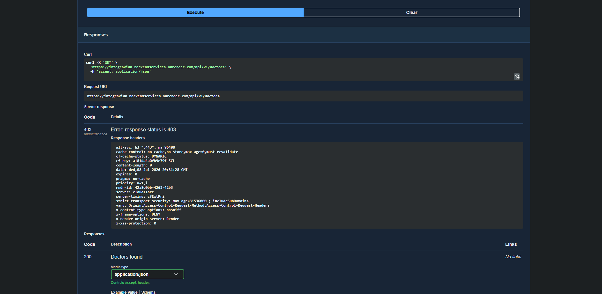
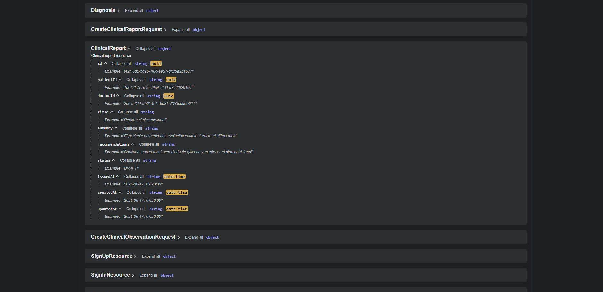
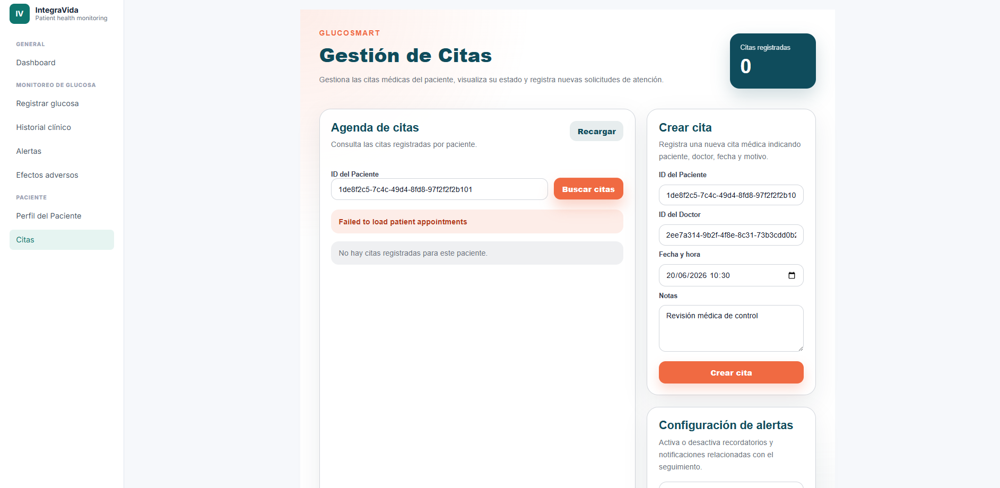

<!-- TODO: Insertar enlace al video de demostración del Sprint 4. -->

## 5.2.4.6. Services Documentation Evidence for Sprint Review

Los servicios documentados corresponden a los mismos endpoints del backend Spring Boot desplegados en el Sprint 3. Se realizaron las siguientes actualizaciones:

- Se verificó que todos los endpoints documentados en Swagger UI respondieran correctamente después de las correcciones de bugs.
- Se agregaron 5 nuevos endpoints faltantes identificados durante las validaciones.
- Se actualizó la documentación OpenAPI con descripciones más precisas de los parámetros y respuestas.

Swagger UI disponible en: **https://integravida-backendservices.onrender.com/swagger-ui/index.html#/**
Frontend Web App:**https://integravida-appweb.web.app/**

*Login*
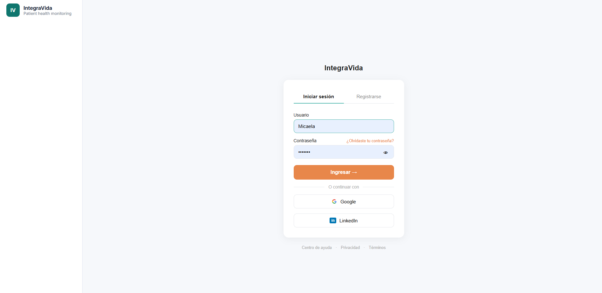
*Dashboard*
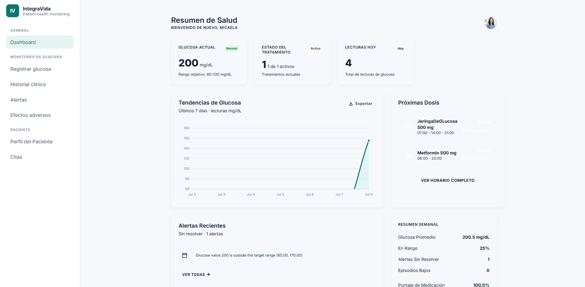
*Registro de Glucosa*
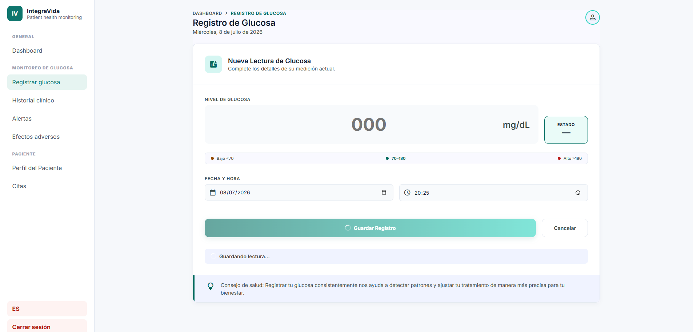
*Historial Clinico*
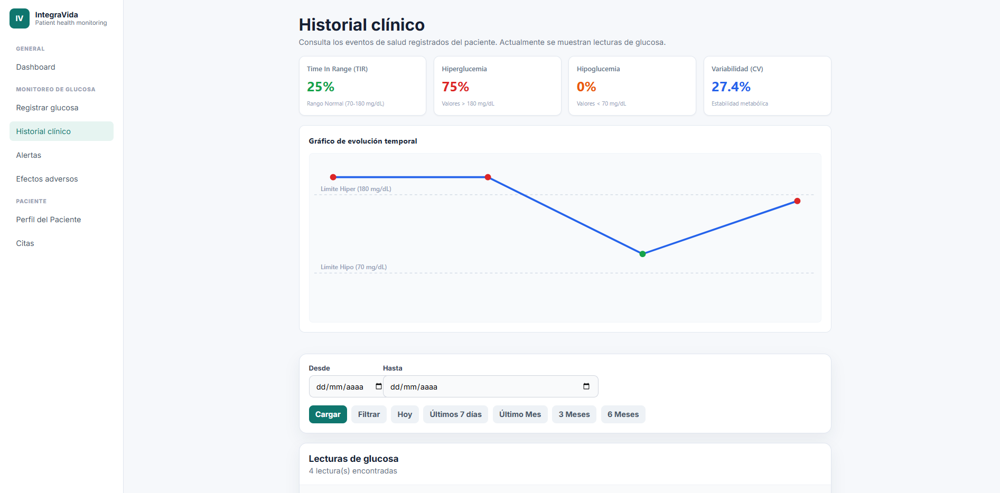
*Alertas*
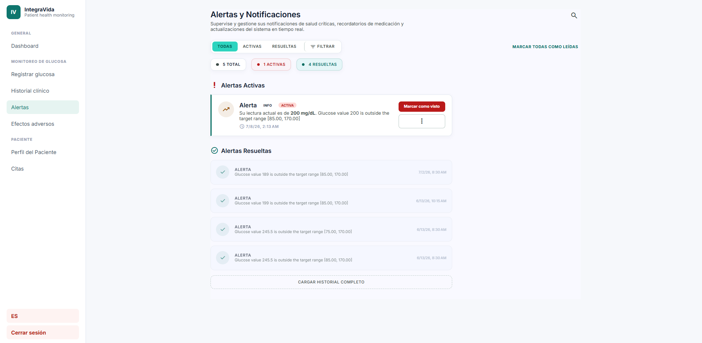
*Medicacion*
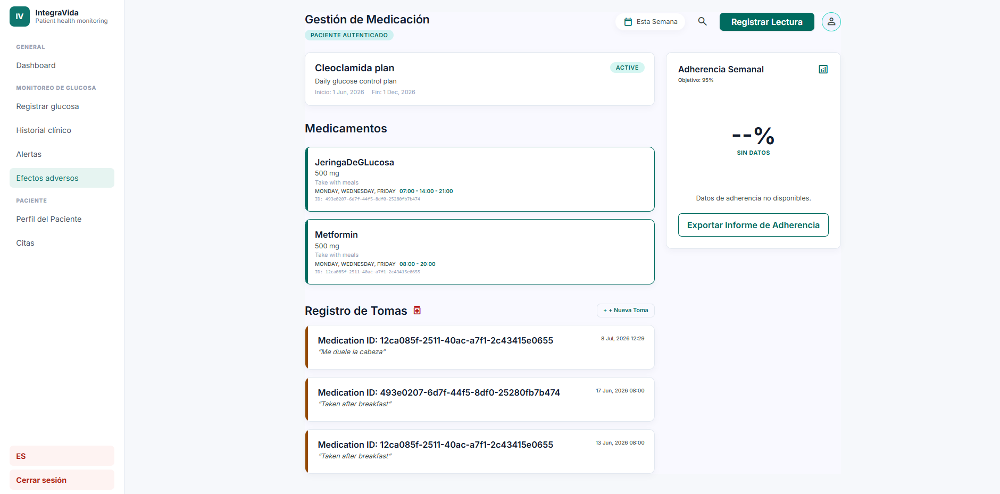
*Perfil*
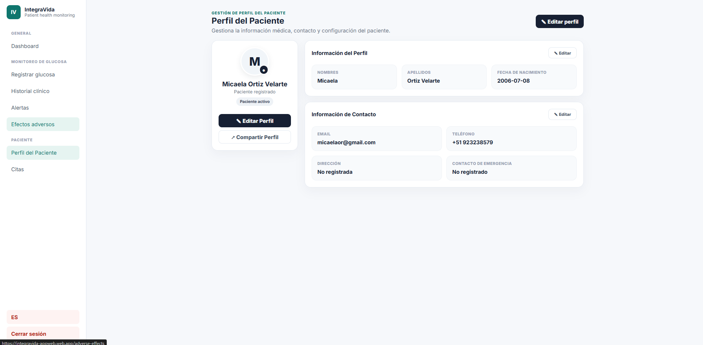

## 5.2.4.7. Software Deployment Evidence for Sprint Review

Durante el Sprint 4 se mantuvieron los tres componentes desplegados:

| Componente                | Plataforma       | URL                                                                          |
| :------------------------ | :--------------- | :--------------------------------------------------------------------------- |
| Landing Page              | GitHub Pages     | **https://mts-opensource.github.io/IntegraVida/**                            |
| Frontend Web App          | Firebase Hosting | **https://integravida-appweb.web.app/**                                      |
| Backend API (Spring Boot) | Render.com       | **https://integravida-backendservices.onrender.com**                         |
| Swagger UI                | Render.com       | **https://integravida-backendservices.onrender.com/swagger-ui/index.html#/** |

Durante el Sprint 4 se configuró el despliegue de la base de datos **PostgreSQL** mediante un contenedor **Docker**, y se actualizó la configuración de Spring Boot para conectarse a dicha base de datos en lugar de la configuración por defecto en memoria.

Captura: terminal mostrando `docker ps` con el contenedor de PostgreSQL corriendo, o Docker Desktop con el contenedor activo.

**Despliegue de PostgreSQL mediante Docker:**

1. Se definió un archivo `docker-compose.yml` en la raíz del repositorio `Integravida-BackendServices` con el servicio de PostgreSQL, exponiendo el puerto `5432` y definiendo un volumen persistente para los datos.
2. Se configuraron las variables de entorno `DATABASE_URL`, `DATABASE_PORT`, `DATABASE_NAME`, `DATABASE_USER` y `DATABASE_PASSWORD` consistentes con `application-prod.properties`.
3. Se levantó el contenedor con `docker compose up -d`, validando la conexión mediante un cliente PostgreSQL (pgAdmin o `psql`).
4. Se actualizó `application-prod.properties` en el backend Spring Boot apuntando al contenedor local o a la instancia desplegada.
5. Se ejecutó `./mvnw clean spring-boot:run` con el perfil `prod` activo, validando que las tablas se generaran correctamente mediante Hibernate (`ddl-auto`).
6. Se creó una instancia de base de datos administrada **PostgreSQL** dentro de la plataforma Render.
7. Se generaron automáticamente las credenciales de acceso seguras (Database Name, User, Password) y las URLs de conexión correspondientes.
8. Se proporcionó la conectividad a la base de datos remota utilizando un cliente externo de PostgreSQL (`pgAdmin` o `psql`) a través de la _External Connection String_ para verificar el acceso inicial.
9. Se estructuró la configuración en el entorno de Spring Boot para mapear dinámicamente las credenciales productivas mediante variables de entorno, evitando exponer datos sensibles en el repositorio.
10. Se verificó la conexión de manera que las tablas se crearan de forma automática en la nube mediante las propiedades de Hibernate (`ddl-auto`).

Captura: pgAdmin o consola psql mostrando las tablas generadas en PostgreSQL para los 5 bounded contexts.

**Despliegue del backend Spring Boot en Render (Web Service):**

- Se creó un **Web Service** en Render (modalidad requerida para aplicaciones ejecutables con servidor embebido como Spring Boot) y se vinculó al repositorio de GitHub `Integravida-BackendServices`.
- Se configuró el comando de construcción (_Build Command_) utilizando la herramienta de empaquetado de Maven: `./mvnw clean package -DskipTests`
- Se configuró el comando de inicio (_Start Command_) para ejecutar el archivo JAR generado por Spring Boot: `java -jar target/*.jar`
- Se definieron las variables de entorno directamente en el panel de configuración de Render para inyectar las credenciales de forma segura sin exponerlas en el código fuente:
    - `SPRING_PROFILES_ACTIVE=prod`
    - `SPRING_DATASOURCE_URL=jdbc:postgresql://<HOST_DE_RENDER>:<PUERTO>/<DB_NAME>`
    - `SPRING_DATASOURCE_USERNAME=<USUARIO_DE_RENDER>`
    - `SPRING_DATASOURCE_PASSWORD=<PASSWORD_DE_RENDER>`
    
- Se ejecutó el despliegue automático y se validó a través de los logs de la plataforma que el backend levantó correctamente el contexto de Spring, estableció la conexión con el servicio PostgreSQL de Render y mapeó de forma exitosa las entidades de los bounded contexts en la base de datos remota.

URL del Backend desplegado: **https://integravida-backendservices.onrender.com**
URL del Backend desplegado en el SwaggerUI: **https://integravida-backendservices.onrender.com/swagger-ui/index.html#/**

**Despliegue del Frontend en Firebase Hosting:**

1. Instalar Firebase CLI: `npm install -g firebase-tools`
2. Autenticarse: `firebase login`
3. Inicializar Firebase en el proyecto `Integravida-FrontendServices`: `firebase init hosting`
   - Seleccionar el proyecto de Firebase de GlucoSmart.
   - Public directory: `dist/integravida-frontend-services`
   - Configurar como Single Page App: Sí
4. Compilar Angular para producción: `ng build --configuration production`
5. Desplegar: `firebase deploy --only hosting`
6. URL generada: **https://integravida-appweb.web.app/**

**Despliegue de la LandingPage**

1. Hacer un .workflow en el Repositorio de Github
2. Hacer cambios mediante commits
3. Hacer un Git Push para que se active el workflow
4. Verificar el Github action y el deploy 
5. URL generada: https://mts-opensource.github.io/IntegraVida/
## 5.2.4.8. Team Collaboration Insights during Sprint

Durante el Sprint 4, el equipo trabajó de forma colaborativa en la validación final del producto y la preparación de los entregables de TB2. Las tareas se distribuyeron en dos frentes principales: (1) ejecución de Validation Interviews con pacientes diabéticos y profesionales de la salud, y (2) preparación de los artefactos finales (About-the-Product, About-the-Team, Student Outcome).

| Team Member          | Commits |
| :------------------- | :------ |
| Jean Pool Arias      | 7       |
| Javier Oswaldo Tello | 6       |
| Juan Estupiñan       | 3       |

## 5.3. Validation Interviews

### 5.3.1. Diseño de Entrevistas de Validación

Se diseñaron entrevistas semiestructuradas para validar la solución GlucoSmart con representantes de los dos segmentos de usuario definidos: **pacientes diagnosticados con diabetes** y **profesionales de la salud (endocrinólogos / médicos tratantes)** . El objetivo fue evaluar la usabilidad, utilidad percibida y pertinencia de las funcionalidades implementadas en los tres componentes de la solución: Landing Page, Web Application (Frontend Angular) y Web Services (Backend Spring Boot).

**Segmento 1: Pacientes con diabetes**

| **Aspecto a validar**                    | **Pregunta guía**                                                                                                                                                                                                                                                                                                                                                                                                                 | **Métrica / Tipo de Respuesta**                                                                              |
| ---------------------------------------- | --------------------------------------------------------------------------------------------------------------------------------------------------------------------------------------------------------------------------------------------------------------------------------------------------------------------------------------------------------------------------------------------------------------------------------- | ------------------------------------------------------------------------------------------------------------ |
| **Experiencia Base y Dolores**           | • ¿Cómo describes tu experiencia diaria gestionando tu diabetes con las herramientas o apps que usas actualmente?      • ¿Ha sentido alguna vez "fatiga de datos" o agotamiento por tener que registrar manualmente sus niveles de glucosa constantemente?                                                                                                                                                            | Cualitativa (Abierta) / Nivel de frustración actual.                                                         |
| **Adherencia y Alertas**                 | • ¿Qué tan difícil le resulta mantener el control y la adherencia a sus medicamentos cuando se encuentra fuera del consultorio o centro médico?      • ¿Siente que las apps actuales le brindan alertas preventivas realmente útiles antes de sufrir una crisis o descompensación?      • ¿Alguna vez ha ignorado notificaciones de salud por considerarlas poco relevantes para su situación específica? | Escala Likert (1-5: Muy difícil a Muy fácil)      Cualitativa / Frecuencia de alertas ignoradas. |
| **Registro de glucosa y Dashboard**      | • ¿Le resultaría valioso que sus registros de glucosa se cruzaran automáticamente con los horarios en que toma sus medicamentos?      • ¿Cómo cree que mejoraría su calidad de vida si tuviera una visión completa de su tratamiento (dieta, medicamentos, glucosa) en una sola aplicación?                                                                                                                           | Escala de Utilidad (1-5: Nada útil a Totalmente útil) / Impacto percibido.                                   |
| **Compartición de Datos en Tiempo Real** | • ¿Qué opina de la posibilidad de que su médico pueda visualizar sus datos en tiempo real sin esperar a su próxima cita presencial?                                                                                                                                                                                                                                                                                               | Nivel de aceptación de telemonitoreo (Escala Likert).                                                        |
| **Seguridad y Adopción (GlucoSmart)**    | • ¿Estaría dispuesto a usar nuestra nueva app que garantice la transparencia y la seguridad de su información médica?      • Al conocer la propuesta de GlucoSmart, ¿qué función le parece que resolvería mejor sus problemas diarios?      • ¿Estaría dispuesto a usar GlucoSmart como su herramienta principal de gestión de glucosa si estuviera disponible hoy mismo?                                 | Intención de adopción (Sí / No) / Identificación del valor central.                                          |
| **Feedback de Funcionalidades**          | • ¿Qué otras funciones no anunciadas en la propuesta de la app le gustaría agregar y cómo le resultaría de uso importante?                                                                                                                                                                                                                                                                                                        | Cualitativa (Sugerencias de mejora).                                                                         |

**Segmento 2: Profesionales de la salud**

| **Aspecto a validar**                  | **Pregunta guía**                                                                                                                                                                                                                                                                                                                                                                                                                           | **Métrica / Tipo de Respuesta**                                                                                       |
| -------------------------------------- | ------------------------------------------------------------------------------------------------------------------------------------------------------------------------------------------------------------------------------------------------------------------------------------------------------------------------------------------------------------------------------------------------------------------------------------------- | --------------------------------------------------------------------------------------------------------------------- |
| **Anamnesis y Trazabilidad**           | • ¿Qué tan complicado le resulta a usted realizar ajustes terapéuticos precisos utilizando solo los datos manuales que el paciente trae a consulta?      • ¿Cómo afecta a su diagnóstico el hecho de recibir datos recolectados de forma asíncrona y sin un contexto clínico real?      • ¿Ha sentido que su tratamiento a veces se basa en realizar ensayo y error debido a la falta de trazabilidad del paciente? | Escala de Dificultad (1-5)      Cualitativa (Impacto clínico por asincronía).                             |
| **Silos de Información e Integración** | • ¿Considera que los actuales silos de información en salud dificultan obtener una visión más precisa de la condición de sus pacientes?      • ¿Cree que una app o plataforma facilitaría la integración de datos entre diferentes instituciones de salud?                                                                                                                                                                      | Nivel de acuerdo (Escala Likert 1-5)      Pertinencia institucional.                                      |
| **Seguimiento Ambulatorio y Clínico**  | • ¿Qué importancia le asigna a la brecha existente entre lo que usted recomienda a sus pacientes y lo que el paciente realmente consume en su periodo ambulatorio?      • ¿De qué manera una app podría mejorar la precisión en el seguimiento de enfermedades crónicas que suelen considerarse complejas?                                                                                                                      | Escala de Importancia (1-5)      Cualitativa (Expectativa de mejora).                                     |
| **Dashboard Médico y Analítica**       | • ¿Qué valor le daría a contar con herramientas de analítica de datos en tiempo real para apoyar su toma de decisiones clínicas?      • ¿Cómo evaluaría una solución digital cuyo diseño esté estrictamente anclado a los protocolos clínicos del mundo real?      • ¿Considera que acceder a datos accionables en tiempo real ayudaría a reducir las complicaciones severas y los costos operativos en salud?      | Grado de Valor Percibido (1-5)      Nivel de confianza en protocolos digitales.                           |
| **Farmacovigilancia y Adopción**       | • ¿Le interesaría una plataforma que conecte directamente el sistema de farmacovigilancia con las variaciones glicémicas del paciente?      • ¿Integraría GlucoSmart en su flujo de trabajo clínico si esto le permitiera cerrar el ciclo terapéutico de manera proactiva?                                                                                                                                                      | Nivel de interés clínico (1-5)      Intención de adopción e integración en el flujo de trabajo (Sí / No). |
### 5.3.2. Resultados de las Entrevistas de Validación

A continuación se presentan los resultados de las entrevistas de validación realizadas con usuarios reales.

| **N°** | **Entrevistado**  | **Segmento**                   | **Fecha**  | **Duración** | **Enlace al Video**                                              |
| ------ | ----------------- | ------------------------------ | ---------- | ------------ | ---------------------------------------------------------------- |
| **1**  | Jorge Quispe      | Segmento 1: Paciente (19 años) | 02/07/2026 | 22 min       | [Entrevista_a_Paciente01.mp4](https://youtu.be/_JOh925f1DE)   |
| **2**  | Virgilia Velasque | Segmento 1: Paciente (49 años) | 03/07/2026 | 28 min       | [Entrevista a paciente 02.mp4](https://youtu.be/RhP6C_cGmqs)  |
| **3**  | Andy Ascalla      | Segmento 1: Paciente (18 años) | 04/07/2026 | 19 min       | [Entrevista a medico 01.mp4](https://youtu.be/O9gIC_WXCfg)       |
| **4**  | Dr. Walter Gómez  | Segmento 2: Médico (70 años)   | 06/07/2026 | 35 min       | [Entrevista a medico 02.mp4](https://youtu.be/rn8sOZuT5MM)    |

**Principales hallazgos:**

#### 1. Funcionalidades mejor valoradas

- **Módulo de Gráficos e Historial (Angular Frontend):** Los tres pacientes coincidieron en que ver curvas de tendencia visuales en lugar de tablas estáticas les ayuda a comprender el impacto de sus picos glucémicos (especialmente ante crisis provocadas por el estrés).
- **Alertas Críticas de Hipoglucemia:** El Dr. Gómez destacó que el envío inmediato de notificaciones ante mediciones críticas reduce drásticamente el riesgo de un coma diabético o fallos orgánicos ambulatorios.
- **Sincronización del Perfil Médico:** La posibilidad de compartir los registros de glucosa en tiempo real con el especialista para agilizar teleconsultas recibió una aceptación unánime de los pacientes.

#### 2. Dificultades encontradas y Problemas de usabilidad

- **Complejidad en el Formulario de Registro (Frontend):** Jorge y Andy indicaron que ingresar manualmente los niveles de glucosa, el tipo de medicamento (metformina/glibenclamida) y las comidas en pantallas separadas genera fricción y fatiga de datos.
- **Accesibilidad y Tamaño de Fuentes:** Virgilia (49 años) manifestó dificultades para leer los reportes y las alertas preventivas en la interfaz de la Web Application debido a contrastes bajos y tipografías pequeñas.
- **Carga de Datos Históricos (Backend):** Durante la navegación del Dr. Gómez en el Dashboard Médico, se experimentó una demora notable (latencia) al intentar filtrar el historial clínico por rangos mayores a 3 meses, provocando una percepción de lentitud en los Web Services.

#### 3. Sugerencias de mejora

- **Módulo de Soporte / Chat Médico:** Jorge sugirió agregar un chat directo dentro de la plataforma con nutricionistas o médicos para resolver dudas rápidas sobre efectos secundarios (como sus mareos recurrentes).
- **Integración de Recordatorios Robustos:** Virgilia solicitó que las alarmas de medicación no solo operen dentro de la plataforma abierta, sino que envíen alertas tipo _Push_ o SMS al celular cuando la aplicación esté en segundo plano.
- **Inclusión de la Variable Contextual de Estrés:** Dado que todos los pacientes reportaron que los problemas emocionales elevan su glucosa, se solicitó una etiqueta o parámetro para registrar el nivel de estrés diario junto a la medición de glucosa.

#### 4. Aceptación general del producto

- **Pacientes:** Alta disposición de uso como herramienta principal (90%), siempre y cuando se simplifique el flujo de entrada de datos cotidianos.
- **Médicos:** El Dr. Gómez validó positivamente el enfoque basado en protocolos clínicos reales y la medición de tendencias alineadas a la Hemoglobina Glicosilada (HbA1c), confirmando que integraría el sistema a su flujo clínico si se resuelven los retrasos en las consultas de datos masivos.

**Plan de acción:**

A partir del feedback recolectado de los usuarios y el especialista, se establecen las siguientes acciones correctivas para optimizar los componentes de la solución:

|**Hallazgo**|**Acción correctiva**|**Responsable**|**Estado**|
|---|---|---|---|
|**Fatiga de datos** en el registro manual (Pacientes).|Rediseñar el componente de Registro de Glucosa en Angular unificando las variables (Glucosa, Medicamento, Comida) en un solo formulario simplificado de un paso.|Diseñador UX / Dev Frontend|**Asignado**|
|**Falta de accesibilidad** para usuarios mayores (Virgilia).|Aplicar principios de accesibilidad WCAG: Incrementar el contraste de colores y permitir el escalado de fuentes en el Dashboard de salud.|Dev Frontend (Angular)|**En Proceso**|
|**Latencia en la carga** de historiales clínicos de más de 3 meses (Dr. Gómez).|Optimizar las consultas SQL en Spring Boot mediante indexación en PostgreSQL por `paciente_id` y rangos de fechas para acelerar los Web Services.|Dev Backend (Spring Boot)|**En Proceso**|
|Necesidad de alertas fuera de la aplicación abierta.|Implementar el servicio de notificaciones en el Backend acoplado a un proveedor de mensajería o Web Push para asegurar la llegada de recordatorios.|Dev Backend / Dev Frontend|**Pendiente**|
|Demanda de trazabilidad del **factor estrés** en las descompensaciones.|Modificar la entidad de registros en la base de datos y agregar el campo selector "Nivel de Estrés" (Bajo/Medio/Alto) en la interfaz de usuario.|Arquitecto de Software / BD|**Asignado**|
### 5.3.3. Evaluaciones según heurísticas

**SITE o APP A EVALUAR:**

GlucoSmart (Landing Page y Web Application)

**TAREAS A EVALUAR:**

El alcance de esta evaluación incluye la revisión de la usabilidad, arquitectura de información y diseño inclusivo de las siguientes tareas:

- Registro de medición diaria de glucosa (Frontend Angular).
- Visualización de gráficos de tendencias históricas de salud.
- Configuración y recepción de alertas preventivas de hipoglucemia.
- Consulta de historial clínico y filtrado por rangos de tiempo (Dashboard Médico).
- Navegación y redirección desde los Call-to-Action (CTA) de la Landing Page hacia la Web Application.

No están incluidas en esta versión de la evaluación las siguientes tareas:

- Configuración avanzada del sistema de farmacovigilancia automatizado.
- Integración con APIs de glucómetros externos por Bluetooth.
- Descarga de reportes clínicos consolidados en formato PDF firmado digitalmente.

**ESCALA DE SEVERIDAD:**

Los errores serán puntuados tomando en cuenta la siguiente escala de severidad:

|**Nivel**|**Descripción**|
|---|---|
|**1**|**Problema superficial:** Puede ser fácilmente superado por el usuario u ocurre con muy poca frecuencia. No necesita ser arreglado a no ser que exista disponibilidad de tiempo.|
|**2**|**Problema menor:** Puede ocurrir un poco más frecuentemente o es un poco más difícil de superar para el usuario. Se le debería asignar una prioridad baja para resolverlo de cara al siguiente release.|
|**3**|**Problema mayor:** Ocurre frecuentemente o los usuarios no son capaces de resolverlos. Es importante que sean corregidos y se les debe asignar una prioridad alta.|
|**4**|**Problema muy grave:** Un error de gran impacto que impide al usuario continuar con el uso de la herramienta. Es imperativo que sea corregido antes del lanzamiento.|

**TABLA RESUMEN DE PROBLEMAS:**

|**Problema**|**Escala de severidad**|**Heurística / Principio violado**|**Componente afectado**|
|---|---|---|---|
|**1**|3|Usabilidad: Libertad y control del usuario|Web App (Angular Frontend)|
|**2**|2|Diseño Inclusivo: Proporcionar experiencias comparables (a11y)|Web App (Angular Frontend)|
|**3**|3|Arquitectura de Información: ¿Es usable / eficiente?|Web Services (Spring Boot Backend)|
|**4**|2|Usabilidad: Consistencia y estándares|Landing Page (HTML/CSS/JS)|

**DESCRIPCIÓN DE PROBLEMAS DETALLADA:**

#### PROBLEMA #1: Flujo rígido y fatiga de datos en el registro manual de glucosa

- **Severidad:** 3
- **Heurística violada:** Usabilidad - Libertad y control del usuario
- **Problema:** Al intentar registrar una nueva medición, la aplicación web obliga al paciente (como Jorge o Andy) a completar un asistente de tres pantallas separadas (Paso 1: Valor glucémico, Paso 2: Medicamento asociado, Paso 3: Alimentos consumidos). Si el usuario comete un error en el primer paso o desea cancelar la acción a la mitad, no existe un control visible para retornar o guardar un borrador, obligando al usuario a reiniciar toda la aplicación o completar datos ficticios.
- **Captura del problema:** _(Insertar aquí captura de pantalla de la interfaz de Angular mostrando el formulario segmentado sin botón de retorno)_
- **Recomendación:** Unificar el formulario de entrada de datos en una sola vista colapsable usando componentes de Angular Material. Añadir un botón explícito de "Cancelar" y "Volver al Dashboard" en todo momento para asegurar el control del usuario.

#### PROBLEMA #2: Deficiencia de contraste y legibilidad en reportes de texto para usuarios mayores

- **Severidad:** 2
- **Heurística violada:** Diseño Inclusivo (Accessibility under a11y) - Proporcionar experiencias comparables.
- **Problema:** Durante la sesión de validación con la paciente Virgilia (49 años), se evidenció que los textos de las alertas preventivas y los ejes de las gráficas de evolución usan una tipografía gris claro sobre un fondo blanco (`#F5F5F5`). Esto viola las pautas WCAG de accesibilidad, dificultando drásticamente la lectura autónoma a pacientes con fatiga visual o disminución de agudeza visual.
- **Captura del problema:** _(Insertar aquí captura de pantalla del Dashboard de salud con bajo contraste cromático)_
- **Recomendación:** Modificar las hojas de estilo CSS en la aplicación Angular para elevar el contraste de color a un ratio mínimo de 4.5:1. Implementar atributos ARIA (`aria-live="assertive"`) en el componente de alertas para que los lectores de pantalla puedan asistir al usuario.

#### PROBLEMA #3: Latencia excesiva en consultas de historial clínico prolongado

- **Severidad:** 3
- **Heurística violada:** Arquitectura de Información - ¿Es usable? (Eficiencia del sistema)
- **Problema:** Cuando el auditor simuló el rol del Dr. Walter Gómez e intentó filtrar el historial glucémico de un paciente por un rango mayor a los 3 meses (necesario para evaluar la Hemoglobina Glicosilada - HbA1c), la interfaz web se congeló sin mostrar un indicador de carga (_spinner_). El Web Service de Spring Boot tardó más de 8 segundos en resolver la petición debido a la falta de paginación e indexación de datos en PostgreSQL.
- **Captura del problema:** _(Insertar aquí captura del inspector de red del navegador mostrando un tiempo de respuesta elevado en el endpoint `/api/v1/records`)_
- **Recomendación:** Optimizar el backend en Spring Boot mediante el uso de anotaciones de paginación (`Pageable`) en el repositorio JPA y añadir índices compuestos en PostgreSQL para los campos `paciente_id` y `fecha_registro`. En el frontend, incluir un componente `mat-progress-spinner` para comunicar que la solicitud está en proceso.

#### PROBLEMA #4: Enlaces rotos y falta de consistencia en Call-To-Action (CTA) de la Landing Page

- **Severidad:** 2
- **Heurística violada:** Usabilidad - Consistencia y estándares
- **Problema:** El botón principal de conversión (CTA) dirigido al segmento de profesionales de la salud ("Acceso Médico") ubicado en la sección inferior de la Landing Page estática redirige erróneamente a la raíz local del servidor en lugar de apuntar a la ruta específica del componente de autenticación de la Web Application, rompiendo el flujo de navegación esperado.
- **Captura del problema:** _(Insertar aquí captura de la Landing Page resaltando el botón con el hipervínculo incorrecto)_
- **Recomendación:** Corregir la referencia de anclaje en el archivo `index.html` de la Landing Page, asegurando que todos los puntos de contacto externos mapeen de forma absoluta a los endpoints de la aplicación Angular desplegada.

## 5.4. About-the-Product

En esta sección se presenta el video introductorio del producto GlucoSmart, que describe la solución desarrollada, su propuesta de valor, los segmentos de usuario a los que está dirigida y las principales funcionalidades implementadas en los tres componentes de la solución.

| Duracion | Contenico         | Fecha de Grabacion |
| -------- | ----------------- | ------------------ |
| 8:27     | About the Product | 20/06/2026         |

**Video About-the-Product:**

**URL:** [About-the-Product - GlucoSmart](https://youtu.be/LJl85ku9Ycc)

**Contenido del video:**
1. Introducción al problema de salud abordado (diabetes y fragmentación de información clínica).
2. Presentación de la solución GlucoSmart y sus componentes (Landing Page, Web App, Backend API).
3. Demostración de las funcionalidades principales desde la perspectiva del paciente y del médico.
4. Propuesta de valor y beneficios diferenciadores.
5. Cierre con llamado a la acción.

## 5.5. About-the-Team

En esta sección se presenta el video de retrospectiva del equipo de desarrollo, donde cada integrante reflexiona sobre su participación en el proyecto, los logros alcanzados, las lecciones aprendidas y la experiencia de trabajo colaborativo durante el ciclo de vida del proyecto.

| Duracion | Contenico      | Fecha de Grabacion |
| -------- | -------------- | ------------------ |
| 8:27     | About the team | 20/06/2026         |

**Video About-the-Team:**

**URL:** [About-the-Team - IntegraVida](https://youtu.be/7PH1xagxlBU?si=zOp9OKVLssfd4Uk7)

**Participantes:**
- Jean Pool Alexander Arias Tasayco
- Abigail Nadhim Raymundo Villarroel
- Juan Sebastian Estupiñan Olortegui
- Javier Oswaldo Tello Murga
- Jose Antonio Muñoz Amasifuen

**Contenido del video:**
1. Presentación de cada miembro del equipo y su rol en el proyecto.
2. Reflexión sobre los principales logros técnicos y funcionales.
3. Lecciones aprendidas durante el desarrollo (técnicas, metodológicas y de trabajo en equipo).
4. Retrospectiva del proceso ágil: qué funcionó bien y qué se podría mejorar.
5. Agradecimientos y cierre.

# Conclusiones

## Conclusiones y recomendaciones

#### Conclusiones

- **Validación Temprana mediante Lean UX:** La aplicación del proceso Lean UX, respaldada por entrevistas a pacientes diabéticos y personal médico especialista, permitió validar que la fragmentación de la información clínica y la falta de seguimiento de la adherencia al tratamiento constituyen problemas críticos en el manejo de la diabetes. Esta validación orientada al usuario garantizó que la definición del Product Backlog se centrara en funcionalidades de alto valor real, como el módulo de farmacovigilancia, el registro de glucosa, las alertas médicas y el panel de control clínico, evitando el desarrollo de características de bajo impacto.

- **Arquitectura Frontend Escalable y Modular:** La implementación de la Web Application mediante Angular y TypeScript, siguiendo una arquitectura basada en Domain-Driven Design con separación clara entre capas domain, application, infrastructure y presentation, permitió construir una base técnica sólida, mantenible y extensible. La estandarización de patrones como BaseApi, BaseAssembler y BaseEntity garantiza consistencia en el consumo de servicios y facilita la incorporación de nuevos bounded contexts en futuros sprints.

- **Implementación de Bounded Contexts Funcionales:** La división del sistema en bounded contexts independientes como Authentication, Patient Profile Management, Medical Follow-up, Alerts y Appointment Management permitió distribuir el trabajo de forma colaborativa y reducir dependencias entre módulos. Esto facilitó la integración progresiva de funcionalidades sin afectar la estabilidad general del frontend.

- **Entrega Funcional del Frontend en Sprint 2:** El Sprint 2 culminó con la implementación y despliegue exitoso de las principales vistas funcionales de GlucoSmart — autenticación, dashboard de salud, registro de glucosa, historial con gráficos, alertas y perfil del paciente — conectadas a una API REST desplegada en Render.com y con la Web Application disponible en Firebase Hosting. Esto demuestra la capacidad del equipo para cumplir ciclos de entrega completos, desde el desarrollo hasta el despliegue en producción.

- **Integración Exitosa de Servicios REST:** La conexión entre Angular Services y los endpoints REST desplegados permitió validar correctamente operaciones CRUD para usuarios, pacientes, registros de glucosa, alertas y medicamentos. El uso de json-server como entorno de simulación facilitó las pruebas tempranas y la integración progresiva entre frontend y servicios.

- **Mejora de la Experiencia de Usuario:** La construcción de interfaces responsive, dashboards visuales, formularios interactivos y componentes reutilizables permitió mejorar significativamente la experiencia de navegación del usuario final. Funcionalidades como edición de perfil, visualización de alertas y gráficos médicos contribuyen a una interacción más clara y accesible para pacientes y profesionales de salud.

- **Colaboración Efectiva mediante GitHub Flow:** El uso de ramas feature, Pull Requests y procesos de merge permitió mantener una integración organizada del proyecto durante el Sprint 2. La distribución de tareas por módulos y bounded contexts facilitó el trabajo simultáneo entre integrantes, reduciendo conflictos de integración y fortaleciendo la colaboración técnica del equipo.

- **Despliegue Continuo como Práctica Establecida:** La configuración de despliegue en plataformas cloud como Render.com para servicios y Firebase Hosting para la aplicación web estableció una base sólida de integración y entrega continua. Esto permitió validar funcionalidades en entornos accesibles públicamente y preparar la infraestructura para futuras iteraciones del proyecto.

- **Aplicación de Buenas Prácticas de Ingeniería de Software:** El proyecto permitió aplicar principios reales de ingeniería de software como modularidad, separación de responsabilidades, arquitectura multicapa, control de versiones y metodologías ágiles Scrum, fortaleciendo tanto las capacidades técnicas como organizacionales del equipo de desarrollo.

- **Base Sólida para Futuras Iteraciones:** La estructura técnica alcanzada durante los dos primeros sprints proporciona una base estable para continuar con funcionalidades más avanzadas relacionadas con analítica médica, notificaciones inteligentes, seguimiento automatizado de tratamientos y futuras integraciones con servicios externos de salud digital.

- **Implementación del Backend Real en Spring Boot:** Durante el Sprint 3 se reemplazó la simulación inicial con json-server por un backend real desarrollado en Spring Boot, estructurado en cinco bounded contexts (IAM, Profiles, Patients, Monitoring y Medical) siguiendo Domain-Driven Design con separación en capas domain, application, infrastructure e interfaces. Esto permitió implementar persistencia real en PostgreSQL, lógica de negocio centralizada y comunicación entre contextos mediante Domain Events y Anti-Corruption Layers (ACL Facades), cumpliendo así una de las recomendaciones identificadas tras el Sprint 2.

- **Documentación de Servicios mediante OpenAPI/Swagger:** Todos los endpoints del backend fueron documentados automáticamente mediante Swagger UI, permitiendo probar cada operación CRUD de forma interactiva y validar las respuestas reales del servidor antes de conectar el frontend, lo que redujo errores de integración entre ambos equipos de trabajo.

- **Integración Real Frontend-Backend:** Se migró progresivamente el consumo de datos del frontend Angular desde el Fake API (json-server) hacia los endpoints reales del backend Spring Boot, resolviendo en el proceso desafíos técnicos reales como la configuración de políticas CORS entre servidores en distintos puertos, evidenciando la capacidad del equipo para diagnosticar y resolver problemas de integración en un entorno de microservicios.

- **Despliegue Completo en Producción:** Al finalizar el Sprint 3, los tres componentes de la solución — Landing Page, Frontend Web Application y Web Services (backend) — se encuentran desplegados en plataformas cloud (GitHub Pages, Firebase Hosting y Render.com respectivamente), completando el ciclo de entrega continua iniciado en sprints anteriores y demostrando la viabilidad técnica end-to-end de GlucoSmart.

#### Recomendaciones

1. **Fortalecimiento de la Seguridad y Autenticación del Backend:** Con la capa de servicios ya implementada en Spring Boot, se recomienda priorizar para el siguiente sprint la finalización del bounded context IAM con autenticación robusta basada en JSON Web Tokens (JWT), de forma que todos los endpoints de Profiles, Patients, Monitoring y Medical queden protegidos según el rol del usuario (paciente o médico).
   
2. **Priorización de la Seguridad de Datos Clínicos:** Dado que **GlucoSmart** procesará información médica altamente sensible, se recomienda integrar requerimientos no funcionales de seguridad desde el inicio del desarrollo del backend. Esto incluye la encriptación de datos en tránsito y en reposo, autenticación robusta (ej. JSON Web Tokens) y el estricto cumplimiento de la Ley de Protección de Datos Personales vigente en el país.

3. **Integración de Pruebas Automatizadas:** Se sugiere incorporar la automatización de pruebas (unitarias y de integración) en el flujo de trabajo del repositorio. Considerando que el sistema maneja alertas de riesgo vital para los pacientes, asegurar la calidad del código mediante la integración continua (CI) minimizará la probabilidad de fallos en el entorno de producción al momento de notificar reacciones adversas o crisis glucémicas.

4. **Mejora Continua de la Experiencia de Usuario:** Se recomienda continuar refinando las interfaces de la Web Application mediante pruebas con usuarios reales, especialmente pacientes con diabetes y profesionales de salud. Esto permitirá detectar dificultades de navegación, mejorar la claridad de los formularios y asegurar que las funcionalidades sean fáciles de usar.

5. **Validación Médica de las Funcionalidades:** Antes de ampliar el sistema, se recomienda validar los módulos de alertas, rangos de glucosa, farmacovigilancia y reportes médicos con especialistas en salud. Esto permitirá asegurar que la información presentada sea clínicamente útil y no genere interpretaciones incorrectas.

6. **Implementación de Roles y Permisos:** Se recomienda fortalecer la gestión de usuarios mediante roles diferenciados para pacientes, médicos y administradores. Esto permitirá controlar el acceso a la información según el tipo de usuario y proteger datos sensibles dentro de la plataforma.

7. **Optimización del Despliegue Continuo:** Se recomienda configurar un flujo CI/CD más automatizado para que cada cambio aprobado mediante Pull Request pueda ser validado, construido y desplegado de forma controlada. Esto reducirá errores manuales durante el proceso de publicación.

8. **Migración Completa de los Bounded Contexts Restantes:** El bounded context Profiles ya fue migrado exitosamente del Fake API (json-server) al backend real en Spring Boot. Se recomienda completar esta misma migración para los bounded contexts de Monitoring y Medical, de forma que el frontend consuma exclusivamente datos reales en todos sus módulos antes de la entrega final.

9. **Documentación Técnica Más Detallada:** Se recomienda mantener actualizada la documentación de servicios, endpoints, estructura de carpetas, bounded contexts y convenciones de código. Esto facilitará la incorporación de nuevos integrantes y el mantenimiento del proyecto.

10. **Incorporación de Pruebas de Usabilidad:** Se recomienda realizar pruebas de usabilidad con usuarios del segmento objetivo para evaluar si el flujo de registro de glucosa, visualización de alertas y edición del perfil del paciente resulta claro, rápido y comprensible.

11. **Mejora del Manejo de Errores:** Se recomienda implementar mensajes de error más específicos en formularios, servicios y rutas protegidas. Esto permitirá que el usuario comprenda qué ocurrió y cómo solucionarlo sin abandonar la plataforma.

12. **Fortalecimiento del Módulo Patient Profile Management:** Se recomienda ampliar el perfil del paciente incorporando datos médicos adicionales como alergias, contacto de emergencia, historial de diagnósticos, medicamentos activos y preferencias de notificación.

13. **Implementación de Notificaciones Reales:** Se recomienda integrar un sistema real de notificaciones por correo electrónico, SMS o push notifications para alertar al paciente y al médico ante lecturas fuera de rango o eventos críticos.

14. **Mejor Gestión del Product Backlog:** Se recomienda revisar y actualizar constantemente las historias de usuario, criterios de aceptación y estimaciones de story points, asegurando que el backlog refleje las prioridades reales del producto.

15. **Mayor Control de Calidad en Pull Requests:** Se recomienda establecer una checklist de revisión para cada Pull Request, incluyendo compilación exitosa, revisión de código, consistencia visual, cumplimiento de arquitectura y pruebas básicas de funcionamiento.

# Bibliografía

- Carrillo-Larco, R. M., & Bernabé-Ortiz, A. (2019). Diabetes mellitus tipo 2 en Perú: Una revisión sistemática sobre la prevalencia e incidencia en población general. Revista Peruana de Medicina Experimental y Salud Pública. [https://doi.org/10.17843/rpmesp.2019.361.4027](https://doi.org/10.17843/rpmesp.2019.361.4027)

- Lozano Ortiz, M., & Salazar González, B. C. (2007). Estrés percibido y adaptación en pacientes con diabetes mellitus tipo 2.  [http://www.scielo.org.co/scielo.php?script=sci_arttext&pid=S1657-59972007000100007](http://www.scielo.org.co/scielo.php?script=sci_arttext&pid=S1657-59972007000100007)

- Mishra, L. N. (2024, 5 de agosto). Functional Requirements Analysis – Benefits, Steps and Challenges. Adaptive US. Recuperado el 14 de septiembre de 2025. [https://www.adaptiveus-com.translate.goog/blog/functional-requirements-analysis/?_x_tr_sl=en&_x_tr_tl=es&_x_tr_hl=es&_x_tr_pto=tc](https://www.adaptiveus-com.translate.goog/blog/functional-requirements-analysis/?_x_tr_sl=en&_x_tr_tl=es&_x_tr_hl=es&_x_tr_pto=tc)

- Domínguez Reyes, M. Y., & Viamonte Pérez, Y. (2014). Ansiedad, depresión y vulnerabilidad al estrés ante el diagnóstico reciente de diabetes mellitus tipo 2. Gaceta Médica Espirituana. [http://scielo.sld.cu/scielo.php?pid=s1608-89212014000300009&script=sci_arttext&tlng=en](http://scielo.sld.cu/scielo.php?pid=s1608-89212014000300009&script=sci_arttext&tlng=en)

- Organización Mundial de la Salud. (2024, 14 de noviembre). Diabetes. [https://www.who.int/news-room/fact-sheets/detail/diabetes](https://www.who.int/news-room/fact-sheets/detail/diabetes?utm_source=chatgpt.com) [Organización Mundial de la Salud](https://www.who.int/news-room/fact-sheets/detail/diabetes)

- GBD 2021 Diabetes Collaborators. (2023). Global, regional, and national burden of diabetes from 1990 to 2021, with projections of prevalence to 2050: A systematic analysis for the Global Burden of Disease Study 2021. The Lancet, 402(10397), 203–234. [Global, regional, and national burden of diabetes from 1990 to 2021, with projections of prevalence to 2050: a systematic analysis for the Global Burden of Disease Study 2021 - The Lancet](https://www.thelancet.com/journals/lancet/article/PIIS0140-6736\(23\)01301-6/fulltext)

- Yu, X., Wang, Z., Liu, S., & Jung, H. (2025). Technological functionality and system architecture of mobile health interventions for diabetes management: A systematic review and meta-analysis of randomized controlled trials. Frontiers in Public Health, 13, 1549568. [Frontiers | Technological functionality and system architecture of mobile health interventions for diabetes management: a systematic review and meta-analysis of randomized controlled trials  ](https://www.frontiersin.org/journals/public-health/articles/10.3389/fpubh.2025.1549568/full)

- Organización Panamericana de la Salud. (s. f.). Farmacovigilancia. [https://www.paho.org/es/temas/farmacovigilancia](https://www.paho.org/es/temas/farmacovigilancia?utm_source=chatgpt.com)

- Tang, Z., Zhao, L., Li, J., Yang, Y., Liu, F., Li, H., Yang, Z., Qin, S., & Li, X. (2024). Prognostic effectiveness of interactive vs. non-interactive mobile app interventions in type 2 diabetes: A systematic review and meta-analysis. Archives of Public Health, 82, 221. [Prognostic effectiveness of interactive vs. non-interactive mobile app interventions in type 2 diabetes: a systematic review and meta-analysis | Archives of Public Health | Full Text](https://archpublichealth.biomedcentral.com/articles/10.1186/s13690-024-01450-x)

- Oracle. (s. f.). What is MySQL? Oracle. Recuperado el 4 de octubre de 2025, de [https://www.oracle.com/mysql/what-is-mysql/](https://www.oracle.com/mysql/what-is-mysql/)

- Amazon Web Services. (2024). Amazon DynamoDB documentation. [https://docs.aws.amazon.com/dynamodb/](https://docs.aws.amazon.com/dynamodb/)
# Anexos

Anexo 1: [LandignPage Desplegada](https://mts-opensource.github.io/IntegraVida/)
Anexo 2: [Mockups - Wireframe](https://www.figma.com/design/lu1p4NLglhTYnbHWT8lDl4/GlucoSmart-Prototype?node-id=0-1&t=LGg8wMfqWMWoYlOB-1)
Anexo 3: [Impact Mapping](https://miro.com/app/board/uXjVHdifA00=/?share_link_id=602434447345)
Anexo 4:https://integravida-appweb.web.app/
Anexo 5:https://integravida-data.onrender.com/
Anexo 6: [Web Services (Backend) Desplegado](https://integravida-backendservices.onrender.com) | [Swagger UI](https://integravida-backendservices.onrender.com/swagger-ui/index.html#/)
Anexo 7:https://miro.com/app/board/uXjVH9-y8M8=/?share_link_id=910309606422
Anexo 8:https://trello.com/invite/b/6a4e64494b5bffc899ec3b0e/ATTI4356e6f50a007be86b2cf9b2aca5dcac26194524/integravida

